<div class="flex flex-col justify-center items-center h-full" style="background: #ffffff;">
  <p style="color: #5eada0; font-size: 1rem; font-weight: 600; letter-spacing: 0.2em; text-transform: uppercase; margin-bottom: 1.2rem;">
    Spring Boot Backend Masterclass
  </p>
  <h1 style="color: #1a5c5c; font-size: 3.8rem; font-weight: 900; line-height: 1.15; margin-bottom: 1.5rem;">
    環境安裝
  </h1>
  <div style="height: 4px; width: 320px; background: linear-gradient(90deg, #5eada0, #a7d9d0); border-radius: 2px; margin-bottom: 1.5rem;"></div>
  <p style="color: #4a7c7c; font-size: 1.15rem; font-style: italic;">
    「工欲善其事，必先利其器」
  </p>
  <Link to="home" style="color: #9dc4c4; font-size: 0.85rem; margin-top: 2rem; text-decoration: none; letter-spacing: 0.05em;">← 返回目錄</Link>
</div>

<!--
大家好，歡迎來到第二章！

在開始寫程式之前，我們要先把三個重要的工具裝好：MySQL、Git 和 GitHub Desktop。

MySQL 是我們的資料庫；Git 是版本控制工具；GitHub Desktop 則是 Git 的視覺化介面，讓我們不用打指令也能管理程式碼。

這三個工具在實際開發工作中幾乎天天都會用到，所以今天我們就花點時間把它們都裝好。
-->

---
layout: default
---

# Outline

- **MySQL 安裝** — 下載 MySQL Installer、設定 root 帳號、驗證連線
- **Git 安裝** — 下載 Git for Windows、設定安裝選項、驗證版本
- **GitHub 介紹 & 帳號註冊** — 什麼是 GitHub、免費註冊帳號、驗證信箱
- **GitHub Desktop 安裝** — 下載安裝、登入 GitHub 帳號、設定 Git 身份

<!--
今天的安裝流程分三個部分。

每個部分我都會帶著大家一步一步操作，並且告訴大家哪些選項是重要的、哪些直接按預設就好。

大家可以邊看邊在自己的電腦上操作，有問題隨時舉手！
-->

---
layout: section
class: flex flex-col justify-center items-center text-center
---

# Part 1
# MySQL 安裝

<!--
我們先來安裝 MySQL。

MySQL 是目前最主流的關聯式資料庫之一，Spring Boot 專案後續連接資料庫，幾乎都會用到它。
-->

---

# MySQL 安裝 — Step 1：下載 MySQL Installer

前往 `dev.mysql.com/downloads/installer/` 下載，選擇下方 **565.9 MB** 的 Full Bundle 版本。

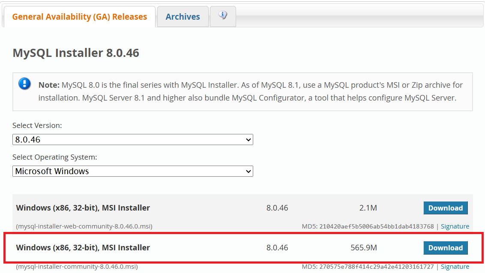

<div class="mt-3 p-3 bg-blue-50 border-l-4 border-blue-400 text-gray-700 text-sm text-left">
💡 下載後點「No thanks, just start my download.」即可跳過 Oracle 帳號登入。
</div>

<!--
大家開啟瀏覽器，輸入網址 dev.mysql.com/downloads/installer/

你會看到兩個版本：
- Web 版（約 2MB）：安裝時才下載元件，需要穩定網路
- Full Bundle（565.9MB）：把所有東西都一次下載好

我建議選 Full Bundle，這樣安裝過程不需要一直等下載。

按下 Download 之後，它會叫你登入 Oracle 帳號，但你可以直接點「No thanks, just start my download.」跳過登入，直接下載。
-->

---

# MySQL 安裝 — Step 2：選擇 Server only

執行 `.exe` 安裝程式，Setup Type 選擇 **Server only**。

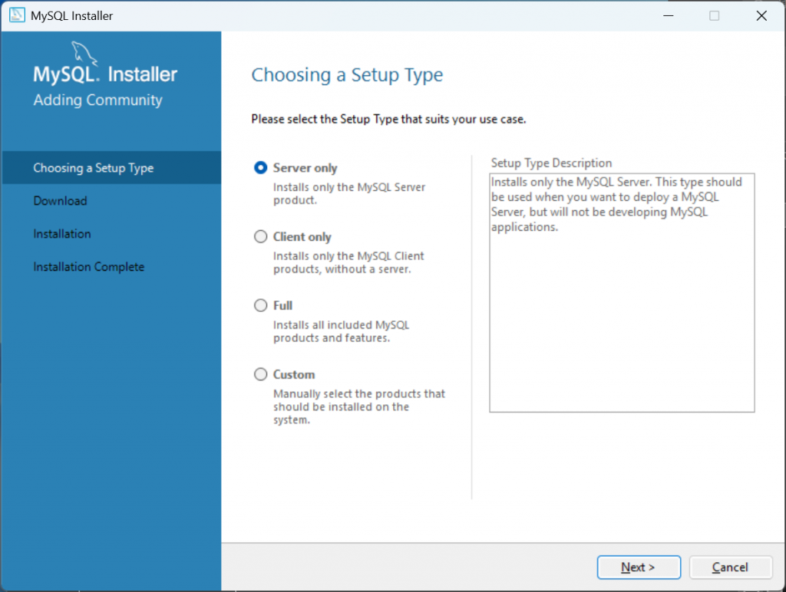

<!--
雙擊 exe 檔執行安裝程式，如果 Windows 詢問管理員權限，選「是」允許。

等安裝程式初始化之後，會看到 Setup Type 的選擇畫面。

選「Server only」，然後按 Next — 我們會在下一個畫面手動加入 Workbench。
-->

---

# MySQL 安裝 — Step 3：加入 Workbench

在 **Select Products** 畫面，從左側把 **MySQL Workbench** 和 **MySQL Shell** 加到右側安裝清單。

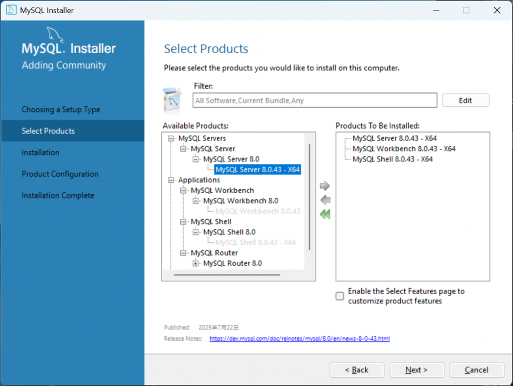

<div class="mt-3 p-3 bg-blue-50 border-l-4 border-blue-400 text-gray-700 text-sm text-left">
💡 <b>要加的元件：</b> MySQL Server + MySQL Workbench + MySQL Shell，選好後按 Next。
</div>

<!--
這個畫面讓我們自己選要安裝哪些東西。

左邊是可以安裝的元件，右邊是已選定要安裝的。

找到 MySQL Workbench 和 MySQL Shell，把它們加到右側清單。這樣安裝完就會有 Workbench 可以用。

選好之後按 Next，安裝程式會確認安裝清單。
-->

---

# MySQL 安裝 — Step 4（續）：執行安裝

確認安裝清單後按 **Execute**，等待所有元件安裝完成。

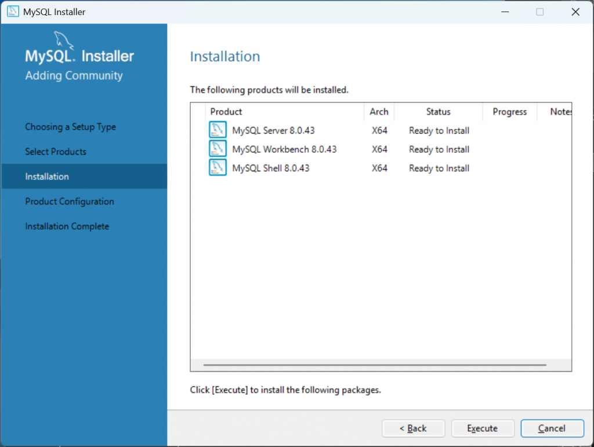

<!--
按 Execute 之後，安裝程式會開始安裝 MySQL Server、Workbench、Shell。

這個步驟通常很快，因為 Full Bundle 已經把安裝檔都下載好了。

所有項目都顯示安裝完成後，按 Next 繼續設定 MySQL Server。
-->

---

# MySQL 安裝 — Step 4：設定 MySQL Server

進入 MySQL Server 設定精靈，保持預設值即可。

| 設定項目 | 建議值 | 說明 |
| --- | --- | --- |
| Config Type | Development Computer | 開發環境用，記憶體佔用較低 |
| Port | `3306` | MySQL 預設連接埠，保持不變 |
| Authentication | Strong Password Encryption | 安全性較高，保持預設 |

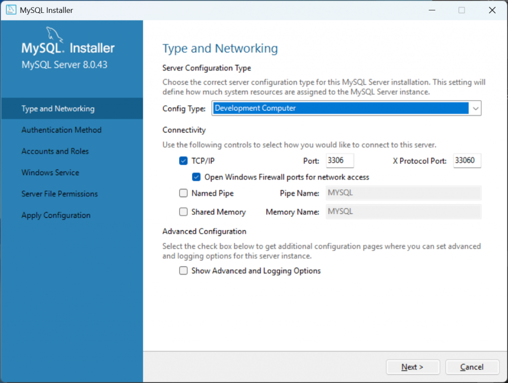

<!--
進入 MySQL Server 設定精靈，這裡有幾個重要的設定。

Config Type 選「Development Computer」，這個選項讓 MySQL 在開發機上使用較少的記憶體，不會影響電腦效能。

Port 保持 3306 不要改，這是 MySQL 的標準連接埠，之後在 Spring Boot 的設定檔中也會用到這個數字。

⚠️ 注意：如果你的電腦之前裝過其他 MySQL，port 3306 可能已被占用。遇到這種情況再來問我。
-->

---

# MySQL 安裝 — Step 5：設定 root 密碼

**最重要的步驟**：設定 root 帳號密碼，請務必記住！

| 欄位 | 說明 |
| --- | --- |
| MySQL Root Password | 設定管理員密碼（自訂，請記住！） |
| Repeat Password | 再輸入一次確認 |

<div class="mt-3 p-3 bg-yellow-50 border-l-4 border-yellow-400 text-gray-700 text-sm text-left">
⚠️ <b>重要：</b> root 是 MySQL 的最高權限帳號。密碼請記在安全的地方，之後 Spring Boot 連接資料庫時會用到。
</div>

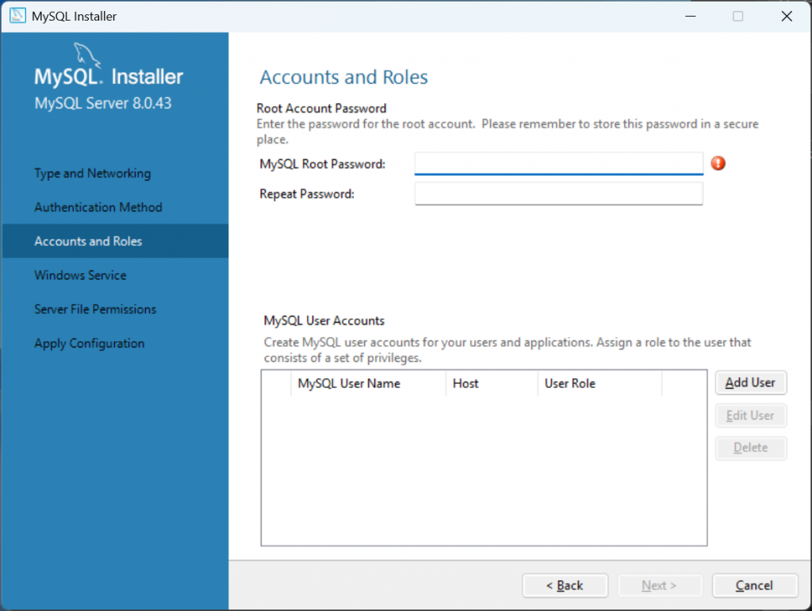

<!--
這個步驟最重要！設定 root 帳號的密碼。

root 是 MySQL 的最高權限帳號，可以對資料庫做任何操作。

密碼建議設定一個好記又有點複雜的，例如 Root@1234 這種組合大小寫加數字的格式。

⚠️ 強調一下：這個密碼請一定要記下來！後面我們在 Spring Boot 的 application.properties 裡面，連接資料庫時就需要填這個密碼。如果忘記了，重設過程很麻煩。

設好之後按 Next。
-->

---

# MySQL 安裝 — Step 6：Windows Service 設定

保持預設設定，讓 MySQL 以 Windows Service 形式自動啟動。

| 設定項目 | 建議值 | 說明 |
| --- | --- | --- |
| Windows Service Name | `MySQL80` | 服務名稱，保持預設 |
| Start at System Startup | ✅ 勾選 | 電腦重開機後自動啟動 MySQL |
| Run as Standard System Account | ✅ 選擇 | 安全性設定，保持預設 |

<!--
Windows Service 設定讓 MySQL 在電腦開機時自動啟動，這樣你每次打開電腦就可以直接使用資料庫，不需要手動啟動。

服務名稱 MySQL80 是預設的，不需要改。
-->

---

# MySQL 安裝 — Step 6（續）：完成安裝

按 **Execute** 套用設定，完成後按 **Finish** 結束安裝精靈。

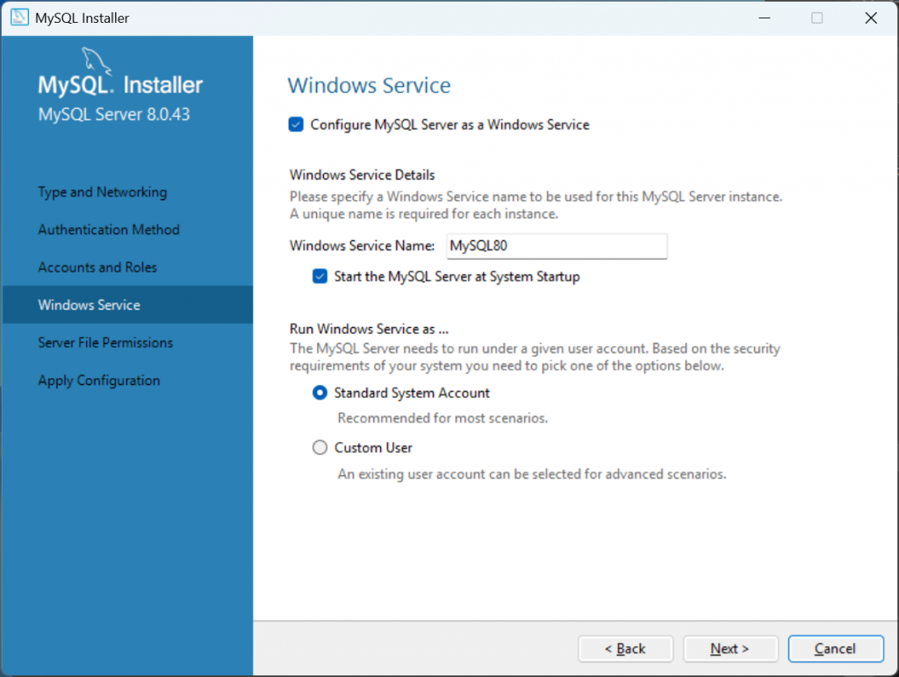

<!--
按 Execute 套用所有設定，等所有步驟都變成打勾之後，按 Finish。

到這裡 MySQL 就安裝完成了！
-->

---

# MySQL 安裝 — Step 7：驗證安裝

開啟 **MySQL Workbench** 確認可以連線。

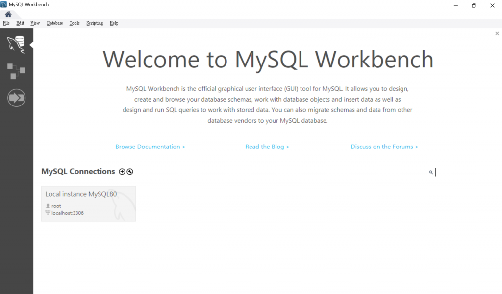

<div class="mt-3 p-3 bg-blue-50 border-l-4 border-blue-400 text-gray-700 text-sm text-left">
💡 <b>驗證方式：</b> 看到 Workbench 主畫面有「Local instance MySQL80」連線卡片，點擊輸入 root 密碼後能成功進入，代表安裝成功！
</div>

<!--
安裝完成後，安裝精靈通常會自動開啟 MySQL Workbench。

如果沒有自動開啟，從開始選單找到 MySQL Workbench 手動開啟。

主畫面會看到一張「Local instance MySQL80」的連線卡片，點擊它，輸入剛才設定的 root 密碼，能成功進入就代表 MySQL 安裝完成！

大家試試看，有沒有看到這個畫面？
-->

---
layout: section
class: flex flex-col justify-center items-center text-center
---

# Part 2
# Git 安裝

<!--
MySQL 裝好了，接下來安裝 Git。

Git 是版本控制工具，可以記錄每次程式碼的修改，也讓多人協作開發成為可能。

不管是個人專案還是團隊開發，Git 都是必備工具。
-->

---
layout: two-cols
---

# Git 安裝 — Step 1：下載 Git for Windows

前往官網下載最新版 Git。

| 項目 | 說明 |
| --- | --- |
| 下載網址 | `git-scm.com/downloads` |
| 選擇平台 | 點選 **Windows**，自動下載最新版 |
| 檔案大小 | 約 60 MB |

::right::

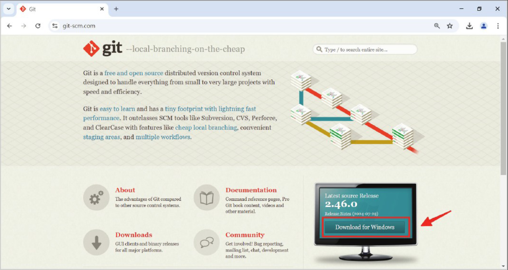

<!--
開啟瀏覽器，進入 git-scm.com。

看到右下角的「Download for Windows」按鈕，點擊進入下載頁面。
-->

---
layout: two-cols
---

# Git 安裝 — Step 1（續）：點擊下載連結

進入下載頁面後，點選 **Click here to download** 開始下載。

下載完成後執行 `.exe` 安裝程式。

::right::

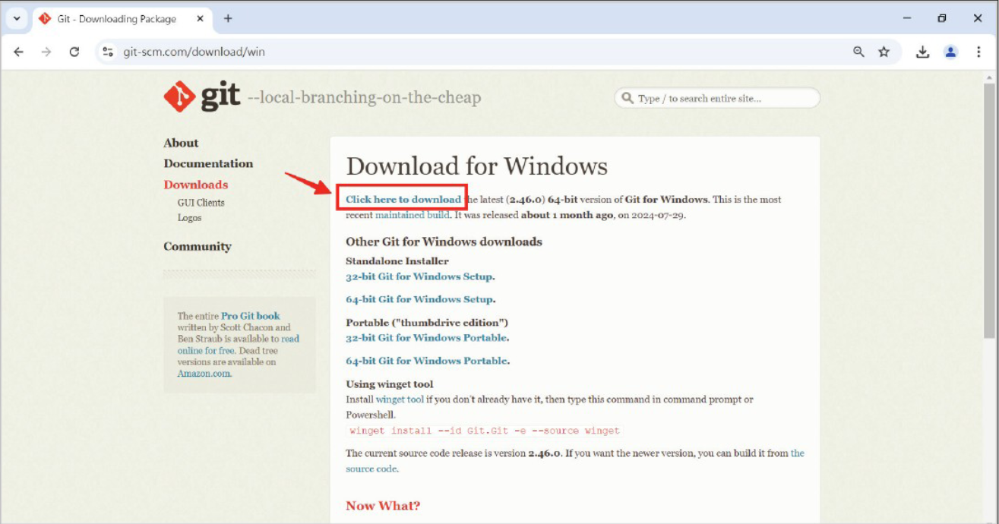

<!--
點選 Click here to download，瀏覽器就會自動開始下載最新版的 Git 安裝程式。

檔案大約 60MB，下載速度應該很快。
-->

---
layout: two-cols
---

# Git 安裝 — Step 2：安裝精靈設定

下載完成後，點兩下執行安裝檔，按幾個 **Next** 繼續。

當出現 **Select Components** 視窗時，勾選左上角的 **Additional icons → On the Desktop**，安裝程式就會在桌面建立 Git Bash 捷徑，方便日後使用。

其他選項保持預設，繼續按 **Next** 直到完成。

::right::

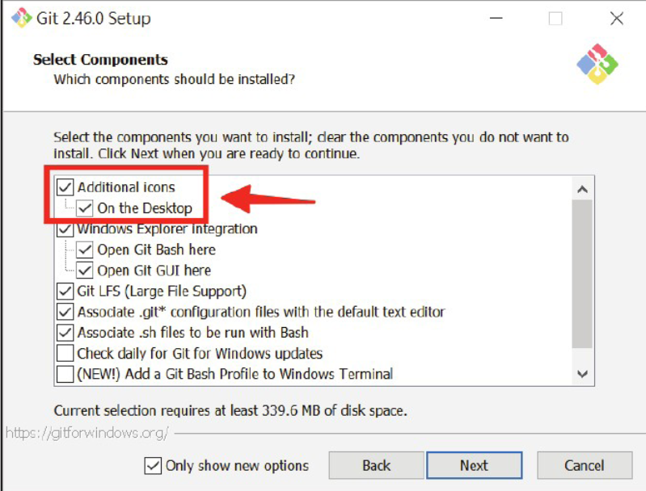

<!--
下載完成後雙擊執行安裝程式，按幾個 Next 就會看到 Select Components 這個畫面。

勾選 Additional icons 底下的 On the Desktop，這樣安裝完成後桌面就會有一個 Git Bash 的捷徑。

其他選項保持預設，繼續按 Next 直到安裝完成。
-->

---

# Git 安裝 — Step 3：完成安裝並驗證

安裝完成後，開啟 **Command Prompt** 或 **PowerShell** 輸入驗證指令。

```bash
git --version
```

成功輸出版本號即代表安裝完成：

```
git version 2.49.0.windows.1
```

<div class="mt-3 p-3 bg-blue-50 border-l-4 border-blue-400 text-gray-700 text-sm text-left">
💡 <b>找不到 Command Prompt？</b> 按 <code>Win + R</code>，輸入 <code>cmd</code> 按 Enter 即可開啟。
</div>

<!--
安裝完成後，打開 Command Prompt 或 PowerShell，輸入 git --version。

如果看到輸出 git version 2.x.x，代表 Git 已成功安裝。

如果出現「'git' is not recognized」的錯誤，表示安裝時 PATH 設定沒有生效。通常重新開啟 Command Prompt 或重開機就可以解決。

大家來試試看！
-->

---
layout: section
class: flex flex-col justify-center items-center text-center
---

# Part 3
# GitHub 介紹 & 帳號註冊

<!--
Git 裝好了，接下來介紹 GitHub。

GitHub 是全球最大的程式碼托管平台，幾乎所有開源專案都在這裡。

我們需要一個 GitHub 帳號，之後才能用 GitHub Desktop 把程式碼同步上去。
-->

---

# 什麼是 GitHub？

GitHub 是基於 Git 的**雲端程式碼托管平台**，讓開發者可以將程式碼存放在雲端、與他人協作。

| 比較 | Git | GitHub |
| --- | --- | --- |
| 本質 | 版本控制工具（軟體） | 程式碼托管平台（網站） |
| 安裝位置 | 裝在本機電腦 | 雲端服務，無需安裝 |
| 主要功能 | 記錄版本、管理分支 | 存放程式碼、協作開發、Issue 追蹤 |
| 使用方式 | 指令列 / GitHub Desktop | 瀏覽器 |

<div class="mt-3 p-3 bg-blue-50 border-l-4 border-blue-400 text-gray-700 text-sm text-left">
💡 <b>一句話記住：</b>Git 是工具，GitHub 是放程式碼的地方。就像 Word 是軟體，Google Drive 是雲端空間。
</div>

<!--
很多同學會搞混 Git 和 GitHub，其實很簡單：

Git 是安裝在你電腦上的工具，負責記錄版本、管理分支。

GitHub 是網站，讓你把 Git 管理的程式碼放到雲端，方便備份和多人協作。

我們課程同時用這兩個：Git 負責本機版本管理，GitHub 負責雲端備份。
-->

---
layout: two-cols
---

# 帳號註冊 — Step 1：填寫基本資料

前往 `github.com`，點選右上角 **Sign up** 開始免費註冊。

| 欄位 | 說明 | 建議 |
| --- | --- | --- |
| Username | 帳號名稱，公開顯示 | 用英文，選好記的名字 |
| Email address | 登入用 Email | 用常用信箱，需驗證 |
| Password | 帳號密碼 | 至少 8 字元，含英數 |

<div class="mt-3 p-3 bg-yellow-50 border-l-4 border-yellow-400 text-gray-700 text-sm text-left">
⚠️ <b>Username 很重要：</b>程式碼網址會包含你的 username，例如 <code>github.com/your-name</code>。
</div>

::right::

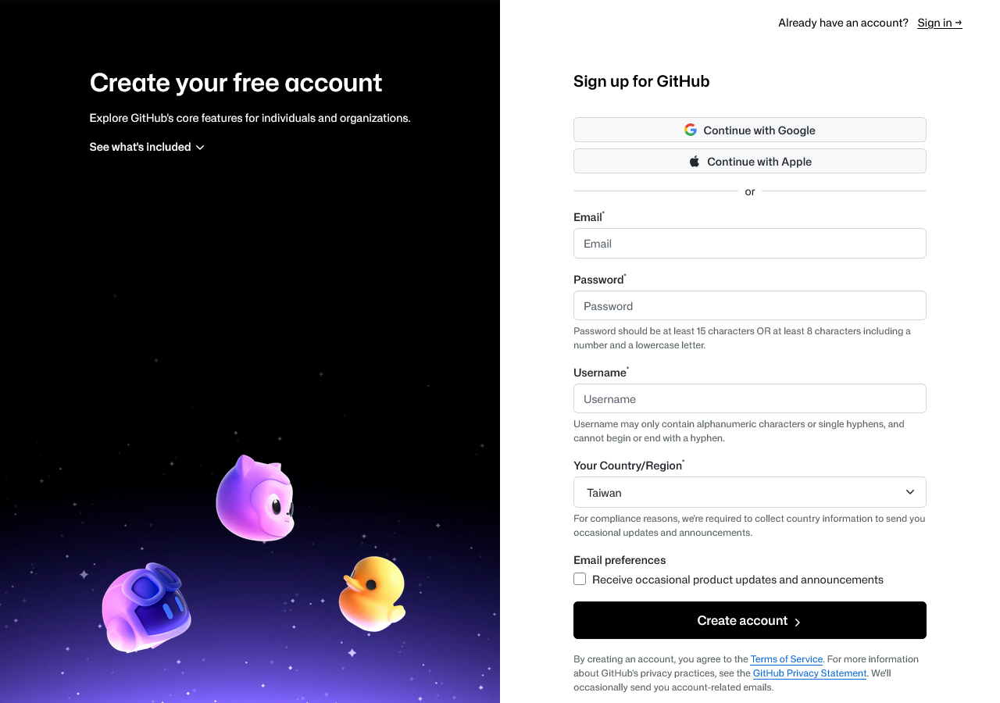

<!--
打開瀏覽器，輸入 github.com，點右上角的 Sign up。

填入 Email、Password、Username。

Username 是你在 GitHub 上的公開身份，之後你的 repository 網址都會包含這個名稱，所以選一個好記、專業的名字。
-->

---

# 帳號註冊 — Step 2：驗證 & 完成

| 步驟 | 說明 |
| --- | --- |
| ① 人機驗證 | 完成 GitHub 的拼圖驗證（Verify your account） |
| ② 選擇方案 | 選 **GitHub Free**，免費，個人開發夠用 |
| ③ 信箱驗證 | 收 Email → 輸入 8 位數驗證碼，啟用帳號 |

<div class="mt-3 p-3 bg-blue-50 border-l-4 border-blue-400 text-gray-700 text-sm text-left">
💡 <b>方案選 Free 就好：</b>Public / Private repository 皆可免費建立，個人開發完全夠用，之後有需要再升級。
</div>

<!--
填完資料之後，GitHub 會發一封驗證信到你的 Email。

去信箱找一封來自 GitHub 的信，裡面有 8 位數驗證碼，輸入到網頁上就好。

方案選 Free，不需要付費。

驗證完成，GitHub 帳號就建立好了！
-->

---
layout: section
class: flex flex-col justify-center items-center text-center
---

# Part 4
# GitHub Desktop 安裝

<!--
最後一個工具：GitHub Desktop。

GitHub Desktop 是 Git 的視覺化操作介面。你不需要記住 Git 的指令，就可以透過點擊按鈕完成 commit、push、pull 等操作。

對初學者來說非常友善，我們課程後期也會用它來管理我們的 Spring Boot 專案。
-->

---
layout: two-cols
---

# GitHub Desktop 安裝 — Step 1：下載與安裝

前往官網一鍵下載，安裝過程全自動，無需額外操作。

| 項目 | 說明 |
| --- | --- |
| 下載網址 | `desktop.github.com` |
| 選擇版本 | 點選 **Download for Windows (64-bit)** |
| 安裝方式 | 雙擊 `.exe` 後**全自動安裝**，不需要精靈設定 |
| 安裝時間 | 通常不到 1 分鐘 |

::right::

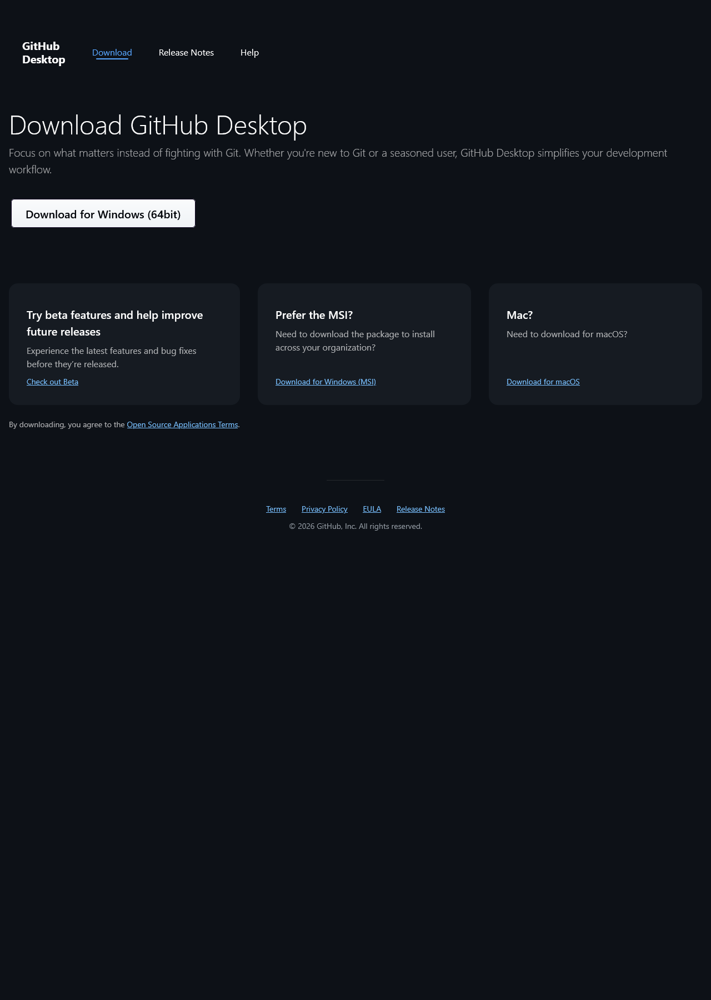

<!--
開啟瀏覽器，輸入 desktop.github.com。

點選 Download for Windows (64-bit) 下載安裝程式。

下載完成後雙擊執行，GitHub Desktop 會全自動安裝，沒有安裝精靈，不需要選任何選項。

安裝完成後會自動開啟 GitHub Desktop，進入首次設定流程。
-->

---

# GitHub Desktop 安裝 — Step 2：登入 GitHub 帳號

安裝完成後，GitHub Desktop 自動開啟，點選 **Sign in to GitHub.com** 登入。

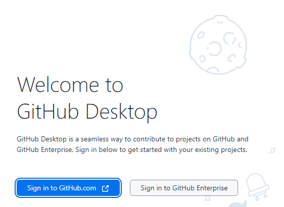

<div class="mt-3 p-3 bg-blue-50 border-l-4 border-blue-400 text-gray-700 text-sm text-left">
💡 <b>還沒有 GitHub 帳號？</b> 先前往 <code>github.com</code> 免費註冊一個帳號再回來登入。
</div>

<!--
安裝完成後會看到 GitHub Desktop 的歡迎畫面。

點選「Sign in to GitHub.com」，系統會自動開啟你的瀏覽器，跳轉到 GitHub 的授權頁面。

在瀏覽器裡輸入你的 GitHub 帳號和密碼，確認授權之後，瀏覽器會提示回到 GitHub Desktop。

如果你還沒有 GitHub 帳號，現在可以先去 github.com 免費申請一個，只需要 Email 就可以註冊。
-->

---

# GitHub Desktop 安裝 — Step 3：設定 Git 身份

登入後填入 Git 身份資訊，這會顯示在每次 commit 的紀錄中。

| 欄位 | 說明 | 範例 |
| --- | --- | --- |
| Name | 顯示在 commit 紀錄的名字 | `王小明` 或 英文名 |
| Email | 與 GitHub 帳號相同的 Email | `your@email.com` |

按 **Finish** 完成設定。

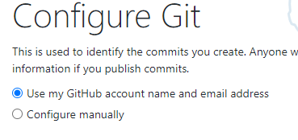

<!--
登入成功後，會進入 Configure Git 畫面。

Name 是顯示在 commit 紀錄中的名字，可以用中文或英文，輸入你慣用的名字就好。

Email 建議填和 GitHub 帳號相同的 Email，這樣 commit 紀錄才能正確對應到你的 GitHub 帳號。

填好之後按 Finish，就完成了！
-->

---

# GitHub Desktop 安裝 — Step 4：確認主畫面

設定完成後進入 GitHub Desktop 主畫面，三個工具全部安裝完畢！

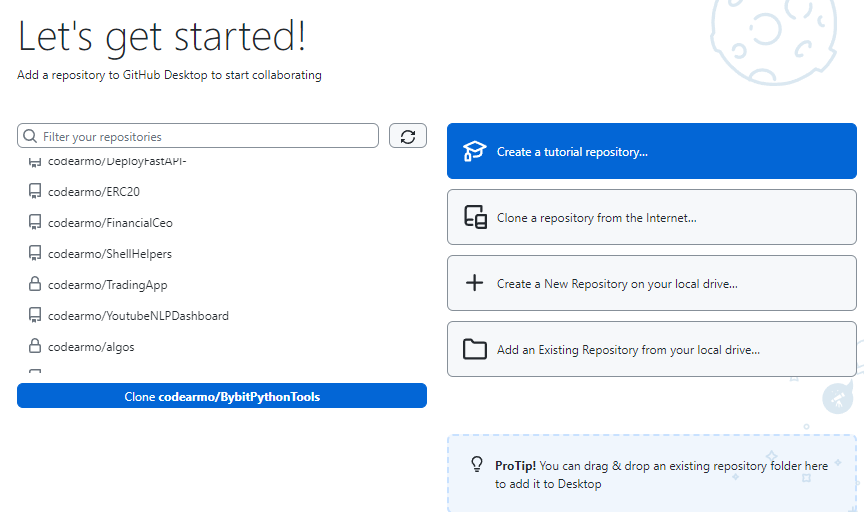

<div class="mt-3 p-3 bg-blue-50 border-l-4 border-blue-400 text-gray-700 text-sm text-left">
💡 <b>安裝完成確認清單：</b> ✅ MySQL Workbench 可連線　✅ <code>git --version</code> 有輸出　✅ GitHub Desktop 已登入帳號
</div>

<!--
看到 GitHub Desktop 的主畫面，左上角顯示你的 GitHub 帳號，代表安裝和登入都成功了！

讓我們做一個快速確認：
- MySQL：打開 Workbench 能看到 Local instance MySQL80 ✅
- Git：在終端機輸入 git --version 有看到版本號 ✅  
- GitHub Desktop：已登入帳號 ✅

三個都 OK 的同學恭喜！今天的任務完成了。
-->

---
layout: section
class: flex flex-col justify-center items-center text-center
---

# 章節總結

<!--
好，讓我們來整理一下今天安裝的三個工具。
-->

---

# 總結

今天我們完成了三個開發必備工具的安裝：

- **MySQL** — 關聯式資料庫，Spring Boot 後端儲存資料的地方；root 密碼請妥善保管
- **Git** — 版本控制工具，追蹤程式碼的每一次修改；安裝時記得開啟 PATH 設定
- **GitHub Desktop** — Git 的視覺化介面，讓版本控制操作更直覺；需登入 GitHub 帳號

<div class="mt-4 p-3 bg-blue-50 border-l-4 border-blue-400 text-gray-700 text-sm text-left">
🚀 <b>下一章：</b> 環境都備妥了！接下來我們將建立第一個 Spring Boot 專案，實際寫出第一支後端 API！
</div>

<!--
今天我們裝好了三個工具：MySQL 資料庫、Git 版本控制、GitHub Desktop 視覺化介面。

有幾件事要提醒大家：

MySQL 的 root 密碼一定要記住，之後設定 Spring Boot 連接資料庫時會用到。

Git 安裝時的 PATH 設定要記得選，這樣才能在終端機裡面直接用 git 指令。

GitHub Desktop 要記得登入你的 GitHub 帳號，之後我們會用它把程式碼上傳到 GitHub。

下一章我們就要開始真正的開發了，大家期待嗎？
-->

---
layout: end
---

# Q & A

有任何安裝問題嗎？

<!--
安裝過程中有沒有遇到什麼問題？

常見的問題通常是：MySQL port 被占用、git 指令找不到、GitHub Desktop 登入失敗。

有問題的同學可以截圖錯誤訊息，我們一起來看一下怎麼解決。
-->
