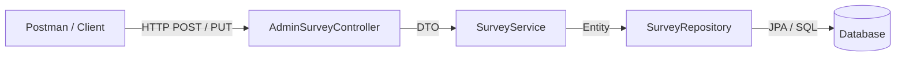

<div class="flex flex-col justify-center items-center h-full" style="background: #ffffff;">
  <p style="color: #5eada0; font-size: 1rem; font-weight: 600; letter-spacing: 0.2em; text-transform: uppercase; margin-bottom: 1.2rem;">
    Spring Boot Project Practice
  </p>
  <h1 style="color: #1a5c5c; font-size: 3.8rem; font-weight: 900; line-height: 1.15; margin-bottom: 1.5rem;">
    實戰演練：動態問卷系統
  </h1>
  <div style="height: 4px; width: 320px; background: linear-gradient(90deg, #5eada0, #a7d9d0); border-radius: 2px; margin-bottom: 1.5rem;"></div>
  <p style="color: #4a7c7c; font-size: 1.15rem; font-style: italic;">
    「從零到一，打造完整的前後端整合專案」
  </p>
  <Link to="home" style="color: #9dc4c4; font-size: 0.85rem; margin-top: 2rem; text-decoration: none; letter-spacing: 0.05em;">← 返回目錄</Link>
</div>

---
layout: section
class: flex flex-col justify-center items-center text-center
---

# 設定

---
layout: default
---

# build.gradle 設定(1)

<div v-pre>

```groovy
dependencies {    // [資料庫存取] 提供 JPA 支援與 Hibernate 實作
   implementation 'org.springframework.boot:spring-boot-starter-data-jpa'
  
   // [Web 核心] 提供 REST API 開發與 MVC 架構支援
	implementation 'org.springframework.boot:spring-boot-starter-webmvc'
  
   // [資料驗證] 提供 @NotBlank, @Size 等 Bean Validation 註解支援
	implementation 'org.springframework.boot:spring-boot-starter-validation'
  
   // [安全機制] 提供 Spring Security 權限控管與加密支援
	implementation 'org.springframework.boot:spring-boot-starter-security'
  
   // [JWT 介面] 定義 JSON Web Token 的 API 規範
   implementation 'io.jsonwebtoken:jjwt-api:0.11.5'
  
   // [開發利器] 使用註解自動產生 Getter/Setter (編譯時期)
	compileOnly 'org.projectlombok:lombok'
}
```

</div>

---
layout: default
---

# build.gradle 設定(2)

<div v-pre>

```groovy
dependencies {      // [熱部署] 程式修改後自動重啟伺服器，提升開發效率
	developmentOnly 'org.springframework.boot:spring-boot-devtools'
  
   // [MySQL 驅動] 程式執行時連結 MySQL 資料庫的驅動程式
	runtimeOnly 'com.mysql:mysql-connector-j'
  
   // [JWT 實作] 執行時期所需的 JWT 加密與解析邏輯
	runtimeOnly 'io.jsonwebtoken:jjwt-impl:0.11.5'
   runtimeOnly 'io.jsonwebtoken:jjwt-jackson:0.11.5'
  
   // [Lombok 處理器] 讓編譯器能識別 Lombok 註解並產生代碼
	annotationProcessor 'org.projectlombok:lombok'
  
   // [單元測試] 提供測試框架與 Security 測試支援
	testImplementation 'org.springframework.boot:spring-boot-starter-test'
   testImplementation 'org.springframework.security:spring-security-test'

}
```

</div>

---
layout: default
---

# application.properties 設定

<div v-pre>

```properties
# Database Configuration (MySQL)
spring.datasource.url=jdbc:mysql://localhost:3306/dynamic_survey?useSSL=false&serverTimezone=UTC&allowPublicKeyRetrieval=true
spring.datasource.username=root
spring.datasource.password=root
spring.datasource.driver-class-name=com.mysql.cj.jdbc.Driver
# JPA / Hibernate
spring.jpa.hibernate.ddl-auto=update
spring.jpa.show-sql=true
spring.jpa.properties.hibernate.format_sql=true
spring.jpa.properties.hibernate.dialect=org.hibernate.dialect.MySQLDialect
# Logging
logging.level.org.springframework.web=INFO
logging.level.com.example.dynamicsurvey=DEBUG
# JWT Configuration (Secret should be stored securely in prod)
jwt.secret=vW9mK2v6yB?E(G+KbPeShVmYq3t6w9z$C&E)H@McQfTjWnZr4u7x!A%D*G-KaPdS
jwt.expiration=86400000
```

</div>

---
layout: default
---

# config - SecurityConfig

<div v-pre>

```java
@Configuration
@EnableWebSecurity // 開啟 Web 安全功能
public class SecurityConfig {
   @Bean
   public SecurityFilterChain filterChain(HttpSecurity http) throws Exception {
       http
           .csrf(csrf -> csrf.disable())
           .authorizeHttpRequests(auth -> auth
               .anyRequest().permitAll() // 這裡定義了不需要登入
           );
       return http.build(); // Spring 會自動拿到這個回傳的物件並使用它
   }
   @Bean
   public BCryptPasswordEncoder passwordEncoder() {
       return new BCryptPasswordEncoder();
   }
}
```

</div>

---
layout: default
---

# VO - 狀態碼 Enum

### `RspCode.java`

<div v-pre>

```java
public enum RspCode {
    SUCCESS(200, "Success"),
    ERROR(400, "Error"),
    NOT_FOUND(404, "Not Found"),
    DUPLICATE_ERROR(409, "Duplicate Data"),
    UNAUTHORIZED(401, "Unauthorized"),
    INTERNAL_SERVER_ERROR(500, "Internal Server Error");

    private final int code;
    private final String message;

    RspCode(int code, String message) {
        this.code = code;
        this.message = message;
    }

    public int getCode() { return code; }
    public String getMessage() { return message; }
}
```

</div>

---
layout: default
---

# VO - 統一回應物件

### `AppResponse.java`

<div v-pre>

```java
@Data
public class AppResponse<T> {
    private int code;
    private String message;
    private T data;

    public static <T> AppResponse<T> success(T data) {
        AppResponse<T> response = new AppResponse<>();
        response.setCode(200);
        response.setMessage("Success");
        response.setData(data);
        return response;
    }

    public static <T> AppResponse<T> error(RspCode rspCode) {
        AppResponse<T> response = new AppResponse<>();
        response.setCode(rspCode.getCode());
        response.setMessage(rspCode.getMessage());
        return response;
    }

    public static <T> AppResponse<T> error(RspCode rspCode, String customMessage) {
        AppResponse<T> response = new AppResponse<>();
        response.setCode(rspCode.getCode());
        response.setMessage(customMessage);
        return response;
    }
}
```

</div>

---
layout: section
class: flex flex-col justify-center items-center text-center
---

# 新增&修改問卷

---
layout: default
---

# 問卷管理 (Admin CRUD) — 架構與流程



---
layout: default
---

# Repository

- SurveyRepository.java

<div v-pre>

```java
public interface SurveyRepository extends JpaRepository<Survey, Long> {
  

}
```

</div>

---
layout: default
---

# DTO — 問卷傳輸物件

- `OptionDTO.java` — 選項傳輸物件
- `QuestionDTO.java` — 題目傳輸物件
- `SurveyDTO.java` — 問卷主體傳輸物件

---
layout: default
---

# Service

- SurveyService.java

- @Autowired
- SurveyRepository surveyRepository;
- private SurveyDTO convertToDTO(Survey s)
- public AppResponse&lt;SurveyDTO&gt; saveSurvey(SurveyDTO dto)

---
layout: default
---

# AdminSurveyController.java

- Controller

<div v-pre>

```java
@Autowired
   SurveyService surveyService;

@PostMapping
public AppResponse<Object> createSurvey(@Valid @RequestBody SurveyDTO surveyDTO)

@PutMapping("/{id}")
public AppResponse<Object> updateSurvey(@PathVariable("id")  Long id, @Valid @RequestBody SurveyDTO surveyDTO)
```

</div>

---
layout: default
---

# 使用 Postman 測試 — 新增與更新問卷

### 1. 新增問卷
- **Method**: `POST`
- **URL**: `http://localhost:8080/api/admin/surveys`
- **Body (JSON)**:

<div v-pre>

```json
{
    "title": "2026 程式語言喜好大調查",
    "description": "為了瞭解開發者趨勢，請花一分鐘填寫此問卷。",
    "startDate": "2026-03-01",
    "endDate": "2026-03-31",
    "status": "PUBLISHED",
    "questions": [
        {
            "title": "您最常使用的程式語言是？",
            "type": "SINGLE",
            "required": true,
            "orderIndex": 0,
            "options": [
                { "optionText": "Java", "orderIndex": 0 },
                { "optionText": "TypeScript", "orderIndex": 1 },
                { "optionText": "Python", "orderIndex": 2 }
            ]
        },
        {
            "title": "您目前從事的開發領域有？(可多選)",
            "type": "MULTI",
            "required": true,
            "orderIndex": 1,
            "options": [
                { "optionText": "網頁前端", "orderIndex": 0 },
                { "optionText": "網頁後端", "orderIndex": 1 },
                { "optionText": "手機 App", "orderIndex": 2 }
            ]
        },
        {
            "title": "對本課程有什麼建議嗎？",
            "type": "TEXT",
            "required": false,
            "orderIndex": 2,
            "options": []
        }
    ]
}
```

</div>

- **預期結果**: `code: 200`, `data: 問卷內容`

---

### 2. 更新問卷
- **Method**: `PUT`
- **URL**: `http://localhost:8080/api/admin/surveys/1` *(請替換成對應的問卷 ID)*
- **Body (JSON)**:

<div v-pre>

```json
{
    "id": 1,
    "title": "【已更新】2026 開發者趨勢調查",
    "description": "更新：感謝大家踴躍參與，問卷延長至四月中旬。",
    "startDate": "2026-03-01",
    "endDate": "2026-04-15",
    "status": "PUBLISHED",
    "questions": [
        {
            "title": "您最常使用的程式語言是？",
            "type": "SINGLE",
            "required": true,
            "orderIndex": 0,
            "options": [
                { "optionText": "Java (Spring Boot)", "orderIndex": 0 },
                { "optionText": "TypeScript (Angular)", "orderIndex": 1 },
                { "optionText": "Python (FastAPI)", "orderIndex": 2 },
                { "optionText": "Go", "orderIndex": 3 }
            ]
        },
        {
            "title": "您最喜歡的開發工具？",
            "type": "SINGLE",
            "required": true,
            "orderIndex": 1,
            "options": [
                { "optionText": "VS Code", "orderIndex": 0 },
                { "optionText": "IntelliJ IDEA", "orderIndex": 1 }
            ]
        }
    ]
}
```

</div>

- **預期結果**: `code: 200`, `data: 問卷內容`

---
layout: section
class: flex flex-col justify-center items-center text-center
---

# 刪除問卷

---
layout: default
---

# SurveyService.java

- Service

<div v-pre>

```java
/**
    * [功能] 刪除問卷
    */
   @Transactional
   public AppResponse<Object> deleteSurvey(Long id) {
       surveyRepository.deleteById(id);
       return AppResponse.success(null);
   }
```

</div>

---
layout: default
---

# AdminSurveyController.java

- Controller

<div v-pre>

```java
/**
    * [功能] 刪除問卷
    * -------------------------------------------------------------------------
    * 【技術細節】
    * 1. @DeleteMapping: 指定使用 DELETE 方法。
    */
   @DeleteMapping("/{id}")
   public AppResponse<Object> deleteSurvey(@PathVariable("id") Long id) {
       return surveyService.deleteSurvey(id);
   }
```

</div>

---
layout: default
---

# 使用 Postman 測試

- 刪除問卷
- Method: DELETE
- URL: http://localhost:8080/api/admin/surveys/1
- 預期結果: code: 200, data: null
- 1請替換成對應的問卷ID

---
layout: section
class: flex flex-col justify-center items-center text-center
---

# 查詢問卷列表

---
layout: default
---

# Repository

- SurveyRepository.java

<div v-pre>

```java
public interface SurveyRepository extends JpaRepository<Survey, Long> {
     /**
    * 多條件動態篩選
    * 支援根據標題關鍵字、日期區間進行搜尋。
    */
   @Query("SELECT s FROM Survey s WHERE " +
          "(:title IS NULL OR s.title LIKE %:title%) AND " +
          "(:startDate IS NULL OR s.startDate >= :startDate) AND " +
          "(:endDate IS NULL OR s.endDate <= :endDate)")
   List<Survey> findByFilters(@Param("title") String title,
                              @Param("startDate") LocalDate startDate,
                              @Param("endDate") LocalDate endDate);
}
```

</div>

---
layout: default
---

# SurveyService.java

- Service

<div v-pre>

```java
public AppResponse<List<SurveyDTO>> getSurveysByAdmin(String title, LocalDate start, LocalDate end) {
       List<Survey> surveys = surveyRepository.findByFilters(title, start, end);
       return AppResponse.success(surveys.stream().map(s -> {
           SurveyDTO dto = convertToDTO(s);
           return dto;
       }).collect(Collectors.toList()));
   }
```

</div>

---
layout: default
---

# AdminSurveyController.java

- Controller

<div v-pre>

```java
@GetMapping
    public AppResponse<Object> getSurveys(
            @RequestParam(name = "title",required = false) String title,
            @RequestParam(name = "startDate",required = false) @DateTimeFormat(iso = DateTimeFormat.ISO.DATE) LocalDate startDate,
            @RequestParam(name = "endDate",required = false) @DateTimeFormat(iso = DateTimeFormat.ISO.DATE) LocalDate endDate) {
        // 將篩選條件傳交給 Service 處理業務查詢
        return surveyService.getSurveysByAdmin(title, startDate, endDate);
    }
```

</div>

---
layout: default
---

# 使用 Postman 測試

1. 取得問卷列表
- Method: GET
- URL: http://localhost:8080/api/admin/surveys
- 預期結果: code: 200, data: 所有問卷內容

2. 取得問卷列表(Filter)
- Method: GET
- URL: http://localhost:8080/api/admin/surveys?title=2025&startDate=2026-03-01
- 預期結果: code: 200, data: 所有符合條件的問卷內容

---
layout: section
class: flex flex-col justify-center items-center text-center
---

# 查詢單一問卷

---
layout: default
---

# SurveyService.java

- Service

<div v-pre>

```java
/**
    * [功能] 取得單一問卷詳情 (填寫用)
    */
   public AppResponse<SurveyDTO> getSurveyDetails(Long id) {
       return surveyRepository.findById(id)
               .map(s -> AppResponse.success(convertToDTO(s)))
               .orElse(AppResponse.error(RspCode.NOT_FOUND));
   }
```

</div>

---
layout: default
---

# AdminSurveyController.java

- Controller

<div v-pre>

```java
@GetMapping("/{id}")
   public AppResponse<Object> getSurveyById(@PathVariable("id") Long id) {
       return surveyService.getSurveyDetails(id);
   }
```

</div>

---
layout: default
---

# 使用 Postman 測試

1. 取得單一問卷內容
- Method: GET
- URL: http://localhost:8080/api/admin/surveys/1
- 預期結果: code: 200, data: 單一問卷內容
- 1請替換成對應的問卷ID

---
layout: section
class: flex flex-col justify-center items-center text-center
---

# 取得可填寫問卷列表

---
layout: default
---

# Repository

- SurveyRepository.java

<div v-pre>

```java
public interface SurveyRepository extends JpaRepository<Survey, Long> {
/**
    * 自定義查詢 (Query Method)
    * 這裡使用了 JPQL 來查詢符合「已發佈」且「在有效日期內」的問卷。
    */
   @Query("SELECT s FROM Survey s WHERE s.status = 'PUBLISHED' AND s.startDate <= :today AND s.endDate >= :today")
   List<Survey> findActiveSurveys(@Param("today") LocalDate today);

}
```

</div>

---
layout: default
---

# SurveyService.java

- Service

<div v-pre>

```java
/**
    * [功能] 取得所有進行中的問卷
    * 【關鍵點】調用 Repository 的自定義查詢，僅回傳符合日期範圍且已發佈的問卷。
    */
   public AppResponse<List<SurveyDTO>> getActiveSurveys() {
       List<Survey> surveys = surveyRepository.findActiveSurveys(LocalDate.now());
       return AppResponse.success(surveys.stream().map(this::convertToDTO).collect(Collectors.toList()));
   }
```

</div>

---
layout: default
---

# SurveyController.java

- Controller

<div v-pre>

```java
@RestController
@RequestMapping("/api/surveys")

@Autowired
   SurveyService surveyService;

@GetMapping
   public AppResponse<Object> getActiveSurveys() {
       return surveyService.getActiveSurveys();
   }
```

</div>

---
layout: default
---

# 使用 Postman 測試

1. 取得所有可填寫問卷內容
- Method: GET
- URL: http://localhost:8080/api/surveys
- 預期結果: code: 200, data: 所有可填寫問卷內容

---
layout: section
class: flex flex-col justify-center items-center text-center
---

# 查詢單一問卷

---
layout: default
---

# SurveyController.java

- Controller

<div v-pre>

```java
/**
    * [功能] 取得單一問卷詳情
    * [技術細節] 明確指定 PathVariable 名稱為 "id"。
    */
   @GetMapping("/{id}/details")
   public AppResponse<Object> getSurveyDetails(@PathVariable("id") Long id) {
       return surveyService.getSurveyDetails(id);
   }
```

</div>

---
layout: default
---

# 使用 Postman 測試

1. 取得單一問卷內容
- Method: GET
- URL: http://localhost:8080/api/surveys/1/details
- 預期結果: code: 200, data: 單一問卷內容
- 1請替換成對應的問卷ID

---
layout: section
class: flex flex-col justify-center items-center text-center
---

# 填寫問卷

---
layout: default
---

# DTO — 作答傳輸物件

- `AnswerDTO.java` — 單題作答傳輸物件
- `ResponseDTO.java` — 整份問卷作答傳輸物件

---
layout: default
---

# Entity — 作答實體設計

- `SurveyResponse.java` — 填寫紀錄主檔 (保存姓名、電話、信箱、填寫時間)
- `ResponseAnswer.java` — 作答明細檔 (多對一連結主檔與題目，保存作答文字與選取選項)
- `User.java` — 會員帳號實體 (JWT 登入認證使用)

---
layout: default
---

# Repository

- SurveyResponseRepository.java

<div v-pre>

```java
public interface SurveyResponseRepository extends JpaRepository<SurveyResponse, Long> {
   boolean existsBySurveyIdAndEmail(Long surveyId, String email);
}
```

</div>

---
layout: default
---

# SurveyService.java

- Service

<div v-pre>

```java
@Autowired
   SurveyResponseRepository responseRepository;
  
   private static final String SURVEY_SESSION_KEY = "TEMP_SURVEY_RESPONSE";

public AppResponse<Object> saveToSession(ResponseDTO submission, HttpSession session) {
       if (responseRepository.existsBySurveyIdAndEmail(submission.getSurveyId(), submission.getEmail())) {
           return AppResponse.error(RspCode.DUPLICATE_ERROR, "此 Email 已填寫過本問卷。");
       }
       session.setAttribute(SURVEY_SESSION_KEY, submission);
       return AppResponse.success(null);
   }
```

</div>

---
layout: default
---

# SurveyController.java

- Controller

<div v-pre>

```java
/**
    * [功能] 1. 暫存作答資料至 Session (進入確認頁前呼叫)
    */
   @PostMapping("/session-store")
   public AppResponse<Object> storeInSession(@RequestBody ResponseDTO submission, HttpSession session) {
       return surveyService.saveToSession(submission, session);
   }
```

</div>

---
layout: default
---

# 使用 Postman 測試 — 提交問卷 (暫存於 Session)

- **Method**: `POST`
- **URL**: `http://localhost:8080/api/surveys/session-store`
- **Body (JSON)**:

<div v-pre>

```json
{
    "surveyId": 1,
    "name": "測試人員",
    "phone": "0912345678",
    "email": "test@example.com",
    "age": 25,
    "answers": [
        {
            "questionId": 1,
            "optionIds": [1],
            "answerText": null
        },
        {
            "questionId": 2,
            "optionIds": [4, 5],
            "answerText": null
        },
        {
            "questionId": 3,
            "optionIds": [],
            "answerText": "希望能增加更多實戰練習題，這門課非常有幫助！"
        }
    ]
}
```

</div>

- **預期結果**: `code: 200`, `data: null`

---
layout: default
---

# SurveyService.java

- Service

<div v-pre>

```java
public AppResponse<ResponseDTO> getFromSession(HttpSession session) {
       ResponseDTO data = (ResponseDTO) session.getAttribute(SURVEY_SESSION_KEY);
       if (data == null) return AppResponse.error(RspCode.NOT_FOUND);
       return AppResponse.success(data);
   }
```

</div>

---
layout: default
---

# SurveyController.java

- Controller

<div v-pre>

```java
/**
    * [功能] 2. 從 Session 取得暫存資料 (確認頁唯讀顯示)
    */
   @GetMapping("/session-get")
   public AppResponse<Object> getFromSession(HttpSession session) {
       return surveyService.getFromSession(session);
   }
```

</div>

---
layout: default
---

# 使用 Postman 測試

1. 取得Session中的問卷內容
- Method: GET
- URL: http://localhost:8080/api/surveys/session-get
- 預期結果: code: 200, data: 問卷作答內容

---
layout: default
---

# SurveyService.java

- Service

<div v-pre>

```java
@Transactional
   public AppResponse<Object> commitFromSession(HttpSession session) {
       ResponseDTO submission = (ResponseDTO) session.getAttribute(SURVEY_SESSION_KEY);
       if (submission == null) return AppResponse.error(RspCode.NOT_FOUND);
       AppResponse<Object> response = submitResponse(submission.getSurveyId(), submission);
       if (response.getCode() == 200) {
           session.removeAttribute(SURVEY_SESSION_KEY);
       }
       return response;
   }
```

</div>

---
layout: default
---

# SurveyService.java

- Service

<div v-pre>

```java
@Transactional
   public AppResponse<Object> submitResponse(Long surveyId, ResponseDTO submission) {
       Survey survey = surveyRepository.findById(surveyId).orElse(null);
       if (survey == null) return AppResponse.error(RspCode.NOT_FOUND);
       SurveyResponse response = new SurveyResponse();
       response.setSurvey(survey); response.setSubmittedAt(LocalDateTime.now());
       response.setName(submission.getName()); response.setPhone(submission.getPhone());
       response.setEmail(submission.getEmail()); response.setAge(submission.getAge());
```

</div>

---
layout: default
---

# Service

<div v-pre>

```java
for (AnswerDTO aDto : submission.getAnswers()) {
       ResponseAnswer answer = new ResponseAnswer();
       answer.setSurveyResponse(response);
       Question question = survey.getQuestions().stream() .filter(q -> q.getId().equals(aDto.getQuestionId())).findFirst().orElse(null);
       if (question == null) continue;
       answer.setQuestion(question);
       if (question.getType().equals("TEXT")) {
           answer.setAnswerText(aDto.getAnswerText());
       } else {
           List<Option> selected = question.getOptions().stream()
                   .filter(o -> aDto.getOptionIds().contains(o.getId())).collect(Collectors.toList());
           answer.setSelectedOptions(selected);
           answer.setAnswerText(selected.stream().map(Option::getOptionText).collect(Collectors.joining(";")));
       }
       response.getAnswers().add(answer);
   }
}
responseRepository.save(response);
return AppResponse.success(null);
```

</div>

---
layout: default
---

# SurveyController.java

- Controller

<div v-pre>

```java
/**
    * [功能] 3. 正式提交問卷 (從 Session 轉存資料庫)
    */
   @PostMapping("/confirm")
   public AppResponse<Object> confirmSubmit(HttpSession session) {
       return surveyService.commitFromSession(session);
   }
```

</div>

---
layout: default
---

# 使用 Postman 測試

1. 將Session內容儲存到資料庫
- Method: POST
- URL: http://localhost:8080/api/surveys/confirm
- 預期結果: code: 200, data: 單一問卷內容
- 1請替換成對應的問卷ID

---
layout: section
class: flex flex-col justify-center items-center text-center
---

# 回饋

---
layout: default
---

# Repository

- SurveyResponseRepository.java

- List&lt;SurveyResponse&gt; findBySurveyIdOrderByIdDesc(Long surveyId);

---
layout: default
---

# SurveyService.java

- Service

<div v-pre>

```java
public AppResponse<Object> getSurveyResponses(Long id) {
       List<SurveyResponse> responses = responseRepository.findBySurveyIdOrderByIdDesc(id);
       return AppResponse.success(responses.stream().map(r -> {
           Map<String, Object> map = new HashMap<>();
           map.put("responseId", r.getId());
           map.put("userName", r.getName());
           map.put("userEmail", r.getEmail());
           map.put("submittedAt", r.getSubmittedAt());
           return map;
       }).collect(Collectors.toList()));
   }
```

</div>

---
layout: default
---

# AdminSurveyController.java

- Controller

<div v-pre>

```java
/**
    * [功能] 取得該問卷的所有填寫者清單
    */
   @GetMapping("/{id}/responses")
   public AppResponse<Object> getSurveyResponses(@PathVariable("id") Long id) {
       return surveyService.getSurveyResponses(id);
   }
```

</div>

---
layout: default
---

# 使用 Postman 測試

1. 取得該問卷的所有填寫者清單
- Method: GET
- URL: http://localhost:8080/api/admin/surveys/1/responses
- 預期結果: code: 200, data: 單一問卷的所有填寫者清單
- 1請替換成對應的問卷ID

---
layout: default
---

# Service

<div v-pre>

```java
public AppResponse<Object> getResponseDetail(Long responseId) {
       SurveyResponse response = responseRepository.findById(responseId).orElse(null);
       if (response == null) return AppResponse.error(RspCode.NOT_FOUND);
       Map<String, Object> result = new HashMap<>();
       result.put("responseId", response.getId());
       result.put("userName", response.getName());
       result.put("submittedAt", response.getSubmittedAt());
       result.put("surveyTitle", response.getSurvey().getTitle());
       var details = response.getAnswers().stream().map(a -> {
           Map<String, Object> aMap = new HashMap<>();
           aMap.put("questionTitle", a.getQuestion().getTitle());
           aMap.put("type", a.getQuestion().getType());
           aMap.put("answer", a.getAnswerText()); // 多選題已在存入時串接好
           return aMap;
       }).collect(Collectors.toList());
       result.put("details", details);
       return AppResponse.success(result);
   }
```

</div>

---
layout: default
---

# AdminSurveyController.java

- Controller

<div v-pre>

```java
/**
    * [功能] 取得單一作答詳細內容
    * [路徑] /api/admin/surveys/response-detail/{responseId}
    */
   @GetMapping("/response-detail/{responseId}")
   public AppResponse<Object> getResponseDetail(@PathVariable("responseId") Long responseId) {
       return surveyService.getResponseDetail(responseId);
   }
```

</div>

---
layout: default
---

# 使用 Postman 測試

1. 取得該問卷單一作答者的作答詳細內容
- Method: GET
- URL: http://localhost:8080/api/admin/surveys/response-detail/1
- 預期結果: code: 200, data: 作答詳細內容
- 1請替換成對應的回覆ID

---
layout: section
class: flex flex-col justify-center items-center text-center
---

# 統計

---
layout: default
---

# Repository

- SurveyResponseRepository.java

- List&lt;SurveyResponse&gt; findBySurveyId(Long surveyId);

---
layout: default
---

# SurveyService.java

- Service

- public AppResponse&lt;Object&gt; getSurveyStats(Long id) {
- Survey survey = surveyRepository.findById(id).orElse(null);
- if (survey == null)
- return AppResponse.error(RspCode.NOT_FOUND);
- List&lt;SurveyResponse&gt; responses = responseRepository.findBySurveyId(id);
- int totalResponses = responses.size();
- Map&lt;String, Object&gt; stats = new HashMap&lt;&gt;();
- stats.put("surveyId", survey.getId());
- stats.put("surveyTitle", survey.getTitle());
- stats.put("totalResponses", totalResponses);
- var qStatsList = new ArrayList&lt;&gt;();

---
layout: default
---

# SurveyService.java

- Service

<div v-pre>

```java
for (Question q : survey.getQuestions()) {
			Map<String, Object> qMap = new HashMap<>();
			qMap.put("questionId", q.getId());
			qMap.put("questionTitle", q.getTitle());
			qMap.put("type", q.getType());
			if (q.getType().equals("TEXT")) {
				qMap.put("textAnswers", responses.stream().flatMap(r -> r.getAnswers().stream())
						.filter(a -> a.getQuestion().getId().equals(q.getId())).map(ResponseAnswer::getAnswerText)
						.filter(Objects::nonNull).collect(Collectors.toList()));
			}
```

</div>

---
layout: default
---

# SurveyService.java

- Service

<div v-pre>

```java
else {
				Map<Long, Map<String, Object>> optMap = new HashMap<>();
				for (Option o : q.getOptions()) {
					Map<String, Object> oData = new HashMap<>();
					oData.put("optionText", o.getOptionText());
					oData.put("count", 0);
					optMap.put(o.getId(), oData);
				}
				responses.stream().flatMap(r -> r.getAnswers().stream())
						.filter(a -> a.getQuestion().getId().equals(q.getId()))
						.flatMap(a -> a.getSelectedOptions().stream()).forEach(o -> {
							Map<String, Object> oData = optMap.get(o.getId());
							if (oData != null)
								oData.put("count", (int) oData.get("count") + 1);
						});
```

</div>

---
layout: default
---

# SurveyService.java

- Service

<div v-pre>

```java
for (Map<String, Object> oData : optMap.values()) {
					double pct = totalResponses > 0 ? ((int) oData.get("count") * 100.0 / totalResponses) : 0;
					oData.put("percentage", Math.round(pct * 10.0) / 10.0);
				}
				qMap.put("optionStats", optMap);
			}
			qStatsList.add(qMap);
		}
		stats.put("questionStats", qStatsList);
		return AppResponse.success(stats);
	}
```

</div>

---
layout: default
---

# AdminSurveyController.java

- Controller

<div v-pre>

```java
@GetMapping("/{id}/stats")
	public AppResponse<Object> getSurveyStats(@PathVariable("id") Long id) {
		return surveyService.getSurveyStats(id);
	}
```

</div>

---
layout: default
---

# 使用 Postman 測試

1. 作答統計
- Method: GET
- URL: http://localhost:8080/api/admin/surveys/1/stats
- 預期結果: code: 200, data: 單一問卷作答統計內容
- 1請替換成對應的問卷ID

---
layout: section
class: flex flex-col justify-center items-center text-center
---

# 新增問卷(Session)

---
layout: default
---

# SurveyService.java

- Service

<div v-pre>

```java
private static final String ADMIN_EDIT_SESSION_KEY = "TEMP_ADMIN_SURVEY";
/**
    * [功能] 管理員編輯問卷暫存至 Session
    */
   public AppResponse<Object> saveAdminSurveyToSession(SurveyDTO surveyDTO, HttpSession session) {
       session.setAttribute(ADMIN_EDIT_SESSION_KEY, surveyDTO);
       return AppResponse.success(null);
   }
```

</div>

---
layout: default
---

# AdminSurveyController.java

- Controller

<div v-pre>

```java
/**
    * [功能] 1. 編輯問卷暫存至 Session
    */
   @PostMapping("/session-store")
   public AppResponse<Object> storeSurveyInSession(@RequestBody SurveyDTO surveyDTO, HttpSession session) {
       return surveyService.saveAdminSurveyToSession(surveyDTO, session);
   }
```

</div>

---
layout: default
---

# 使用 Postman 測試

1. 問卷內容(暫存於Session)
- Method: POST
- URL: http://localhost:8080/api/admin/surveys/session-store
- Body (JSON):
- 參考 https://docs.google.com/document/d/1uNZgv125KTMh1R79wOrQgEq-Y7k-pdBbaHQvxTcnhc0/edit?tab=t.jnrb85fal13u 的新增問卷
- 預期結果: code: 200, data: null

---
layout: default
---

# SurveyService.java

- Service

<div v-pre>

```java
/**
    * [功能] 管理員從 Session 取得正在編輯的問卷
    */
   public AppResponse<SurveyDTO> getAdminSurveyFromSession(HttpSession session) {
       SurveyDTO dto = (SurveyDTO) session.getAttribute(ADMIN_EDIT_SESSION_KEY);
       if (dto == null) return AppResponse.error(RspCode.NOT_FOUND, "找不到編輯中的資料");
       return AppResponse.success(dto);
   }
```

</div>

---
layout: default
---

# AdminSurveyController.java

- Controller

<div v-pre>

```java
/**
    * [功能] 2. 從 Session 取得編輯中的問卷
    */
   @GetMapping("/session-get")
   public AppResponse<Object> getSurveyFromSession(HttpSession session) {
       return surveyService.getAdminSurveyFromSession(session);
   }
```

</div>

---
layout: default
---

# 使用 Postman 測試

1. 取得Session中的問卷內容
- Method: GET
- URL: http://localhost:8080/api/admin/surveys/session-get
- 預期結果: code: 200, data: 問卷內容

---
layout: default
---

# Service

<div v-pre>

```java
/**
    * [功能] 管理員正式提交問卷並清空 Session
    * @param isPublish 是否發佈 (true -> PUBLISHED, false -> DRAFT)
    */
   @Transactional
   public AppResponse<SurveyDTO> commitAdminSurveyFromSession(boolean isPublish, HttpSession session) {
       SurveyDTO dto = (SurveyDTO) session.getAttribute(ADMIN_EDIT_SESSION_KEY);
       if (dto == null) return AppResponse.error(RspCode.NOT_FOUND);
       // 根據按鈕決定狀態
       dto.setStatus(isPublish ? "PUBLISHED" : "DRAFT");
      
       AppResponse<SurveyDTO> response = saveSurvey(dto);
       if (response.getCode() == 200) {
           session.removeAttribute(ADMIN_EDIT_SESSION_KEY);
       }
       return response;
   }
```

</div>

---
layout: default
---

# AdminSurveyController.java

- Controller

<div v-pre>

```java
/**
    * [功能] 3. 確認提交問卷並決定是否發佈
    */
   @PostMapping("/confirm-commit")
   public AppResponse<Object> confirmSurveyCommit(@RequestParam(name = "isPublish") boolean isPublish, HttpSession session) {
       return surveyService.commitAdminSurveyFromSession(isPublish, session);
   }
```

</div>

---
layout: default
---

# 使用 Postman 測試

1. 確認提交問卷並決定是否發佈
- Method: POST
- URL: http://localhost:8080/api/admin/surveys/confirm-commit?isPublish=true
- 預期結果: code: 200, data: 問卷內容
- isPublish=true表示儲存並發布, false則為僅儲存成草稿

---
layout: section
class: flex flex-col justify-center items-center text-center
---

# 註冊

---
layout: default
---

# Entity

- import jakarta.persistence.Column;
- import jakarta.persistence.Entity;
- import jakarta.persistence.GeneratedValue;
- import jakarta.persistence.GenerationType;
- import jakarta.persistence.Id;
- import jakarta.persistence.Table;
- import lombok.Data;
- @Entity
- @Table(name = "users")
- @Data

---
layout: default
---

# Entity

<div v-pre>

```java
public class User {
	@Id
	@GeneratedValue(strategy = GenerationType.IDENTITY)
	private Long id; // 使用者ID
	
	@Column(nullable = false)
	private String name; // 使用者名稱
	
	@Column(nullable = false, unique = true)
	private String email; // 使用者電子郵件
```

</div>

---
layout: default
---

# Entity

- @Column(nullable = true)
- private String phone; // 使用者電話
- private Integer age; // 使用者年齡
- @Column(nullable = false)
- private String password; // 使用者密碼 (實際應該加密存儲)
- @Column(nullable = false)
- private String role; // 使用者角色 (例如: "USER", "ADMIN")
- }

---
layout: default
---

# Repository

- UserRepository.java

<div v-pre>

```java
@Repository
public interface UserRepository extends JpaRepository<User, Long> {
   Optional<User> findByEmail(String email);
}
```

</div>

---
layout: default
---

# DTO

- RegisterDTO.java

<div v-pre>

```java
import lombok.Data;
@Data
public class RegisterDTO {
   private String name;
   private String email;
   private String password;
   private String phone;
   private Integer age;
}
```

</div>

---
layout: default
---

# DTO

- LoginResponseDTO.java

<div v-pre>

```java
import lombok.AllArgsConstructor;
import lombok.Data;
import lombok.NoArgsConstructor;
@Data
@AllArgsConstructor
@NoArgsConstructor
public class LoginResponseDTO {
   private String token;
}
```

</div>

---
layout: default
---

# Service - AuthService

<div v-pre>

```java
@Service
public class AuthService {
@Autowired
   private UserRepository userRepository;
   @Autowired
   private PasswordEncoder passwordEncoder;
}
```

</div>

---
layout: default
---

# Service

<div v-pre>

```java
public String register(RegisterDTO registerDTO) {
       if (userRepository.findByEmail(registerDTO.getEmail()).isPresent()) {
           throw new RuntimeException("Email address already in use.");
       }
       User user = new User();
       user.setName(registerDTO.getName());
       user.setEmail(registerDTO.getEmail());
       user.setPassword(passwordEncoder.encode(registerDTO.getPassword()));
       user.setPhone(registerDTO.getPhone());
       user.setAge(registerDTO.getAge());
   }
```

</div>

---
layout: default
---

# Service

<div v-pre>

```java
public String register(RegisterDTO registerDTO) {
      if (userRepository.count() == 0) {
            user.setRole("ADMIN");
        } else {
            user.setRole("USER");
        }
        userRepository.save(user);
        
        LoginDTO loginDTO = new LoginDTO();
        loginDTO.setEmail(registerDTO.getEmail());
        loginDTO.setPassword(registerDTO.getPassword());
        return login(loginDTO);
    }
```

</div>

---
layout: default
---

# Config — 安全機制設定 (JWT 與權限控管)

### `SecurityConfig.java`

<div v-pre>

```java
@Configuration
@EnableWebSecurity
public class SecurityConfig {
    @Bean
    public JwtAuthenticationFilter jwtAuthenticationFilter() {
        return new JwtAuthenticationFilter();
    }

    @Bean
    public SecurityFilterChain filterChain(HttpSecurity http) throws Exception {
        http
            .csrf(csrf -> csrf.disable())
            .sessionManagement(session -> session.sessionCreationPolicy(SessionCreationPolicy.STATELESS))
            .authorizeHttpRequests(auth -> auth
                .requestMatchers("/api/auth/**").permitAll()
                .requestMatchers("/api/surveys/**").permitAll()
                .requestMatchers("/api/admin/**").hasRole("ADMIN")
                .anyRequest().authenticated()
            );

        http.addFilterBefore(jwtAuthenticationFilter(), UsernamePasswordAuthenticationFilter.class);
        return http.build();
    }

    @Bean
    public PasswordEncoder passwordEncoder() {
        return new BCryptPasswordEncoder();
    }

    @Bean
    public AuthenticationManager authenticationManager(AuthenticationConfiguration c) throws Exception {
        return c.getAuthenticationManager();
    }
}
```

</div>

---
layout: default
---

# AuthController.java

- Controller

<div v-pre>

```java
@RestController
@RequestMapping("/api/auth")
public class AuthController {
   @Autowired
   private AuthService authService;
}
```

</div>

---
layout: default
---

# AuthController.java

- Controller

<div v-pre>

```java
@PostMapping("/register")
   public AppResponse<LoginResponseDTO> register(@RequestBody RegisterDTO registerDTO) {
       try {
           String token = authService.register(registerDTO);
           return AppResponse.success(new LoginResponseDTO(token));
       } catch (RuntimeException e) {
           return AppResponse.error(RspCode.DUPLICATE_ERROR, e.getMessage());
       } catch (Exception e) {
           return AppResponse.error(RspCode.INTERNAL_SERVER_ERROR, "Registration failed");
       }
   }
```

</div>

---
layout: default
---

# 使用 Postman 測試 — 會員註冊

- **Method**: `POST`
- **URL**: `http://localhost:8080/api/auth/register`
- **Body (JSON)**:

<div v-pre>

```json
{
    "name": "管理員",
    "email": "admin@example.com",
    "password": "Password123",
    "phone": "0912345678",
    "age": 30
}
```

</div>

- **預期結果**: `code: 200`, `data: { "token": "JWT通行證字串" }`

---
layout: section
class: flex flex-col justify-center items-center text-center
---

# 登入

---
layout: default
---

# DTO

- LoginDTO.java

<div v-pre>

```java
import lombok.Data;
@Data
public class LoginDTO {
   private String email;
   private String password;
}
```

</div>

---
layout: default
---

# 

- Service - CustomUserDetailsService CustomUserDetailsServiceCustomUserDetailsServiceCustomUserDetailsService CustomUserDetailsServiceCustomUserDetailsServiceCustomUserDetailsService

<div v-pre>

```java
@Service
public class CustomUserDetailsService implements UserDetailsService {
   @Autowired
   private UserRepository userRepository;
   @Override
   public UserDetails loadUserByUsername(String email) throws UsernameNotFoundException {
       User user = userRepository.findByEmail(email)
               .orElseThrow(() -> new UsernameNotFoundException("User not found with email : " + email));
       return new org.springframework.security.core.userdetails.User(
               user.getEmail(),user.getPassword(),
               Collections.singletonList(new SimpleGrantedAuthority("ROLE_" + user.getRole()))
       );
   }
}
```

</div>

---
layout: default
---

# JWT — Token 簽發與過濾過濾器

- `JwtTokenProvider.java` — 負責 JWT 的產生、解析與驗證
- `JwtAuthenticationFilter.java` — 繼承 `OncePerRequestFilter`，在請求前攔截並提取 JWT 進行認證

---
layout: default
---

# Service - AuthService

- @Autowired
- private AuthenticationManager authenticationManager;
- @Autowired
- private JwtTokenProvider tokenProvider;

---
layout: default
---

# Service - AuthService

<div v-pre>

```java
public String login(LoginDTO loginDTO) {
       Authentication authentication = authenticationManager.authenticate(
               new UsernamePasswordAuthenticationToken(
                       loginDTO.getEmail(), loginDTO.getPassword()
               )
       );
       SecurityContextHolder.getContext().setAuthentication(authentication);      
       userRepository.findByEmail(loginDTO.getEmail()).ifPresent(user -> {
           if (userRepository.count() == 1 && "USER".equals(user.getRole())) {
               user.setRole("ADMIN"); userRepository.save(user);
           }
       });
       return tokenProvider.generateToken(authentication);
   }
```

</div>

---
layout: default
---

# AuthController.java

- Controller

<div v-pre>

```java
@PostMapping("/login")
   public AppResponse<LoginResponseDTO> login(@RequestBody LoginDTO loginDTO) {
       try {
           String token = authService.login(loginDTO);
           return AppResponse.success(new LoginResponseDTO(token));
       } catch (Exception e) {
           return AppResponse.error(RspCode.UNAUTHORIZED, "Invalid email or password");
       }
   }
```

</div>

---
layout: default
---

# 使用 Postman 測試 — 會員登入

- **Method**: `POST`
- **URL**: `http://localhost:8080/api/auth/login`
- **Body (JSON)**:

<div v-pre>

```json
{
    "email": "admin@example.com",
    "password": "Password123"
}
```

</div>

- **預期結果**: `code: 200`, `data: { "token": "JWT通行證字串" }`

---
layout: end
---

# Q&A
### 謝謝大家的參與！

<Link to="home" style="color: #9dc4c4; font-size: 0.85rem; margin-top: 2rem; text-decoration: none; letter-spacing: 0.05em;">← 返回目錄</Link>
