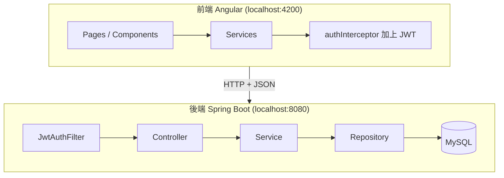
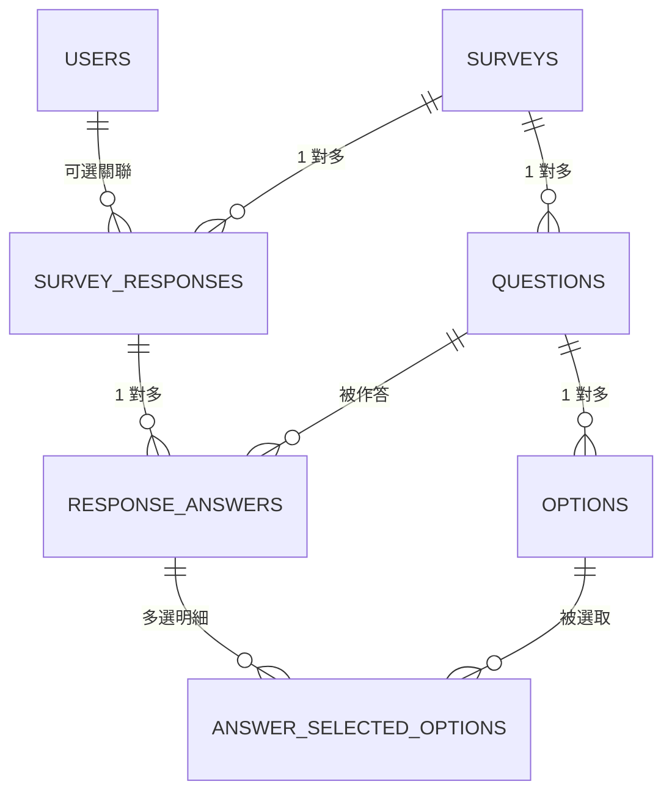
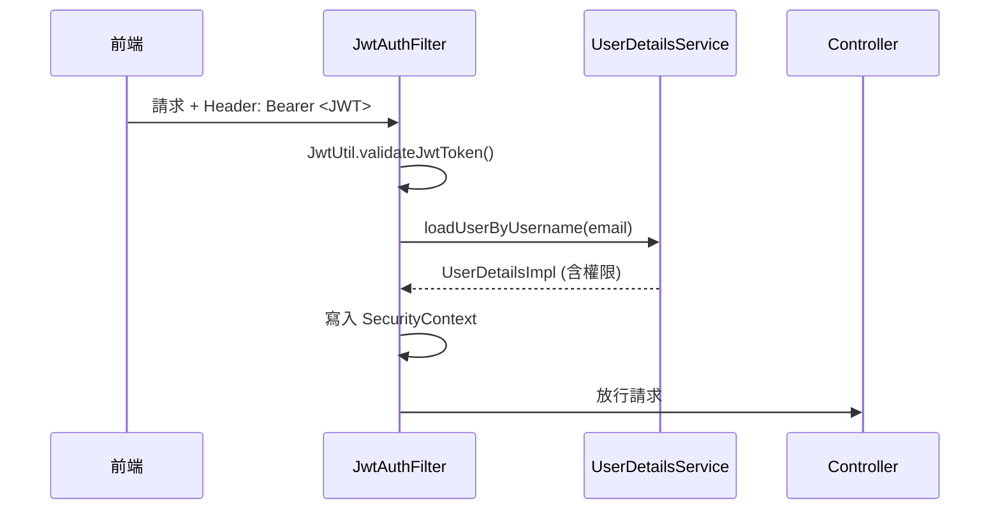
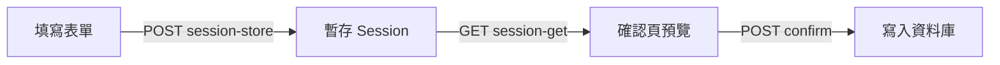

<div class="flex flex-col justify-center items-center h-full" style="background: #ffffff;">
  <p style="color: #5eada0; font-size: 1rem; font-weight: 600; letter-spacing: 0.2em; text-transform: uppercase; margin-bottom: 1.2rem;">
    Spring Boot Project Practice
  </p>
  <h1 style="color: #1a5c5c; font-size: 3.8rem; font-weight: 900; line-height: 1.15; margin-bottom: 1.5rem;">
    實戰演練：動態問卷系統
  </h1>
  <div style="height: 4px; width: 320px; background: linear-gradient(90deg, #5eada0, #a7d9d0); border-radius: 2px; margin-bottom: 1.5rem;"></div>
  <p style="color: #4a7c7c; font-size: 1.15rem; font-style: italic;">
    「從零到一，打造完整的前後端整合專案」
  </p>
  <Link to="home" style="color: #9dc4c4; font-size: 0.85rem; margin-top: 2rem; text-decoration: none; letter-spacing: 0.05em;">← 返回目錄</Link>
</div>

<!--
這一章是整個系列的綜合實戰，我們要把前面學過的 Spring Boot、Spring Security、JWT，甚至前端 Angular 通通串起來，做出一個真正能跑的「動態問卷系統」。之所以特別安排這個專案，是因為單獨學會 Annotation 或語法還不夠，真正上戰場時要處理的是「這些技術怎麼組合在一起」。跟著這份投影片，我們的目標是能夠獨立完成一個前後端分離、含身分驗證與統計圖表的完整專案。
-->

---
layout: section
class: flex flex-col justify-center items-center text-center
---

# 專案總覽

<!--
這個小節先給大家一張「藍圖」，讓我們知道等一下要蓋的房子長什麼樣子、有哪些房間。在動手寫程式之前，先弄懂系統要服務哪些角色、要用什麼技術，可以避免我們寫到一半迷路。
-->

---
layout: default
---

# 我們要做什麼？

本章將帶你從零打造一個 **前後端分離** 的動態問卷系統，跟著投影片即可獨立完成整個專案。

| 角色 | 功能 |
| --- | --- |
| **訪客 / 填答者** | 瀏覽進行中的問卷、填寫（單選 / 多選 / 簡答）、確認頁預覽後送出 |
| **會員** | 註冊、登入（JWT）、查看個人填寫紀錄 |
| **管理員** | 建立 / 編輯 / 刪除問卷、發佈與下架、檢視填寫名單與作答明細、統計圖表 |

- **後端**：Spring Boot 4.1 + Spring Data JPA + Spring Security + JWT + MySQL
- **前端**：Angular 18（Standalone）+ Angular Material + PrimeNG + Chart.js + Tailwind

<!--
這頁的重點是先定調整個專案的範圍：訪客、會員、管理員三種角色各自能做什麼事，直接對應到之後 Controller 要開放的 API。可以把它想像成蓋房子前的「使用需求訪談」——業主（訪客、會員、管理員）想要什麼功能，我們才知道要蓋幾間房間。實務上這種角色權限表，通常就是需求規格書的第一頁，值得養成習慣先畫出來再寫程式。
-->

---
layout: default
---

# 系統架構

<div style="margin-top: 1rem;">



</div>

- 前端透過 `HttpClient` 呼叫後端 REST API，所有回應統一包成 `AppResponse`。
- 後端採三層式架構：**Controller → Service → Repository**，搭配 Entity / DTO / VO。

<!--
這張架構圖把前端 Angular 跟後端 Spring Boot 兩邊怎麼溝通講清楚：前端發 HTTP 請求，經過 authInterceptor 自動掛上 JWT，後端則是 Filter 先驗證身分，才放行進 Controller。我們可以把它想成郵局寄信的流程——authInterceptor 就像是自動幫信件貼上郵票（JWT），JwtAuthFilter 則是郵局窗口先核對身分才放行。業界的前後端分離專案，幾乎都是這種「統一回應格式 + Interceptor 自動處理認證」的架構。
-->

---
layout: default
---

# 後端專案結構

```text
backend/src/main/java/com/example/dynamic_survey/
├── DynamicSurveyApplication.java   # 進入點
├── config/
│   └── GlobalExceptionHandler.java # 全域例外處理
├── controller/                     # REST API 接口
│   ├── AuthController.java         # 註冊 / 登入
│   ├── UserController.java         # 個人資料
│   ├── SurveyController.java       # 前台問卷流程
│   └── AdminSurveyController.java  # 後台問卷管理
├── service/                        # 業務邏輯
│   ├── AuthService.java
│   └── SurveyService.java
├── repository/                     # 資料存取 (JPA)
│   ├── UserRepository.java
│   ├── SurveyRepository.java
│   └── SurveyResponseRepository.java
├── entity/                         # 資料表對應
│   ├── User.java  Survey.java  Question.java
│   ├── Option.java  SurveyResponse.java  ResponseAnswer.java
├── dto/                            # 傳輸物件 (請求 / 回應)
├── vo/                             # 統一回應 (RspCode, AppResponse)
└── security/                       # JWT 與權限控管
```

<!--
這頁列出整個後端專案的資料夾配置，之後每一章的程式碼都會對應放進 controller、service、repository 這些資料夾。這就是我們熟悉的三層式架構（Controller → Service → Repository），只是這次多了 dto、vo、security 幾個資料夾，用來放傳輸物件、統一回應格式跟安全機制。建議大家先花點時間看過這個結構，等一下看到程式碼才知道它放在哪裡、為什麼放在那裡。
-->

---
layout: default
---

# 資料庫 ER 圖

<div class="grid grid-cols-2 gap-4 items-start">
<div class="flex justify-center items-center"><div style="width: 330px;">



</div></div>
<div>

- 一份 **問卷 (Survey)** 有多個 **題目 (Question)**，每題有多個 **選項 (Option)**。
- 一筆 **作答紀錄 (SurveyResponse)** 有多筆 **作答明細 (ResponseAnswer)**。
- 多選題透過中介表 `answer_selected_options` 連結明細與選項。

</div>
</div>

<!--
這張 ER 圖是整個系統的資料骨架，等一下寫 Entity 的時候都會照著這張圖的關聯去設計。可以把問卷想像成一棟大樓：Survey 是大樓，Question 是樓層，Option 是樓層裡的房間，SurveyResponse 跟 ResponseAnswer 則是「誰、什麼時候、住過哪間房」的入住紀錄。多選題透過中介表 answer_selected_options 記錄「這筆作答明細選了哪些選項」，這是多對多關聯的標準做法，等一下在 Entity 章節會實際看到怎麼用 @ManyToMany 實作。
-->

---
layout: section
class: flex flex-col justify-center items-center text-center
---

# 後端：環境設定

<!--
接下來我們要動手搭建後端的開發環境，包含資料庫、專案骨架跟基本設定檔。這一段做完，才有地方讓後面的程式碼真正跑起來。
-->

---
layout: default
---

# 建立 MySQL 資料庫

啟動 MySQL 後，先手動建立一個空資料庫（資料表會由 JPA 自動建立）：

```sql
CREATE DATABASE dynamic_survey
  DEFAULT CHARACTER SET utf8mb4
  DEFAULT COLLATE utf8mb4_unicode_ci;
```

- 資料庫名稱 `dynamic_survey` 必須與 `application.properties` 中的設定一致。
- 因為 `spring.jpa.hibernate.ddl-auto=update`，第一次啟動 Spring Boot 時會**自動建立**所有資料表。

<!--
這段 SQL 只做一件事：建立一個空的資料庫，之後所有的資料表都交給 JPA 的 ddl-auto=update 自動產生，我們不用手動寫 CREATE TABLE。帶大家看一下 utf8mb4 這個字元集設定，這是為了讓資料庫能正確存放中文甚至 emoji，是實務上建立資料庫的標準做法。
⚠️ 易錯點：資料庫名稱 dynamic_survey 一定要跟等一下 application.properties 裡的設定完全一致，不然啟動就會連不到資料庫。
預期結果：執行完這段 SQL，我們應該會看到一個空的 dynamic_survey 資料庫已經建立好。
-->

---
layout: default
---

# 用 Spring Initializr 建立專案

**在 [start.spring.io](https://start.spring.io) 建立新專案：**

| 設定項 | 選擇 |
|------|------|
| Project | Gradle - Groovy |
| Spring Boot | 4.1.x |
| **Artifact** | **`dynamic-survey`** |
| Java | 17 |
| Dependencies | **Spring Web**、**Spring Data JPA**、**Spring Security**、**Validation**、**MySQL Driver**、**Lombok**、**Spring Boot DevTools** |

<!--
這頁是用 Spring Initializr 建立專案時要勾選的設定，記得帶大家看一下 Artifact 名稱要打成 dynamic-survey，這樣之後產生的套件路徑才會跟投影片的程式碼一致。
⚠️ 易錯點：Dependencies 要一次把 Spring Web、Spring Data JPA、Spring Security、Validation、MySQL Driver、Lombok 都勾齊，漏勾一個等一下就要手動補依賴。
預期結果：按下 Generate 之後，我們會拿到一個可以直接匯入 IDE 的專案壓縮檔。
-->

---
layout: default
---

# 手動補上 JWT 套件

- 按 **Generate** 下載解壓，或直接用 IDE 內建的 Spring Initializr 精靈建立。

<div class="mt-2 p-2 bg-yellow-50 border-l-4 border-yellow-400 text-gray-700 text-sm text-left">
⚠️ <b>JWT 套件 Initializr 找不到：</b>下載解壓後，還要手動在 <code>build.gradle</code> 的 <code>dependencies</code> 區塊補上這三行：
</div>

```groovy
dependencies {
    // ... Initializr 已產生的依賴照舊保留

    implementation 'io.jsonwebtoken:jjwt-api:0.12.5'
    runtimeOnly 'io.jsonwebtoken:jjwt-impl:0.12.5'
    runtimeOnly 'io.jsonwebtoken:jjwt-jackson:0.12.5'
}
```

- 補完存檔後記得對專案按右鍵 → **Gradle** → **Refresh Gradle Project**，才會抓到新依賴。

<!--
jjwt 這個 JWT 套件比較新，Spring Initializr 的介面上找不到，所以要手動在 build.gradle 補上這三行依賴。特別提醒同學這是 jjwt 0.12.x 的寫法，分成 api、impl、jackson 三個套件，跟舊版只加一個 jjwt 依賴不一樣。
⚠️ 易錯點：補完存檔後一定要記得對專案按右鍵重新整理 Gradle，不然 IDE 還是抓不到新加的類別，import 會一直標紅字。
預期結果：做完這步，我們應該能在程式碼裡正常 import io.jsonwebtoken 底下的類別。
-->

---
layout: default
---

# application.properties

```properties
# Database Configuration (MySQL)
spring.datasource.url=jdbc:mysql://localhost:3306/dynamic_survey?useSSL=false&serverTimezone=UTC&allowPublicKeyRetrieval=true
spring.datasource.username=root
spring.datasource.password=root
spring.datasource.driver-class-name=com.mysql.cj.jdbc.Driver

# JPA / Hibernate
spring.jpa.hibernate.ddl-auto=update
spring.jpa.show-sql=true
spring.jpa.properties.hibernate.format_sql=true
spring.jpa.properties.hibernate.dialect=org.hibernate.dialect.MySQLDialect

# Jackson Date Formatting (日期序列化為 yyyy-MM-dd 而非時間戳)
spring.jackson.datatype.datetime.write-dates-as-timestamps=false
spring.jackson.date-format=yyyy-MM-dd

# JWT Configuration (正式環境密鑰應妥善保管)
jwt.secret=vAK3M9YSw2q1eRE1oJs0JAcUswCqDOBD4l19sdOWoX+qlVzBEfNyUI/A+EogMuaQlAIzzBbrkMWLl0hy+DT96A==
jwt.expiration=86400000
```

- `jwt.secret` 必須是 **Base64 編碼**過的隨機亂數（見第 45 章），開發期可用 `openssl rand -base64 64` 產生；正式環境不要寫在 properties 裡，改用環境變數覆蓋。
- ⚠️ **HS512 演算法要求密鑰長度 ≥ 512 bits（64 bytes）**：`openssl rand -base64 32` 只產生 32 bytes（256 bits），解碼後不夠長會拋 `WeakKeyException` / `Unable to compute HS512 signature`，務必用 `-base64 64`。

<!--
這頁把資料庫連線、JPA、Jackson 日期格式跟 JWT 金鑰全部集中設定好，是整個後端能不能順利啟動的關鍵檔案。特別帶大家看 jwt.secret 這一行——這跟第 45 章教過的一樣，必須是 Base64 編碼過的隨機亂數。
⚠️ 易錯點：投影片特別標注了 HS512 演算法要求金鑰長度至少 512 bits，如果我們用 openssl rand -base64 32 產生的金鑰只有 256 bits，一啟動就會丟出 WeakKeyException，一定要用 -base64 64 才夠長。
預期結果：設定完成、資料庫也建立好之後，啟動專案應該會在 console 看到 Hibernate 自動建立資料表的 SQL 訊息。
-->

---
layout: default
---

# 專案進入點

### `DynamicSurveyApplication.java`

```java
package com.example.dynamic_survey;

import org.springframework.boot.SpringApplication;
import org.springframework.boot.autoconfigure.SpringBootApplication;

@SpringBootApplication
public class DynamicSurveyApplication {
    public static void main(String[] args) {
        SpringApplication.run(DynamicSurveyApplication.class, args);
    }
}
```

- `@SpringBootApplication` 會自動掃描同套件（含子套件）下的所有元件。

<!--
這是整個 Spring Boot 應用程式的入口，程式碼很短，但 @SpringBootApplication 這個 Annotation 背後其實做了元件掃描、自動組態這些重要的事。可以把它想成一棟大樓的總電源開關——按下去，整棟大樓（所有被 @Component、@Service、@RestController 標記的類別）才會一起被啟動並接上電。預期結果：執行 main method 之後，我們應該會看到 Spring Boot 的啟動 Banner，並且在 8080 埠口監聽請求。
-->

---
layout: section
class: flex flex-col justify-center items-center text-center
---

# 後端：統一回應 (VO)

<!--
在動手寫 Entity 之前，我們先把整個系統回應前端的「信封格式」定義出來，之後所有 API 都用同一種格式回傳，前端處理起來才會一致。
-->

---
layout: default
---

# 狀態碼列舉 (1/2)

### `vo/RspCode.java` — 列舉常數

```java
package com.example.dynamic_survey.vo;

import lombok.Getter;

/**
 * 集中管理系統中所有回應代碼與訊息，避免出現「魔術數字」。
 */
@Getter
public enum RspCode {
    SUCCESS(200, "操作成功"),
    PARAM_ERROR(400, "參數錯誤"),
    UNAUTHORIZED(401, "尚未登入或憑證無效"),
    FORBIDDEN(403, "權限不足"),
    NOT_FOUND(404, "資源不存在"),
    DUPLICATE_ERROR(409, "資料重複"),
    INTERNAL_SERVER_ERROR(500, "系統內部錯誤");

    // ... 見下一頁
}
```

<!--
RspCode 用列舉集中管理所有回應代碼跟訊息，避免程式碼裡到處出現「魔術數字」像是直接寫 200、400 這種讓人看不懂意圖的寫法。可以把它想成郵局的「掛號信代碼表」——每一種狀況都有固定的代碼跟說明，不用每次都重新解釋。這頁先看欄位設計，下一頁會接著看建構子怎麼寫。
-->

---
layout: default
---

# 狀態碼列舉 (2/2)

### `vo/RspCode.java` — 欄位與建構子

```java
public enum RspCode {
    // ... 接上一頁

    private final int code;     // HTTP 狀態碼
    private final String message;

    RspCode(int code, String message) {
        this.code = code;
        this.message = message;
    }
}
```

<!--
接續上一頁，這裡定義了 RspCode 的 code 跟 message 兩個欄位，並用列舉的建構子在宣告每個常數時就把值帶進去。
⚠️ 易錯點：列舉的建構子預設就是 private，不用也不能加 public。這種「列舉 + Getter」的組合，是 Spring Boot 專案裡最常見的狀態碼管理方式，之後在 GlobalExceptionHandler 會看到怎麼實際使用它。
-->

---
layout: default
---

# 統一回應物件 (1/2)

### `vo/AppResponse.java` — record 欄位

```java
package com.example.dynamic_survey.vo;

/** 回傳 JSON 結構一致：{ code, message, data } */
public record AppResponse<T>(int code, String message, T data) {
    // record 自動產生建構子與 code() / message() / data() 存取方法
    // ... 見下一頁
}
```

- record 三個欄位都是唯讀（immutable），不再需要 `@Data` 或 setter。
- 取值方式從 `getCode()` 變成 `code()`（record 慣例，無 `get` 前綴）。

<!--
AppResponse 用 record 定義，讓所有 API 回傳的 JSON 都長成 { code, message, data } 這樣固定的結構，前端才能用同一套邏輯處理所有回應。跟第 45 章一樣，因為這三個欄位建立後就不會再被修改，非常適合用 record 取代傳統的 class + Lombok。
⚠️ 易錯點：record 沒有 getCode() 這種傳統 getter，取值方式變成 code()，同學如果沿用舊習慣打 getCode() 會編譯不過。
-->

---
layout: default
---

# 統一回應物件 (2/2)

### `vo/AppResponse.java` — 靜態工廠方法

```java
public record AppResponse<T>(int code, String message, T data) {

    public static <T> AppResponse<T> success(T data) {
        return new AppResponse<>(RspCode.SUCCESS.getCode(), RspCode.SUCCESS.getMessage(), data);
    }

    public static <T> AppResponse<T> error(RspCode rspCode) {
        return new AppResponse<>(rspCode.getCode(), rspCode.getMessage(), null);
    }

    public static <T> AppResponse<T> error(RspCode rspCode, String customMessage) {
        // record 沒有 setter，直接用自訂訊息建立新物件
        return new AppResponse<>(rspCode.getCode(), customMessage, null);
    }
}
```

<!--
這頁補上 success 跟兩個 error 靜態工廠方法，讓我們在 Controller 或 Service 裡可以很簡潔地寫 AppResponse.success(data) 或 AppResponse.error(RspCode.XXX)，不用每次都手動 new 一個物件塞三個參數。帶大家留意最後一個多載版本，可以帶自訂訊息覆蓋 RspCode 預設的 message，這在驗證失敗要顯示具體錯誤原因時很好用。
⚠️ 易錯點：record 沒有 setter，所以想要換訊息只能重新 new 一個新物件，這也是程式碼裡註解特別寫「record 沒有 setter，直接用自訂訊息建立新物件」的原因。
-->

---
layout: section
class: flex flex-col justify-center items-center text-center
---

# 後端：資料模型 (Entity)

<!--
接下來我們要把剛剛看到的 ER 圖，實際轉換成 JPA 的 Entity 類別。這是整個後端資料層的地基，之後 Repository、Service 都是建立在這些 Entity 之上。
-->

---
layout: default
---

# Entity — Survey (問卷) (1/2)

### `entity/Survey.java` — 欄位

```java
@Entity
@Table(name = "surveys")
@Data
public class Survey {
    @Id
    @GeneratedValue(strategy = GenerationType.IDENTITY)
    private Long id;

    @Column(nullable = false, length = 50)
    private String title;

    @Column(length = 300)
    private String description;

    @Column(nullable = false) private LocalDate startDate;
    @Column(nullable = false) private LocalDate endDate;
    @Column(nullable = false) private String status; // DRAFT / PUBLISHED

    // ... 見下一頁
}
```

<!--
Survey 是整個系統最核心的 Entity，對應到一份問卷本身。帶大家看幾個關鍵欄位：status 用字串存 DRAFT / PUBLISHED，這種「用字串當狀態值」的做法簡單好懂，但也要注意打字錯誤不會被編譯器抓到。
⚠️ 易錯點：title 限制 50 字、description 限制 300 字，這些 @Column 的 length 要跟後面 DTO 上的 @Size 驗證規則對齊，不然資料庫層跟驗證層會對不上。下一頁會接著看 Survey 跟 Question 之間的一對多關聯怎麼寫。
-->

---
layout: default
---

# Entity — Survey (問卷) (2/2)

### `entity/Survey.java` — 一對多關聯

```java
public class Survey {
    // ... 接上一頁

    // [一對多] cascade=ALL：儲存問卷時題目一併儲存；orphanRemoval：移除題目即刪除
    @OneToMany(mappedBy = "survey", cascade = CascadeType.ALL, orphanRemoval = true)
    @OrderBy("orderIndex ASC")
    private List<Question> questions = new ArrayList<>();
}
```

<!--
這頁接續上一頁，補上 Survey 跟 Question 的一對多關聯。帶大家留意兩個關鍵設定：cascade = CascadeType.ALL 讓我們儲存問卷時，底下的題目會一起被存；orphanRemoval = true 則是當題目從 List 裡被移除時，資料庫裡對應的那筆記錄也會被刪除，而不是留下孤兒資料。
⚠️ 易錯點：@OrderBy("orderIndex ASC") 保證取出的題目順序跟使用者編輯時排列的順序一致，如果拿掉這行，題目順序可能會因為資料庫查詢而變亂。
-->

---
layout: default
---

# Entity — Question (題目) (1/2)

### `entity/Question.java` — 欄位與多對一

```java
@Entity
@Table(name = "questions")
@Data
public class Question {
    @Id
    @GeneratedValue(strategy = GenerationType.IDENTITY)
    private Long id;

    // [多對一] 每筆題目都屬於一個問卷
    @ManyToOne(fetch = FetchType.LAZY)
    @JoinColumn(name = "survey_id", nullable = false)
    private Survey survey;

    @Column(nullable = false, length = 75) private String title;
    @Column(nullable = false) private String type;     // SINGLE / MULTI / TEXT
    @Column(nullable = false) private boolean required;
    @Column(nullable = false) private int orderIndex;
    // ... 見下一頁
}
```

<!--
Question 代表問卷裡的一道題目，用 @ManyToOne 掛回 Survey，形成「多個題目屬於同一份問卷」的關聯。注意這裡用 FetchType.LAZY，代表查詢 Question 時不會馬上把整個 Survey 資料都撈出來，要真正用到才會觸發查詢，這是效能考量上的常見做法。type 欄位用字串存 SINGLE / MULTI / TEXT，決定這題要顯示單選、多選還是簡答輸入框，這個欄位會貫穿整個系統一路影響到前端的表單渲染。
-->

---
layout: default
---

# Entity — Question (題目) (2/2)

### `entity/Question.java` — 巢狀一對多

```java
public class Question {
    // ... 接上一頁

    // [巢狀一對多] 題目底下的選項
    @OneToMany(mappedBy = "question", cascade = CascadeType.ALL, orphanRemoval = true)
    @OrderBy("orderIndex ASC")
    private List<Option> options = new ArrayList<>();
}
```

<!--
這頁補上 Question 底下巢狀的一對多關聯到 Option，寫法跟 Survey → Question 的關聯幾乎一樣：cascade = ALL、orphanRemoval = true、依 orderIndex 排序。可以看出這是一個典型的「巢狀樹狀結構」：問卷底下有題目，題目底下又有選項，一路往下巢狀。這種重複的模式熟悉一次，後面看到類似的關聯就能快速理解。
-->

---
layout: default
---

# Entity — Option (選項)

### `entity/Option.java`

```java
@Entity
@Table(name = "options")
@Data
public class Option {
    @Id
    @GeneratedValue(strategy = GenerationType.IDENTITY)
    private Long id;

    // 選項屬於特定題目
    @ManyToOne(fetch = FetchType.LAZY)
    @JoinColumn(name = "question_id", nullable = false)
    private Question question;

    @Column(nullable = false) private String optionText; // 選項文字
    @Column(nullable = false) private int orderIndex;    // 選項順序
}
```

別忘了類別上方的 import：`import jakarta.persistence.*; import lombok.Data;`

<!--
Option 是最底層的資料，對應一個選項的文字內容。這頁沒有巢狀關聯了，是這一串 Entity 裡最單純的一個，帶大家看最後那行 import 提醒——jakarta.persistence 底下的 Annotation 跟 lombok.Data 都要記得引入，這是初學者最常忘記的小細節之一。
-->

---
layout: default
---

# Entity — SurveyResponse (作答紀錄) (1/2)

### `entity/SurveyResponse.java` — 問卷關聯與作答者資訊

```java
@Entity
@Table(name = "survey_responses")
@Data
public class SurveyResponse {
    @Id
    @GeneratedValue(strategy = GenerationType.IDENTITY)
    private Long id;

    @ManyToOne(fetch = FetchType.LAZY)
    @JoinColumn(name = "survey_id", nullable = false)
    private Survey survey;

    // === 作答者基本資訊 (直接存於此，支援免登入作答) ===
    @Column(nullable = false) private String name;   // 姓名
    @Column(nullable = false) private String phone;  // 手機
    @Column(nullable = false) private String email;  // Email (重複作答檢查依據)
    @Column private Integer age;                      // 年齡 (選填)
    @Column(nullable = false) private LocalDateTime submittedAt;
    // ... 見下一頁
}
```

<!--
SurveyResponse 代表「一筆作答紀錄」，比較特別的是它直接把姓名、手機、Email 這些填答者資訊存在自己身上，而不是強制要求要有登入帳號。這個設計是為了支援「免登入作答」——問卷調查常常需要讓匿名訪客也能填寫，不能強制大家都要註冊會員。
⚠️ 易錯點：email 這個欄位除了記錄用途，後面在 SurveyResponseRepository 也會拿來檢查「這個 Email 是否已經填過這份問卷」，算是身兼兩職。
-->

---
layout: default
---

# Entity — SurveyResponse (作答紀錄) (2/2)

### `entity/SurveyResponse.java` — 會員關聯與作答明細

```java
public class SurveyResponse {
    // ... 接上一頁

    // [可選] 若為登入會員，連結其帳號
    @ManyToOne(fetch = FetchType.LAZY)
    @JoinColumn(name = "user_id", nullable = true)
    private User user;

    @OneToMany(mappedBy = "surveyResponse", cascade = CascadeType.ALL, orphanRemoval = true)
    private List<ResponseAnswer> answers = new ArrayList<>();
}
```

<!--
這頁補上跟 User 的可選關聯（nullable = true），代表如果是登入會員來填答，我們會把這筆紀錄跟他的帳號連起來，方便他之後在「我的紀錄」頁面查詢；如果是匿名訪客，這個欄位就會是 null。下面的 answers 則是一對多關聯到 ResponseAnswer，一筆作答紀錄底下會有多筆作答明細，對應到問卷裡的每一道題目。
-->

---
layout: default
---

# Entity — ResponseAnswer (作答明細) (1/2)

### `entity/ResponseAnswer.java` — 多對一關聯

```java
@Entity
@Table(name = "response_answers")
@Data
public class ResponseAnswer {
    @Id
    @GeneratedValue(strategy = GenerationType.IDENTITY)
    private Long id;

    @ManyToOne(fetch = FetchType.LAZY)
    @JoinColumn(name = "response_id", nullable = false)
    private SurveyResponse surveyResponse;

    @ManyToOne(fetch = FetchType.LAZY)
    @JoinColumn(name = "question_id", nullable = false)
    private Question question;
    // ... 見下一頁
}
```

<!--
ResponseAnswer 是「這位填答者，針對某一題，答了什麼」的明細紀錄，同時用兩個 @ManyToOne 分別關聯回 SurveyResponse 跟 Question。可以把它想像成收據上的一行明細——SurveyResponse 是整張收據，ResponseAnswer 就是收據裡的每一項商品。
-->

---
layout: default
---

# Entity — ResponseAnswer (作答明細) (2/2)

### `entity/ResponseAnswer.java` — 多對多選項與簡答

```java
public class ResponseAnswer {
    // ... 接上一頁

    // [多對多] 單/多選的選取選項，產生中介表 answer_selected_options
    @ManyToMany
    @JoinTable(name = "answer_selected_options",
        joinColumns = @JoinColumn(name = "answer_id"),
        inverseJoinColumns = @JoinColumn(name = "option_id"))
    private List<Option> selectedOptions = new ArrayList<>();

    @Column(columnDefinition = "TEXT")
    private String answerText; // 簡答題內容 (選擇題也會存選項文字串接)
}
```

<!--
這頁是整個資料模型裡關聯最複雜的地方：selectedOptions 用 @ManyToMany 搭配 @JoinTable 手動指定中介表名稱 answer_selected_options，處理「一個作答明細可能勾選多個選項」的多選情境。
⚠️ 易錯點：answerText 這個欄位身兼兩種用途——簡答題直接存文字內容，選擇題則是把選中的選項文字用分號串接起來方便顯示，這種「一個欄位兩種用法」的設計要跟同學特別強調，不然容易誤會。
-->

---
layout: default
---

# Entity — User (會員) (1/2)

### `entity/User.java` — 類別註解與認證欄位

```java
@Entity
@Table(name = "users")
@Data
@NoArgsConstructor
@AllArgsConstructor
public class User {
    @Id
    @GeneratedValue(strategy = GenerationType.IDENTITY)
    private Long id;

    @Column(nullable = false, unique = true)
    private String email;

    @Column(nullable = false)
    private String password; // BCrypt 加密儲存
    // ... 見下一頁
}
```

<!--
User 代表系統的會員帳號，這頁先看認證相關欄位：email 設定 unique = true 確保帳號不能重複註冊，password 則存 BCrypt 加密過的雜湊值，絕對不會存明碼。
⚠️ 易錯點：這裡額外加了 @NoArgsConstructor 跟 @AllArgsConstructor，是因為後面 UserDetailsImpl 會需要用建構子產生物件，跟其他只靠 @Data 的 Entity 不太一樣，值得提醒同學留意。
-->

---
layout: default
---

# Entity — User (會員) (2/2)

### `entity/User.java` — 個資與角色

```java
public class User {
    // ... 接上一頁

    @Column(nullable = false)
    private String name;

    private String phone;

    @Column(nullable = false)
    private String role; // "USER" or "ADMIN"
}
```

<!--
這頁補上姓名、電話跟角色欄位，role 用字串存 "USER" 或 "ADMIN" 兩種角色。
⚠️ 易錯點：這個教學版設計是「註冊即為管理員」（等一下在 AuthService 會看到），跟正式產品通常預設是一般會員不同，帶大家理解這只是為了讓教學流程能快速看到後台功能，實務上要另外設計角色升級機制。
-->

---
layout: section
class: flex flex-col justify-center items-center text-center
---

# 後端：資料存取 (Repository)

<!--
Entity 都定義好了，接下來要靠 Repository 把資料從資料庫撈出來或寫進去。Spring Data JPA 最方便的地方就在這裡——大部分查詢我們幾乎不用自己寫 SQL。
-->

---
layout: default
---

# Repository — UserRepository

### `repository/UserRepository.java`

```java
package com.example.dynamic_survey.repository;

import com.example.dynamic_survey.entity.User;
import org.springframework.data.jpa.repository.JpaRepository;
import java.util.Optional;

public interface UserRepository extends JpaRepository<User, Long> {
    Optional<User> findByEmail(String email);
    boolean existsByEmail(String email);
}
```

- 繼承 `JpaRepository` 即免費取得 CRUD。
- 依命名規則 `findByEmail` / `existsByEmail`，Spring Data JPA 會自動產生查詢。

<!--
這是最簡單的一個 Repository，繼承 JpaRepository 就免費拿到 save、findById、deleteById 等基本 CRUD 方法。帶大家看 findByEmail 跟 existsByEmail 這兩個方法——只要照 Spring Data JPA 的命名規則寫方法名稱，框架就會自動幫我們產生對應的查詢邏輯，完全不用寫一行 SQL，這也是 Spring Data JPA 最受歡迎的功能之一。
-->

---
layout: default
---

# Repository — SurveyRepository

### `repository/SurveyRepository.java`

```java
public interface SurveyRepository extends JpaRepository<Survey, Long> {

    // 查詢「已發佈」且「在有效日期內」的問卷 (前台首頁用)
    @Query("SELECT s FROM Survey s WHERE s.status = 'PUBLISHED' " +
           "AND s.startDate <= CURRENT_DATE AND s.endDate >= CURRENT_DATE")
    List<Survey> findActiveSurveys();

    // 多條件動態篩選 (後台搜尋用)：標題關鍵字 + 日期區間
    @Query("SELECT s FROM Survey s WHERE " +
           "(:title IS NULL OR s.title LIKE %:title%) AND " +
           "(:startDate IS NULL OR s.startDate >= :startDate) AND " +
           "(:endDate IS NULL OR s.endDate <= :endDate)")
    List<Survey> findByFilters(@Param("title") String title,
                               @Param("startDate") LocalDate startDate,
                               @Param("endDate") LocalDate endDate);
}
```

<!--
這裡開始用 @Query 手寫 JPQL，因為命名規則沒辦法表達這麼複雜的條件。findActiveSurveys 查詢「已發佈且在有效日期內」的問卷，直接在 SQL 條件裡用 CURRENT_DATE 比較日期。findByFilters 則示範了「可選條件」的寫法——用 :title IS NULL OR ... 這種 pattern，讓同一個方法可以應付使用者可能只填標題、只填日期、或都不填的各種篩選組合。
⚠️ 易錯點：LIKE %:title% 這種寫法在某些情境要注意跳脫特殊字元，教學版先簡化處理。
-->

---
layout: default
---

# Repository — SurveyResponseRepository

### `repository/SurveyResponseRepository.java`

```java
public interface SurveyResponseRepository extends JpaRepository<SurveyResponse, Long> {

    // 個人歷史紀錄 (依提交時間新到舊)
    List<SurveyResponse> findByUserOrderBySubmittedAtDesc(User user);

    // 統計用：取得某問卷所有回覆
    List<SurveyResponse> findBySurveyId(Long surveyId);

    // 填寫名單：依 ID 逆序 (最新在前)
    List<SurveyResponse> findBySurveyIdOrderByIdDesc(Long surveyId);

    boolean existsBySurveyId(Long surveyId);                       // 是否有人作答
    boolean existsBySurveyIdAndEmail(Long surveyId, String email); // 此 Email 是否填過
}
```

<!--
這個 Repository 專門服務作答紀錄的各種查詢：個人歷史紀錄要照時間排序、統計要撈某問卷的全部回覆、填寫名單要依 ID 逆序。特別看最後兩個 exists 方法——existsBySurveyId 用來判斷「問卷是否已有人作答」（決定能不能刪除），existsBySurveyIdAndEmail 用來判斷「這個 Email 是否已經填過」（避免重複作答），這種只需要回傳 boolean 的查詢用 exists 開頭效能會比查出整個 List 再判斷是否為空更好。
-->

---
layout: section
class: flex flex-col justify-center items-center text-center
---

# 後端：傳輸物件 (DTO)

<!--
Entity 是資料庫看到的樣子，但直接把 Entity 回傳給前端常常會有問題（例如密碼欄位外洩、巢狀關聯無限遞迴）。接下來我們用 DTO 建立一層對外溝通專用的物件。
-->

---
layout: default
---

# DTO — 問卷結構 (OptionDTO)

### `dto/OptionDTO.java`

```java
@Data
public class OptionDTO {
    private Long id;
    @NotBlank(message = "選項內容不可為空")
    private String optionText;
    private int orderIndex;
}
```

- 不能改成 record：後續 `SurveyService` 會透過 setter 設定裡面的值，而 record 只有 getter、沒有 setter。

<!--
OptionDTO 對應前端傳來的選項資料，用 @NotBlank 確保選項內容不能是空字串。
⚠️ 易錯點：投影片特別註記「不能改成 record」，因為後面 SurveyService 會用 setter 一個一個欄位塞值，而 record 天生沒有 setter，這是判斷這個 DTO 該用 class 還是 record 的實務準則——看它之後會不會被修改。
-->

---
layout: default
---

# DTO — 問卷結構 (QuestionDTO)

### `dto/QuestionDTO.java`

```java
@Data
public class QuestionDTO {
    private Long id;
    @NotBlank(message = "題目名稱不可為空")
    @Size(max = 75, message = "題目不可超過 75 字")
    private String title;
    @NotBlank(message = "題目類型不可為空")
    private String type;            // SINGLE / MULTI / TEXT
    private boolean required;
    private int orderIndex;
    @Valid
    private List<OptionDTO> options;
}
```

- 不能改成 record：後續 `SurveyService` 會透過 setter 設定裡面的值，而 record 只有 getter、沒有 setter。

<!--
QuestionDTO 多了 @Valid 標在 options 欄位上，這就是巢狀驗證的關鍵——沒有這個 @Valid，Bean Validation 只會檢查外層欄位，不會深入檢查 List 裡每個 OptionDTO 內部的 @NotBlank。同樣因為後面會用 setter 賦值，這個 DTO 也維持 class 寫法，不能改成 record。
-->

---
layout: default
---

# DTO — 問卷主體 (SurveyDTO)

### `dto/SurveyDTO.java`

```java
@Data
public class SurveyDTO {
    private Long id;
    @NotBlank(message = "問卷標題不可為空")
    @Size(max = 50, message = "標題長度不可超過 50 字")
    private String title;
    @Size(max = 300, message = "說明長度不可超過 300 字")
    private String description;
    @NotNull(message = "開始日期不可為空") private LocalDate startDate;
    @NotNull(message = "結束日期不可為空") private LocalDate endDate;
    @NotBlank(message = "狀態不可為空")     private String status;
    private boolean hasResponses; // 是否已有人作答 (前端判斷可否刪除)
    @Valid
    @NotNull(message = "題目列表不可為空")
    @Size(min = 1, message = "至少需包含一個題目")
    private List<QuestionDTO> questions;
}
```

- 不能改成 record：後續 `SurveyService` 會透過 setter 設定裡面的值，而 record 只有 getter、沒有 setter。

<!--
SurveyDTO 是整份問卷的頂層傳輸物件，questions 欄位同樣標了 @Valid，形成「SurveyDTO → QuestionDTO → OptionDTO」一路往下驗證的巢狀結構。
⚠️ 易錯點：@Size(min = 1) 保證問卷至少要有一題，這種邊界條件很容易在測試時被忽略，建議寫測試案例時特別驗證「空題目陣列」會被擋下來。
-->

---
layout: default
---

# @Valid 巢狀驗證的運作方式

驗證的起點只有一個：Controller 那行 `@Valid @RequestBody SurveyDTO dto`。

```text
@Valid @RequestBody SurveyDTO dto   ← 驗證起點
        │
        │ SurveyDTO.questions 標了 @Valid
        ▼
    QuestionDTO（逐一驗證 list 裡每個物件）
        │
        │ QuestionDTO.options 標了 @Valid
        ▼
    OptionDTO（逐一驗證 list 裡每個物件）
```

- **沒 `@Valid`** → 驗證器把 `OptionDTO` 物件當黑盒子，只看外層有沒有 null／size 之類問題，內部的 `optionText` 是否為空完全不檢查。
- **有 `@Valid`** → 驗證器對 list 裡每個 `OptionDTO` 執行完整驗證，`optionText` 上的 `@NotBlank` 才會生效。

<!--
這頁用一張流程圖把巢狀驗證的原理講清楚：驗證永遠只有一個起點——Controller 那行 @Valid @RequestBody SurveyDTO dto，之後能不能往下驗證 QuestionDTO、OptionDTO，完全取決於上一層有沒有標 @Valid。可以把它想成信件層層轉交——沒有蓋「請查驗內附文件」的章，郵局只會檢查信封本身有沒有問題，不會拆開檢查裡面的每份文件。這是初學者最容易忽略、卻在專案裡造成「明明有驗證規則但沒生效」的常見地雷，值得花時間讓同學徹底理解。
-->

---
layout: default
---

# DTO — 作答 (AnswerDTO)

### `dto/AnswerDTO.java`

```java
public record AnswerDTO(
    Long questionId,
    List<Long> optionIds,  // 單/多選的選項 ID
    String answerText      // 簡答內容
) {}
```

- record 只能讀取（`questionId()` / `answerText()` 等），這個 DTO 全程只被讀取（Service 讀值），從未被 setter 修改，天生適合改成 record。

<!--
AnswerDTO 代表「對某一題的作答內容」，同時支援選擇題的 optionIds 跟簡答題的 answerText。跟前面幾個 DTO 不同，這裡改用 record，因為它從頭到尾只會被讀取（Service 只呼叫 questionId()、optionIds() 這些存取方法），完全不會被 setter 修改，正是 record 最適合登場的場景。
-->

---
layout: default
---

# DTO — 作答 (ResponseDTO)

### `dto/ResponseDTO.java`

```java
public record ResponseDTO(
    Long surveyId,
    @NotBlank(message = "姓名不可為空") String name,
    @NotBlank(message = "手機不可為空") String phone,
    String email,                                 // 選填 (但作為重複檢查依據)
    @NotNull(message = "年齡不可為空") Integer age,
    List<AnswerDTO> answers
) {}
```

- 這個 DTO 全程只被讀取（Session 暫存、Jackson 反序列化、Service 讀值），從未被 setter 修改，天生適合改成 record。

<!--
ResponseDTO 是一次完整作答提交的頂層物件，帶大家留意驗證規則直接寫在 record 的參數上（@NotBlank String name），這是 record 搭配 Bean Validation 的標準寫法。同樣因為只被讀取、從未被修改，天生適合用 record，跟前面 SurveyDTO 那種會被 setter 操作的情況形成對比，這個對比很適合拿來讓同學建立「什麼時候用 record、什麼時候用 class」的判斷直覺。
-->

---
layout: default
---

# DTO — 認證請求 (LoginRequest)

### `dto/LoginRequest.java`

```java
@Data
public class LoginRequest {
    @NotBlank(message = "電子郵件不可為空")
    @Email(message = "電子郵件格式不正確")
    private String email;
    @NotBlank(message = "密碼不可為空")
    @Size(min = 6, message = "密碼長度需至少 6 位")
    private String password;
}
```

- 不能改成 record：`AuthService.registerUser` 內部用 `new LoginRequest()` + setter 建立，維持 `@Data` class。

<!--
LoginRequest 維持傳統 @Data class 寫法，因為 AuthService.registerUser 內部會 new LoginRequest() 再用 setter 一個個塞值。
⚠️ 易錯點：密碼用 @Size(min = 6) 限制長度，這只是最基本的長度檢查，實務上正式產品通常還會加上複雜度規則（例如需含大小寫、數字），教學版先求簡單。
-->

---
layout: default
---

# DTO — 認證請求 (RegisterRequest)

### `dto/RegisterRequest.java`

```java
public record RegisterRequest(
    @NotBlank(message = "姓名不可為空") String name,
    @NotBlank(message = "電子郵件不可為空")
    @Email(message = "電子郵件格式不正確") String email,
    @NotBlank(message = "密碼不可為空")
    @Size(min = 6, message = "密碼長度需至少 6 位") String password,
    String phone
) {}
```

- `RegisterRequest` 全程只被讀取（`registerUser` 只呼叫 getter），從未被 setter 修改，天生適合改成 record。

<!--
RegisterRequest 改回 record 寫法，因為它全程只被讀取（registerUser 只呼叫 getter 般的存取方法），從未被 setter 修改。把這頁跟上一頁 LoginRequest 放在一起看，剛好是這份投影片「用途決定用 class 還是 record」這個原則最清楚的對照組。
-->

---
layout: section
class: flex flex-col justify-center items-center text-center
---

# 後端：安全機制 (Security & JWT)

<!--
問卷系統要區分訪客、會員、管理員，勢必要有身分驗證機制。這一節我們會重建第 45 章教過的 JWT 認證流程，只是這次要套用到真實的問卷專案上。
-->

---
layout: default
---

# Security — 概念流程



- **JwtUtil**：簽發 / 解析 / 驗證 Token
- **JwtAuthFilter**：每個請求攔截、驗證、登記身分
- **UserDetailsImpl / UserDetailsServiceImpl**：把 `User` 轉成 Security 認得的格式

<!--
這張循序圖把 JWT 認證的完整流程畫出來：前端帶著 Token 發請求，JwtAuthFilter 攔截驗證，成功後才把身分寫進 SecurityContext 放行給 Controller。可以把 JwtAuthFilter 想像成大樓管理員——每個人進大樓都要先在門口刷卡（驗證 Token），管理員確認身分無誤才會讓電梯真正動起來（放行到 Controller）。這是幾乎所有前後端分離專案都會用到的標準認證架構，帶大家先建立整體印象，再一頁一頁看細節怎麼實作。
-->

---
layout: default
---

# Security — JwtUtil (1) 欄位與簽名金鑰

### `security/JwtUtil.java`

```java
@Component
public class JwtUtil {
    @Value("${jwt.secret}")     private String jwtSecret;
    @Value("${jwt.expiration}") private int jwtExpirationMs;

    // jwt.secret 是 Base64 編碼過的亂數，要先解碼還原成位元組
    private SecretKey getSigningKey() {
        byte[] keyBytes = Decoders.BASE64.decode(jwtSecret);
        return Keys.hmacShaKeyFor(keyBytes);
    }
    // ... 見下一頁
}
```

- 與第 45 章一致：`jwt.secret` 必須是 **Base64 編碼**過的隨機亂數，`getSigningKey()` 要先用 `Decoders.BASE64.decode()` 還原成位元組，再交給 `Keys.hmacShaKeyFor()`。

<!--
JwtUtil 是整個認證機制的核心工具類別，先看 getSigningKey 這個方法——因為 jwt.secret 是 Base64 編碼過的字串，要先用 Decoders.BASE64.decode() 還原成位元組，才能交給 Keys.hmacShaKeyFor() 產生真正用來簽章的金鑰物件。
⚠️ 易錯點：這個解碼步驟很容易被忽略，如果直接把字串當位元組用，簽出來的 Token 驗證時就會失敗。
-->

---
layout: default
---

# Security — JwtUtil (2) 簽發

```java
public class JwtUtil {
    // ... 接上一頁

    // 登入成功後產生 Token（jjwt 0.12.x API）
    public String generateJwtToken(Authentication authentication) {
        UserDetails userPrincipal = (UserDetails) authentication.getPrincipal();
        return Jwts.builder()
                .subject(userPrincipal.getUsername())                 // 主題 = Email
                .issuedAt(new Date())
                .expiration(new Date(System.currentTimeMillis() + jwtExpirationMs))
                .signWith(getSigningKey(), Jwts.SIG.HS512)            // 簽名
                .compact();
    }
}
```

<!--
generateJwtToken 負責在登入成功後產生 Token，用 jjwt 0.12.x 的鏈式 API：subject 存 Email 當作身分識別、issuedAt 記錄簽發時間、expiration 設定過期時間、最後用 HS512 演算法簽章。可以把整個 Token 想像成一張有時效性的門禁卡——signWith 這一步就像是在卡片上蓋上防偽鋼印，沒有這個鋼印（正確簽章），別人偽造的卡片是刷不過閘門的。
-->

---
layout: default
---

# Security — JwtUtil (3) 解析與驗證

```java
    // 解析 Token，驗證簽名，取出 Payload 裡的所有 Claims
    // 簽名不對或已過期時，parseSignedClaims() 會拋出 JwtException，交給呼叫端 (Filter) 處理
    public Claims extractAllClaims(String token) {
        return Jwts.parser().verifyWith(getSigningKey()).build()
                .parseSignedClaims(token).getPayload();
    }

    // 從 Token 取出帳號 (Email)
    public String getUserNameFromJwtToken(String token) {
        return extractAllClaims(token).getSubject();
    }

    // 驗證 Token：帳號要對得上，且尚未過期，兩者都成立才算有效
    public boolean validateJwtToken(String token, String email) {
        String tokenEmail = getUserNameFromJwtToken(token);
        boolean expired = extractAllClaims(token).getExpiration().before(new Date());
        return tokenEmail.equals(email) && !expired;
    }
}
```

- 與第 45 章一致：`JwtUtil` 內部**不做 try-catch**，簽名不對或過期時 `parseSignedClaims()` 直接拋出 `JwtException`，交給 `JwtAuthFilter` 統一接住——這樣才能在 Filter 那層正確回 401，而不是被 `JwtUtil` 吞掉。
- 需要的 import：`io.jsonwebtoken.*`、`io.jsonwebtoken.security.Keys`、`io.jsonwebtoken.io.Decoders`、`javax.crypto.SecretKey` 等。

<!--
這頁的重點是 validateJwtToken：要帳號對得上、而且沒有過期，兩個條件同時成立才算驗證通過。
⚠️ 易錯點：跟第 45 章一致，JwtUtil 內部故意不做 try-catch，簽名錯誤或過期時 parseSignedClaims() 會直接拋出 JwtException，這是刻意設計，要交給呼叫端的 JwtAuthFilter 統一處理，才能正確回應 401 而不是被吞掉變成看不懂的錯誤。
-->

---
layout: default
---

# Security — UserDetailsImpl (1/2)

### `security/UserDetailsImpl.java` — 欄位與工廠方法

```java
@Data
@AllArgsConstructor
public class UserDetailsImpl implements UserDetails {
    private Long id;
    private String email;
    private String name;
    @JsonIgnore private String password; // 序列化 JSON 時忽略
    private Collection<? extends GrantedAuthority> authorities;

    // 把資料庫 User 轉成 Security 認得的物件
    public static UserDetailsImpl build(User user) {
        List<GrantedAuthority> authorities =
            List.of(new SimpleGrantedAuthority("ROLE_" + user.getRole()));
        return new UserDetailsImpl(user.getId(), user.getEmail(),
                user.getName(), user.getPassword(), authorities);
    }
    // ... 見下一頁
}
```

<!--
UserDetailsImpl 是資料庫的 User 跟 Spring Security 認識的格式之間的轉接器，build() 這個靜態工廠方法負責做轉換。帶大家留意 @JsonIgnore 標在 password 欄位上——這保證就算不小心把這個物件序列化成 JSON 回傳，密碼欄位也不會外洩，是資安上很重要的小細節。
-->

---
layout: default
---

# Security — UserDetailsImpl (2/2)

### `security/UserDetailsImpl.java` — UserDetails 覆寫

```java
public class UserDetailsImpl implements UserDetails {
    // ... 接上一頁

    @Override public String getUsername() { return email; } // 用 Email 當帳號
    @Override public boolean isAccountNonExpired()     { return true; }
    @Override public boolean isAccountNonLocked()      { return true; }
    @Override public boolean isCredentialsNonExpired() { return true; }
    @Override public boolean isEnabled()               { return true; }
}
```

<!--
這頁把 UserDetails 介面要求的方法都覆寫掉，值得注意的是這幾個 isXxxNonExpired / isEnabled 全部寫死回傳 true——這代表教學版沒有實作帳號鎖定、停用這些進階功能，正式產品如果要做「封鎖使用者」，就要從這幾個方法接上真正的邏輯判斷。
-->

---
layout: default
---

# Security — UserDetailsServiceImpl

### `security/UserDetailsServiceImpl.java`

```java
@Service
public class UserDetailsServiceImpl implements UserDetailsService {

    @Autowired
    UserRepository userRepository;

    // Spring Security 唯一任務：根據帳號 (Email) 找到使用者
    @Override
    @Transactional
    public UserDetails loadUserByUsername(String email)
            throws UsernameNotFoundException {
        User user = userRepository.findByEmail(email)
                .orElseThrow(() ->
                    new UsernameNotFoundException("找不到該帳號: " + email));
        return UserDetailsImpl.build(user);
    }
}
```

這是資料庫 (JPA) 與 Security 認證機制之間的橋樑。

<!--
UserDetailsServiceImpl 是資料庫（JPA）跟 Spring Security 認證機制之間唯一的橋樑，任務很單純：拿到帳號（Email），去資料庫找對應的 User，找不到就丟 UsernameNotFoundException。這是 Spring Security 標準的擴充點，只要實作這一個介面，Security 框架剩下的認證流程就都會自動串起來。
-->

---
layout: default
---

# Security — JwtAuthFilter (1) 抽取 Token

### `security/JwtAuthFilter.java`

```java
public class JwtAuthFilter extends OncePerRequestFilter {
    @Autowired private JwtUtil jwtUtil;
    @Autowired private UserDetailsServiceImpl userDetailsService;

    @Override
    protected void doFilterInternal(HttpServletRequest request,
            HttpServletResponse response, FilterChain filterChain)
            throws ServletException, IOException {
        String jwt = parseJwt(request);        // 1. 取出 JWT
        String username = null;

        if (jwt != null) {
            try {
                username = jwtUtil.getUserNameFromJwtToken(jwt); // 2. 解析
            } catch (JwtException e) {
                // Token 過期、簽名不對、格式壞掉 → 當作「沒帶 Token」處理
                username = null;   // 不要往外拋，否則會變成 500 而不是 401
            }
        }
        // ... 見下一頁
```

- 跟第 45 章一致：`try-catch` 只包 `getUserNameFromJwtToken()` 這一行，接住 `JwtUtil` 拋出的 `JwtException`，並把 `username` 設回 `null`，交給後面的 Spring Security 授權機制回 401，而不是讓例外一路衝出去變成 500。

<!--
JwtAuthFilter 繼承 OncePerRequestFilter，是每個 HTTP 請求進來後第一個攔截點。這頁先看解析 Token 的部分：parseJwt() 從 Header 拿出 Token 之後，try-catch 只包住 getUserNameFromJwtToken() 這一行。
⚠️ 易錯點：捕捉到 JwtException 時故意把 username 設回 null，而不是把例外往外丟，這樣後面才會被 Spring Security 的授權機制正確擋成 401，而不是意外變成一個 500 系統錯誤。
-->

---
layout: default
---

# Security — JwtAuthFilter (2) 建立認證

```java
        // username 存在，且目前 SecurityContext 還沒登入過，才需要處理
        if (username != null &&
                SecurityContextHolder.getContext().getAuthentication() == null) {

            UserDetails userDetails =
                userDetailsService.loadUserByUsername(username); // 3. 載入

            // 再次驗證 Token 簽名與是否過期，確保沒被竄改
            if (jwtUtil.validateJwtToken(jwt, username)) {
                UsernamePasswordAuthenticationToken authentication =
                    new UsernamePasswordAuthenticationToken(
                        userDetails, null, userDetails.getAuthorities());
                authentication.setDetails(
                    new WebAuthenticationDetailsSource().buildDetails(request));
                SecurityContextHolder.getContext()
                    .setAuthentication(authentication);          // 4. 登記身分
            }
        }
        filterChain.doFilter(request, response);                 // 放行
    }
}
```

- `SecurityContextHolder.getContext().getAuthentication() == null` 這層檢查避免重複設定；`validateJwtToken(jwt, username)` 二次確認 Token 沒被竄改、沒過期，才建立 `Authentication` 寫入 `SecurityContext`。

<!--
這頁接續建立真正的 Authentication 物件並寫入 SecurityContext。帶大家看兩層防護：先確認 SecurityContext 目前還沒有登入紀錄，避免重複設定；再呼叫 validateJwtToken() 二次確認簽名跟過期時間都沒問題，才真正建立身分並放行。這種「雙重檢查」的寫法在安全機制的程式碼裡很常見，寧可多判斷一次也不要有漏洞。
-->

---
layout: default
---

# Security — JwtAuthFilter (3) 解析 Header

```java
    // 解析 Header："Authorization: Bearer <token>"
    private String parseJwt(HttpServletRequest request) {
        String headerAuth = request.getHeader("Authorization");
        if (StringUtils.hasText(headerAuth) && headerAuth.startsWith("Bearer ")) {
            String token = headerAuth.substring(7); // 去掉 "Bearer "
            if (StringUtils.hasText(token)) {
                return token;
            }
        }
        return null;
    }
}
```

`OncePerRequestFilter` 確保同一個請求只會被此過濾器處理一次。

<!--
這頁補上 parseJwt 這個私有方法的完整實作，解析 Authorization: Bearer <token> 這種標準格式的 Header。
⚠️ 易錯點：substring(7) 是扣掉 "Bearer " 這 7 個字元（含空格），如果前端沒有照這個格式帶 Header，這裡就會抓不到 Token。最後提醒 OncePerRequestFilter 這個父類別的用意——確保同一個請求不會被這個過濾器重複處理兩次。
-->

---
layout: default
---

# Security — SecurityConfig (1) Beans

### `security/SecurityConfig.java`

```java
@Configuration
@EnableWebSecurity
public class SecurityConfig {

    @Bean
    public JwtAuthFilter authenticationJwtTokenFilter() {
        return new JwtAuthFilter();
    }

    @Bean
    public PasswordEncoder passwordEncoder() {
        return new BCryptPasswordEncoder();
    }

    @Bean
    public AuthenticationManager authenticationManager(
            AuthenticationConfiguration authConfig) throws Exception {
        return authConfig.getAuthenticationManager();
    }
}
```

`BCryptPasswordEncoder` 負責密碼加密；`AuthenticationManager` 是登入驗證的核心。

<!--
SecurityConfig 是整個 Security 機制的組態中心，這頁先看它註冊的三個 Bean：JwtAuthFilter 本身、負責密碼加密比對的 BCryptPasswordEncoder，以及登入驗證用的 AuthenticationManager。這三個 Bean 分別對應到「擋門的警衛」「密碼保險箱」跟「核對身分的櫃檯」，接下來的頁面會看到它們怎麼被組裝進過濾鏈。
-->

---
layout: default
---

# Security — SecurityConfig (2) 過濾鏈

```java
    @Bean
    public SecurityFilterChain filterChain(HttpSecurity http) throws Exception {
        http
            .csrf(csrf -> csrf.disable())                              // 關閉 CSRF
            .cors(cors -> cors.configurationSource(corsConfigurationSource())) // 開啟跨域
            .sessionManagement(session ->                              // 支援確認頁暫存
                session.sessionCreationPolicy(SessionCreationPolicy.IF_REQUIRED))
            .authorizeHttpRequests(auth -> auth
                .anyRequest().permitAll());                            // 開發環境全公開

        http.addFilterBefore(authenticationJwtTokenFilter(),
                UsernamePasswordAuthenticationFilter.class);           // 掛上 JWT filter
        return http.build();
    }
```

> 教學版為求簡單採 `permitAll()`；正式環境應改為 `requestMatchers("/api/admin/**").hasRole("ADMIN")` 等規則。

<!--
filterChain 這個 Bean 定義了整個請求要經過的安全規則：關閉 CSRF（因為是 REST API 不是傳統表單）、開啟 CORS、設定 Session 政策支援確認頁暫存，最後把我們自己的 JwtAuthFilter 掛在 UsernamePasswordAuthenticationFilter 之前。
⚠️ 易錯點：投影片特別用引用區塊提醒，教學版為求簡單用了 permitAll() 開放所有請求，正式環境一定要改成針對 /api/admin/** 這類路徑加上 hasRole("ADMIN") 等實際的權限規則，不然管理員 API 誰都能呼叫。
-->

---
layout: default
---

# Security — SecurityConfig (3) CORS

```java
    @Bean
    public CorsConfigurationSource corsConfigurationSource() {
        CorsConfiguration config = new CorsConfiguration();
        config.setAllowedOrigins(Arrays.asList("http://localhost:4200")); // 前端網址
        config.setAllowedMethods(
            Arrays.asList("GET", "POST", "PUT", "DELETE", "OPTIONS"));
        config.setAllowedHeaders(
            Arrays.asList("Authorization", "Content-Type", "Accept"));
        config.setAllowCredentials(true); // 必須開啟以支援 Session Cookie

        UrlBasedCorsConfigurationSource source =
            new UrlBasedCorsConfigurationSource();
        source.registerCorsConfiguration("/**", config);
        return source;
    }
}
```

前端跑在 `localhost:4200`、後端在 `localhost:8080`，屬於跨域，必須設定 CORS。

<!--
這頁補上 CORS 的詳細設定，允許來源限定 localhost:4200（前端開發伺服器），並開啟 allowCredentials 讓 Session Cookie 可以跨域傳遞。因為前端跑在 4200、後端跑在 8080，瀏覽器會把它們當成不同來源，沒有這段 CORS 設定，前端呼叫後端 API 一定會被瀏覽器擋下來，這是前後端分離架構幾乎必踩的第一個坑。
-->

---
layout: default
---

# 全域例外處理 (1/2) — @Valid 驗證

### `config/GlobalExceptionHandler.java`

```java
@RestControllerAdvice
public class GlobalExceptionHandler {

    // 攔截 @Valid 驗證失敗，回傳第一筆錯誤訊息
    @ExceptionHandler(MethodArgumentNotValidException.class)
    public ResponseEntity<AppResponse<Map<String, String>>>
            handleValidationExceptions(MethodArgumentNotValidException ex) {
        Map<String, String> errors = new HashMap<>();
        ex.getBindingResult().getAllErrors().forEach(error -> {
            String field = ((FieldError) error).getField();
            errors.put(field, error.getDefaultMessage());
        });
        String firstMsg = errors.values().stream().findFirst().orElse("參數驗證失敗");
        return ResponseEntity.badRequest()
                .body(AppResponse.error(RspCode.PARAM_ERROR, firstMsg));
    }
    // ... 見下一頁
}
```

<!--
GlobalExceptionHandler 用 @RestControllerAdvice 集中攔截整個系統的例外，不用在每個 Controller 都寫 try-catch。這頁攔截的是 @Valid 驗證失敗丟出的 MethodArgumentNotValidException，把所有欄位錯誤蒐集起來，取第一筆訊息包成統一的 AppResponse 格式回傳給前端，這樣前端拿到的永遠是我們熟悉的 { code, message, data } 結構，不會是 Spring 預設那種不好處理的錯誤格式。
-->

---
layout: default
---

# 全域例外處理 (2/2) — 通用例外

### `config/GlobalExceptionHandler.java`

```java
public class GlobalExceptionHandler {
    // ... 接上一頁

    @ExceptionHandler(Exception.class)
    public ResponseEntity<AppResponse<String>> handleAllExceptions(Exception ex) {
        return ResponseEntity.internalServerError()
                .body(AppResponse.error(RspCode.INTERNAL_SERVER_ERROR, ex.getMessage()));
    }
}
```

<!--
這頁補上一個攔截所有 Exception 的保底處理器，確保就算是我們沒預期到的系統錯誤，也不會讓使用者看到難懂的堆疊追蹤，而是統一回傳格式化過的錯誤訊息。
⚠️ 易錯點：這種「攔截所有例外」的寫法方便，但正式產品通常會把直接回傳 ex.getMessage() 視為資安風險，值得跟同學提一下實務上的取捨。
-->

---
layout: section
class: flex flex-col justify-center items-center text-center
---

# 後端：註冊與登入

<!--
環境設定好、資料模型跟安全機制也都準備好了，接下來我們要實際把註冊、登入功能寫出來，這是整個系統認證流程的起點。
-->

---
layout: default
---

# AuthService — 注入依賴

### `service/AuthService.java`

```java
@Service
public class AuthService {
    @Autowired AuthenticationManager authenticationManager;
    @Autowired UserRepository userRepository;
    @Autowired PasswordEncoder encoder;
    @Autowired JwtUtil jwtUtils;

    // ... 以下逐步實作 register / login / profile
}
```

- `AuthenticationManager`：執行帳密驗證
- `PasswordEncoder`：加密 / 比對密碼
- `JwtUtil`：登入成功後簽發 Token

<!--
AuthService 一次注入四個依賴，先讓大家對它們的分工有個印象：AuthenticationManager 負責帳密驗證、UserRepository 負責存取會員資料、PasswordEncoder 負責密碼加解密比對、JwtUtil 負責簽發 Token。接下來的頁面會一一實作 register、login、取得個人資料這幾個方法，會反覆用到這四個依賴。
-->

---
layout: default
---

# AuthService — 註冊

```java
public AppResponse<?> registerUser(RegisterRequest signUpRequest) {
    if (userRepository.existsByEmail(signUpRequest.email())) {
        return AppResponse.error(RspCode.DUPLICATE_ERROR, "錯誤：此電子郵件已被使用！");
    }
    User user = new User();
    user.setEmail(signUpRequest.email());
    user.setName(signUpRequest.name());
    user.setPassword(encoder.encode(signUpRequest.password())); // BCrypt 加密
    user.setPhone(signUpRequest.phone());
    user.setRole("ADMIN"); // 教學版：註冊即為管理員
    userRepository.save(user);

    // 註冊完直接幫使用者登入，回傳 Token
    LoginRequest loginReq = new LoginRequest();
    loginReq.setEmail(signUpRequest.email());
    loginReq.setPassword(signUpRequest.password());
    return authenticateUser(loginReq);
}
```

<!--
registerUser 示範了完整的註冊流程：檢查 Email 是否重複、用 BCrypt 加密密碼、存進資料庫。
⚠️ 易錯點：user.setRole("ADMIN") 這一行是教學版特別的設計，代表註冊帳號直接變成管理員，方便我們馬上體驗後台功能，正式產品要記得改回一般會員角色。最後一步很聰明：註冊完直接呼叫 authenticateUser 幫使用者登入，一次操作就拿到可以使用的 Token，不用使用者再手動登入一次。
-->

---
layout: default
---

# AuthService — 登入

```java
public AppResponse<?> authenticateUser(LoginRequest loginRequest) {
    // 1. 交給 Spring Security 驗證帳密
    Authentication authentication = authenticationManager.authenticate(
        new UsernamePasswordAuthenticationToken(
            loginRequest.getEmail(), loginRequest.getPassword()));

    // 2. 登記到 SecurityContext
    SecurityContextHolder.getContext().setAuthentication(authentication);

    // 3. 簽發 JWT 並回傳
    String jwt = jwtUtils.generateJwtToken(authentication);
    Map<String, String> response = new HashMap<>();
    response.put("token", jwt);
    return AppResponse.success(response);
}
```

驗證失敗會丟出例外，由 Controller 攔截後回傳 401。

<!--
authenticateUser 交給 Spring Security 的 AuthenticationManager 驗證帳密，驗證成功後寫入 SecurityContext，最後用 JwtUtil 簽出 Token 回傳。這是標準的 Spring Security 認證流程，我們自己完全不用寫密碼比對的邏輯，都交給框架處理。驗證失敗時 authenticate() 會直接丟出例外，交給 Controller 那層接住並回傳 401，這點下一頁會看到。
-->

---
layout: default
---

# AuthService — 個人資料 (1/2) 查詢

```java
public AppResponse<?> getCurrentUser() {
    Authentication auth = SecurityContextHolder.getContext().getAuthentication();
    if (auth == null || auth.getPrincipal().equals("anonymousUser"))
        return AppResponse.error(RspCode.UNAUTHORIZED);
    UserDetailsImpl userDetails = (UserDetailsImpl) auth.getPrincipal();
    User user = userRepository.findById(userDetails.getId()).orElse(null);
    if (user == null) return AppResponse.error(RspCode.NOT_FOUND);
    return AppResponse.success(userToMap(user));
}
```

<!--
getCurrentUser 從 SecurityContext 取出目前登入者的身分，再回資料庫查完整資料。
⚠️ 易錯點：要先判斷 auth 是否為 null 或是 anonymousUser，因為就算沒登入，Spring Security 的 SecurityContext 也不會是完全空的，而是會有一個代表「匿名使用者」的物件，直接強轉型別會丟例外。
-->

---
layout: default
---

# AuthService — 個人資料 (2/2) 更新

```java
public AppResponse<?> updateProfile(Map<String, String> updates) {
    Authentication auth = SecurityContextHolder.getContext().getAuthentication();
    UserDetailsImpl userDetails = (UserDetailsImpl) auth.getPrincipal();
    User user = userRepository.findById(userDetails.getId()).orElse(null);
    if (user == null) return AppResponse.error(RspCode.NOT_FOUND);
    if (updates.containsKey("name"))  user.setName(updates.get("name"));
    if (updates.containsKey("phone")) user.setPhone(updates.get("phone"));
    if (updates.get("password") != null && !updates.get("password").isEmpty())
        user.setPassword(encoder.encode(updates.get("password")));
    userRepository.save(user);
    return AppResponse.success(userToMap(user));
}
```

<!--
updateProfile 允許使用者更新姓名、電話跟密碼，注意每個欄位都先用 containsKey 判斷前端有沒有傳這個欄位再更新，這種寫法支援「部分更新」（只想改密碼就不用連姓名也一起傳）。密碼欄位額外多判斷是否為空字串，避免使用者不小心把密碼欄位清空送出，結果整個密碼被改成空值。
-->

---
layout: default
---

# AuthService — userToMap 輔助方法

```java
private Map<String, Object> userToMap(User user) {
    Map<String, Object> userInfo = new HashMap<>();
    userInfo.put("id", user.getId());
    userInfo.put("email", user.getEmail());
    userInfo.put("name", user.getName());
    userInfo.put("phone", user.getPhone());
    userInfo.put("role", user.getRole());
    return userInfo; // 注意：不回傳 password
}
```

把 `User` 實體轉成不含密碼的 Map，安全地回傳給前端。

<!--
這是一個輔助方法，把 User 實體轉成 Map 再回傳給前端。
⚠️ 易錯點也是這頁最重要的一句話：注意最後的註解「不回傳 password」——即使密碼已經是 BCrypt 加密過的雜湊值，也不應該回傳給前端，這是資安上最基本但最容易被忽略的習慣。
-->

---
layout: default
---

# AuthController

### `controller/AuthController.java`

```java
@RestController
@RequestMapping("/api/auth")
public class AuthController {
    @Autowired AuthService authService;

    @PostMapping("/login")
    public AppResponse<?> login(@Valid @RequestBody LoginRequest req) {
        try { return authService.authenticateUser(req); }
        catch (Exception e) {
            return AppResponse.error(RspCode.UNAUTHORIZED, "帳號或密碼錯誤");
        }
    }
    @PostMapping("/register")
    public AppResponse<?> register(@Valid @RequestBody RegisterRequest req) {
        return authService.registerUser(req);
    }
}
```

<!--
AuthController 是註冊、登入這兩個功能對外的入口，帶大家注意 login 方法用 try-catch 包住呼叫，把 Spring Security 驗證失敗丟出的例外接住，轉換成我們熟悉的 401 格式回應，而不是讓例外一路衝到 GlobalExceptionHandler 變成看不懂的訊息。這頁程式碼很短，但正好是前端呼叫後端拿到 Token 的第一個進入點，等一下做完前端就會實際打到這兩支 API。
-->

---
layout: default
---

# UserController

### `controller/UserController.java`

```java
@RestController
@RequestMapping("/api/users")
public class UserController {
    @Autowired AuthService authService;

    @GetMapping("/profile")
    public AppResponse<?> getProfile() { return authService.getCurrentUser(); }

    @PutMapping("/profile")
    public AppResponse<?> updateProfile(@RequestBody Map<String, String> updates) {
        return authService.updateProfile(updates);
    }
}
```

<!--
UserController 負責處理個人資料相關的 API，getProfile 跟 updateProfile 都是直接把工作轉交給 AuthService 處理，Controller 本身幾乎沒有邏輯——這正是三層架構的精神：Controller 只負責接請求、轉呼叫、回應，真正的業務邏輯都放在 Service。
-->

---
layout: default
---

# Postman 測試 — 註冊

- **Method**: `POST`
- **URL**: `http://localhost:8080/api/auth/register`
- **Body (JSON)**:

```json
{
    "name": "管理員",
    "email": "admin@example.com",
    "password": "Password123",
    "phone": "0912345678"
}
```

- **預期結果**: `code: 200`, `data: { "token": "JWT 字串" }`
- 後續所有需要登入的 API，請在 Header 加上 `Authorization: Bearer <token>`。

<!--
這頁帶大家實際用 Postman 打一次註冊 API，確認後端到目前為止的功能真的能跑起來。帶讀一下 Body 內容——這四個欄位剛好對應 RegisterRequest record 的四個參數。預期結果會拿到 code: 200 跟一組 token 字串。
⚠️ 易錯點：後續所有需要登入的 API，都要記得在 Header 加上 Authorization: Bearer <token>，這是最容易忘記造成 401 的地方。
-->

---
layout: default
---

# Postman 測試 — 登入

- **Method**: `POST`
- **URL**: `http://localhost:8080/api/auth/login`
- **Body (JSON)**:

```json
{
    "email": "admin@example.com",
    "password": "Password123"
}
```

- **預期結果**: `code: 200`, `data: { "token": "JWT 字串" }`

<!--
這頁測試登入 API，用剛剛註冊時的帳密再登入一次。預期結果一樣是拿到 code: 200 跟新的 token——每次登入都會產生新的 Token 而不是沿用舊的，這點可以提醒同學留意，Token 是有時效性的一次性憑證。
-->

---
layout: section
class: flex flex-col justify-center items-center text-center
---

# 後端：問卷管理 (Admin)

<!--
認證機制打通之後，我們要開始做這個系統真正的核心功能——問卷的建立、編輯、發佈跟管理。這一節會是整個後端邏輯最複雜、也最值得花時間理解的部分。
-->

---
layout: default
---

# SurveyService — 注入與 Session Key

```java
@Service
public class SurveyService {
    @Autowired SurveyRepository surveyRepository;
    @Autowired UserRepository userRepository;
    @Autowired SurveyResponseRepository responseRepository;

    // 前台作答暫存
    private static final String SURVEY_SESSION_KEY = "TEMP_SURVEY_RESPONSE";
    // 後台編輯暫存
    private static final String ADMIN_EDIT_SESSION_KEY = "TEMP_ADMIN_SURVEY";

    // ... 以下實作各功能
}
```

`SurveyService` 同時負責**前台作答**與**後台管理**，是整個系統最核心的類別。

<!--
SurveyService 是整個系統最核心的類別，同時負責前台作答跟後台管理兩大塊功能。先看這兩個 Session Key 常數——SURVEY_SESSION_KEY 跟 ADMIN_EDIT_SESSION_KEY 分別用來暫存「訪客正在填的問卷」跟「管理員正在編輯的問卷」，用不同的 Key 隔開避免互相干擾，這個設計在後面看到 Session 暫存流程時會用到。
-->

---
layout: default
---

# SurveyService — Entity 轉 DTO

```java
private SurveyDTO convertToDTO(Survey s) {
    SurveyDTO dto = new SurveyDTO();
    dto.setId(s.getId()); dto.setTitle(s.getTitle());
    dto.setDescription(s.getDescription());
    dto.setStartDate(s.getStartDate()); dto.setEndDate(s.getEndDate());
    dto.setStatus(s.getStatus());
    dto.setQuestions(s.getQuestions().stream().map(q -> {
        QuestionDTO qDto = new QuestionDTO();
        qDto.setId(q.getId()); qDto.setTitle(q.getTitle()); qDto.setType(q.getType());
        qDto.setRequired(q.isRequired()); qDto.setOrderIndex(q.getOrderIndex());
        qDto.setOptions(q.getOptions().stream().map(o -> {
            OptionDTO oDto = new OptionDTO();
            oDto.setId(o.getId()); oDto.setOptionText(o.getOptionText());
            oDto.setOrderIndex(o.getOrderIndex());
            return oDto;
        }).collect(Collectors.toList()));
        return qDto;
    }).collect(Collectors.toList()));
    return dto;
}
```

把巢狀的 Entity（Survey→Question→Option）攤平成可安全回傳的 DTO。

<!--
convertToDTO 負責把巢狀的 Survey → Question → Option 結構，一層一層轉換成對應的 DTO。
⚠️ 易錯點：這種巢狀 stream 轉換寫法容易讓人眼花，帶大家從外往內拆解——最外層轉 Survey 基本欄位，中間用 map 把每個 Question 轉成 QuestionDTO，最裡面再用 map 把每個 Option 轉成 OptionDTO，一層對應一層。這個方法之所以重要，是因為直接把 Entity 傳給前端容易有密碼外洩或無限遞迴的風險，DTO 轉換是必要的一道防線。
-->

---
layout: default
---

# SurveyService — 儲存問卷 (1/2) 設定問卷

```java
@Transactional
public AppResponse<SurveyDTO> saveSurvey(SurveyDTO dto) {
    // 有 id 就是更新，沒有就是新增
    Survey survey = (dto.getId() != null)
        ? surveyRepository.findById(dto.getId()).orElse(new Survey())
        : new Survey();
    survey.setTitle(dto.getTitle()); survey.setDescription(dto.getDescription());
    survey.setStartDate(dto.getStartDate()); survey.setEndDate(dto.getEndDate());
    survey.setStatus(dto.getStatus());

    survey.getQuestions().clear(); // 先清空舊題目 (orphanRemoval 會刪除)
    // ... 重建題目與選項見下一頁
}
```

<!--
saveSurvey 同時處理新增跟更新兩種情境：有 id 就找出既有問卷來更新，沒有就 new 一個新的。
⚠️ 易錯點：survey.getQuestions().clear() 這一行看起來簡單，但因為 Entity 上設定了 orphanRemoval = true，清空這個 List 會讓 JPA 在儲存時真的把舊題目從資料庫刪掉，這是「先清空、再重建」這種更新策略的關鍵前提，如果沒設 orphanRemoval，舊資料會留在資料庫變成孤兒紀錄。
-->

---
layout: default
---

# SurveyService — 儲存問卷 (2/2) 重建題目與選項

```java
    // ... 接上一頁 (survey 已設定，題目已清空)
    for (QuestionDTO qDto : dto.getQuestions()) {
        Question q = new Question();
        q.setSurvey(survey); q.setTitle(qDto.getTitle()); q.setType(qDto.getType());
        q.setRequired(qDto.isRequired()); q.setOrderIndex(qDto.getOrderIndex());
        if (qDto.getOptions() != null) for (OptionDTO oDto : qDto.getOptions()) {
            Option o = new Option();
            o.setQuestion(q); o.setOptionText(oDto.getOptionText());
            o.setOrderIndex(oDto.getOrderIndex());
            q.getOptions().add(o);
        }
        survey.getQuestions().add(q);
    }
    return AppResponse.success(convertToDTO(surveyRepository.save(survey)));
}
```

<!--
接續上一頁，這裡用巢狀迴圈把 DTO 裡的每一題、每個選項重新建成 Entity，一路串好雙向關聯（q.setSurvey(survey)、o.setQuestion(q)）再加進 List。最後只呼叫一次 surveyRepository.save(survey)，因為前面 Entity 設定了 cascade = ALL，儲存 Survey 時題目跟選項會被自動一併存入，不用我們自己分開呼叫三次 save。
-->

---
layout: default
---

# SurveyService — 後台列表

```java
// 後台列表 (含篩選，並標記是否已有作答)
public AppResponse<List<SurveyDTO>> getSurveysByAdmin(
        String title, LocalDate start, LocalDate end) {
    List<Survey> surveys = surveyRepository.findByFilters(title, start, end);
    return AppResponse.success(surveys.stream().map(s -> {
        SurveyDTO dto = convertToDTO(s);
        dto.setHasResponses(responseRepository.existsBySurveyId(s.getId()));
        return dto;
    }).collect(Collectors.toList()));
}
```

<!--
getSurveysByAdmin 除了轉換成 DTO，還額外標記每份問卷是否已有人作答（hasResponses），這個欄位是給前端判斷「這份問卷能不能顯示刪除按鈕」用的，等一下在 Angular 那邊會看到怎麼用它來 disable 刪除鈕。
-->

---
layout: default
---

# SurveyService — 詳情 / 刪除

```java
// 單一問卷詳情
public AppResponse<SurveyDTO> getSurveyDetails(Long id) {
    return surveyRepository.findById(id).map(s -> AppResponse.success(convertToDTO(s)))
            .orElse(AppResponse.error(RspCode.NOT_FOUND));
}

// 刪除 (已有作答則禁止)
@Transactional
public AppResponse<?> deleteSurvey(Long id) {
    if (responseRepository.existsBySurveyId(id))
        return AppResponse.error(RspCode.PARAM_ERROR, "已有作答紀錄");
    surveyRepository.deleteById(id);
    return AppResponse.success(null);
}
```

<!--
這頁把兩個相對單純的方法放在一起：getSurveyDetails 查單一問卷詳情，deleteSurvey 則在刪除前先檢查是否已有作答紀錄。
⚠️ 易錯點：業務邏輯上「已有人填過的問卷不能刪除」是個重要的資料保護規則——如果隨便刪掉，統計數據跟填寫名單會失去對應的問卷資料，變成無法追溯的孤兒紀錄，這也是為什麼要在刪除之前先做這道檢查。
-->

---
layout: default
---

# SurveyService — 後台編輯 Session 流程 (1/2) 暫存與取回

```java
// 1. 暫存編輯中的問卷
public AppResponse<?> saveAdminSurveyToSession(SurveyDTO dto, HttpSession session) {
    session.setAttribute(ADMIN_EDIT_SESSION_KEY, dto);
    return AppResponse.success(null);
}

// 2. 取回編輯中的問卷
public AppResponse<SurveyDTO> getAdminSurveyFromSession(HttpSession session) {
    SurveyDTO dto = (SurveyDTO) session.getAttribute(ADMIN_EDIT_SESSION_KEY);
    if (dto == null) return AppResponse.error(RspCode.NOT_FOUND, "找不到編輯中的資料");
    return AppResponse.success(dto);
}

// 3. 確認提交見下一頁
```

<!--
管理員編輯問卷時，先把編輯中的 SurveyDTO 暫存到 Session（用 ADMIN_EDIT_SESSION_KEY 這個 Key），切到預覽頁時再從 Session 讀回顯示，這樣預覽頁不用重新拿一次完整的問卷資料，也能避免使用者填到一半誤觸提交。
-->

---
layout: default
---

# SurveyService — 後台編輯 Session 流程 (2/2) 確認提交

```java
// ... 接上一頁 (dto 已暫存於 Session)

// 3. 確認提交，依按鈕決定發佈或草稿，並清空 Session
@Transactional
public AppResponse<SurveyDTO> commitAdminSurveyFromSession(
        boolean isPublish, HttpSession session) {
    SurveyDTO dto = (SurveyDTO) session.getAttribute(ADMIN_EDIT_SESSION_KEY);
    if (dto == null) return AppResponse.error(RspCode.NOT_FOUND);
    dto.setStatus(isPublish ? "PUBLISHED" : "DRAFT");
    AppResponse<SurveyDTO> response = saveSurvey(dto);
    if (response.code() == 200) session.removeAttribute(ADMIN_EDIT_SESSION_KEY);
    return response;
}
```

<!--
確認提交時從 Session 取出暫存的 dto，依按鈕決定 isPublish 是 true 還是 false，設定對應的 status 後呼叫 saveSurvey 真正寫入資料庫，成功才清空 Session。這種「成功才清空」的順序要注意——如果寫入失敗，Session 裡的暫存資料還在，使用者可以重試而不會遺失剛剛編輯的內容。
-->

---
layout: default
---

# SurveyService — 填寫名單

```java
// 某問卷的所有填寫者清單
public AppResponse<?> getSurveyResponses(Long id) {
    List<SurveyResponse> responses = responseRepository.findBySurveyIdOrderByIdDesc(id);
    return AppResponse.success(responses.stream().map(r -> {
        Map<String, Object> map = new HashMap<>();
        map.put("responseId", r.getId());  map.put("userName", r.getName());
        map.put("userEmail", r.getEmail()); map.put("submittedAt", r.getSubmittedAt());
        return map;
    }).collect(Collectors.toList()));
}
```

<!--
getSurveyResponses 撈出某份問卷的所有填答者清單，注意這裡只回傳姓名、Email、提交時間這些基本資訊，不包含詳細作答內容——詳細內容要另外呼叫 getResponseDetail 才會看到，這種「先看清單、點進去才看細節」的分層設計，也是為了避免一次回傳過多資料造成效能負擔。
-->

---
layout: default
---

# SurveyService — 作答明細

```java
// 單一作答者的詳細內容
public AppResponse<?> getResponseDetail(Long responseId) {
    SurveyResponse response = responseRepository.findById(responseId).orElse(null);
    if (response == null) return AppResponse.error(RspCode.NOT_FOUND);
    Map<String, Object> result = new HashMap<>();
    result.put("responseId", response.getId()); result.put("userName", response.getName());
    result.put("submittedAt", response.getSubmittedAt());
    result.put("surveyTitle", response.getSurvey().getTitle());
    result.put("details", response.getAnswers().stream().map(a -> {
        Map<String, Object> m = new HashMap<>();
        m.put("questionTitle", a.getQuestion().getTitle());
        m.put("type", a.getQuestion().getType());
        m.put("answer", a.getAnswerText());
        return m;
    }).collect(Collectors.toList()));
    return AppResponse.success(result);
}
```

<!--
getResponseDetail 撈出單一作答者的完整內容，重點看 details 這個欄位怎麼把每一筆 ResponseAnswer 轉成好讀的格式：題目標題、題型、答案文字，統統攤平成一個 Map 陣列，方便前端直接渲染成列表，不用自己再處理巢狀結構。
-->

---
layout: default
---

# SurveyService — 統計 (1) 初始化

```java
public AppResponse<?> getSurveyStats(Long id) {
    Survey survey = surveyRepository.findById(id).orElse(null);
    if (survey == null) return AppResponse.error(RspCode.NOT_FOUND);
    List<SurveyResponse> responses = responseRepository.findBySurveyId(id);
    int totalResponses = responses.size();

    Map<String, Object> stats = new HashMap<>();
    stats.put("surveyId", survey.getId());
    stats.put("surveyTitle", survey.getTitle());
    stats.put("totalResponses", totalResponses);

    List<Map<String, Object>> qStatsList = new ArrayList<>();
    for (Question q : survey.getQuestions()) {
        Map<String, Object> qMap = new HashMap<>();
        qMap.put("questionId", q.getId());
        qMap.put("questionTitle", q.getTitle());
        qMap.put("type", q.getType());
        // ... 依題型分別統計 (見下頁)
```

<!--
從這頁開始，我們要實作整個系統邏輯最複雜的一段——統計功能。這頁先建立整體骨架：撈出這份問卷的所有回覆，計算總作答數，然後對每一題準備一個統計用的 Map。接下來三頁會分別處理「簡答題怎麼統計」跟「選擇題怎麼算票數跟百分比」，建議帶著同學一頁一頁跟著程式碼的執行順序走，不要跳著看。
-->

---
layout: default
---

# SurveyService — 統計 (2) 簡答與選項初始化

```java
        if (q.getType().equals("TEXT")) {
            // 簡答題：收集所有文字回答
            qMap.put("textAnswers", responses.stream()
                .flatMap(r -> r.getAnswers().stream())
                .filter(a -> a.getQuestion().getId().equals(q.getId()))
                .map(ResponseAnswer::getAnswerText)
                .filter(Objects::nonNull).collect(Collectors.toList()));
        } else {
            // 選擇題：初始化每個選項的計數為 0
            Map<Long, Map<String, Object>> optMap = new HashMap<>();
            for (Option o : q.getOptions()) {
                Map<String, Object> oData = new HashMap<>();
                oData.put("optionText", o.getOptionText());
                oData.put("count", 0);
                optMap.put(o.getId(), oData);
            }
            // ... 累加計數見下一頁
```

<!--
這頁開始分流：如果是 TEXT 簡答題，直接把所有人的文字回答收集成一個 List；如果是選擇題，先把每個選項的計數初始化為 0，放進一個以選項 ID 為 Key 的 Map，方便之後累加。
⚠️ 易錯點：這個初始化步驟很重要——如果沒有選項的人一票都沒有，選項計數就會維持 0 而不是完全消失不顯示，前端畫圖表時才不會漏掉「0 票的選項」。
-->

---
layout: default
---

# SurveyService — 統計 (3) 選項計數累加

```java
            // ... 接上一頁 (optMap 已初始化為 0)
            // 累加每個選項被選的次數
            responses.stream().flatMap(r -> r.getAnswers().stream())
                .filter(a -> a.getQuestion().getId().equals(q.getId()))
                .flatMap(a -> a.getSelectedOptions().stream())
                .forEach(o -> {
                    Map<String, Object> oData = optMap.get(o.getId());
                    if (oData != null) oData.put("count", (int) oData.get("count") + 1);
                });
```

<!--
接續上一頁，這裡用 flatMap 把「所有回覆 → 每筆回覆的作答明細 → 該題被選中的選項」一路攤平，再用 forEach 對每個被選中的選項計數 +1。這種 stream 串接的寫法一開始會覺得抽象，建議帶著同學拆開講：先過濾出這一題的作答，再攤平出所有被選的選項，最後才逐一累加，分成三個步驟理解會清楚很多。
-->

---
layout: default
---

# SurveyService — 統計 (4) 百分比與收尾

```java
            // 計算百分比 (四捨五入到小數第一位)
            for (Map<String, Object> oData : optMap.values()) {
                double pct = totalResponses > 0
                    ? ((int) oData.get("count") * 100.0 / totalResponses) : 0;
                oData.put("percentage", Math.round(pct * 10.0) / 10.0);
            }
            qMap.put("optionStats", optMap);
        }
        qStatsList.add(qMap);
    } // end for question

    stats.put("questionStats", qStatsList);
    return AppResponse.success(stats);
}
```

統計結果回傳給前端後，會用 Chart.js 畫成圓餅圖。

<!--
最後這頁計算每個選項的百分比，用 Math.round(pct * 10.0) / 10.0 做到四捨五入到小數點後一位，是常見的百分比顯示技巧。統計結果最後包成一個巢狀 Map 回傳給前端，前端會用 Chart.js 把它畫成圓餅圖——這頁做完，後端的統計邏輯就全部完成了，後面就是把它包裝成 API 端點對外開放。
-->

---
layout: default
---

# AdminSurveyController (1/2) — 查詢問卷列表

### `controller/AdminSurveyController.java`

```java
@RestController
@RequestMapping("/api/admin/surveys")
public class AdminSurveyController {
    @Autowired SurveyService surveyService;

    @GetMapping
    public AppResponse<?> getSurveys(
        @RequestParam(name="title", required=false) String title,
        @RequestParam(name="startDate", required=false)
            @DateTimeFormat(iso=DateTimeFormat.ISO.DATE) LocalDate startDate,
        @RequestParam(name="endDate", required=false)
            @DateTimeFormat(iso=DateTimeFormat.ISO.DATE) LocalDate endDate) {
        return surveyService.getSurveysByAdmin(title, startDate, endDate);
    }
    // ... 問卷詳情端點見下一頁
}
```

<!--
AdminSurveyController 掛在 /api/admin/surveys 路徑下，這頁先看列表查詢端點。帶大家留意 getSurveys 的參數用 @DateTimeFormat(iso = DateTimeFormat.ISO.DATE) 明確指定日期格式，這是因為 URL 上的日期參數是字串，需要告訴 Spring 怎麼把它轉成 LocalDate，這是處理日期型別 Query Parameter 的標準寫法。
-->

---
layout: default
---

# AdminSurveyController (2/2) — 查詢問卷詳情

```java
public class AdminSurveyController {
    // ... 接上一頁

    @GetMapping("/{id}")
    public AppResponse<?> getSurveyById(@PathVariable("id") Long id) {
        return surveyService.getSurveyDetails(id);
    }
}
```

<!--
getSurveyById 用路徑參數 id 取得單一問卷的完整詳情，通常是後台點進某張問卷編輯頁時呼叫的第一支 API。
-->

---
layout: default
---

# AdminSurveyController (3) — 新增 / 更新 / 刪除

```java
public class AdminSurveyController {
    // ... 接上一頁

    @PostMapping("")
    public AppResponse<?> createSurvey(@Valid @RequestBody SurveyDTO dto) {
        return surveyService.saveSurvey(dto);
    }

    @PutMapping("/{id}")
    public AppResponse<?> updateSurvey(@PathVariable("id") Long id,
            @Valid @RequestBody SurveyDTO dto) {
        dto.setId(id);
        return surveyService.saveSurvey(dto);
    }

    @DeleteMapping("/{id}")
    public AppResponse<?> deleteSurvey(@PathVariable("id") Long id) {
        return surveyService.deleteSurvey(id);
    }
}
```

<!--
這頁是問卷管理最基本的 CRUD 端點，帶大家注意 updateSurvey 裡 dto.setId(id) 這一行——URL 路徑上的 id 才是權威來源，這裡把它強制覆蓋進 DTO，避免使用者從前端傳一個跟網址不一致的 id 造成資料錯亂，這是實務上常見的安全考量。
-->

---
layout: default
---

# AdminSurveyController (4) — Session 編輯流程

```java
    // === Session 編輯流程 ===
    @PostMapping("/session-store")
    public AppResponse<?> storeSurveyInSession(
            @RequestBody SurveyDTO dto, HttpSession session) {
        return surveyService.saveAdminSurveyToSession(dto, session);
    }
    @GetMapping("/session-get")
    public AppResponse<?> getSurveyFromSession(HttpSession session) {
        return surveyService.getAdminSurveyFromSession(session);
    }
    @PostMapping("/confirm-commit")
    public AppResponse<?> confirmSurveyCommit(
            @RequestParam(name="isPublish") boolean isPublish, HttpSession session) {
        return surveyService.commitAdminSurveyFromSession(isPublish, session);
    }
    // ... 統計端點見下一頁
}
```

<!--
這三個端點對應前面 SurveyService 的暫存、取回、確認提交流程，帶大家留意 confirm-commit 用 @RequestParam 接收 isPublish 這個布林參數，決定最後儲存的問卷狀態是要發佈還是存成草稿，這也是等一下 Angular 編輯器頁面「儲存草稿」跟「儲存並發佈」兩個按鈕背後對應的 API。
-->

---
layout: default
---

# AdminSurveyController (5) — 統計與作答明細

```java
public class AdminSurveyController {
    // ... 接上一頁

    // === 統計與作答明細 ===
    @GetMapping("/{id}/stats")
    public AppResponse<?> getSurveyStats(@PathVariable("id") Long id) {
        return surveyService.getSurveyStats(id);
    }
    @GetMapping("/{id}/responses")
    public AppResponse<?> getSurveyResponses(@PathVariable("id") Long id) {
        return surveyService.getSurveyResponses(id);
    }
    @GetMapping("/response-detail/{responseId}")
    public AppResponse<?> getResponseDetail(@PathVariable("responseId") Long rid) {
        return surveyService.getResponseDetail(rid);
    }
}
```

<!--
這頁補上統計、填寫名單、作答明細三個端點，到這裡整個 AdminSurveyController 就完整了。可以看到每個端點都非常薄——只是把路徑參數接住，直接轉呼叫對應的 Service 方法，這正是三層架構希望達到的效果：Controller 保持乾淨，所有邏輯都集中在 Service。
-->

---
layout: default
---

# Postman 測試 — 新增問卷 (1/2) 基本欄位與 SINGLE/MULTI 題

- **Method**: `POST`  **URL**: `http://localhost:8080/api/admin/surveys`

```json
{
    "title": "2026 程式語言喜好大調查",
    "description": "為了瞭解開發者趨勢，請花一分鐘填寫此問卷。",
    "startDate": "2026-07-01", "endDate": "2026-08-31", "status": "PUBLISHED",
    "questions": [
        { "title": "您最常使用的程式語言是？", "type": "SINGLE",
          "required": true, "orderIndex": 0, "options": [
            { "optionText": "Java", "orderIndex": 0 },
            { "optionText": "TypeScript", "orderIndex": 1 },
            { "optionText": "Python", "orderIndex": 2 } ] },
        { "title": "您的開發領域有？(可多選)", "type": "MULTI",
          "required": true, "orderIndex": 1, "options": [
            { "optionText": "網頁前端", "orderIndex": 0 },
            { "optionText": "網頁後端", "orderIndex": 1 },
            { "optionText": "手機 App", "orderIndex": 2 } ] }
        // ... TEXT 題與預期結果見下一頁
    ]
}
```

<!--
這頁先看新增問卷請求的基本欄位跟前兩題：SINGLE 是單選、MULTI 是多選，兩者都需要 options 陣列列出可選項目，並用 orderIndex 控制顯示順序，這是 SurveyDTO 巢狀欄位最常見的兩種題型長相。
-->

---
layout: default
---

# Postman 測試 — 新增問卷 (2/2) TEXT 題與預期結果

```json
{
    // ... 接上一頁
    "questions": [
        // ... SINGLE、MULTI 題
        { "title": "對本課程有什麼建議嗎？", "type": "TEXT",
          "required": false, "orderIndex": 2, "options": [] }
    ]
}
```

- **預期結果**: `code: 200`, `data: 問卷內容 (含產生的 id)`

<!--
TEXT 題型不需要 options，因為是自由填寫的簡答題，options 給空陣列即可。送出後預期拿到剛剛建立的問卷內容，並附上資料庫自動產生的 id，方便同學之後串接更新、刪除等 API 時直接複製這個 id 使用。
-->

---
layout: default
---

# Postman 測試 — 更新剛剛的問卷 (1/3) 基本欄位

- **Method**: `PUT`  **URL**: `http://localhost:8080/api/admin/surveys/1`
- `1` 請替換成上一頁回傳的實際 id

```json
{
    "title": "2026 程式語言喜好大調查 (更新版)",
    "description": "為了瞭解開發者趨勢，請花一分鐘填寫此問卷。",
    "startDate": "2026-07-01", "endDate": "2026-08-31", "status": "PUBLISHED"
    // ... questions 見下一頁
}
```

<!--
PUT 請求示範更新剛剛新增的問卷：Body 結構跟新增時一樣，但 URL 路徑帶上 id，對應 AdminSurveyController.updateSurvey 裡 dto.setId(id) 那行邏輯。這裡先看基本欄位，title 加上「(更新版)」方便同學辨識這是更新後的結果。
-->

---
layout: default
---

# Postman 測試 — 更新剛剛的問卷 (2/3) SINGLE/MULTI 題

```json
{
    // ... 接上一頁
    "questions": [
        { "title": "您最常使用的程式語言是？", "type": "SINGLE",
          "required": true, "orderIndex": 0, "options": [
            { "optionText": "Java", "orderIndex": 0 },
            { "optionText": "TypeScript", "orderIndex": 1 },
            { "optionText": "Python", "orderIndex": 2 },
            { "optionText": "Go", "orderIndex": 3 } ] },
        { "title": "您的開發領域有？(可多選)", "type": "MULTI",
          "required": true, "orderIndex": 1, "options": [
            { "optionText": "網頁前端", "orderIndex": 0 },
            { "optionText": "網頁後端", "orderIndex": 1 },
            { "optionText": "手機 App", "orderIndex": 2 } ] }
        // ... TEXT 題與預期結果見下一頁
    ]
}
```

<!--
這裡示範在 SINGLE 題多加一個 Go 選項，帶大家注意因為 saveSurvey 是「先清空、再重建」的策略，題目跟選項會整批被新的內容取代，不是差異更新，測試時可以順便觀察資料庫裡舊的 Question / Option 是不是真的被清掉重建了。
-->

---
layout: default
---

# Postman 測試 — 更新剛剛的問卷 (3/3) TEXT 題與預期結果

```json
{
    // ... 接上一頁
    "questions": [
        // ... SINGLE、MULTI 題
        { "title": "對本課程有什麼建議嗎？", "type": "TEXT",
          "required": false, "orderIndex": 2, "options": [] }
    ]
}
```

- **預期結果**: `code: 200`, `data: 更新後的問卷內容`

<!--
更新後的預期結果會拿到最新的問卷內容，資料庫裡舊的 Question / Option 已被整批清空重建，可以順便去資料庫確認一下，驗證「先清空、再重建」策略真的有生效。
-->

---
layout: default
---

# Postman 測試 — 其他後台 API

| 功能 | Method | URL |
| --- | --- | --- |
| 更新問卷 | `PUT` | `/api/admin/surveys/1` |
| 問卷列表 | `GET` | `/api/admin/surveys` |
| 列表+篩選 | `GET` | `/api/admin/surveys?title=2026&startDate=2026-03-01` |
| 單一問卷 | `GET` | `/api/admin/surveys/1` |
| 刪除問卷 | `DELETE` | `/api/admin/surveys/1` |
| 填寫名單 | `GET` | `/api/admin/surveys/1/responses` |
| 作答明細 | `GET` | `/api/admin/surveys/response-detail/1` |
| 統計 | `GET` | `/api/admin/surveys/1/stats` |

- URL 前綴皆為 `http://localhost:8080`；`1` 請替換成實際 ID。
- 預期皆回傳 `code: 200`。

<!--
這頁用表格整理後台其他常用的 API，方便同學快速對照測試。
⚠️ 易錯點：篩選查詢那行示範了同時帶 title 跟 startDate 兩個 Query Parameter，記得對應前面 SurveyRepository.findByFilters 那個可選條件的查詢方法，測試的時候可以試著只帶其中一個參數，驗證「部分篩選」真的有效。
-->

---
layout: section
class: flex flex-col justify-center items-center text-center
---

# 後端：前台作答流程

<!--
後台管理功能完成了，接下來換到前台角度——訪客要怎麼瀏覽問卷、填寫、送出。這一節會實作跟前面「後台編輯 Session 流程」架構很類似的三步驟作答機制。
-->

---
layout: default
---

# 作答的三步驟設計



1. **暫存**：填完先存進 Session，並檢查此 Email 是否已填過。
2. **預覽**：確認頁從 Session 讀回資料，唯讀顯示。
3. **提交**：確認無誤後，才正式寫入資料庫並清空 Session。

<!--
這張流程圖說明整個作答分成暫存、預覽、提交三步驟，跟前面後台編輯問卷的 Session 流程幾乎是同一套設計模式。之所以不讓使用者填完直接送出，是因為要提供一個確認頁讓使用者檢查作答內容有沒有填錯——想像我們線上填資料時，送出前都會希望有個「確認畫面」再三檢查，這個設計正是為了滿足這個使用者體驗需求，同時後端也趁機檢查這個 Email 是否已經填過這份問卷。
-->

---
layout: default
---

# SurveyService — 前台查詢 (1/2) 進行中問卷

```java
// 取得進行中的問卷 (首頁用)
public AppResponse<List<SurveyDTO>> getActiveSurveys() {
    List<Survey> surveys = surveyRepository.findActiveSurveys();
    return AppResponse.success(
        surveys.stream().map(this::convertToDTO).collect(Collectors.toList()));
}
// ... 作答暫存見下一頁
```

<!--
getActiveSurveys 撈出目前進行中的問卷清單給首頁顯示，篩選邏輯（開始日期已到、結束日期未過）封裝在 surveyRepository.findActiveSurveys() 裡，Service 只負責轉成 DTO 回傳。
-->

---
layout: default
---

# SurveyService — 前台查詢 (2/2) 作答暫存

```java
// 暫存作答至 Session (含重複作答檢查)
public AppResponse<?> saveToSession(ResponseDTO submission, HttpSession session) {
    if (responseRepository.existsBySurveyIdAndEmail(
            submission.surveyId(), submission.email())) {
        return AppResponse.error(RspCode.DUPLICATE_ERROR, "此 Email 已填寫過本問卷。");
    }
    session.setAttribute(SURVEY_SESSION_KEY, submission);
    return AppResponse.success(null);
}

// 從 Session 取回暫存資料 (確認頁用)
public AppResponse<ResponseDTO> getFromSession(HttpSession session) {
    ResponseDTO data = (ResponseDTO) session.getAttribute(SURVEY_SESSION_KEY);
    if (data == null) return AppResponse.error(RspCode.NOT_FOUND);
    return AppResponse.success(data);
}
```

<!--
saveToSession 暫存作答並檢查重複、getFromSession 從 Session 取回暫存資料給確認頁顯示，這一組是前台填寫流程的核心。
⚠️ 易錯點：saveToSession 裡的重複作答檢查用的是 Email，這代表同一個人如果換不同 Email 就能重複填寫，這是教學版簡化的設計，正式產品可能會需要更嚴謹的身分驗證機制。
-->

---
layout: default
---

# SurveyService — 確認提交

```java
@Transactional
public AppResponse<?> commitFromSession(HttpSession session) {
    ResponseDTO submission =
        (ResponseDTO) session.getAttribute(SURVEY_SESSION_KEY);
    if (submission == null) return AppResponse.error(RspCode.NOT_FOUND);

    AppResponse<?> response = submitResponse(submission.surveyId(), submission);
    if (response.code() == 200)
        session.removeAttribute(SURVEY_SESSION_KEY); // 成功後清空暫存
    return response;
}
```

`commitFromSession` 把暫存資料交給 `submitResponse` 真正寫入資料庫。

<!--
commitFromSession 從 Session 取出剛剛暫存的作答，交給 submitResponse 真正寫入資料庫，成功後才清空 Session。這種「成功才清空」的順序要特別注意——如果寫入資料庫失敗，Session 裡的暫存資料還在，使用者重新整理頁面時還能再試一次，不會直接遺失剛剛填寫的內容。
-->

---
layout: default
---

# SurveyService — 寫入作答 (1/3)

```java
@Transactional
public AppResponse<?> submitResponse(Long surveyId, ResponseDTO submission) {
    Survey survey = surveyRepository.findById(surveyId).orElse(null);
    if (survey == null) return AppResponse.error(RspCode.NOT_FOUND);

    SurveyResponse response = new SurveyResponse();
    response.setSurvey(survey);
    response.setSubmittedAt(LocalDateTime.now());
    response.setName(submission.name());   response.setPhone(submission.phone());
    response.setEmail(submission.email()); response.setAge(submission.age());

    // 若為登入會員，連結帳號 (匿名作答則略過)
    Authentication auth = SecurityContextHolder.getContext().getAuthentication();
    if (auth != null && auth.isAuthenticated()
            && !(auth instanceof AnonymousAuthenticationToken)) {
        UserDetailsImpl ud = (UserDetailsImpl) auth.getPrincipal();
        response.setUser(userRepository.findById(ud.getId()).orElse(null));
    }
    // ... 處理每一題作答 (見下頁)
```

<!--
submitResponse 開始真正把作答寫進資料庫，這頁先建立 SurveyResponse 物件，填入姓名、電話、Email、年齡等基本資料。帶大家留意判斷是否為登入會員的那段邏輯——用 instanceof AnonymousAuthenticationToken 排除匿名使用者，如果是登入會員，才把 response.setUser() 連結到帳號，這正好對應前面 Entity 章節提到的「可選關聯，支援免登入作答」的設計。
-->

---
layout: default
---

# SurveyService — 寫入作答 (2/3) 找出對應題目

```java
    for (AnswerDTO aDto : submission.answers()) {
        ResponseAnswer answer = new ResponseAnswer();
        answer.setSurveyResponse(response);
        Question question = survey.getQuestions().stream()
            .filter(q -> q.getId().equals(aDto.questionId()))
            .findFirst().orElse(null);
        if (question == null) continue;
        answer.setQuestion(question);
        // ... 依題型分流見下一頁
    }
```

<!--
for 迴圈逐一處理每一筆作答，先用 questionId 從 survey 裡找出對應的 Question 物件——找不到就 continue 跳過（防禦性寫法，避免前端傳來無效的 questionId 讓程式炸掉）。找到後先把 question 掛到 answer 上，接下來才依題型決定怎麼存值。
-->

---
layout: default
---

# SurveyService — 寫入作答 (3/3) 依題型分流並儲存

```java
        // ... 接上一頁 (question 已找到)
        if (question.getType().equals("TEXT")) {
            answer.setAnswerText(aDto.answerText());          // 簡答
        } else {
            List<Option> selected = question.getOptions().stream()
                .filter(o -> aDto.optionIds().contains(o.getId()))
                .collect(Collectors.toList());
            answer.setSelectedOptions(selected);                 // 選取的選項
            answer.setAnswerText(selected.stream()               // 同時存文字 (方便顯示)
                .map(Option::getOptionText).collect(Collectors.joining(";")));
        }
        response.getAnswers().add(answer);
    }
    responseRepository.save(response); // cascade 一併存入明細
    return AppResponse.success(null);
}
```

<!--
依題型分流：TEXT 直接存文字，選擇題則從 options 裡篩出被選中的那些，同時存進 selectedOptions（供統計用）跟 answerText（同時存文字方便直接顯示，不用每次都要 join 選項文字）。最後 responseRepository.save(response) 因為 cascade 設定，會把所有作答明細一併存入，跟前面儲存問卷的寫法是同一個套路。
-->

---
layout: default
---

# SurveyService — 個人歷史紀錄

```java
public AppResponse<?> getUserHistory() {
    Authentication auth = SecurityContextHolder.getContext().getAuthentication();
    if (auth == null || !auth.isAuthenticated()
            || auth instanceof AnonymousAuthenticationToken)
        return AppResponse.error(RspCode.UNAUTHORIZED);

    UserDetailsImpl ud = (UserDetailsImpl) auth.getPrincipal();
    User user = userRepository.findById(ud.getId()).orElse(null);
    List<SurveyResponse> history =
        responseRepository.findByUserOrderBySubmittedAtDesc(user);

    return AppResponse.success(history.stream().map(r -> {
        Map<String, Object> map = new HashMap<>();
        map.put("surveyId", r.getSurvey().getId());
        map.put("surveyTitle", r.getSurvey().getTitle());
        map.put("submittedAt", r.getSubmittedAt());
        return map;
    }).collect(Collectors.toList()));
}
```

<!--
getUserHistory 撈出目前登入會員填過的所有問卷紀錄，一樣要先判斷是否為匿名使用者，未登入就直接回傳 401。這個功能只有登入會員才能使用，也呼應了 SurveyResponse 那個可選的 user 關聯——只有當初填答時有登入、有連結帳號的紀錄，才會出現在這裡。
-->

---
layout: default
---

# SurveyController — 查詢端點

### `controller/SurveyController.java`

```java
@RestController
@RequestMapping("/api/surveys")
public class SurveyController {
    @Autowired SurveyService surveyService;

    @GetMapping
    public AppResponse<?> getActiveSurveys() {
        return surveyService.getActiveSurveys();
    }
    @GetMapping("/{id}/details")
    public AppResponse<?> getSurveyDetails(@PathVariable("id") Long id) {
        return surveyService.getSurveyDetails(id);
    }
    // ... 作答流程見下一頁
}
```

<!--
SurveyController 掛在 /api/surveys 路徑下，服務所有前台功能，這頁先看兩個查詢端點：取得進行中的問卷、取得問卷詳情。跟 AdminSurveyController 一樣走三層架構的薄 Controller 風格，邏輯都在 SurveyService 裡。
-->

---
layout: default
---

# SurveyController — 三步驟作答流程

```java
public class SurveyController {
    // ... 接上一頁
    // === 三步驟作答流程 ===
    @PostMapping("/session-store")
    public AppResponse<?> storeInSession(
            @RequestBody ResponseDTO submission, HttpSession session) {
        return surveyService.saveToSession(submission, session);
    }
    @GetMapping("/session-get")
    public AppResponse<?> getFromSession(HttpSession session) {
        return surveyService.getFromSession(session);
    }
    @PostMapping("/confirm")
    public AppResponse<?> confirmSubmit(HttpSession session) {
        return surveyService.commitFromSession(session);
    }
    // ... 直接提交與紀錄見下一頁
}
```

<!--
這頁對應到前面提過的三步驟作答設計：暫存、取回、確認提交，三個端點都直接轉呼叫 SurveyService 對應的方法。可以把這頁跟 AdminSurveyController 的 Session 編輯端點放在一起比較，會發現前台跟後台雖然服務對象不同，但底層架構是同一套模式的重複應用。
-->

---
layout: default
---

# SurveyController — 直接提交與個人紀錄

```java
public class SurveyController {
    // ... 接上一頁
    // 直接提交 (不經 Session) 與個人紀錄
    @PostMapping("/{id}/submit")
    public AppResponse<?> submitResponse(
            @PathVariable("id") Long id, @RequestBody ResponseDTO submission) {
        return surveyService.submitResponse(id, submission);
    }
    @GetMapping("/history")
    public AppResponse<?> getUserHistory() { return surveyService.getUserHistory(); }
}
```

<!--
這頁補上一個「不經過 Session、直接提交」的端點，這是給前端某些場景（例如不需要確認頁的簡易流程）備用的替代方案，讓 API 設計更有彈性。history 端點則對應剛剛的個人歷史紀錄功能，需要登入才能查詢。
-->

---
layout: default
---

# Postman 測試 — 前台作答

| 步驟 | Method | URL |
| --- | --- | --- |
| 進行中問卷 | `GET` | `/api/surveys` |
| 問卷詳情 | `GET` | `/api/surveys/1/details` |
| 1. 暫存作答 | `POST` | `/api/surveys/session-store` |
| 2. 取回暫存 | `GET` | `/api/surveys/session-get` |
| 3. 確認提交 | `POST` | `/api/surveys/confirm` |
| 個人紀錄 | `GET` | `/api/surveys/history` *(需登入)* |

- URL 前綴皆為 `http://localhost:8080`。

<!--
這頁整理前台作答會用到的所有 API，方便同學按順序測試整個流程：先查進行中的問卷、看詳情，接著暫存、取回確認、最後確認提交，最後還可以查個人紀錄（需要登入）。建議照表格順序一個一個測試，能更直觀地理解整個三步驟的資料流向。
-->

---
layout: default
---

# Postman 測試 — 提交 Body 範例

提交 Body 範例（`session-store`）：

```json
{
  "surveyId": 1, "name": "測試人員", "phone": "0912345678",
  "email": "test@example.com", "age": 25,
  "answers": [
    { "questionId": 1, "optionIds": [1], "answerText": null },
    { "questionId": 2, "optionIds": [4, 5], "answerText": null },
    { "questionId": 3, "optionIds": [], "answerText": "希望增加更多實戰練習！" }
  ]
}
```

<!--
這頁示範暫存作答的 Body 範例，帶大家對照 answers 陣列裡三種題型分別怎麼帶資料：單選題 optionIds 只放一個 ID、多選題放多個 ID、簡答題則是 optionIds 給空陣列改用 answerText。這個範例很適合同學自己測試時直接複製修改，快速驗證後端邏輯是否正確。
-->

---
layout: section
class: flex flex-col justify-center items-center text-center
---

# 前端：環境建置 (Angular)

<!--
後端的功能到這裡已經全部完成，接下來換我們建立 Angular 前端，把剛剛做好的這些 API 串接起來，讓使用者真正看得到、摸得到這個問卷系統。
-->

---
layout: default
---

# 建立 Angular 專案

```bash
# 安裝 Angular CLI (若尚未安裝)
npm install -g @angular/cli

# 建立 standalone + routing + scss 專案
ng new frontend --standalone --routing --style=scss
cd frontend

# UI 套件
ng add @angular/material                 # Angular Material (前台 / 後台列表)
npm install primeng @primeng/themes primeicons primeflex  # PrimeNG (問卷編輯器)

# 圖表 (統計頁)
npm install chart.js ng2-charts

# Tailwind CSS
npm install -D tailwindcss postcss autoprefixer
npx tailwindcss init
```

啟動：`ng serve` → 開啟 `http://localhost:4200`。

<!--
這頁的指令一次把整個前端專案骨架跟需要的套件都裝好：Angular CLI 建立 standalone 專案、Angular Material 跟 PrimeNG 兩套 UI 元件庫（後面會看到分別用在不同頁面）、Chart.js 畫統計圖表、Tailwind CSS 做版面樣式。
⚠️ 易錯點：這裡混用了 Angular Material 跟 PrimeNG 兩套 UI 框架，同學要留意元件命名跟樣式不要互相搞混，通常後台問卷編輯器用 PrimeNG、其他大部分頁面用 Angular Material。預期結果：指令跑完之後，執行 ng serve 應該就能在 localhost:4200 看到 Angular 預設歡迎頁。
-->

---
layout: default
---

# Tailwind 設定

### `tailwind.config.js`

```javascript
/** @type {import('tailwindcss').Config} */
module.exports = {
  content: ["./src/**/*.{html,ts}"],
  theme: {
    extend: {
      colors: {
        primary: '#8D6E63',   // 大地色系棕
        secondary: '#D7CCC8', // 米色
      }
    },
  },
  plugins: [],
}
```

`content` 告訴 Tailwind 要掃描哪些檔案，產生對應的 utility class。

<!--
tailwind.config.js 裡最重要的是 content 這個欄位，它告訴 Tailwind 要去掃描哪些檔案裡用到的 class，才能只產生真正用到的樣式（避免整包 CSS 過大）。這裡也順便自訂了 primary、secondary 兩個顏色變數，之後在各頁面可以直接用 bg-primary 這種語意化的 class，不用每次都寫死色碼。
-->

---
layout: default
---

# 全域樣式 — 匯入與變數

### `src/styles.scss`

```scss
@tailwind base;
@tailwind components;
@tailwind utilities;

@import "primeflex/primeflex.css";
@import "primeicons/primeicons.css";

:root {
    color-scheme: light;        /* 強制亮色，避免系統深色模式造成文字反白 */
    --primary-color: #8D6E63;
    --bg-beige: #F5F1EE;
}
```

<!--
styles.scss 是整個前端的全域樣式入口，先匯入 Tailwind 的三層樣式（base/components/utilities），再匯入 PrimeFlex 跟 PrimeIcons 這兩個 PrimeNG 需要的輔助套件。
⚠️ 易錯點：color-scheme: light 這行特別強制鎖定亮色模式，是為了避免使用者系統開了深色模式時，某些元件的文字顏色跟背景反白撞色看不清楚，這是實務上處理「系統深色模式 vs 自訂 UI 框架」常見的權宜做法。
-->

---
layout: default
---

# 全域樣式 — 基底與表單修正

```scss
html, body {
    height: 100%;
    background-color: var(--bg-beige) !important;
    color: #333333 !important;
    font-family: Roboto, "Helvetica Neue", sans-serif;
}

/* 修正 Tailwind Preflight 與 Material 表單外框的衝突 */
.mat-mdc-form-field .mdc-notched-outline__notch {
    border-left: none !important;
    border-right: none !important;
}
```

<!--
這頁補上 html/body 的基礎樣式，跟一段修正 Angular Material 表單外框跟 Tailwind Preflight 衝突的 CSS。
⚠️ 易錯點：這種「兩套 CSS 框架混用互相打架」的狀況在實務專案很常見，遇到時通常要打開瀏覽器開發者工具，找到衝突的 class 再手動覆蓋，這頁就是一個真實案例的修正示範。
-->

---
layout: default
---

# index.html

### `src/index.html`

```html
<!doctype html>
<html lang="en">
<head>
  <meta charset="utf-8">
  <title>動態問卷系統</title>
  <base href="/">
  <meta name="viewport" content="width=device-width, initial-scale=1">
  <link rel="icon" type="image/x-icon" href="favicon.ico">
  <!-- 字型與 Material Icons -->
  <link href="https://fonts.googleapis.com/css2?family=Roboto:wght@300;400;500&display=swap" rel="stylesheet">
  <link href="https://fonts.googleapis.com/icon?family=Material+Icons" rel="stylesheet">
</head>
<body class="mat-typography">
  <app-root></app-root>
</body>
</html>
```

<!--
index.html 是整個 Angular 應用程式的殼子，<app-root></app-root> 這個標籤就是根元件掛載的地方，等一下 main.ts 啟動應用程式時會把整個元件樹渲染進這裡。這頁也順便引入 Google Fonts 的 Roboto 字型跟 Material Icons，這是 Angular Material 元件能正常顯示圖示的前提。
-->

---
layout: section
class: flex flex-col justify-center items-center text-center
---

# 前端：全域設定

<!--
專案骨架搭好了，接下來要設定 Angular 應用程式的全域組態，包含啟動流程、Providers、跟路由規則，這些是 standalone 模式下取代舊版 AppModule 的關鍵設定。
-->

---
layout: default
---

# main.ts — 啟動點

```typescript
// main.ts — 啟動點
import { bootstrapApplication } from '@angular/platform-browser';
import { appConfig } from './app/app.config';
import { AppComponent } from './app/app.component';

bootstrapApplication(AppComponent, appConfig)
  .catch((err) => console.error(err));
```

<!--
main.ts 是整個前端應用程式真正的進入點，bootstrapApplication 這個函式取代了舊版 Angular 的 platformBrowserDynamic().bootstrapModule() 寫法，是 standalone 元件時代的新啟動方式。程式碼很短，但值得帶同學理解它做的事：把 AppComponent 當作根元件，套用 appConfig 裡設定的所有全域服務，正式啟動整個應用程式。
-->

---
layout: default
---

# app.component — 根元件

```typescript
// app.component.ts — 根元件
@Component({
  selector: 'app-root',
  standalone: true,
  imports: [RouterOutlet, NavbarComponent],
  templateUrl: './app.component.html',
  styleUrl: './app.component.scss'
})
export class AppComponent { title = 'frontend'; }
```

```html
<!-- app.component.html -->
<app-navbar></app-navbar>
<main class="container mx-auto mt-8 px-4">
  <router-outlet></router-outlet>
</main>
```

<!--
AppComponent 是整個應用程式的根元件，standalone: true 代表它不需要被任何 NgModule 宣告，imports 陣列直接列出它用到的其他元件（這裡是 RouterOutlet 跟 NavbarComponent）。Template 裡的 <router-outlet> 就是頁面切換時，各個路由對應的元件會被渲染進來的位置，可以把它想像成一個固定的畫框，畫框裡的畫（頁面內容）會隨路由改變。
-->

---
layout: default
---

# app.config.ts — 全域 Providers

```typescript
export const appConfig: ApplicationConfig = {
  providers: [
    provideZoneChangeDetection({ eventCoalescing: true }),
    provideRouter(routes),
    provideAnimationsAsync(),
    provideHttpClient(
      withInterceptors([authInterceptor])   // 註冊 JWT 攔截器
    ),
    provideCharts(withDefaultRegisterables()), // Chart.js
    providePrimeNG({                           // PrimeNG 主題
      theme: {
        preset: Aura,
        options: { prefix: 'p', darkModeSelector: 'system', cssLayer: false }
      }
    })
  ]
};
```

Standalone 模式下，全域服務都在此註冊（取代舊版的 `AppModule`）。

<!--
app.config.ts 是 standalone 模式下集中註冊所有全域服務的地方，取代了舊版 AppModule 的 providers 陣列。帶大家看 provideHttpClient(withInterceptors([authInterceptor])) 這一行——這就是等一下會看到的 JWT 自動附加機制的註冊位置，少了這行，authInterceptor 就不會生效。同一頁還註冊了 Chart.js 跟 PrimeNG 主題，這些都是後面頁面會用到的第三方套件整合點。
-->

---
layout: default
---

# app.routes.ts — 路由

```typescript
export const routes: Routes = [
  { path: 'login',    loadComponent: () => import('./pages/login/login.component').then(m => m.LoginComponent) },
  { path: 'register', loadComponent: () => import('./pages/register/register.component').then(m => m.RegisterComponent) },
  { path: 'home',     loadComponent: () => import('./pages/home/home.component').then(m => m.HomeComponent) },
  { path: 'fill/:id', loadComponent: () => import('./pages/survey-fill/survey-fill.component').then(m => m.SurveyFillComponent) },
  { path: 'history',  loadComponent: () => import('./pages/user-history/user-history.component').then(m => m.UserHistoryComponent) },
  { path: 'admin', children: [
      { path: '',          loadComponent: () => import('./pages/admin/survey-list/survey-list.component').then(m => m.SurveyListComponent) },
      { path: 'create',    loadComponent: () => import('./pages/admin/survey-editor/survey-editor.component').then(m => m.SurveyEditorComponent) },
      { path: 'edit/:id',  loadComponent: () => import('./pages/admin/survey-editor/survey-editor.component').then(m => m.SurveyEditorComponent) },
      { path: 'stats/:id', loadComponent: () => import('./pages/admin/survey-stats/survey-stats.component').then(m => m.SurveyStatsComponent) },
  ]},
  { path: '', redirectTo: 'home', pathMatch: 'full' }
];
```

`loadComponent` 採用 **lazy loading**，每個頁面才需要時才載入。

<!--
這頁定義整個應用程式的路由表，帶大家留意每個路由都用 loadComponent 搭配動態 import()，這是 Angular 的懶加載（lazy loading）寫法——使用者實際導航到某個路由時，對應的元件程式碼才會被下載，而不是一開始就把所有頁面的程式碼都載入，能有效縮短應用程式的初始載入時間。admin 底下用巢狀 children 定義後台的子路由，結構跟 URL 路徑一一對應。
-->

---
layout: section
class: flex flex-col justify-center items-center text-center
---

# 前端：資料模型與攔截器

<!--
路由設定好了，接下來要定義前端跟後端溝通時用的資料型別，以及一個很關鍵的 HTTP 攔截器，負責自動幫每個請求帶上身分憑證。
-->

---
layout: default
---

# Models — 資料結構

```typescript
// models/auth.model.ts
export interface User {
  id: number; email: string; name: string;
  phone?: string; role: 'USER' | 'ADMIN';
}
export interface AuthResponse {
  code: number; message: string; data: { token: string };
}

// models/survey.model.ts
export type SurveyStatus = 'DRAFT' | 'PUBLISHED';
export type QuestionType = 'SINGLE' | 'MULTI' | 'TEXT';
export interface Option   { id?: number; optionText: string; orderIndex: number; }
export interface Question {
  id?: number; title: string; type: QuestionType;
  required: boolean; orderIndex: number; options: Option[];
}
export interface Survey {
  id?: number; title: string; description: string;
  startDate: string; endDate: string; status: SurveyStatus;
  hasResponses?: boolean; questions: Question[];
}
```

TypeScript 的 `interface` 必須與後端 DTO 結構一一對應。

<!--
這頁定義的 TypeScript interface，一定要跟後端的 DTO 結構逐一對應，這是前後端分離專案裡容易出錯的地方——後端改了欄位名稱，前端沒同步更新，編譯時 TypeScript 不會報錯（因為後端回傳的是 JSON，不受型別檢查約束），但執行時資料就會對不上。
⚠️ 易錯點：這種型別不同步的問題通常要等到畫面顯示 undefined 才會發現，養成前後端欄位命名一致的習慣很重要。
-->

---
layout: default
---

# Models — 統計結構

### `models/survey-stats.model.ts`

```typescript
export interface OptionStats {
  optionText: string;
  count: number;
  percentage: number;
}

export interface QuestionStats {
  questionId: number;
  questionTitle: string;
  type: 'SINGLE' | 'MULTI' | 'TEXT';
  optionStats?: { [key: number]: OptionStats }; // 選項ID -> 統計
  textAnswers?: string[];
}

export interface SurveyStats {
  surveyId: number;
  surveyTitle: string;
  totalResponses: number;
  questionStats: QuestionStats[];
}
```

<!--
這頁補上統計功能專用的型別定義，QuestionStats 裡 optionStats 用 { [key: number]: OptionStats } 這種索引簽章（index signature），對應後端回傳的 Map<Long, ...> 結構，這種寫法讓 TypeScript 能正確描述「用選項 ID 當 Key」的物件形狀。
-->

---
layout: default
---

# Interceptor — 自動帶上 JWT

### `interceptors/auth.interceptor.ts`

```typescript
import { HttpInterceptorFn } from '@angular/common/http';

export const authInterceptor: HttpInterceptorFn = (req, next) => {
  const token = localStorage.getItem('token');

  // 永遠開啟 withCredentials 以支援後端 Session
  let clonedReq = req.clone({ withCredentials: true });

  // 有 token 才加上 Authorization Header
  if (token && token !== 'undefined') {
    clonedReq = clonedReq.clone({
      setHeaders: { Authorization: `Bearer ${token}` }
    });
  }
  return next(clonedReq);
};
```

每個 HTTP 請求都會經過此攔截器，自動附加 JWT，前端各處就不必重複處理。

<!--
authInterceptor 是前端認證機制的核心，每一個透過 HttpClient 發出的請求都會先經過這裡：自動開啟 withCredentials 支援 Session Cookie，如果 localStorage 裡有 Token，就自動加上 Authorization Header。
⚠️ 易錯點：if (token && token !== 'undefined') 這個判斷式看起來多餘，但其實是防禦性寫法——localStorage.getItem 拿不到值時回傳 null，但如果程式碼曾經誤把字串 'undefined' 存進去，這個判斷就能一併擋掉，是實務上常見的小地雷。有了這個攔截器，前端各處呼叫 API 都不用再手動處理 Token，大幅減少重複程式碼。
-->

---
layout: section
class: flex flex-col justify-center items-center text-center
---

# 前端：服務層 (Services)

<!--
資料模型跟攔截器都準備好了，接下來要寫 Angular 的 Service 層，負責封裝所有跟後端 API 的溝通，讓元件（Component）不用直接處理 HTTP 細節。
-->

---
layout: default
---

# AuthService (1) — 欄位與建構子

### `services/auth.service.ts`

```typescript
@Injectable({ providedIn: 'root' })
export class AuthService {
  private http = inject(HttpClient);
  private router = inject(Router);
  private readonly API_URL = 'http://localhost:8080/api/auth';

  currentUser = signal<User | null>(null); // 用 Signal 管理登入狀態

  constructor() {
    const token = localStorage.getItem('token');
    if (token) {
      this.fetchUserProfile().subscribe({
        error: () => localStorage.removeItem('token')
      });
    }
  }
  // ... 登入/註冊見下一頁
}
```

<!--
前端的 AuthService 跟後端同名但職責不同，這裡負責管理登入狀態。帶大家留意 currentUser 用 signal 管理，這是 Angular 新版的響應式狀態管理方式，取代舊版的 BehaviorSubject。建構子裡的邏輯也值得說明：應用程式啟動時，如果 localStorage 已經有 Token，就嘗試用它拿使用者資料，這樣重新整理頁面後登入狀態才不會遺失。
-->

---
layout: default
---

# AuthService (2) — 登入 / 註冊

```typescript
export class AuthService {
  // ... 接上一頁
  login(credentials: any) {
    return this.http.post<AuthResponse>(`${this.API_URL}/login`, credentials).pipe(
      tap(res => { if (res.code === 200 && res.data.token)
        this.handleAuthSuccess(res.data.token); })
    );
  }

  register(userData: any) {
    return this.http.post<AuthResponse>(`${this.API_URL}/register`, userData).pipe(
      tap(res => { if (res.code === 200 && res.data.token)
        this.handleAuthSuccess(res.data.token); })
    );
  }
}
```

<!--
login 跟 register 兩個方法結構幾乎一樣，都是呼叫後端 API，再用 RxJS 的 tap 運算子在成功時觸發 handleAuthSuccess。
⚠️ 易錯點：tap 只是「順便做一件事」，不會改變資料流，如果同學把它誤用成 map 而回傳了不同的值，後面訂閱者拿到的資料型別就會跟預期不一樣，這是初學 RxJS 常見的混淆點。
-->

---
layout: default
---

# AuthService (3) — 登出與授權處理

```typescript
export class AuthService {
  // ... 接上一頁
  logout() {
    localStorage.removeItem('token');
    this.currentUser.set(null);
    this.router.navigate(['/login']);
  }

  private handleAuthSuccess(token: string) {
    localStorage.setItem('token', token);
    this.fetchUserProfile().subscribe({
      next: () => this.router.navigate(['/']),
      error: () => {
        localStorage.removeItem('token');
        this.router.navigate(['/login']);
      }
    });
  }
  // ... 取得個人資料見下一頁
}
```

<!--
logout 很單純，清除 Token、重設 currentUser、導回登入頁。handleAuthSuccess 則是登入成功後的收尾動作：先存 Token，再打一次取得個人資料的 API，成功才導頁；如果拿資料失敗（可能 Token 有問題），就清掉 Token 導回登入頁，這種「先驗證再導頁」的寫法比直接相信登入回應更嚴謹。
-->

---
layout: default
---

# AuthService (4) — 取得個人資料

```typescript
export class AuthService {
  // ... 接上一頁
  fetchUserProfile() {
    // 加時間戳避免瀏覽器快取舊的 401 結果
    return this.http.get<any>(
        `http://localhost:8080/api/users/profile?t=${Date.now()}`).pipe(
      map(res => {
        if (res.code !== 200) throw new Error(res.message || '無法取得使用者資料');
        return res.data as User;
      }),
      tap(user => this.currentUser.set(user))
    );
  }
}
```

<!--
fetchUserProfile 呼叫後端取得目前登入者的資料，並用 tap 把結果存進 currentUser 這個 signal。
⚠️ 易錯點：URL 後面加了 ?t=${Date.now()} 這個時間戳，是為了避免瀏覽器快取住舊的 401 回應——這種瀏覽器快取造成「明明後端已經修好了，前端卻還是拿到舊錯誤」的狀況，在除錯時很容易讓人摸不著頭緒，是實務上一個值得記住的小技巧。
-->

---
layout: default
---

# SurveyService (1) — 查詢

### `services/survey.service.ts`

```typescript
@Injectable({ providedIn: 'root' })
export class SurveyService {
  private http = inject(HttpClient);
  private readonly ADMIN_API_URL  = 'http://localhost:8080/api/admin/surveys';
  private readonly PUBLIC_API_URL = 'http://localhost:8080/api/surveys';

  getActiveSurveys(): Observable<Survey[]> {
    return this.http.get<any>(this.PUBLIC_API_URL).pipe(map(res => res.data));
  }
  getAllSurveys(): Observable<Survey[]> {
    return this.http.get<any>(this.ADMIN_API_URL).pipe(map(res => res.data));
  }
  getAdminSurveyById(id: number): Observable<Survey> {
    return this.http.get<any>(`${this.ADMIN_API_URL}/${id}`).pipe(map(res => res.data));
  }
  getSurveyById(id: number): Observable<Survey> {
    return this.http.get<any>(`${this.PUBLIC_API_URL}/${id}/details`)
      .pipe(map(res => res.data));
  }
  // ... 統計/紀錄見下一頁
}
```

<!--
前端 SurveyService 封裝所有跟問卷相關的 API 呼叫，先看查詢相關的方法。帶大家注意每個方法都用 .pipe(map(res => res.data)) 把後端統一回應格式（AppResponse）裡的 data 欄位取出來，這樣元件拿到的就是乾淨的資料本身，不用每次都自己寫 res.data.data 這種重複的解包邏輯。
-->

---
layout: default
---

# SurveyService (2) — 統計與紀錄

```typescript
export class SurveyService {
  // ... 接上一頁
  getSurveyStats(id: number): Observable<SurveyStats> {
    return this.http.get<any>(`${this.ADMIN_API_URL}/${id}/stats`)
      .pipe(map(res => res.data));
  }
  getUserHistory(): Observable<any[]> {
    return this.http.get<any>(`${this.PUBLIC_API_URL}/history`).pipe(map(res => res.data));
  }
}
```

<!--
這頁補上統計跟個人紀錄的查詢方法，寫法跟上一頁完全一致，都是呼叫 API 再用 map 解包。可以藉這個機會提醒同學：這種高度重複的 pipe(map(res => res.data)) 寫法，實務上有些團隊會抽成一個共用的 RxJS operator 減少重複程式碼，這裡先讓同學熟悉基本寫法。
-->

---
layout: default
---

# SurveyService (3) — Session

```typescript
export class SurveyService {
  // ... 接上一頁
  // === 前台作答 Session ===
  saveToSession(response: any): Observable<any> {
    return this.http.post<any>(`${this.PUBLIC_API_URL}/session-store`, response);
  }
  confirmSubmit(): Observable<any> {
    return this.http.post<any>(`${this.PUBLIC_API_URL}/confirm`, {});
  }

  // === 後台編輯 Session ===
  saveAdminSurveyToSession(survey: Survey): Observable<any> {
    return this.http.post<any>(`${this.ADMIN_API_URL}/session-store`, survey);
  }
  confirmAdminSubmit(isPublish: boolean): Observable<any> {
    return this.http.post<any>(
      `${this.ADMIN_API_URL}/confirm-commit?isPublish=${isPublish}`, {});
  }
  // ... 基本 CRUD 見下一頁
}
```

<!--
這頁把前台跟後台的 Session 相關方法放在一起，可以清楚對照出兩套流程的對稱性：前台用 session-store / confirm，後台用 session-store / confirm-commit（多了 isPublish 參數決定要發佈還是存草稿）。這種對稱設計也呼應了後端 SurveyService 用兩個不同 Session Key 區分前台跟後台暫存資料的做法。
-->

---
layout: default
---

# SurveyService (4) — 基本 CRUD

```typescript
export class SurveyService {
  // ... 接上一頁
  // === 基本 CRUD ===
  saveSurvey(survey: Survey): Observable<Survey> {
    const request = survey.id
      ? this.http.put<any>(`${this.ADMIN_API_URL}/${survey.id}`, survey)
      : this.http.post<any>(this.ADMIN_API_URL, survey);
    return request.pipe(map(res => res.data));
  }
  deleteSurvey(id: number): Observable<void> {
    return this.http.delete<any>(`${this.ADMIN_API_URL}/${id}`).pipe(map(res => res.data));
  }
```

<!--
saveSurvey 這個方法很值得帶讀：用三元運算子判斷 survey.id 是否存在，決定要發 PUT（更新）還是 POST（新增）請求，一個方法同時處理新增跟更新兩種情境，是前端串接 CRUD API 常見的簡潔寫法。deleteSurvey 則對應後台列表頁的刪除按鈕。
-->

---
layout: section
class: flex flex-col justify-center items-center text-center
---

# 前端：共用元件與認證頁

<!--
Service 層準備好了，接下來開始寫實際會顯示在畫面上的元件，先從全站共用的導覽列，跟登入、註冊這兩個認證頁面開始。
-->

---
layout: default
---

# Navbar — Component

```typescript
@Component({
  selector: 'app-navbar', standalone: true,
  imports: [CommonModule, MatToolbarModule, MatButtonModule,
            MatIconModule, RouterLink, RouterLinkActive],
  templateUrl: './navbar.component.html', styleUrl: './navbar.component.scss'
})
export class NavbarComponent {
  authService = inject(AuthService);          // 讀取登入狀態 Signal
  logout() { this.authService.logout(); }
}
```

<!--
NavbarComponent 是每個頁面都會看到的導覽列，注入 AuthService 讀取登入狀態的 signal，決定要顯示登入/註冊按鈕，還是已登入使用者的選單。這是一個很典型的「全域共用元件依賴全域服務狀態」的例子，後面的 Template 頁會看到怎麼用 @if 依照登入狀態切換顯示內容。
-->

---
layout: default
---

# Navbar — Template

<div v-pre>

```html
<mat-toolbar color="primary" class="flex justify-between items-center shadow-md">
  <div class="flex items-center gap-2 cursor-pointer" routerLink="/">
    <mat-icon>assignment</mat-icon>
    <span class="text-xl font-bold">動態問卷系統</span>
  </div>
  <div class="flex items-center gap-4">
    @if (authService.currentUser()) {
      <span class="hidden sm:inline">歡迎, {{ authService.currentUser()?.name }}</span>
      <button mat-button routerLink="/admin">問卷管理</button>
      <button mat-button routerLink="/history">我的紀錄</button>
      <button mat-stroked-button color="warn" (click)="logout()">登出</button>
    } @else {
      <button mat-button routerLink="/login">登入</button>
      <button mat-raised-button color="accent" routerLink="/register">註冊</button>
    }
  </div>
</mat-toolbar>
```

</div>

<!--
這頁是 Navbar 的 HTML 樣板，重點看 @if (authService.currentUser()) 這段——這是 Angular 新版控制流程語法（取代舊版的 *ngIf），依照 signal 的值決定顯示「歡迎, 姓名」加上管理跟登出按鈕，還是顯示登入/註冊按鈕。
⚠️ 易錯點：注意呼叫 signal 要加括號 currentUser()，忘記加括號會拿到 signal 物件本身而不是裡面的值，這是 Angular Signal 初學者最常犯的錯誤。
-->

---
layout: default
---

# 登入頁 — Component

### `pages/login/login.component.ts`

```typescript
@Component({
  selector: 'app-login', standalone: true,
  imports: [CommonModule, ReactiveFormsModule, MatCardModule, MatFormFieldModule,
            MatInputModule, MatButtonModule, MatSnackBarModule],
  templateUrl: './login.component.html', styleUrl: './login.component.scss'
})
export class LoginComponent {
  private fb = inject(FormBuilder);
  private authService = inject(AuthService);
  private snackBar = inject(MatSnackBar);

  loginForm = this.fb.group({
    email: ['', [Validators.required, Validators.email]],
    password: ['', [Validators.required, Validators.minLength(6)]]
  });
  // ... onSubmit 見下一頁
}
```

<!--
LoginComponent 用 Reactive Forms 建立表單，loginForm 裡 email 加了 required 跟 email 兩個驗證器，password 則要求最少 6 個字元，這些驗證規則會直接對應到 Template 裡顯示的錯誤訊息。這是 Angular 表單驗證的標準寫法，跟後端 Bean Validation 的角色類似，只是發生在使用者輸入的當下，能提早給予回饋。
-->

---
layout: default
---

# 登入頁 — 提交邏輯

```typescript
export class LoginComponent {
  // ... 接上一頁
  onSubmit() {
    if (this.loginForm.valid) {
      this.authService.login(this.loginForm.value).subscribe({
        next: () => this.snackBar.open('登入成功', '關閉', { duration: 3000 }),
        error: () => this.snackBar.open('登入失敗，請檢查帳號密碼', '關閉', { duration: 3000 })
      });
    }
  }
}
```

<!--
onSubmit 先檢查 loginForm.valid 才會真正呼叫 API，避免把不合法的資料送到後端。訂閱結果時用 next/error 分別處理成功跟失敗的情境，各自彈出一則 SnackBar 提示訊息，讓使用者清楚知道操作結果，這是前端表單提交的標準模式。
-->

---
layout: default
---

# 登入頁 — Template (卡片與 Email)

### `pages/login/login.component.html`

```html
<div class="flex justify-center items-center min-h-[80vh]">
  <mat-card class="w-full max-w-md p-6">
    <mat-card-header>
      <mat-card-title class="text-2xl font-bold mb-4">系統登入</mat-card-title>
    </mat-card-header>
    <mat-card-content>
      <form [formGroup]="loginForm" (ngSubmit)="onSubmit()" class="flex flex-col gap-4">
        <mat-form-field appearance="outline">
          <mat-label>電子郵件 (Email)</mat-label>
          <input matInput formControlName="email" type="email">
          @if (loginForm.get('email')?.hasError('required')) { <mat-error>Email 為必填</mat-error> }
          @if (loginForm.get('email')?.hasError('email')) { <mat-error>Email 格式錯誤</mat-error> }
        </mat-form-field>
        <!-- ... 密碼與按鈕見下一頁 -->
      </form>
    </mat-card-content>
  </mat-card>
</div>
```

<!--
這頁是登入表單的 HTML 結構，用 Angular Material 的 mat-card、mat-form-field 組出卡片式登入畫面。帶大家看 Email 欄位怎麼依照不同的驗證錯誤類型（required、email）顯示不同的錯誤訊息，這種「每種錯誤各自對應一句提示文字」的寫法，能讓使用者更清楚知道自己哪裡填錯了，而不是只顯示一句籠統的格式錯誤。
-->

---
layout: default
---

# 登入頁 — Template (密碼與按鈕)

```html
      <form [formGroup]="loginForm" (ngSubmit)="onSubmit()" class="flex flex-col gap-4">
        <!-- ... 接上一頁 -->
        <mat-form-field appearance="outline">
          <mat-label>密碼 (Password)</mat-label>
          <input matInput formControlName="password" type="password">
          @if (loginForm.get('password')?.hasError('minlength')) {
            <mat-error>密碼長度需至少 6 位</mat-error> }
        </mat-form-field>
        <button mat-raised-button color="primary" type="submit"
                [disabled]="loginForm.invalid">登入</button>
        <div class="text-center mt-4">還沒有帳號？
          <a routerLink="/register" class="text-blue-600 hover:underline">立即註冊</a>
        </div>
      </form>
    </mat-card-content>
  </mat-card>
</div>
```

<!--
這頁接續密碼欄位跟提交按鈕，注意 [disabled]="loginForm.invalid" 這個屬性繫結，讓按鈕在表單還沒通過驗證時保持禁用狀態，避免使用者按下去卻因為表單不合法而沒有反應，是常見的表單 UX 細節。頁面最下方也附上前往註冊頁的連結，方便還沒有帳號的使用者導頁。
-->

---
layout: default
---

# 註冊頁 — Component

### `pages/register/register.component.ts`

```typescript
export class RegisterComponent {
  private fb = inject(FormBuilder);
  private authService = inject(AuthService);
  private snackBar = inject(MatSnackBar);
  private router = inject(Router);

  registerForm = this.fb.group({
    name: ['', [Validators.required]],
    email: ['', [Validators.required, Validators.email]],
    password: ['', [Validators.required, Validators.minLength(6)]],
    phone: ['']
  });
  // ... onSubmit 見下一頁
}
```

<!--
RegisterComponent 的結構跟 LoginComponent 非常相似，一樣用 Reactive Forms 定義驗證規則，多了 name 跟 phone 兩個欄位。同學可以留意這種「相似頁面用相似結構」的規律，掌握了登入頁的寫法，註冊頁基本上是同一套模式加減欄位。
-->

---
layout: default
---

# 註冊頁 — 提交邏輯

```typescript
export class RegisterComponent {
  // ... 接上一頁
  onSubmit() {
    if (this.registerForm.valid) {
      this.authService.register(this.registerForm.value).subscribe({
        next: () => this.snackBar.open('註冊成功！', '關閉', { duration: 3000 }),
        error: (err) => {
          const msg = err.error?.message || '註冊失敗，請稍後再試';
          this.snackBar.open(msg, '關閉', { duration: 3000 });
        }
      });
    }
  }
}
```

註冊成功後，導頁邏輯由 `AuthService.handleAuthSuccess` 統一處理。

<!--
onSubmit 跟登入頁類似，但錯誤處理多了一步：從 err.error?.message 取出後端回傳的具體錯誤訊息（例如「此電子郵件已被使用」），而不是顯示固定文字，這樣使用者才知道確切要怎麼修正。
⚠️ 易錯點：err.error 才是後端回傳的 Body 內容，同學容易搞混直接用 err.message 拿到的是 HTTP 層級的通用錯誤描述，而不是我們自訂的 AppResponse 訊息。
-->

---
layout: default
---

# 註冊頁 — Template (姓名與 Email)

```html
<form [formGroup]="registerForm" (ngSubmit)="onSubmit()" class="flex flex-col gap-4">
  <mat-form-field appearance="outline">
    <mat-label>姓名 (Name)</mat-label>
    <input matInput formControlName="name">
    @if (registerForm.get('name')?.hasError('required')) { <mat-error>姓名為必填</mat-error> }
  </mat-form-field>

  <mat-form-field appearance="outline">
    <mat-label>電子郵件 (Email)</mat-label>
    <input matInput formControlName="email" type="email">
    @if (registerForm.get('email')?.hasError('email')) { <mat-error>Email 格式錯誤</mat-error> }
  </mat-form-field>
  <!-- ... 密碼/電話與按鈕見下一頁 -->
</form>
```

<!--
這頁是註冊表單前半部分，姓名跟 Email 欄位的寫法跟登入頁如出一轍。可以請同學觀察這種重複的表單樣板結構，體會為什麼實務上很多團隊會把 mat-form-field 這種重複的樣板抽成共用元件，減少複製貼上的程式碼。
-->

---
layout: default
---

# 註冊頁 — Template (密碼/電話與按鈕)

```html
<form [formGroup]="registerForm" (ngSubmit)="onSubmit()" class="flex flex-col gap-4">
  <!-- ... 接上一頁 -->
  <mat-form-field appearance="outline">
    <mat-label>密碼 (Password)</mat-label>
    <input matInput formControlName="password" type="password">
  </mat-form-field>

  <mat-form-field appearance="outline">
    <mat-label>電話 (Phone)</mat-label>
    <input matInput formControlName="phone">
  </mat-form-field>

  <button mat-raised-button color="primary" type="submit"
          [disabled]="registerForm.invalid">確認註冊</button>
</form>
```

<!--
這頁補上密碼、電話欄位跟提交按鈕，注意電話欄位沒有加任何驗證器（對應 Model 裡 phone 是選填欄位），這跟前面姓名、Email、密碼都是必填形成對比，帶同學留意表單驗證規則要跟後端 DTO 的必填/選填設定保持一致。
-->

---
layout: section
class: flex flex-col justify-center items-center text-center
---

# 前端：前台頁面

<!--
共用元件跟認證頁做完了，接下來開始做訪客會實際互動的前台頁面：瀏覽問卷的首頁、填寫問卷的表單，還有查看個人紀錄的頁面。
-->

---
layout: default
---

# 首頁 — 進行中的問卷

### `pages/home/home.component.ts`

```typescript
@Component({
  selector: 'app-home', standalone: true,
  imports: [CommonModule, MatCardModule, MatButtonModule, MatIconModule, RouterLink],
  templateUrl: './home.component.html', styleUrl: './home.component.scss'
})
export class HomeComponent implements OnInit {
  private surveyService = inject(SurveyService);
  surveys = signal<Survey[]>([]);

  ngOnInit() {
    this.surveyService.getActiveSurveys().subscribe({
      next: (data) => this.surveys.set(data),
      error: (err) => console.error('無法載入問卷', err)
    });
  }
}
```

`ngOnInit` 是元件初始化時的生命週期掛鉤，常用來載入初始資料。

<!--
HomeComponent 用 ngOnInit 這個生命週期掛鉤，在元件初始化時就呼叫 API 載入進行中的問卷列表，存進 surveys 這個 signal。這是 Angular 元件最常見的資料載入模式：元件一建立就立刻打 API，拿到資料後更新畫面。
-->

---
layout: default
---

# 首頁 — Template (卡片清單)

<div v-pre>

```html
@if (surveys().length > 0) {
  <div class="grid grid-cols-1 md:grid-cols-2 lg:grid-cols-3 gap-6">
    @for (survey of surveys(); track survey.id) {
      <mat-card class="hover:shadow-xl transition-shadow h-full flex flex-col">
        <mat-card-header>
          <mat-card-title class="!text-xl !font-bold">{{ survey.title }}</mat-card-title>
          <mat-card-subtitle>開放至 {{ survey.endDate }}</mat-card-subtitle>
        </mat-card-header>
        <mat-card-content class="flex-grow pt-4">
          <p class="text-gray-600 line-clamp-3">
            {{ survey.description || '本問卷尚無詳細說明。' }}</p>
        </mat-card-content>
        <!-- ... 動作按鈕與空狀態見下一頁 -->
      </mat-card>
    }
  </div>
}
```

</div>

<!--
這頁用 @for 迴圈把每份問卷渲染成一張 mat-card，帶大家看 track survey.id 這個寫法——這是 Angular 新版控制流程語法要求的追蹤鍵，讓 Angular 知道每個元素對應哪筆資料，資料更新時才能有效率地只重繪真正變動的部分，而不是整個列表全部重新渲染。
-->

---
layout: default
---

# 首頁 — Template (動作與空狀態)

```html
<!-- ... 接上一頁：mat-card 內動作按鈕 -->
<mat-card-actions class="p-4 flex justify-end">
  <button mat-raised-button color="primary" [routerLink]="['/fill', survey.id]">
    立即填寫 <mat-icon>edit_note</mat-icon>
  </button>
</mat-card-actions>

<!-- surveys() 為空時顯示 -->
@if (surveys().length === 0) {
  <div class="bg-white p-12 rounded-xl shadow text-center">
    <p class="text-xl text-gray-500">目前沒有進行中的問卷，請稍後再來。</p>
  </div>
}
```

<!--
這頁補上「立即填寫」按鈕跟一個很容易被忽略、但很重要的細節——空狀態（Empty State）處理：當 surveys() 長度為 0 時，顯示「目前沒有進行中的問卷」而不是留白畫面。
⚠️ 易錯點：空狀態設計常常在開發初期被忽略，等到 QA 測試或正式上線遇到「真的沒有資料」的情境才發現畫面很醜，建議養成習慣一開始就把空狀態考慮進去。
-->

---
layout: default
---

# 填寫頁 — 狀態與表單建立

### `pages/survey-fill/survey-fill.component.ts` (1)

```typescript
export class SurveyFillComponent implements OnInit {
  private fb = inject(FormBuilder);
  private surveyService = inject(SurveyService);
  private snackBar = inject(MatSnackBar);
  private router = inject(Router);
  private route = inject(ActivatedRoute);

  survey = signal<Survey | null>(null);
  fillForm: FormGroup = this.fb.group({});
  isConfirmPage = signal(false);   // 是否在確認頁
  previewData = signal<any>(null); // 確認頁顯示資料
  // ... ngOnInit / 載入見下一頁
}
```

<!--
SurveyFillComponent 是整個前台最複雜的元件，這頁先看它管理的幾個狀態：survey 存問卷資料、fillForm 是動態建立的表單、isConfirmPage 控制目前顯示填寫頁還是確認頁、previewData 存確認頁要顯示的資料。因為表單欄位數量會隨問卷題目數量變動，這裡沒辦法像登入頁那樣寫死欄位，之後會看到怎麼動態建立表單。
-->

---
layout: default
---

# 填寫頁 — 載入問卷

### `survey-fill.component.ts` (1a)

```typescript
export class SurveyFillComponent {
  // ... 接上一頁
  ngOnInit() {
    const id = this.route.snapshot.paramMap.get('id');
    if (id) this.loadSurvey(Number(id));
  }

  loadSurvey(id: number) {
    this.surveyService.getSurveyById(id).subscribe({
      next: (data) => { this.survey.set(data); this.buildForm(data.questions); },
      error: () => this.snackBar.open('無法載入問卷', '關閉', { duration: 3000 })
    });
  }
  // ... buildForm 見下一頁
}
```

<!--
ngOnInit 從路由參數拿到問卷 id，呼叫 loadSurvey 載入問卷內容，拿到資料後同時呼叫 buildForm 動態建立表單。這種「先拿資料、再依資料動態產生表單」的順序很重要——表單結構必須等問卷資料回來後才能知道要建幾個欄位，這也是下一頁 buildForm 存在的原因。
-->

---
layout: default
---

# 填寫頁 — 動態建立表單

### `survey-fill.component.ts` (1b)

```typescript
export class SurveyFillComponent {
  // ... 接上一頁
  private buildForm(questions: Question[]) {
    const group: any = {
      name: ['', Validators.required],
      phone: ['', [Validators.required, Validators.pattern(/^[0-9-]{10,15}$/)]],
      email: ['', [Validators.required, Validators.email]],
      age: [null]
    };
    questions.forEach(q => {
      group[q.id!] = q.type === 'MULTI'
        ? this.fb.array([], q.required ? Validators.required : null)
        : ['', q.required ? Validators.required : null];
    });
    this.fillForm = this.fb.group(group);
  }
}
```

<!--
buildForm 是這個元件的核心，動態走訪每一題，依照題型決定用什麼類型的表單控制項：MULTI 多選題用 FormArray（因為勾選數量不固定），其他題型用一般的表單控制項，並依 required 屬性決定要不要加驗證器。
⚠️ 易錯點：group[q.id!] 直接用題目 ID 當作表單欄位的 key，這種「用資料 ID 動態命名表單欄位」的技巧是動態表單的關鍵手法，值得帶同學仔細理解，跟一般寫死欄位名稱的表單思維很不一樣。
-->

---
layout: default
---

# 填寫頁 — 多選題維護

### `survey-fill.component.ts` (2a)

```typescript
export class SurveyFillComponent {
  // ... 接上一頁
  // 多選題：勾選 / 取消時手動維護 FormArray
  onCheckboxChange(questionId: number, optionId: number, checked: boolean) {
    const arr = this.fillForm.get(questionId.toString()) as FormArray;
    if (checked) arr.push(this.fb.control(optionId));
    else arr.removeAt(arr.controls.findIndex(x => x.value === optionId));
  }
  // ... 送出 Session 見下一頁
}
```

<!--
因為 FormArray 沒辦法像 checkbox 原生那樣自動雙向綁定，onCheckboxChange 要手動維護這個陣列：勾選時 push 進去，取消時用 findIndex 找到位置再 removeAt 移除。這是使用 FormArray 處理多選題時必須手動處理的細節，跟單選、簡答題可以直接用 formControlName 雙向綁定不太一樣。
-->

---
layout: default
---

# 填寫頁 — 送出 Session

### `survey-fill.component.ts` (2b)

```typescript
export class SurveyFillComponent {
  // ... 接上一頁
  // 第一步：點「下一步」存入 Session 並切換確認頁
  onGoToConfirm() {
    if (this.fillForm.invalid) {
      this.snackBar.open('請填寫所有必填欄位', '關閉', { duration: 3000 }); return;
    }
    const submission = this.formatSubmission(this.fillForm.value);
    this.surveyService.saveToSession(submission).subscribe({
      next: (res) => {
        if (res.code === 200) {
          this.isConfirmPage.set(true);
          this.previewData.set(submission);
          window.scrollTo(0, 0);
        } else this.snackBar.open(res.message, '關閉', { duration: 3000 });
      },
      error: (err) => this.snackBar.open(err.error?.message || '傳送失敗', '關閉', { duration: 3000 })
    });
  }
}
```

<!--
onGoToConfirm 是使用者按下「下一步」時觸發的方法：先檢查表單合法性，再把表單值格式化成後端要的格式，暫存到 Session，成功後才切換到確認頁並捲動回頁面頂部（window.scrollTo）。
⚠️ 易錯點：window.scrollTo(0, 0) 這種細節很容易被忽略，如果不加，使用者停留在填寫表單底部的位置，切到確認頁時可能看不到頁面已經切換，體驗會很奇怪。
-->

---
layout: default
---

# 填寫頁 — 確認提交

### `survey-fill.component.ts` (3a)

```typescript
export class SurveyFillComponent {
  // ... 接上一頁
  // 第二步：確認頁點「確認提交」
  onFinalSubmit() {
    if (!confirm('確定要送出問卷嗎？送出後將無法修改。')) return;
    this.surveyService.confirmSubmit().subscribe({
      next: (res) => {
        if (res.code === 200) {
          this.snackBar.open('問卷提交成功！', '關閉', { duration: 3000 });
          this.router.navigate(['/home']);
        } else this.snackBar.open(res.message, '關閉', { duration: 3000 });
      },
      error: () => this.snackBar.open('提交失敗，請稍後再試', '關閉', { duration: 3000 })
    });
  }
  // ... 格式化見下一頁
}
```

<!--
onFinalSubmit 是最後真正送出問卷的動作，先用瀏覽器原生的 confirm() 跳出確認對話框，避免使用者手滑誤觸提交，確認後才呼叫 API 真正寫入資料庫，成功後導回首頁。這種「再次確認」的 UX 設計，呼應了整個作答流程一開始強調的「先預覽再提交」精神。
-->

---
layout: default
---

# 填寫頁 — 格式化 (基本欄位)

### `survey-fill.component.ts` (3b)

```typescript
export class SurveyFillComponent {
  // ... 接上一頁
  // 把表單值轉成後端 ResponseDTO 格式
  private formatSubmission(formValue: any) {
    const s = this.survey()!;
    return {
      surveyId: s.id, name: formValue.name, phone: formValue.phone,
      email: formValue.email, age: formValue.age,
      answers: this.formatAnswers(formValue, s)   // 題目作答見下一頁
    };
  }
}
```

<!--
formatSubmission 把 Angular 表單的資料格式，轉換成後端 ResponseDTO 期待的格式，這頁先處理姓名、電話、Email、年齡這些基本欄位，題目作答的部分交給下一頁的 formatAnswers 處理，把複雜的轉換邏輯拆成兩個方法各司其職，讀起來更清楚。
-->

---
layout: default
---

# 填寫頁 — 格式化 (題目作答)

### `survey-fill.component.ts` (3c)

```typescript
  // 將各題作答轉為後端格式
  private formatAnswers(formValue: any, s: Survey) {
    return Object.keys(formValue)
      .filter(k => !['name', 'phone', 'email', 'age'].includes(k))
      .map(qId => {
        const val = formValue[qId];
        const q = s.questions.find(x => x.id === Number(qId))!;
        return {
          questionId: Number(qId),
          optionIds: q.type === 'TEXT' ? [] : (Array.isArray(val) ? val : [val]),
          answerText: q.type === 'TEXT' ? val : null
        };
      });
  }
```

<!--
formatAnswers 把表單裡每一題的作答轉成後端要的陣列格式，帶大家看這行程式碼怎麼過濾掉姓名、電話、Email、年齡這些非題目欄位，只保留題目 ID 對應的作答，再依題型組成 optionIds 或 answerText。這是前端資料格式跟後端 DTO 格式不完全一致時，常見的「轉換層」寫法。
-->

---
layout: default
---

# 填寫頁 — Template：單選題

<div v-pre>

```html
@for (q of survey()?.questions; track q.id) {
  <mat-card class="p-4">
    <mat-card-title class="!text-lg">
      {{ $index + 1 }}. {{ q.title }}
      @if (q.required) { <span class="text-red-500 ml-1">*</span> }
    </mat-card-title>
    <mat-card-content>
      @if (q.type === 'SINGLE') {
        <mat-radio-group [formControlName]="q.id!" class="flex flex-col gap-3">
          @for (opt of q.options; track opt.id) {
            <mat-radio-button [value]="opt.id">{{ opt.optionText }}</mat-radio-button>
          }
        </mat-radio-group>
      }
      <!-- ... 多選/簡答見下一頁 -->
    </mat-card-content>
  </mat-card>
}
```

</div>

<!--
這頁開始渲染問卷題目，用 @for 迴圈跑過每一題，依照 q.type 用 @if 決定顯示哪種輸入元件，這頁先看 SINGLE 單選題用 mat-radio-group。
⚠️ 易錯點：[formControlName]="q.id!" 這裡用了非空斷言 !，因為 TypeScript 型別上 q.id 是可選的（optional），但我們知道從後端拿到的資料一定有 id，這種斷言要謹慎使用，只有在真的確定不會是 undefined 時才用。
-->

---
layout: default
---

# 填寫頁 — Template：多選 / 簡答題

<div v-pre>

```html
<mat-card-content>
  <!-- ... 接上一頁 (同一 @for / mat-card 內) -->
      @if (q.type === 'MULTI') {
        <div class="flex flex-col gap-3">
          @for (opt of q.options; track opt.id) {
            <mat-checkbox (change)="onCheckboxChange(q.id!, opt.id!, $event.checked)">
              {{ opt.optionText }}
            </mat-checkbox>
          }
        </div>
      }
      @if (q.type === 'TEXT') {
        <mat-form-field appearance="outline" class="w-full">
          <textarea matInput [formControlName]="q.id!" rows="3"></textarea>
        </mat-form-field>
      }
    </mat-card-content>
  </mat-card>
}
```

</div>

<!--
這頁接續處理 MULTI 多選題（用 mat-checkbox，並手動綁定剛剛看過的 onCheckboxChange）跟 TEXT 簡答題（用 textarea）。三種題型的渲染邏輯集中在同一個 @for 迴圈裡用 @if 分流，這是動態表單常見的做法——不用為每種題型寫獨立的元件，而是用條件渲染切換顯示內容。
-->

---
layout: default
---

# 填寫頁 — Template：確認頁 (作答者)

<div v-pre>

```html
@if (isConfirmPage()) {
  <mat-card class="p-6 border-2 border-green-200">
    <mat-card-title class="text-green-700">請確認您的作答內容</mat-card-title>
    <div class="bg-gray-50 p-4 rounded-lg mb-6">
      <p><strong>姓名：</strong> {{ previewData().name }}</p>
      <p><strong>手機：</strong> {{ previewData().phone }}</p>
      <p><strong>Email：</strong> {{ previewData().email }}</p>
    </div>
    <!-- ... 作答內容與按鈕見下一頁 -->
  </mat-card>
}
```

</div>

<!--
這頁開始渲染確認頁，isConfirmPage() 為 true 時才會顯示，用一個綠色邊框的卡片跟正在填寫的表單做視覺區隔，先顯示作答者的姓名、手機、Email 這些基本資料，讓使用者送出前能一目瞭然自己填了什麼。
-->

---
layout: default
---

# 填寫頁 — Template：確認頁 (作答內容)

<div v-pre>

```html
<mat-card class="p-6 border-2 border-green-200">
  <!-- ... 接上一頁 -->
    @for (ans of previewData().answers; track ans.questionId) {
      <div class="py-4 border-b">
        <p class="font-bold">{{ $index + 1 }}. {{ (survey()?.questions)![$index].title }}</p>
        <p class="text-indigo-700">
          @if (ans.answerText) { {{ ans.answerText }} }
          @else {
            @for (oId of ans.optionIds; track oId) {
              <span class="bg-indigo-100 px-2 py-1 rounded mr-2">
                {{ getOptionText(ans.questionId, oId) }}</span>
            }
          }
        </p>
      </div>
    }
    <div class="flex justify-center gap-4 mt-8">
      <button mat-stroked-button (click)="isConfirmPage.set(false)">修改內容</button>
      <button mat-raised-button color="accent" (click)="onFinalSubmit()">確認提交</button>
    </div>
  </mat-card>
}
```

</div>

`getOptionText(qId, oId)` 由選項 ID 反查文字，供預覽顯示。

<!--
這頁接續顯示每一題的作答內容，簡答題直接顯示文字，選擇題則用 getOptionText 反查選項 ID 對應的文字內容，用標籤樣式呈現。最下方是「修改內容」（切回填寫頁）跟「確認提交」兩個按鈕，整個作答流程到這裡從填寫到確認就完整串起來了。
-->

---
layout: default
---

# 我的紀錄 — Component

```typescript
export class UserHistoryComponent implements OnInit {
  private surveyService = inject(SurveyService);
  history = signal<any[]>([]);
  displayedColumns = ['index', 'surveyTitle', 'submittedAt', 'actions'];

  ngOnInit() {
    this.surveyService.getUserHistory().subscribe({
      next: (data) => this.history.set(data),
      error: (err) => console.error('無法載入歷史紀錄', err)
    });
  }
}
```

<!--
UserHistoryComponent 邏輯很單純，ngOnInit 時呼叫 API 載入這位會員填過的問卷紀錄。displayedColumns 這個陣列定義了表格要顯示哪些欄位、以及順序，是 Angular Material 表格元件（mat-table）的標準用法。
-->

---
layout: default
---

# 我的紀錄 — Template

<div v-pre>

```html
<table mat-table [dataSource]="history()" class="w-full">
  <ng-container matColumnDef="surveyTitle">
    <th mat-header-cell *matHeaderCellDef> 問卷名稱 </th>
    <td mat-cell *matCellDef="let h"> {{ h.surveyTitle }} </td>
  </ng-container>
  <ng-container matColumnDef="submittedAt">
    <th mat-header-cell *matHeaderCellDef> 提交時間 </th>
    <td mat-cell *matCellDef="let h"> {{ h.submittedAt | date:'yyyy-MM-dd HH:mm' }} </td>
  </ng-container>
  <!-- index / actions 欄略 -->
  <tr mat-header-row *matHeaderRowDef="displayedColumns"></tr>
  <tr mat-row *matRowDef="let row; columns: displayedColumns;"></tr>
</table>
```

</div>

<!--
這頁用 mat-table 搭配 ng-container matColumnDef 定義每一欄要怎麼顯示，帶大家看 submittedAt 那欄用了 date pipe 格式化時間顯示（yyyy-MM-dd HH:mm），這是 Angular 內建 Pipe 最常見的應用之一，不用自己手動處理日期字串格式化。
-->

---
layout: section
class: flex flex-col justify-center items-center text-center
---

# 前端：後台頁面

<!--
前台頁面完成了，最後這一節要做管理員使用的後台頁面：問卷列表管理、問卷編輯器（整個系統最複雜的表單），還有統計圖表頁。
-->

---
layout: default
---

# 問卷列表 — Component

### `pages/admin/survey-list/survey-list.component.ts`

```typescript
export class SurveyListComponent implements OnInit {
  private surveyService = inject(SurveyService);
  private snackBar = inject(MatSnackBar);
  private router = inject(Router);

  surveys = signal<Survey[]>([]);
  displayedColumns = ['id', 'title', 'status', 'period', 'actions'];

  ngOnInit() { this.loadSurveys(); }

  loadSurveys() {
    this.surveyService.getAllSurveys().subscribe({
      next: (data) => this.surveys.set(data),
      error: () => this.snackBar.open('無法載入問卷列表', '關閉', { duration: 3000 })
    });
  }

  // ... 操作方法見下一頁
}
```

<!--
SurveyListComponent 跟前面看過的元件結構類似，ngOnInit 時載入問卷列表。loadSurveys 被抽成獨立方法而不是直接寫在 ngOnInit 裡，是因為等一下操作方法（切換狀態、刪除）成功後都要重新呼叫它刷新列表，抽成方法可以避免重複程式碼。
-->

---
layout: default
---

# 問卷列表 — 操作方法

```typescript
export class SurveyListComponent {
  // ... 接上一頁
  onEdit(s: Survey) { this.router.navigate(['/admin/edit', s.id]); }

  // 切換發佈 / 草稿
  toggleStatus(survey: Survey) {
    const newStatus = survey.status === 'PUBLISHED' ? 'DRAFT' : 'PUBLISHED';
    this.surveyService.saveSurvey({ ...survey, status: newStatus }).subscribe({
      next: () => { this.snackBar.open('狀態已更新', '關閉', { duration: 2000 }); this.loadSurveys(); },
      error: () => this.snackBar.open('狀態更新失敗', '關閉', { duration: 3000 })
    });
  }

  onDelete(id: number) {
    if (confirm('確定要刪除這份問卷嗎？')) {
      this.surveyService.deleteSurvey(id).subscribe({
        next: () => { this.snackBar.open('問卷已刪除', '關閉', { duration: 3000 }); this.loadSurveys(); },
        error: () => this.snackBar.open('刪除失敗', '關閉', { duration: 3000 })
      });
    }
  }
}
```

<!--
這頁看三個操作方法：onEdit 導頁到編輯頁、toggleStatus 切換發佈/草稿狀態、onDelete 刪除問卷。帶大家留意 toggleStatus 的寫法——用展開運算子 { ...survey, status: newStatus } 建立一個複製自原問卷、只改狀態欄位的新物件再送出，這是前端處理「部分欄位更新」時常見且乾淨的寫法。onDelete 一樣先用 confirm() 二次確認才執行刪除。
-->

---
layout: default
---

# 問卷列表 — Template (標題與狀態欄)

<div v-pre>

```html
<table mat-table [dataSource]="surveys()" class="w-full">
  <ng-container matColumnDef="title">
    <th mat-header-cell *matHeaderCellDef> 問卷標題 </th>
    <td mat-cell *matCellDef="let s" class="font-medium"> {{ s.title }} </td>
  </ng-container>

  <ng-container matColumnDef="status">
    <th mat-header-cell *matHeaderCellDef> 狀態 </th>
    <td mat-cell *matCellDef="let s">
      @if (s.status === 'PUBLISHED') { <mat-chip class="!bg-green-100 !text-green-700">已發佈</mat-chip> }
      @else { <mat-chip class="!bg-gray-100 !text-gray-600">草稿</mat-chip> }
    </td>
  </ng-container>
  <!-- ... 操作欄見下一頁 -->
</table>
```

</div>

<!--
這頁是問卷列表表格的前半部分，重點看狀態欄用 @if / @else 依照 status 顯示綠色的「已發佈」或灰色的「草稿」標籤，用顏色直接傳達狀態差異，是很直覺的 UI 設計手法。
-->

---
layout: default
---

# 問卷列表 — Template (操作欄)

<div v-pre>

```html
<table mat-table [dataSource]="surveys()" class="w-full">
  <!-- ... 接上一頁 -->
  <ng-container matColumnDef="actions">
    <th mat-header-cell *matHeaderCellDef> 操作 </th>
    <td mat-cell *matCellDef="let s">
      <button mat-icon-button (click)="toggleStatus(s)">
        <mat-icon>{{ s.status === 'PUBLISHED' ? 'pause_circle_outline' : 'play_circle_outline' }}</mat-icon>
      </button>
      <button mat-icon-button [routerLink]="['/admin/stats', s.id]"><mat-icon>bar_chart</mat-icon></button>
      <button mat-icon-button (click)="onEdit(s)"><mat-icon>edit</mat-icon></button>
      <button mat-icon-button color="warn" (click)="onDelete(s.id)"
              [disabled]="s.hasResponses"><mat-icon>delete</mat-icon></button>
    </td>
  </ng-container>

  <tr mat-header-row *matHeaderRowDef="displayedColumns"></tr>
  <tr mat-row *matRowDef="let row; columns: displayedColumns;"></tr>
</table>
```

</div>

已有作答的問卷，刪除鈕會 `disabled`（對應後端的保護）。

<!--
這頁補上操作欄，四個圖示按鈕分別對應切換狀態、查看統計、編輯、刪除。
⚠️ 易錯點：刪除按鈕的 [disabled]="s.hasResponses" 正好對應後端 SurveyService.deleteSurvey 裡「已有作答紀錄則禁止刪除」的規則，前端這裡是提前擋一次讓使用者體驗更好，但後端還是要做同樣的檢查，因為前端的限制永遠可以被繞過（例如直接呼叫 API），這是前後端都要驗證的資安基本觀念。
-->

---
layout: default
---

# 問卷編輯器 — 表單結構

### `survey-editor.component.ts` (1)

```typescript
export class SurveyEditorComponent implements OnInit {
  private fb = inject(FormBuilder);
  private surveyService = inject(SurveyService);
  private messageService = inject(MessageService);
  private router = inject(Router);
  private route = inject(ActivatedRoute);

  surveyId = signal<number | null>(null);
  activeStep = signal(0); // 0:基本資料 1:題目設定 2:預覽確認
  surveyForm: FormGroup;

  questionTypes = [
    { label: '單選', value: 'SINGLE' },
    { label: '多選', value: 'MULTI' },
    { label: '文字', value: 'TEXT' }
  ];
  // ... 建構子與初始化見下一頁
}
```

<!--
SurveyEditorComponent 是整個系統最複雜的表單元件，這頁先看它管理的狀態：surveyId 判斷新增還是編輯模式、activeStep 用數字控制目前在步驟 0（基本資料）、1（題目設定）還是 2（預覽確認），questionTypes 則是題型選單的選項資料，供 PrimeNG 的 SelectButton 元件使用。
-->

---
layout: default
---

# 問卷編輯器 — 建構表單

### `survey-editor.component.ts` (1b)

```typescript
export class SurveyEditorComponent {
  // ... 接上一頁
  constructor() {
    this.surveyForm = this.fb.group({
      id: [null],
      title: ['', [Validators.required, Validators.maxLength(50)]],
      description: ['', [Validators.maxLength(300)]],
      startDate: [null, Validators.required],
      endDate: [null, Validators.required],
      questions: this.fb.array([])   // 巢狀 FormArray
    });
  }
  // ... 初始化與 getter 見下一頁
}
```

<!--
建構子裡用 FormBuilder 建立整個表單結構，重點看 questions: this.fb.array([]) 這一行——先建一個空的 FormArray，之後題目會動態一個一個加進去，不是一開始就寫死幾個題目欄位，這正是動態問卷編輯器的核心設計。
-->

---
layout: default
---

# 問卷編輯器 — 初始化與 getter

### `survey-editor.component.ts` (1c)

```typescript
export class SurveyEditorComponent {
  // ... 接上一頁
  ngOnInit() {
    const id = this.route.snapshot.paramMap.get('id');
    if (id) { this.surveyId.set(Number(id)); this.loadSurvey(Number(id)); }
    else this.addQuestion(); // 新增模式預設一題
  }

  get questionsArray(): FormArray { return this.surveyForm.get('questions') as FormArray; }
  getOptionsArray(i: number): FormArray { return this.questionsArray.at(i).get('options') as FormArray; }
}
```

<!--
ngOnInit 判斷路由參數有沒有 id：有代表是編輯模式（載入既有問卷），沒有就是新增模式（預設加一題）。下面兩個 getter 方法（questionsArray、getOptionsArray）是為了方便在 Template 裡多次存取巢狀的 FormArray，避免重複寫轉型程式碼。
-->

---
layout: default
---

# 問卷編輯器 — 動態題目

### `survey-editor.component.ts` (2a)

```typescript
export class SurveyEditorComponent {
  // ... 接上一頁
  addQuestion() {
    const qGroup = this.fb.group({
      id: [null],
      title: ['', Validators.required],
      type: ['SINGLE', Validators.required],
      required: [true],
      options: this.fb.array([])
    });
    this.addOption(qGroup.get('options') as FormArray); // 預設兩個選項
    this.addOption(qGroup.get('options') as FormArray);
    this.questionsArray.push(qGroup);
  }
  removeQuestion(i: number) { this.questionsArray.removeAt(i); }
  // ... 選項與型別切換見下一頁
}
```

<!--
addQuestion 建立一個新的題目表單群組並加進 questionsArray，同時預設加兩個選項（呼叫 addOption 兩次），這是因為單選/多選題至少要有兩個選項才有意義。removeQuestion 則是移除指定索引的題目，這兩個方法就是問卷編輯器「新增題目」「刪除題目」按鈕背後的邏輯。
-->

---
layout: default
---

# 問卷編輯器 — 動態選項

### `survey-editor.component.ts` (2b)

```typescript
export class SurveyEditorComponent {
  // ... 接上一頁
  addOption(optionsArray: FormArray) {
    optionsArray.push(this.fb.group({ id: [null], optionText: ['', Validators.required] }));
  }
  removeOption(qi: number, oi: number) { this.getOptionsArray(qi).removeAt(oi); }

  // 切換為文字題時清空選項；切回選擇題時補回選項
  onTypeChange(qi: number) {
    const options = this.getOptionsArray(qi);
    if (this.questionsArray.at(qi).get('type')?.value === 'TEXT') options.clear();
    else if (options.length === 0) { this.addOption(options); this.addOption(options); }
  }
```

`FormArray` 讓「題目數」「選項數」可動態增減，是動態問卷的核心。

<!--
這頁補上選項的新增、刪除方法，跟題型切換時的處理邏輯：切成文字題時清空選項（因為文字題不需要選項），切回選擇題如果選項是空的，就自動補回兩個預設選項，避免使用者切換題型後忘記加選項導致資料不完整。這種「依條件動態增減 FormArray」的技巧，正是投影片標注「FormArray 讓題目數、選項數可動態增減，是動態問卷的核心」這句話的具體實作。
-->

---
layout: default
---

# 問卷編輯器 — 暫存至 Session

### `survey-editor.component.ts` (3a)

```typescript
export class SurveyEditorComponent {
  // ... 接上一頁
  // 進確認頁前，整理成 DTO 並存入 Session
  goToConfirm() {
    if (this.surveyForm.invalid) {
      this.messageService.add({ severity: 'warn', summary: '提醒', detail: '請填寫完整資訊' });
      return;
    }
    const fv = this.surveyForm.value;
    const surveyData: Survey = {
      ...fv, status: 'DRAFT',
      questions: fv.questions.map((q: any, i: number) => ({
        ...q, orderIndex: i,
        options: q.options.map((o: any, j: number) => ({ ...o, orderIndex: j }))
      }))
    };
    this.surveyService.saveAdminSurveyToSession(surveyData).subscribe(() => {
      this.activeStep.set(2); window.scrollTo(0, 0);
    });
  }
  // ... 最終提交見下一頁
}
```

<!--
goToConfirm 是進入預覽步驟前的整理動作：先驗證表單合法性，再把資料重新整理成後端 DTO 格式（補上 orderIndex 這種前端表單沒有、但後端需要的欄位），暫存到 Session 後才切換到步驟 2。
⚠️ 易錯點：orderIndex 用陣列的索引 i、j 重新計算，而不是沿用舊值，這樣使用者調整題目順序或刪除中間題目後，順序編號才會保持正確連續。
-->

---
layout: default
---

# 問卷編輯器 — 最終提交

### `survey-editor.component.ts` (3b)

```typescript
export class SurveyEditorComponent {
  // ... 接上一頁
  onFinalSubmit(isPublish: boolean) {
    if (!confirm(`確定要${isPublish ? '儲存並發佈' : '僅儲存'}嗎？`)) return;
    this.surveyService.confirmAdminSubmit(isPublish).subscribe({
      next: () => {
        this.messageService.add({ severity: 'success', summary: '成功', detail: '問卷處理完成' });
        setTimeout(() => this.router.navigate(['/admin']), 1000);
      },
      error: (err) => this.messageService.add({ severity: 'error', summary: '失敗', detail: err.error?.message })
    });
  }
```

<!--
onFinalSubmit 接收一個 isPublish 布林參數，對應「僅儲存」跟「儲存並發佈」兩個不同的按鈕，用同一個方法、不同參數處理兩種情境，避免寫兩份幾乎一樣的程式碼。成功後用 setTimeout 延遲一秒再導頁，讓使用者有時間看到成功提示訊息，這是常見的 UX 細節。
-->

---
layout: default
---

# 問卷編輯器 — 載入既有問卷 (編輯模式)

### `survey-editor.component.ts` (4)

```typescript
  loadSurvey(id: number) {
    this.surveyService.getAdminSurveyById(id).subscribe(s => {
      this.surveyForm.patchValue({
        id: s.id, title: s.title, description: s.description,
        startDate: new Date(s.startDate), endDate: new Date(s.endDate)
      });
      this.questionsArray.clear();
      s.questions.forEach(q => {
        this.questionsArray.push(this.fb.group({
          id: [q.id],
          title: [q.title, Validators.required],
          type: [q.type, Validators.required],
          required: [q.required],
          options: this.fb.array(q.options.map(o => this.fb.group({
            id: [o.id], optionText: [o.optionText, Validators.required]
          })))
        }));
      });
    });
  }
}
```

編輯模式時，把後端資料 `patchValue` 回填，並重建題目 / 選項 FormArray。

<!--
loadSurvey 是編輯模式專用的方法，重點在於它不只是 patchValue 基本欄位，還要清空並重建整個 questionsArray（因為題目數量因問卷而異，沒辦法用 patchValue 處理巢狀陣列）。
⚠️ 易錯點：這種「先 clear 再逐一 push」的做法是處理巢狀 FormArray 回填資料的標準手法，同學容易誤以為 patchValue 可以處理所有情境，但巢狀陣列結構不同時就必須手動重建。
-->

---
layout: default
---

# 問卷編輯器 — Template：題目卡片

<div v-pre>

```html
<div formArrayName="questions" class="flex flex-column gap-5">
  @for (q of questionsArray.controls; track q; let i = $index) {
    <div [formGroupName]="i" class="p-4 border-1 border-round-xl bg-gray-50">
      <div class="flex justify-content-between mb-3">
        <span class="text-xl font-bold">題目 #{{ i+1 }}</span>
        <button pButton icon="pi pi-trash" (click)="removeQuestion(i)"
                class="p-button-text p-button-danger"
                [disabled]="questionsArray.length === 1"></button>
      </div>
      <input pInputText formControlName="title" class="w-full mb-3">
      <p-selectButton [options]="questionTypes" formControlName="type"
                      (onChange)="onTypeChange(i)"></p-selectButton>
      <p-checkbox formControlName="required" [binary]="true"></p-checkbox> 必填
      <!-- ... 選項區見下一頁 -->
    </div>
  }
  <button pButton label="新增題目" (click)="addQuestion()" class="p-button-outlined"></button>
</div>
```

</div>

<!--
這頁是題目設定步驟的核心 UI，用 formArrayName="questions" 搭配 @for 迴圈渲染每個題目卡片，帶大家看刪除按鈕的 [disabled]="questionsArray.length === 1"——強制至少保留一題，不能把問卷刪成完全沒有題目，這是資料完整性的前端防護。
-->

---
layout: default
---

# 問卷編輯器 — Template：選項區

```html
<!-- 接上一頁：題目卡片內 (q.type 非 TEXT 時顯示) -->
      @if (q.get('type')?.value !== 'TEXT') {
        <div formArrayName="options" class="flex flex-column gap-2 mt-3">
          @for (opt of getOptionsArray(i).controls; track opt; let j = $index) {
            <div [formGroupName]="j" class="flex gap-2">
              <input pInputText formControlName="optionText" class="flex-grow-1">
              <button pButton icon="pi pi-times" (click)="removeOption(i, j)"></button>
            </div>
          }
          <button pButton label="新增選項" icon="pi pi-plus"
                  (click)="addOption(getOptionsArray(i))"></button>
        </div>
      }
    </div>
  }
  <button pButton label="新增題目" (click)="addQuestion()" class="p-button-outlined"></button>
</div>
```

<!--
這頁接續渲染選項編輯區，只有當題型不是 TEXT 時才顯示（對應剛剛看過 onTypeChange 的邏輯），用巢狀的 formArrayName="options" 搭配 @for 迴圈，讓每個選項都能獨立編輯文字跟刪除，是巢狀 FormArray 在 Template 層的實際應用範例。
-->

---
layout: default
---

# 問卷編輯器 — Template：步驟切換

<div v-pre>

```html
<form [formGroup]="surveyForm">
  <!-- STEP 0: 基本資料 -->
  @if (activeStep() === 0) {
    <input pInputText formControlName="title" placeholder="問卷名稱" class="w-full">
    <textarea pTextarea formControlName="description" rows="4" class="w-full"></textarea>
    <p-datepicker formControlName="startDate"></p-datepicker>
    <p-datepicker formControlName="endDate"></p-datepicker>
    <button pButton label="下一步：設定題目" (click)="activeStep.set(1)"></button>
  }
  <!-- STEP 1: 題目設定 (見前頁) -->
  @else if (activeStep() === 1) {
    <button pButton label="上一步" (click)="activeStep.set(0)"></button>
    <button pButton label="下一步：預覽確認" (click)="goToConfirm()"></button>
  }
  <!-- STEP 2: 預覽 + 儲存 -->
  @else {
    <p><strong>問卷名稱：</strong>{{ surveyForm.get('title')?.value }}</p>
    <button pButton label="返回修改" (click)="activeStep.set(1)"></button>
    <button pButton label="僅儲存 (草稿)" (click)="onFinalSubmit(false)"></button>
    <button pButton label="儲存並發佈" (click)="onFinalSubmit(true)"></button>
  }
</form>
<p-toast></p-toast>
```

</div>

三步驟（基本資料 → 題目 → 預覽）由 `activeStep` Signal 控制顯示。

<!--
這頁把三個步驟的畫面用 @if / @else if / @else 依照 activeStep() 的值切換顯示，是一個典型的「多步驟表單精靈（Wizard）」UI 模式。帶大家留意最後一步的按鈕組合——返回修改、僅儲存草稿、儲存並發佈，剛好對應前面看過的 goToConfirm 跟 onFinalSubmit 兩個方法，把整個編輯器的邏輯跟畫面串成完整的一條線。
-->

---
layout: default
---

# 統計頁 — Component

### `pages/admin/survey-stats/survey-stats.component.ts`

```typescript
@Component({
  selector: 'app-survey-stats', standalone: true,
  imports: [CommonModule, MatCardModule, MatButtonModule, MatIconModule,
            MatDividerModule, RouterLink, BaseChartDirective],
  templateUrl: './survey-stats.component.html', styleUrl: './survey-stats.component.scss'
})
export class SurveyStatsComponent implements OnInit {
  private surveyService = inject(SurveyService);
  private route = inject(ActivatedRoute);
  stats = signal<SurveyStats | null>(null);

  ngOnInit() {
    const id = this.route.snapshot.paramMap.get('id');
    if (id) this.surveyService.getSurveyStats(Number(id)).subscribe({
      next: (data) => this.stats.set(data),
      error: (err) => console.error('無法載入統計數據', err)
    });
  }
  // ... 圖表資料見下一頁
}
```

<!--
SurveyStatsComponent 從路由拿到問卷 id，呼叫 API 取得統計資料存進 stats 這個 signal。imports 陣列裡的 BaseChartDirective 是 ng2-charts 套件提供的指令，等一下會在 Template 裡用它把資料畫成圖表。
-->

---
layout: default
---

# 統計頁 — 圖表資料

```typescript
export class SurveyStatsComponent {
  // ... 接上一頁
  // 把後端統計 Map 轉成 Chart.js 圓餅圖資料
  getChartData(q: QuestionStats): ChartData<'pie'> {
    if (!q.optionStats) return { labels: [], datasets: [] };
    return {
      labels: Object.values(q.optionStats).map(o => o.optionText),
      datasets: [{
        data: Object.values(q.optionStats).map(o => o.count),
        backgroundColor: ['#4F46E5','#10B981','#F59E0B','#EF4444','#8B5CF6','#EC4899']
      }]
    };
  }
  public pieChartOptions: ChartConfiguration['options'] = {
    responsive: true, plugins: { legend: { position: 'top' } }
  };
}
```

<!--
getChartData 把後端回傳的 optionStats（一個以選項 ID 為 Key 的物件）轉換成 Chart.js 需要的 labels/datasets 格式，帶大家看 Object.values() 這個技巧——因為後端統計結果是用 Map（在前端變成一般物件），要用 Object.values 才能把裡面的值取出來變成陣列，這是處理「後端 Map 轉前端物件」時常見的轉換手法。backgroundColor 則預先定義好一組顏色，讓圓餅圖每個選項有固定且好分辨的顏色。
-->

---
layout: default
---

# 統計頁 — Template (圓餅圖)

<div v-pre>

```html
@for (q of stats()?.questionStats; track q.questionId) {
  <mat-card>
    <mat-card-title>{{ $index + 1 }}. {{ q.questionTitle }}</mat-card-title>
    <mat-card-content class="p-6">
      @if (q.type !== 'TEXT') {
        <div class="flex flex-col md:flex-row gap-8">
          <div class="w-full md:w-1/2 max-w-[300px]">
            <canvas baseChart [data]="getChartData(q)"
                    [options]="pieChartOptions" [type]="'pie'"></canvas>
          </div>
          <!-- ... 票數表見下一頁 -->
        </div>
      }
    </mat-card-content>
  </mat-card>
}
```

</div>

選擇題左側：Chart.js 圓餅圖。

<!--
這頁渲染每一題的統計卡片，選擇題左側顯示用 baseChart 指令畫出的圓餅圖，[data]="getChartData(q)" 直接呼叫上一頁看過的方法動態產生圖表資料。這是前端串接圖表套件的典型模式——資料處理邏輯留在 Component，Template 只負責把處理好的資料丟給圖表元件渲染。
-->

---
layout: default
---

# 統計頁 — Template (票數表)

<div v-pre>

```html
<!-- 接上一頁：圓餅圖右側的票數/百分比表 -->
          <table class="w-full md:w-1/2 text-sm">
            @for (opt of (q.optionStats | keyvalue); track opt.key) {
              <tr class="border-b">
                <td class="p-2">{{ opt.value.optionText }}</td>
                <td class="p-2 text-right">{{ opt.value.count }}</td>
                <td class="p-2 text-right text-indigo-600">{{ opt.value.percentage }}%</td>
              </tr>
            }
          </table>
```

</div>

右側：各選項票數與百分比。

<!--
這頁補上圓餅圖右側的票數/百分比表格，帶大家留意 (q.optionStats | keyvalue) 這個 Angular 內建 Pipe——因為 optionStats 是物件不是陣列，沒辦法直接用 @for 迴圈，keyvalue pipe 可以把物件轉成 {key, value} 的陣列讓我們遍歷，這是處理「物件型別資料要在 Template 裡跑迴圈」的標準做法。
-->

---
layout: default
---

# 統計頁 — Template (簡答題)

<div v-pre>

```html
<!-- 接上一頁：mat-card-content 內，q.type === 'TEXT' 時 -->
      @if (q.type === 'TEXT') {
        @for (ans of q.textAnswers; track $index) {
          <div class="bg-white p-3 rounded shadow-sm mb-2 border-l-4 border-indigo-400">
            {{ ans }}
          </div>
        }
      }
```

</div>

簡答題逐筆列出文字回答。

<!--
這頁處理簡答題的統計顯示，因為文字答案沒辦法畫成圖表，就直接把 textAnswers 陣列逐筆列出來，用左側色條做視覺區隔。可以留意這種「依資料類型決定顯示方式」的設計思維，貫穿了整個統計頁：選擇題畫圖表、簡答題列文字，各自用最適合的呈現方式。
-->

---
layout: section
class: flex flex-col justify-center items-center text-center
---

# 整合與啟動

<!--
前後端的程式碼都寫完了，最後這一節帶大家把整個系統跑起來，實際體驗一次從註冊、建立問卷到看統計圖表的完整流程，也整理幾個最常遇到的錯誤跟排解方式。
-->

---
layout: default
---

# 完整啟動流程

```bash
# 1. 啟動 MySQL，並建立資料庫 dynamic_survey

# 2. 啟動後端 (在 backend/ 目錄)
./gradlew bootRun           # → http://localhost:8080

# 3. 啟動前端 (在 frontend/ 目錄)
npm install                 # 第一次需安裝套件
ng serve                    # → http://localhost:4200
```

操作順序建議：

1. 開啟 `localhost:4200` → **註冊**一個帳號（第一位即管理員）。
2. 進入 **問卷管理** → 建立並發佈一份問卷。
3. 回首頁以訪客身分**填寫**問卷 → 確認頁送出。
4. 回後台看 **統計圖表** 與 **填寫名單**。

<!--
這頁列出完整的啟動順序：先確認 MySQL 資料庫存在，接著啟動後端（./gradlew bootRun），最後啟動前端（ng serve）。下面建議的操作順序，其實就是把整份投影片從頭到尾學過的功能，串成一次完整的端到端體驗——註冊、建立問卷、填寫問卷、看統計，強烈建議同學實際照著順序操作一次，比單獨看程式碼更容易建立整體感。
-->

---
layout: default
---

# 常見問題 (Troubleshooting)

| 症狀 | 可能原因 | 解法 |
| --- | --- | --- |
| 前端 CORS 錯誤 | 後端未允許來源 | 確認 `SecurityConfig` 的 `allowedOrigins` 含 `4200` |
| 401 / 一直要登入 | Token 遺失或過期 | 檢查 `localStorage` 的 `token`、攔截器是否生效 |
| 確認頁拿不到資料 | Session 未帶 Cookie | 攔截器需 `withCredentials: true` + 後端 `allowCredentials` |
| 啟動即報資料表錯誤 | DB 未建立 | 先 `CREATE DATABASE dynamic_survey` |
| 日期顯示成數字 | 序列化格式 | 確認 `spring.jackson.date-format=yyyy-MM-dd` |

<!--
這張表整理了整個專案最常遇到的幾個錯誤跟對應解法，值得帶同學一條一條過一次，因為這些幾乎都是前後端分離專案的「經典地雷」：CORS 設定、Token 遺失、Session Cookie 沒帶到、資料庫沒建立、日期格式問題。
⚠️ 易錯點：這些問題單獨看都不難，但實際除錯時常常會同時出現、彼此干擾（例如 CORS 沒設好，看起來會很像是 Token 的問題），建議同學遇到問題時，先照這張表一項一項排除，養成系統化除錯的習慣。
-->

---
layout: end
---

# Q&A
### 謝謝大家的參與！

<Link to="home" style="color: #9dc4c4; font-size: 0.85rem; margin-top: 2rem; text-decoration: none; letter-spacing: 0.05em;">← 返回目錄</Link>

<!--
到這裡，我們從資料庫設計、後端三層架構、JWT 認證，一路做到 Angular 前端跟統計圖表，完整走完了一個真實專案該有的所有環節。這份投影片濃縮了整個系列教過的技術，如果同學能獨立複現這個專案，代表對 Spring Boot 後端開發已經有了紮實的實戰能力。最後留一點時間開放大家提問，剛剛哪個環節看得比較不確定，都歡迎現在提出來一起討論。
-->
