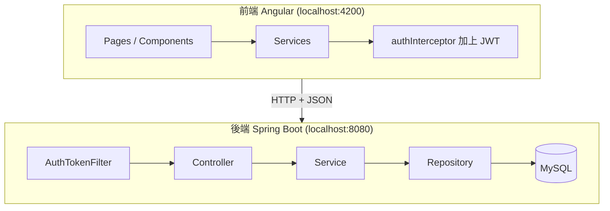
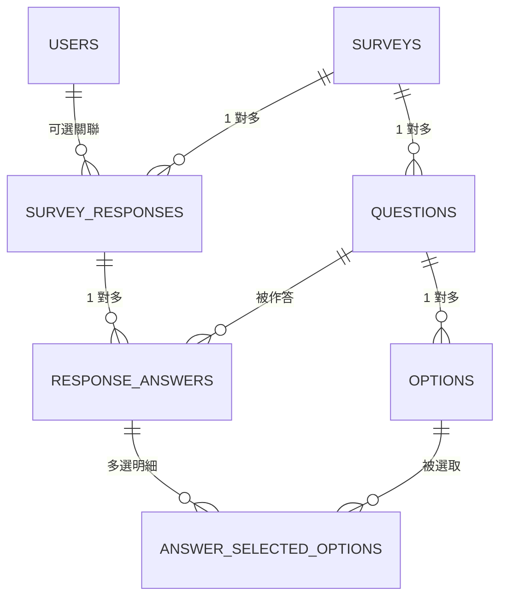
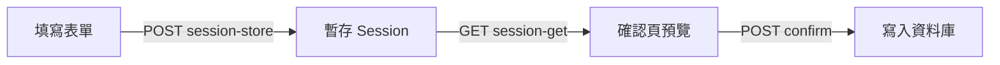

<div class="flex flex-col justify-center items-center h-full" style="background: #ffffff;">
  <p style="color: #5eada0; font-size: 1rem; font-weight: 600; letter-spacing: 0.2em; text-transform: uppercase; margin-bottom: 1.2rem;">
    Spring Boot Project Practice
  </p>
  <h1 style="color: #1a5c5c; font-size: 3.8rem; font-weight: 900; line-height: 1.15; margin-bottom: 1.5rem;">
    實戰演練：動態問卷系統
  </h1>
  <div style="height: 4px; width: 320px; background: linear-gradient(90deg, #5eada0, #a7d9d0); border-radius: 2px; margin-bottom: 1.5rem;"></div>
  <p style="color: #4a7c7c; font-size: 1.15rem; font-style: italic;">
    「從零到一，打造完整的前後端整合專案」
  </p>
  <Link to="home" style="color: #9dc4c4; font-size: 0.85rem; margin-top: 2rem; text-decoration: none; letter-spacing: 0.05em;">← 返回目錄</Link>
</div>

---
layout: section
class: flex flex-col justify-center items-center text-center
---

# 專案總覽

---
layout: default
---

# 我們要做什麼？

本章將帶你從零打造一個 **前後端分離** 的動態問卷系統，跟著投影片即可獨立完成整個專案。

| 角色 | 功能 |
| --- | --- |
| **訪客 / 填答者** | 瀏覽進行中的問卷、填寫（單選 / 多選 / 簡答）、確認頁預覽後送出 |
| **會員** | 註冊、登入（JWT）、查看個人填寫紀錄 |
| **管理員** | 建立 / 編輯 / 刪除問卷、發佈與下架、檢視填寫名單與作答明細、統計圖表 |

- **後端**：Spring Boot 4.1 + Spring Data JPA + Spring Security + JWT + MySQL
- **前端**：Angular 18（Standalone）+ Angular Material + PrimeNG + Chart.js + Tailwind

---
layout: default
---

# 系統架構

<div style="margin-top: 1rem;">



</div>

- 前端透過 `HttpClient` 呼叫後端 REST API，所有回應統一包成 `AppResponse`。
- 後端採三層式架構：**Controller → Service → Repository**，搭配 Entity / DTO / VO。

---
layout: default
---

# 後端專案結構

<div v-pre>

```text
backend/src/main/java/com/example/dynamicsurvey/
├── DynamicSurveyApplication.java   # 進入點
├── config/
│   └── GlobalExceptionHandler.java # 全域例外處理
├── controller/                     # REST API 接口
│   ├── AuthController.java         # 註冊 / 登入
│   ├── UserController.java         # 個人資料
│   ├── SurveyController.java       # 前台問卷流程
│   └── AdminSurveyController.java  # 後台問卷管理
├── service/                        # 業務邏輯
│   ├── AuthService.java
│   └── SurveyService.java
├── repository/                     # 資料存取 (JPA)
│   ├── UserRepository.java
│   ├── SurveyRepository.java
│   └── SurveyResponseRepository.java
├── entity/                         # 資料表對應
│   ├── User.java  Survey.java  Question.java
│   ├── Option.java  SurveyResponse.java  ResponseAnswer.java
├── dto/                            # 傳輸物件 (請求 / 回應)
├── vo/                             # 統一回應 (RspCode, AppResponse)
└── security/                       # JWT 與權限控管
```

</div>

---
layout: default
---

# 資料庫 ER 圖

<div class="grid grid-cols-2 gap-4 items-start">
<div class="flex justify-center items-center"><div style="width: 330px;">



</div></div>
<div>

- 一份 **問卷 (Survey)** 有多個 **題目 (Question)**，每題有多個 **選項 (Option)**。
- 一筆 **作答紀錄 (SurveyResponse)** 有多筆 **作答明細 (ResponseAnswer)**。
- 多選題透過中介表 `answer_selected_options` 連結明細與選項。

</div>
</div>

---
layout: section
class: flex flex-col justify-center items-center text-center
---

# 後端：環境設定

---
layout: default
---

# 建立 MySQL 資料庫

啟動 MySQL 後，先手動建立一個空資料庫（資料表會由 JPA 自動建立）：

<div v-pre>

```sql
CREATE DATABASE dynamic_survey
  DEFAULT CHARACTER SET utf8mb4
  DEFAULT COLLATE utf8mb4_unicode_ci;
```

</div>

- 資料庫名稱 `dynamic_survey` 必須與 `application.properties` 中的設定一致。
- 因為 `spring.jpa.hibernate.ddl-auto=update`，第一次啟動 Spring Boot 時會**自動建立**所有資料表。

---
layout: default
---

# build.gradle — 外掛與 Java 版本

<div v-pre>

```groovy
plugins {
    id 'java'
    id 'org.springframework.boot' version '4.1.0'
    id 'io.spring.dependency-management' version '1.1.7'
}

group = 'com.example'
version = '0.0.1-SNAPSHOT'

java {
    toolchain {
        languageVersion = JavaLanguageVersion.of(17)
    }
}

configurations {
    compileOnly { extendsFrom annotationProcessor }
}

repositories { mavenCentral() }
```

</div>

---
layout: default
---

# build.gradle — 相依套件 (1)

<div v-pre>

```groovy
dependencies {
    // [資料庫存取] 提供 JPA 支援與 Hibernate 實作
    implementation 'org.springframework.boot:spring-boot-starter-data-jpa'

    // [Web 核心] 提供 REST API 開發與 MVC 架構支援
    implementation 'org.springframework.boot:spring-boot-starter-web'

    // [資料驗證] 提供 @NotBlank, @Size 等 Bean Validation 註解支援
    implementation 'org.springframework.boot:spring-boot-starter-validation'

    // [安全機制] 提供 Spring Security 權限控管與加密支援
    implementation 'org.springframework.boot:spring-boot-starter-security'

    // [JWT 介面] 定義 JSON Web Token 的 API 規範
    implementation 'io.jsonwebtoken:jjwt-api:0.12.5'

    // [開發利器] 使用註解自動產生 Getter/Setter (編譯時期)
    compileOnly 'org.projectlombok:lombok'
}
```

</div>

---
layout: default
---

# build.gradle — 相依套件 (2)

<div v-pre>

```groovy
dependencies {
    // [熱部署] 程式修改後自動重啟伺服器，提升開發效率
    developmentOnly 'org.springframework.boot:spring-boot-devtools'

    // [MySQL 驅動] 程式執行時連結 MySQL 資料庫的驅動程式
    runtimeOnly 'com.mysql:mysql-connector-j'

    // [JWT 實作] 執行時期所需的 JWT 加密與解析邏輯
    runtimeOnly 'io.jsonwebtoken:jjwt-impl:0.12.5'
    runtimeOnly 'io.jsonwebtoken:jjwt-jackson:0.12.5'

    // [Lombok 處理器] 讓編譯器能識別 Lombok 註解並產生代碼
    annotationProcessor 'org.projectlombok:lombok'

    // [單元測試] 提供測試框架與 Security 測試支援
    testImplementation 'org.springframework.boot:spring-boot-starter-test'
    testImplementation 'org.springframework.security:spring-security-test'
}

tasks.named('test') { useJUnitPlatform() }
```

</div>

---
layout: default
---

# application.properties

<div v-pre>

```properties
# Server Port
server.port=8080

# Database Configuration (MySQL)
spring.datasource.url=jdbc:mysql://localhost:3306/dynamic_survey?useSSL=false&serverTimezone=UTC&allowPublicKeyRetrieval=true
spring.datasource.username=root
spring.datasource.password=root
spring.datasource.driver-class-name=com.mysql.cj.jdbc.Driver

# JPA / Hibernate
spring.jpa.hibernate.ddl-auto=update
spring.jpa.show-sql=true
spring.jpa.properties.hibernate.format_sql=true
spring.jpa.properties.hibernate.dialect=org.hibernate.dialect.MySQLDialect

# Jackson Date Formatting (日期序列化為 yyyy-MM-dd 而非時間戳)
spring.jackson.serialization.write-dates-as-timestamps=false
spring.jackson.date-format=yyyy-MM-dd

# JWT Configuration (正式環境密鑰應妥善保管)
jwt.secret=vW9mK2v6yB?E(G+KbPeShVmYq3t6w9z$C&E)H@McQfTjWnZr4u7x!A%D*G-KaPdS
jwt.expiration=86400000
```

</div>

---
layout: default
---

# 專案進入點

### `DynamicSurveyApplication.java`

<div v-pre>

```java
package com.example.dynamicsurvey;

import org.springframework.boot.SpringApplication;
import org.springframework.boot.autoconfigure.SpringBootApplication;

@SpringBootApplication
public class DynamicSurveyApplication {
    public static void main(String[] args) {
        SpringApplication.run(DynamicSurveyApplication.class, args);
    }
}
```

</div>

- `@SpringBootApplication` 會自動掃描同套件（含子套件）下的所有元件。

---
layout: section
class: flex flex-col justify-center items-center text-center
---

# 後端：統一回應 (VO)

---
layout: default
---

# 狀態碼列舉 (1/2)

### `vo/RspCode.java` — 列舉常數

<div v-pre>

```java
package com.example.dynamicsurvey.vo;

import lombok.Getter;

/**
 * 集中管理系統中所有回應代碼與訊息，避免出現「魔術數字」。
 */
@Getter
public enum RspCode {
    SUCCESS(200, "操作成功"),
    PARAM_ERROR(400, "參數錯誤"),
    UNAUTHORIZED(401, "尚未登入或憑證無效"),
    FORBIDDEN(403, "權限不足"),
    NOT_FOUND(404, "資源不存在"),
    DUPLICATE_ERROR(409, "資料重複"),
    INTERNAL_SERVER_ERROR(500, "系統內部錯誤");

    // ... 見下一頁
}
```

</div>

---
layout: default
---

# 狀態碼列舉 (2/2)

### `vo/RspCode.java` — 欄位與建構子

<div v-pre>

```java
public enum RspCode {
    // ... 接上一頁

    private final int code;     // HTTP 狀態碼
    private final String message;

    RspCode(int code, String message) {
        this.code = code;
        this.message = message;
    }
}
```

</div>

---
layout: default
---

# 統一回應物件 (1/2)

### `vo/AppResponse.java` — 欄位與建構子

<div v-pre>

```java
package com.example.dynamicsurvey.vo;
import lombok.Data;

/** 回傳 JSON 結構一致：{ code, message, data } */
@Data
public class AppResponse<T> {
    private int code;
    private String message;
    private T data;

    public AppResponse(RspCode rspCode) {
        this.code = rspCode.getCode();
        this.message = rspCode.getMessage();
    }
    public AppResponse(RspCode rspCode, T data) {
        this(rspCode);
        this.data = data;
    }
    // ... 見下一頁
}
```

</div>

---
layout: default
---

# 統一回應物件 (2/2)

### `vo/AppResponse.java` — 靜態工廠方法

<div v-pre>

```java
public class AppResponse<T> {
    // ... 接上一頁

    public static <T> AppResponse<T> success(T data) {
        return new AppResponse<>(RspCode.SUCCESS, data);
    }

    public static <T> AppResponse<T> error(RspCode rspCode) {
        return new AppResponse<>(rspCode);
    }

    public static <T> AppResponse<T> error(RspCode rspCode, String customMessage) {
        AppResponse<T> response = new AppResponse<>(rspCode);
        response.setMessage(customMessage); // 覆蓋預設訊息
        return response;
    }
}
```

</div>

---
layout: section
class: flex flex-col justify-center items-center text-center
---

# 後端：資料模型 (Entity)

---
layout: default
---

# Entity — Survey (問卷) (1/2)

### `entity/Survey.java` — 欄位

<div v-pre>

```java
@Entity
@Table(name = "surveys")
@Data
public class Survey {
    @Id
    @GeneratedValue(strategy = GenerationType.IDENTITY)
    private Long id;

    @Column(nullable = false, length = 50)
    private String title;

    @Column(length = 300)
    private String description;

    @Column(nullable = false) private LocalDate startDate;
    @Column(nullable = false) private LocalDate endDate;
    @Column(nullable = false) private String status; // DRAFT / PUBLISHED

    // ... 見下一頁
}
```

</div>

---
layout: default
---

# Entity — Survey (問卷) (2/2)

### `entity/Survey.java` — 一對多關聯

<div v-pre>

```java
public class Survey {
    // ... 接上一頁

    // [一對多] cascade=ALL：儲存問卷時題目一併儲存；orphanRemoval：移除題目即刪除
    @OneToMany(mappedBy = "survey", cascade = CascadeType.ALL, orphanRemoval = true)
    @OrderBy("orderIndex ASC")
    private List<Question> questions = new ArrayList<>();
}
```

</div>

---
layout: default
---

# Entity — Question (題目) (1/2)

### `entity/Question.java` — 欄位與多對一

<div v-pre>

```java
@Entity
@Table(name = "questions")
@Data
public class Question {
    @Id
    @GeneratedValue(strategy = GenerationType.IDENTITY)
    private Long id;

    // [多對一] 每筆題目都屬於一個問卷
    @ManyToOne(fetch = FetchType.LAZY)
    @JoinColumn(name = "survey_id", nullable = false)
    private Survey survey;

    @Column(nullable = false, length = 75) private String title;
    @Column(nullable = false) private String type;     // SINGLE / MULTI / TEXT
    @Column(nullable = false) private boolean required;
    @Column(nullable = false) private int orderIndex;
    // ... 見下一頁
}
```

</div>

---
layout: default
---

# Entity — Question (題目) (2/2)

### `entity/Question.java` — 巢狀一對多

<div v-pre>

```java
public class Question {
    // ... 接上一頁

    // [巢狀一對多] 題目底下的選項
    @OneToMany(mappedBy = "question", cascade = CascadeType.ALL, orphanRemoval = true)
    @OrderBy("orderIndex ASC")
    private List<Option> options = new ArrayList<>();
}
```

</div>

---
layout: default
---

# Entity — Option (選項)

### `entity/Option.java`

<div v-pre>

```java
@Entity
@Table(name = "options")
@Data
public class Option {
    @Id
    @GeneratedValue(strategy = GenerationType.IDENTITY)
    private Long id;

    // 選項屬於特定題目
    @ManyToOne(fetch = FetchType.LAZY)
    @JoinColumn(name = "question_id", nullable = false)
    private Question question;

    @Column(nullable = false) private String optionText; // 選項文字
    @Column(nullable = false) private int orderIndex;    // 選項順序
}
```

</div>

別忘了類別上方的 import：`import jakarta.persistence.*; import lombok.Data;`

---
layout: default
---

# Entity — SurveyResponse (作答紀錄) (1/2)

### `entity/SurveyResponse.java` — 問卷關聯與作答者資訊

<div v-pre>

```java
@Entity
@Table(name = "survey_responses")
@Data
public class SurveyResponse {
    @Id
    @GeneratedValue(strategy = GenerationType.IDENTITY)
    private Long id;

    @ManyToOne(fetch = FetchType.LAZY)
    @JoinColumn(name = "survey_id", nullable = false)
    private Survey survey;

    // === 作答者基本資訊 (直接存於此，支援免登入作答) ===
    @Column(nullable = false) private String name;   // 姓名
    @Column(nullable = false) private String phone;  // 手機
    @Column(nullable = false) private String email;  // Email (重複作答檢查依據)
    @Column private Integer age;                      // 年齡 (選填)
    @Column(nullable = false) private LocalDateTime submittedAt;
    // ... 見下一頁
}
```

</div>

---
layout: default
---

# Entity — SurveyResponse (作答紀錄) (2/2)

### `entity/SurveyResponse.java` — 會員關聯與作答明細

<div v-pre>

```java
public class SurveyResponse {
    // ... 接上一頁

    // [可選] 若為登入會員，連結其帳號
    @ManyToOne(fetch = FetchType.LAZY)
    @JoinColumn(name = "user_id", nullable = true)
    private User user;

    @OneToMany(mappedBy = "surveyResponse", cascade = CascadeType.ALL, orphanRemoval = true)
    private List<ResponseAnswer> answers = new ArrayList<>();
}
```

</div>

---
layout: default
---

# Entity — ResponseAnswer (作答明細) (1/2)

### `entity/ResponseAnswer.java` — 多對一關聯

<div v-pre>

```java
@Entity
@Table(name = "response_answers")
@Data
public class ResponseAnswer {
    @Id
    @GeneratedValue(strategy = GenerationType.IDENTITY)
    private Long id;

    @ManyToOne(fetch = FetchType.LAZY)
    @JoinColumn(name = "response_id", nullable = false)
    private SurveyResponse surveyResponse;

    @ManyToOne(fetch = FetchType.LAZY)
    @JoinColumn(name = "question_id", nullable = false)
    private Question question;
    // ... 見下一頁
}
```

</div>

---
layout: default
---

# Entity — ResponseAnswer (作答明細) (2/2)

### `entity/ResponseAnswer.java` — 多對多選項與簡答

<div v-pre>

```java
public class ResponseAnswer {
    // ... 接上一頁

    // [多對多] 單/多選的選取選項，產生中介表 answer_selected_options
    @ManyToMany
    @JoinTable(name = "answer_selected_options",
        joinColumns = @JoinColumn(name = "answer_id"),
        inverseJoinColumns = @JoinColumn(name = "option_id"))
    private List<Option> selectedOptions = new ArrayList<>();

    @Column(columnDefinition = "TEXT")
    private String answerText; // 簡答題內容 (選擇題也會存選項文字串接)
}
```

</div>

---
layout: default
---

# Entity — User (會員) (1/2)

### `entity/User.java` — 類別註解與認證欄位

<div v-pre>

```java
@Entity
@Table(name = "users")
@Data
@NoArgsConstructor
@AllArgsConstructor
public class User {
    @Id
    @GeneratedValue(strategy = GenerationType.IDENTITY)
    private Long id;

    @Column(nullable = false, unique = true)
    private String email;

    @Column(nullable = false)
    private String password; // BCrypt 加密儲存
    // ... 見下一頁
}
```

</div>

---
layout: default
---

# Entity — User (會員) (2/2)

### `entity/User.java` — 個資與角色

<div v-pre>

```java
public class User {
    // ... 接上一頁

    @Column(nullable = false)
    private String name;

    private String phone;

    @Column(nullable = false)
    private String role; // "USER" or "ADMIN"
}
```

</div>

---
layout: section
class: flex flex-col justify-center items-center text-center
---

# 後端：資料存取 (Repository)

---
layout: default
---

# Repository — UserRepository

### `repository/UserRepository.java`

<div v-pre>

```java
package com.example.dynamicsurvey.repository;

import com.example.dynamicsurvey.entity.User;
import org.springframework.data.jpa.repository.JpaRepository;
import java.util.Optional;

public interface UserRepository extends JpaRepository<User, Long> {
    Optional<User> findByEmail(String email);
    boolean existsByEmail(String email);
}
```

</div>

- 繼承 `JpaRepository` 即免費取得 CRUD。
- 依命名規則 `findByEmail` / `existsByEmail`，Spring Data JPA 會自動產生查詢。

---
layout: default
---

# Repository — SurveyRepository

### `repository/SurveyRepository.java`

<div v-pre>

```java
public interface SurveyRepository extends JpaRepository<Survey, Long> {

    // 查詢「已發佈」且「在有效日期內」的問卷 (前台首頁用)
    @Query("SELECT s FROM Survey s WHERE s.status = 'PUBLISHED' " +
           "AND s.startDate <= CURRENT_DATE AND s.endDate >= CURRENT_DATE")
    List<Survey> findActiveSurveys();

    // 多條件動態篩選 (後台搜尋用)：標題關鍵字 + 日期區間
    @Query("SELECT s FROM Survey s WHERE " +
           "(:title IS NULL OR s.title LIKE %:title%) AND " +
           "(:startDate IS NULL OR s.startDate >= :startDate) AND " +
           "(:endDate IS NULL OR s.endDate <= :endDate)")
    List<Survey> findByFilters(@Param("title") String title,
                               @Param("startDate") LocalDate startDate,
                               @Param("endDate") LocalDate endDate);
}
```

</div>

---
layout: default
---

# Repository — SurveyResponseRepository

### `repository/SurveyResponseRepository.java`

<div v-pre>

```java
public interface SurveyResponseRepository extends JpaRepository<SurveyResponse, Long> {

    // 個人歷史紀錄 (依提交時間新到舊)
    List<SurveyResponse> findByUserOrderBySubmittedAtDesc(User user);

    // 統計用：取得某問卷所有回覆
    List<SurveyResponse> findBySurveyId(Long surveyId);

    // 填寫名單：依 ID 逆序 (最新在前)
    List<SurveyResponse> findBySurveyIdOrderByIdDesc(Long surveyId);

    boolean existsBySurveyId(Long surveyId);                       // 是否有人作答
    boolean existsBySurveyIdAndEmail(Long surveyId, String email); // 此 Email 是否填過
}
```

</div>

---
layout: section
class: flex flex-col justify-center items-center text-center
---

# 後端：傳輸物件 (DTO)

---
layout: default
---

# DTO — 問卷結構 (Option / Question)

<div v-pre>

```java
// OptionDTO.java
@Data
public class OptionDTO {
    private Long id;
    @NotBlank(message = "選項內容不可為空")
    private String optionText;
    private int orderIndex;
}

// QuestionDTO.java
@Data
public class QuestionDTO {
    private Long id;
    @NotBlank(message = "題目名稱不可為空")
    @Size(max = 75, message = "題目不可超過 75 字")
    private String title;
    @NotBlank(message = "題目類型不可為空")
    private String type;            // SINGLE / MULTI / TEXT
    private boolean required;
    private int orderIndex;
    private List<OptionDTO> options;
}
```

</div>

---
layout: default
---

# DTO — 問卷主體 (SurveyDTO)

### `dto/SurveyDTO.java`

<div v-pre>

```java
@Data
public class SurveyDTO {
    private Long id;

    @NotBlank(message = "問卷標題不可為空")
    @Size(max = 50, message = "標題長度不可超過 50 字")
    private String title;

    @Size(max = 300, message = "說明長度不可超過 300 字")
    private String description;

    @NotNull(message = "開始日期不可為空") private LocalDate startDate;
    @NotNull(message = "結束日期不可為空") private LocalDate endDate;
    @NotBlank(message = "狀態不可為空")     private String status;

    private boolean hasResponses; // 是否已有人作答 (前端判斷可否刪除)

    @Valid
    @NotNull(message = "題目列表不可為空")
    @Size(min = 1, message = "至少需包含一個題目")
    private List<QuestionDTO> questions;
}
```

</div>

`@Valid` 會讓驗證「往下傳遞」到每個 `QuestionDTO` 與 `OptionDTO`。

---
layout: default
---

# DTO — 作答 (Answer / Response)

<div v-pre>

```java
// AnswerDTO.java — 單題作答
@Data
public class AnswerDTO {
    private Long questionId;
    private List<Long> optionIds; // 單/多選的選項 ID
    private String answerText;     // 簡答內容
}

// ResponseDTO.java — 整份問卷作答
@Data
public class ResponseDTO {
    private Long surveyId;
    @NotBlank(message = "姓名不可為空") private String name;
    @NotBlank(message = "手機不可為空") private String phone;
    private String email;                       // 選填 (但作為重複檢查依據)
    @NotNull(message = "年齡不可為空") private Integer age;
    private List<AnswerDTO> answers;
}
```

</div>

---
layout: default
---

# DTO — 認證請求 (Login / Register)

<div v-pre>

```java
// LoginRequest.java
@Data
public class LoginRequest {
    @NotBlank(message = "電子郵件不可為空")
    @Email(message = "電子郵件格式不正確")
    private String email;
    @NotBlank(message = "密碼不可為空")
    @Size(min = 6, message = "密碼長度需至少 6 位")
    private String password;
}

// RegisterRequest.java
@Data
public class RegisterRequest {
    @NotBlank(message = "姓名不可為空") private String name;
    @NotBlank(message = "電子郵件不可為空")
    @Email(message = "電子郵件格式不正確") private String email;
    @NotBlank(message = "密碼不可為空")
    @Size(min = 6, message = "密碼長度需至少 6 位") private String password;
    private String phone;
}
```

</div>

---
layout: section
class: flex flex-col justify-center items-center text-center
---

# 後端：安全機制 (Security & JWT)

---
layout: default
---

# Security — 概念流程


- **JwtUtils**：簽發 / 解析 / 驗證 Token
- **AuthTokenFilter**：每個請求攔截、驗證、登記身分
- **UserDetailsImpl / UserDetailsServiceImpl**：把 `User` 轉成 Security 認得的格式

---
layout: default
---

# Security — JwtUtils (1) 簽發

### `security/JwtUtils.java`

<div v-pre>

```java
@Component
public class JwtUtils {
    @Value("${jwt.secret}")     private String jwtSecret;
    @Value("${jwt.expiration}") private int jwtExpirationMs;

    private SecretKey getSigningKey() {
        return Keys.hmacShaKeyFor(jwtSecret.getBytes());
    }

    // 登入成功後產生 Token（jjwt 0.12.x API）
    public String generateJwtToken(Authentication authentication) {
        UserDetails userPrincipal = (UserDetails) authentication.getPrincipal();
        return Jwts.builder()
                .subject(userPrincipal.getUsername())                 // 主題 = Email
                .issuedAt(new Date())
                .expiration(new Date(System.currentTimeMillis() + jwtExpirationMs))
                .signWith(getSigningKey(), Jwts.SIG.HS512)            // 簽名
                .compact();
    }
}
```

</div>

---
layout: default
---

# Security — JwtUtils (2) 解析與驗證

<div v-pre>

```java
    // 從 Token 取出帳號 (Email)（jjwt 0.12.x API）
    public String getUserNameFromJwtToken(String token) {
        return Jwts.parser().verifyWith(getSigningKey()).build()
                .parseSignedClaims(token).getPayload().getSubject();
    }

    // 驗證 Token：格式、簽名、是否過期
    public boolean validateJwtToken(String authToken) {
        try {
            Jwts.parser().verifyWith(getSigningKey()).build()
                .parseSignedClaims(authToken);
            return true;
        } catch (SecurityException e)      { logger.error("無效的 JWT 簽名"); }
        catch (MalformedJwtException e)    { logger.error("無效的 JWT 格式"); }
        catch (ExpiredJwtException e)      { logger.error("JWT 已過期"); }
        catch (UnsupportedJwtException e)  { logger.error("不支援的 JWT 類型"); }
        catch (IllegalArgumentException e) { logger.error("JWT 內容為空"); }
        return false;
    }
}
```

</div>

需要的 import：`io.jsonwebtoken.*`、`io.jsonwebtoken.security.Keys`、`javax.crypto.SecretKey`、`org.slf4j.*` 等。寫法與第 45 章教的 jjwt 0.12.x API 一致（`subject()` / `verifyWith()` / `parseSignedClaims()`）。

---
layout: default
---

# Security — UserDetailsImpl (1/2)

### `security/UserDetailsImpl.java` — 欄位與工廠方法

<div v-pre>

```java
@Data
@AllArgsConstructor
public class UserDetailsImpl implements UserDetails {
    private Long id;
    private String email;
    private String name;
    @JsonIgnore private String password; // 序列化 JSON 時忽略
    private Collection<? extends GrantedAuthority> authorities;

    // 把資料庫 User 轉成 Security 認得的物件
    public static UserDetailsImpl build(User user) {
        List<GrantedAuthority> authorities =
            List.of(new SimpleGrantedAuthority("ROLE_" + user.getRole()));
        return new UserDetailsImpl(user.getId(), user.getEmail(),
                user.getName(), user.getPassword(), authorities);
    }
    // ... 見下一頁
}
```

</div>

---
layout: default
---

# Security — UserDetailsImpl (2/2)

### `security/UserDetailsImpl.java` — UserDetails 覆寫

<div v-pre>

```java
public class UserDetailsImpl implements UserDetails {
    // ... 接上一頁

    @Override public String getUsername() { return email; } // 用 Email 當帳號
    @Override public boolean isAccountNonExpired()     { return true; }
    @Override public boolean isAccountNonLocked()      { return true; }
    @Override public boolean isCredentialsNonExpired() { return true; }
    @Override public boolean isEnabled()               { return true; }
}
```

</div>

---
layout: default
---

# Security — UserDetailsServiceImpl

### `security/UserDetailsServiceImpl.java`

<div v-pre>

```java
@Service
public class UserDetailsServiceImpl implements UserDetailsService {

    @Autowired
    UserRepository userRepository;

    // Spring Security 唯一任務：根據帳號 (Email) 找到使用者
    @Override
    @Transactional
    public UserDetails loadUserByUsername(String email)
            throws UsernameNotFoundException {
        User user = userRepository.findByEmail(email)
                .orElseThrow(() ->
                    new UsernameNotFoundException("找不到該帳號: " + email));
        return UserDetailsImpl.build(user);
    }
}
```

</div>

這是資料庫 (JPA) 與 Security 認證機制之間的橋樑。

---
layout: default
---

# Security — AuthTokenFilter (1) 攔截與驗證

### `security/AuthTokenFilter.java`

<div v-pre>

```java
public class AuthTokenFilter extends OncePerRequestFilter {
    @Autowired private JwtUtils jwtUtils;
    @Autowired private UserDetailsServiceImpl userDetailsService;

    @Override
    protected void doFilterInternal(HttpServletRequest request,
            HttpServletResponse response, FilterChain filterChain)
            throws ServletException, IOException {
        try {
            String jwt = parseJwt(request);                 // 1. 取出 JWT
            if (jwt != null && jwtUtils.validateJwtToken(jwt)) {   // 2. 驗證
                String username = jwtUtils.getUserNameFromJwtToken(jwt);
                UserDetails userDetails =
                    userDetailsService.loadUserByUsername(username); // 3. 載入
                // ... 見下一頁
            }
        // ... 見下一頁
```

</div>

---
layout: default
---

# Security — AuthTokenFilter (2) 建立認證

<div v-pre>

```java
            if (jwt != null && jwtUtils.validateJwtToken(jwt)) {
                // ... 接上一頁 (已載入 userDetails)
                UsernamePasswordAuthenticationToken authentication =
                    new UsernamePasswordAuthenticationToken(
                        userDetails, null, userDetails.getAuthorities());
                authentication.setDetails(
                    new WebAuthenticationDetailsSource().buildDetails(request));
                SecurityContextHolder.getContext()
                    .setAuthentication(authentication);      // 4. 登記身分
            }
        } catch (Exception e) {
            logger.error("無法設定使用者認證: {}", e.getMessage());
        }
        filterChain.doFilter(request, response);             // 放行
    }
}
```

</div>

---
layout: default
---

# Security — AuthTokenFilter (3) 解析 Header

<div v-pre>

```java
    // 解析 Header："Authorization: Bearer <token>"
    private String parseJwt(HttpServletRequest request) {
        String headerAuth = request.getHeader("Authorization");
        if (StringUtils.hasText(headerAuth) && headerAuth.startsWith("Bearer ")) {
            String token = headerAuth.substring(7); // 去掉 "Bearer "
            if (StringUtils.hasText(token)) {
                return token;
            }
        }
        return null;
    }
}
```

</div>

`OncePerRequestFilter` 確保同一個請求只會被此過濾器處理一次。

---
layout: default
---

# Security — WebSecurityConfig (1) Beans

### `security/WebSecurityConfig.java`

<div v-pre>

```java
@Configuration
@EnableWebSecurity
public class WebSecurityConfig {

    @Bean
    public AuthTokenFilter authenticationJwtTokenFilter() {
        return new AuthTokenFilter();
    }

    @Bean
    public PasswordEncoder passwordEncoder() {
        return new BCryptPasswordEncoder();
    }

    @Bean
    public AuthenticationManager authenticationManager(
            AuthenticationConfiguration authConfig) throws Exception {
        return authConfig.getAuthenticationManager();
    }
}
```

</div>

`BCryptPasswordEncoder` 負責密碼加密；`AuthenticationManager` 是登入驗證的核心。

---
layout: default
---

# Security — WebSecurityConfig (2) 過濾鏈

<div v-pre>

```java
    @Bean
    public SecurityFilterChain filterChain(HttpSecurity http) throws Exception {
        http
            .csrf(csrf -> csrf.disable())                              // 關閉 CSRF
            .cors(cors -> cors.configurationSource(corsConfigurationSource())) // 開啟跨域
            .sessionManagement(session ->                              // 支援確認頁暫存
                session.sessionCreationPolicy(SessionCreationPolicy.IF_REQUIRED))
            .authorizeHttpRequests(auth -> auth
                .anyRequest().permitAll());                            // 開發環境全公開

        http.addFilterBefore(authenticationJwtTokenFilter(),
                UsernamePasswordAuthenticationFilter.class);           // 掛上 JWT filter
        return http.build();
    }
```

</div>

> 教學版為求簡單採 `permitAll()`；正式環境應改為 `requestMatchers("/api/admin/**").hasRole("ADMIN")` 等規則。

---
layout: default
---

# Security — WebSecurityConfig (3) CORS

<div v-pre>

```java
    @Bean
    public CorsConfigurationSource corsConfigurationSource() {
        CorsConfiguration config = new CorsConfiguration();
        config.setAllowedOrigins(Arrays.asList("http://localhost:4200")); // 前端網址
        config.setAllowedMethods(
            Arrays.asList("GET", "POST", "PUT", "DELETE", "OPTIONS"));
        config.setAllowedHeaders(
            Arrays.asList("Authorization", "Content-Type", "Accept"));
        config.setAllowCredentials(true); // 必須開啟以支援 Session Cookie

        UrlBasedCorsConfigurationSource source =
            new UrlBasedCorsConfigurationSource();
        source.registerCorsConfiguration("/**", config);
        return source;
    }
}
```

</div>

前端跑在 `localhost:4200`、後端在 `localhost:8080`，屬於跨域，必須設定 CORS。

---
layout: default
---

# 全域例外處理 (1/2) — @Valid 驗證

### `config/GlobalExceptionHandler.java`

<div v-pre>

```java
@RestControllerAdvice
public class GlobalExceptionHandler {

    // 攔截 @Valid 驗證失敗，回傳第一筆錯誤訊息
    @ExceptionHandler(MethodArgumentNotValidException.class)
    public ResponseEntity<AppResponse<Map<String, String>>>
            handleValidationExceptions(MethodArgumentNotValidException ex) {
        Map<String, String> errors = new HashMap<>();
        ex.getBindingResult().getAllErrors().forEach(error -> {
            String field = ((FieldError) error).getField();
            errors.put(field, error.getDefaultMessage());
        });
        String firstMsg = errors.values().stream().findFirst().orElse("參數驗證失敗");
        return ResponseEntity.badRequest()
                .body(AppResponse.error(RspCode.PARAM_ERROR, firstMsg));
    }
    // ... 見下一頁
}
```

</div>

---
layout: default
---

# 全域例外處理 (2/2) — 通用例外

### `config/GlobalExceptionHandler.java`

<div v-pre>

```java
public class GlobalExceptionHandler {
    // ... 接上一頁

    @ExceptionHandler(Exception.class)
    public ResponseEntity<AppResponse<String>> handleAllExceptions(Exception ex) {
        return ResponseEntity.internalServerError()
                .body(AppResponse.error(RspCode.INTERNAL_SERVER_ERROR, ex.getMessage()));
    }
}
```

</div>

---
layout: section
class: flex flex-col justify-center items-center text-center
---

# 後端：註冊與登入

---
layout: default
---

# AuthService — 注入依賴

### `service/AuthService.java`

<div v-pre>

```java
@Service
public class AuthService {
    @Autowired AuthenticationManager authenticationManager;
    @Autowired UserRepository userRepository;
    @Autowired PasswordEncoder encoder;
    @Autowired JwtUtils jwtUtils;

    // ... 以下逐步實作 register / login / profile
}
```

</div>

- `AuthenticationManager`：執行帳密驗證
- `PasswordEncoder`：加密 / 比對密碼
- `JwtUtils`：登入成功後簽發 Token

---
layout: default
---

# AuthService — 註冊

<div v-pre>

```java
public AppResponse<?> registerUser(RegisterRequest signUpRequest) {
    if (userRepository.existsByEmail(signUpRequest.getEmail())) {
        return AppResponse.error(RspCode.DUPLICATE_ERROR, "錯誤：此電子郵件已被使用！");
    }
    User user = new User();
    user.setEmail(signUpRequest.getEmail());
    user.setName(signUpRequest.getName());
    user.setPassword(encoder.encode(signUpRequest.getPassword())); // BCrypt 加密
    user.setPhone(signUpRequest.getPhone());
    user.setRole("ADMIN"); // 教學版：註冊即為管理員
    userRepository.save(user);

    // 註冊完直接幫使用者登入，回傳 Token
    LoginRequest loginReq = new LoginRequest();
    loginReq.setEmail(signUpRequest.getEmail());
    loginReq.setPassword(signUpRequest.getPassword());
    return authenticateUser(loginReq);
}
```

</div>

---
layout: default
---

# AuthService — 登入

<div v-pre>

```java
public AppResponse<?> authenticateUser(LoginRequest loginRequest) {
    // 1. 交給 Spring Security 驗證帳密
    Authentication authentication = authenticationManager.authenticate(
        new UsernamePasswordAuthenticationToken(
            loginRequest.getEmail(), loginRequest.getPassword()));

    // 2. 登記到 SecurityContext
    SecurityContextHolder.getContext().setAuthentication(authentication);

    // 3. 簽發 JWT 並回傳
    String jwt = jwtUtils.generateJwtToken(authentication);
    Map<String, String> response = new HashMap<>();
    response.put("token", jwt);
    return AppResponse.success(response);
}
```

</div>

驗證失敗會丟出例外，由 Controller 攔截後回傳 401。

---
layout: default
---

# AuthService — 個人資料

<div v-pre>

```java
public AppResponse<?> getCurrentUser() {
    Authentication auth = SecurityContextHolder.getContext().getAuthentication();
    if (auth == null || auth.getPrincipal().equals("anonymousUser"))
        return AppResponse.error(RspCode.UNAUTHORIZED);
    UserDetailsImpl userDetails = (UserDetailsImpl) auth.getPrincipal();
    User user = userRepository.findById(userDetails.getId()).orElse(null);
    if (user == null) return AppResponse.error(RspCode.NOT_FOUND);
    return AppResponse.success(userToMap(user));
}

public AppResponse<?> updateProfile(Map<String, String> updates) {
    Authentication auth = SecurityContextHolder.getContext().getAuthentication();
    UserDetailsImpl userDetails = (UserDetailsImpl) auth.getPrincipal();
    User user = userRepository.findById(userDetails.getId()).orElse(null);
    if (user == null) return AppResponse.error(RspCode.NOT_FOUND);
    if (updates.containsKey("name"))  user.setName(updates.get("name"));
    if (updates.containsKey("phone")) user.setPhone(updates.get("phone"));
    if (updates.get("password") != null && !updates.get("password").isEmpty())
        user.setPassword(encoder.encode(updates.get("password")));
    userRepository.save(user);
    return AppResponse.success(userToMap(user));
}
```

</div>

---
layout: default
---

# AuthService — userToMap 輔助方法

<div v-pre>

```java
private Map<String, Object> userToMap(User user) {
    Map<String, Object> userInfo = new HashMap<>();
    userInfo.put("id", user.getId());
    userInfo.put("email", user.getEmail());
    userInfo.put("name", user.getName());
    userInfo.put("phone", user.getPhone());
    userInfo.put("role", user.getRole());
    return userInfo; // 注意：不回傳 password
}
```

</div>

把 `User` 實體轉成不含密碼的 Map，安全地回傳給前端。

---
layout: default
---

# AuthController

### `controller/AuthController.java`

<div v-pre>

```java
@RestController
@RequestMapping("/api/auth")
public class AuthController {
    @Autowired AuthService authService;

    @PostMapping("/login")
    public AppResponse<?> login(@Valid @RequestBody LoginRequest req) {
        try { return authService.authenticateUser(req); }
        catch (Exception e) {
            return AppResponse.error(RspCode.UNAUTHORIZED, "帳號或密碼錯誤");
        }
    }
    @PostMapping("/register")
    public AppResponse<?> register(@Valid @RequestBody RegisterRequest req) {
        return authService.registerUser(req);
    }
}
```

</div>

---
layout: default
---

# UserController

### `controller/UserController.java`

<div v-pre>

```java
@RestController
@RequestMapping("/api/users")
public class UserController {
    @Autowired AuthService authService;

    @GetMapping("/profile")
    public AppResponse<?> getProfile() { return authService.getCurrentUser(); }

    @PutMapping("/profile")
    public AppResponse<?> updateProfile(@RequestBody Map<String, String> updates) {
        return authService.updateProfile(updates);
    }
}
```

</div>

---
layout: default
---

# Postman 測試 — 註冊

- **Method**: `POST`
- **URL**: `http://localhost:8080/api/auth/register`
- **Body (JSON)**:

<div v-pre>

```json
{
    "name": "管理員",
    "email": "admin@example.com",
    "password": "Password123",
    "phone": "0912345678"
}
```

</div>

- **預期結果**: `code: 200`, `data: { "token": "JWT 字串" }`
- 後續所有需要登入的 API，請在 Header 加上 `Authorization: Bearer <token>`。

---
layout: default
---

# Postman 測試 — 登入

- **Method**: `POST`
- **URL**: `http://localhost:8080/api/auth/login`
- **Body (JSON)**:

<div v-pre>

```json
{
    "email": "admin@example.com",
    "password": "Password123"
}
```

</div>

- **預期結果**: `code: 200`, `data: { "token": "JWT 字串" }`

---
layout: section
class: flex flex-col justify-center items-center text-center
---

# 後端：問卷管理 (Admin)

---
layout: default
---

# SurveyService — 注入與 Session Key

<div v-pre>

```java
@Service
public class SurveyService {
    @Autowired SurveyRepository surveyRepository;
    @Autowired UserRepository userRepository;
    @Autowired SurveyResponseRepository responseRepository;

    // 前台作答暫存
    private static final String SURVEY_SESSION_KEY = "TEMP_SURVEY_RESPONSE";
    // 後台編輯暫存
    private static final String ADMIN_EDIT_SESSION_KEY = "TEMP_ADMIN_SURVEY";

    // ... 以下實作各功能
}
```

</div>

`SurveyService` 同時負責**前台作答**與**後台管理**，是整個系統最核心的類別。

---
layout: default
---

# SurveyService — Entity 轉 DTO

<div v-pre>

```java
private SurveyDTO convertToDTO(Survey s) {
    SurveyDTO dto = new SurveyDTO();
    dto.setId(s.getId()); dto.setTitle(s.getTitle());
    dto.setDescription(s.getDescription());
    dto.setStartDate(s.getStartDate()); dto.setEndDate(s.getEndDate());
    dto.setStatus(s.getStatus());
    dto.setQuestions(s.getQuestions().stream().map(q -> {
        QuestionDTO qDto = new QuestionDTO();
        qDto.setId(q.getId()); qDto.setTitle(q.getTitle()); qDto.setType(q.getType());
        qDto.setRequired(q.isRequired()); qDto.setOrderIndex(q.getOrderIndex());
        qDto.setOptions(q.getOptions().stream().map(o -> {
            OptionDTO oDto = new OptionDTO();
            oDto.setId(o.getId()); oDto.setOptionText(o.getOptionText());
            oDto.setOrderIndex(o.getOrderIndex());
            return oDto;
        }).collect(Collectors.toList()));
        return qDto;
    }).collect(Collectors.toList()));
    return dto;
}
```

</div>

把巢狀的 Entity（Survey→Question→Option）攤平成可安全回傳的 DTO。

---
layout: default
---

# SurveyService — 儲存問卷 (1/2) 設定問卷

<div v-pre>

```java
@Transactional
public AppResponse<SurveyDTO> saveSurvey(SurveyDTO dto) {
    // 有 id 就是更新，沒有就是新增
    Survey survey = (dto.getId() != null)
        ? surveyRepository.findById(dto.getId()).orElse(new Survey())
        : new Survey();
    survey.setTitle(dto.getTitle()); survey.setDescription(dto.getDescription());
    survey.setStartDate(dto.getStartDate()); survey.setEndDate(dto.getEndDate());
    survey.setStatus(dto.getStatus());

    survey.getQuestions().clear(); // 先清空舊題目 (orphanRemoval 會刪除)
    // ... 重建題目與選項見下一頁
}
```

</div>

---
layout: default
---

# SurveyService — 儲存問卷 (2/2) 重建題目與選項

<div v-pre>

```java
    // ... 接上一頁 (survey 已設定，題目已清空)
    for (QuestionDTO qDto : dto.getQuestions()) {
        Question q = new Question();
        q.setSurvey(survey); q.setTitle(qDto.getTitle()); q.setType(qDto.getType());
        q.setRequired(qDto.isRequired()); q.setOrderIndex(qDto.getOrderIndex());
        if (qDto.getOptions() != null) for (OptionDTO oDto : qDto.getOptions()) {
            Option o = new Option();
            o.setQuestion(q); o.setOptionText(oDto.getOptionText());
            o.setOrderIndex(oDto.getOrderIndex());
            q.getOptions().add(o);
        }
        survey.getQuestions().add(q);
    }
    return AppResponse.success(convertToDTO(surveyRepository.save(survey)));
}
```

</div>

---
layout: default
---

# SurveyService — 後台列表

<div v-pre>

```java
// 後台列表 (含篩選，並標記是否已有作答)
public AppResponse<List<SurveyDTO>> getSurveysByAdmin(
        String title, LocalDate start, LocalDate end) {
    List<Survey> surveys = surveyRepository.findByFilters(title, start, end);
    return AppResponse.success(surveys.stream().map(s -> {
        SurveyDTO dto = convertToDTO(s);
        dto.setHasResponses(responseRepository.existsBySurveyId(s.getId()));
        return dto;
    }).collect(Collectors.toList()));
}
```

</div>

---
layout: default
---

# SurveyService — 詳情 / 刪除

<div v-pre>

```java
// 單一問卷詳情
public AppResponse<SurveyDTO> getSurveyDetails(Long id) {
    return surveyRepository.findById(id).map(s -> AppResponse.success(convertToDTO(s)))
            .orElse(AppResponse.error(RspCode.NOT_FOUND));
}

// 刪除 (已有作答則禁止)
@Transactional
public AppResponse<?> deleteSurvey(Long id) {
    if (responseRepository.existsBySurveyId(id))
        return AppResponse.error(RspCode.PARAM_ERROR, "已有作答紀錄");
    surveyRepository.deleteById(id);
    return AppResponse.success(null);
}
```

</div>

---
layout: default
---

# SurveyService — 後台編輯 Session 流程

<div v-pre>

```java
// 1. 暫存編輯中的問卷
public AppResponse<?> saveAdminSurveyToSession(SurveyDTO dto, HttpSession session) {
    session.setAttribute(ADMIN_EDIT_SESSION_KEY, dto);
    return AppResponse.success(null);
}

// 2. 取回編輯中的問卷
public AppResponse<SurveyDTO> getAdminSurveyFromSession(HttpSession session) {
    SurveyDTO dto = (SurveyDTO) session.getAttribute(ADMIN_EDIT_SESSION_KEY);
    if (dto == null) return AppResponse.error(RspCode.NOT_FOUND, "找不到編輯中的資料");
    return AppResponse.success(dto);
}

// 3. 確認提交，依按鈕決定發佈或草稿，並清空 Session
@Transactional
public AppResponse<SurveyDTO> commitAdminSurveyFromSession(
        boolean isPublish, HttpSession session) {
    SurveyDTO dto = (SurveyDTO) session.getAttribute(ADMIN_EDIT_SESSION_KEY);
    if (dto == null) return AppResponse.error(RspCode.NOT_FOUND);
    dto.setStatus(isPublish ? "PUBLISHED" : "DRAFT");
    AppResponse<SurveyDTO> response = saveSurvey(dto);
    if (response.getCode() == 200) session.removeAttribute(ADMIN_EDIT_SESSION_KEY);
    return response;
}
```

</div>

---
layout: default
---

# SurveyService — 填寫名單

<div v-pre>

```java
// 某問卷的所有填寫者清單
public AppResponse<?> getSurveyResponses(Long id) {
    List<SurveyResponse> responses = responseRepository.findBySurveyIdOrderByIdDesc(id);
    return AppResponse.success(responses.stream().map(r -> {
        Map<String, Object> map = new HashMap<>();
        map.put("responseId", r.getId());  map.put("userName", r.getName());
        map.put("userEmail", r.getEmail()); map.put("submittedAt", r.getSubmittedAt());
        return map;
    }).collect(Collectors.toList()));
}
```

</div>

---
layout: default
---

# SurveyService — 作答明細

<div v-pre>

```java
// 單一作答者的詳細內容
public AppResponse<?> getResponseDetail(Long responseId) {
    SurveyResponse response = responseRepository.findById(responseId).orElse(null);
    if (response == null) return AppResponse.error(RspCode.NOT_FOUND);
    Map<String, Object> result = new HashMap<>();
    result.put("responseId", response.getId()); result.put("userName", response.getName());
    result.put("submittedAt", response.getSubmittedAt());
    result.put("surveyTitle", response.getSurvey().getTitle());
    result.put("details", response.getAnswers().stream().map(a -> {
        Map<String, Object> m = new HashMap<>();
        m.put("questionTitle", a.getQuestion().getTitle());
        m.put("type", a.getQuestion().getType());
        m.put("answer", a.getAnswerText());
        return m;
    }).collect(Collectors.toList()));
    return AppResponse.success(result);
}
```

</div>

---
layout: default
---

# SurveyService — 統計 (1) 初始化

<div v-pre>

```java
public AppResponse<?> getSurveyStats(Long id) {
    Survey survey = surveyRepository.findById(id).orElse(null);
    if (survey == null) return AppResponse.error(RspCode.NOT_FOUND);
    List<SurveyResponse> responses = responseRepository.findBySurveyId(id);
    int totalResponses = responses.size();

    Map<String, Object> stats = new HashMap<>();
    stats.put("surveyId", survey.getId());
    stats.put("surveyTitle", survey.getTitle());
    stats.put("totalResponses", totalResponses);

    List<Map<String, Object>> qStatsList = new ArrayList<>();
    for (Question q : survey.getQuestions()) {
        Map<String, Object> qMap = new HashMap<>();
        qMap.put("questionId", q.getId());
        qMap.put("questionTitle", q.getTitle());
        qMap.put("type", q.getType());
        // ... 依題型分別統計 (見下頁)
```

</div>

---
layout: default
---

# SurveyService — 統計 (2) 簡答與選項初始化

<div v-pre>

```java
        if (q.getType().equals("TEXT")) {
            // 簡答題：收集所有文字回答
            qMap.put("textAnswers", responses.stream()
                .flatMap(r -> r.getAnswers().stream())
                .filter(a -> a.getQuestion().getId().equals(q.getId()))
                .map(ResponseAnswer::getAnswerText)
                .filter(Objects::nonNull).collect(Collectors.toList()));
        } else {
            // 選擇題：初始化每個選項的計數為 0
            Map<Long, Map<String, Object>> optMap = new HashMap<>();
            for (Option o : q.getOptions()) {
                Map<String, Object> oData = new HashMap<>();
                oData.put("optionText", o.getOptionText());
                oData.put("count", 0);
                optMap.put(o.getId(), oData);
            }
            // ... 累加計數見下一頁
```

</div>

---
layout: default
---

# SurveyService — 統計 (3) 選項計數累加

<div v-pre>

```java
            // ... 接上一頁 (optMap 已初始化為 0)
            // 累加每個選項被選的次數
            responses.stream().flatMap(r -> r.getAnswers().stream())
                .filter(a -> a.getQuestion().getId().equals(q.getId()))
                .flatMap(a -> a.getSelectedOptions().stream())
                .forEach(o -> {
                    Map<String, Object> oData = optMap.get(o.getId());
                    if (oData != null) oData.put("count", (int) oData.get("count") + 1);
                });
```

</div>

---
layout: default
---

# SurveyService — 統計 (4) 百分比與收尾

<div v-pre>

```java
            // 計算百分比 (四捨五入到小數第一位)
            for (Map<String, Object> oData : optMap.values()) {
                double pct = totalResponses > 0
                    ? ((int) oData.get("count") * 100.0 / totalResponses) : 0;
                oData.put("percentage", Math.round(pct * 10.0) / 10.0);
            }
            qMap.put("optionStats", optMap);
        }
        qStatsList.add(qMap);
    } // end for question

    stats.put("questionStats", qStatsList);
    return AppResponse.success(stats);
}
```

</div>

統計結果回傳給前端後，會用 Chart.js 畫成圓餅圖。

---
layout: default
---

# AdminSurveyController (1) — 查詢

### `controller/AdminSurveyController.java`

<div v-pre>

```java
@RestController
@RequestMapping("/api/admin/surveys")
public class AdminSurveyController {
    @Autowired SurveyService surveyService;

    @GetMapping
    public AppResponse<?> getSurveys(
        @RequestParam(name="title", required=false) String title,
        @RequestParam(name="startDate", required=false)
            @DateTimeFormat(iso=DateTimeFormat.ISO.DATE) LocalDate startDate,
        @RequestParam(name="endDate", required=false)
            @DateTimeFormat(iso=DateTimeFormat.ISO.DATE) LocalDate endDate) {
        return surveyService.getSurveysByAdmin(title, startDate, endDate);
    }

    @GetMapping("/{id}")
    public AppResponse<?> getSurveyById(@PathVariable("id") Long id) {
        return surveyService.getSurveyDetails(id);
    }
    // ... 寫入端點見下一頁
}
```

</div>

---
layout: default
---

# AdminSurveyController (2) — 新增 / 更新 / 刪除

<div v-pre>

```java
public class AdminSurveyController {
    // ... 接上一頁

    @PostMapping("")
    public AppResponse<?> createSurvey(@Valid @RequestBody SurveyDTO dto) {
        return surveyService.saveSurvey(dto);
    }

    @PutMapping("/{id}")
    public AppResponse<?> updateSurvey(@PathVariable("id") Long id,
            @Valid @RequestBody SurveyDTO dto) {
        dto.setId(id);
        return surveyService.saveSurvey(dto);
    }

    @DeleteMapping("/{id}")
    public AppResponse<?> deleteSurvey(@PathVariable("id") Long id) {
        return surveyService.deleteSurvey(id);
    }
}
```

</div>

---
layout: default
---

# AdminSurveyController (3) — Session 編輯流程

<div v-pre>

```java
    // === Session 編輯流程 ===
    @PostMapping("/session-store")
    public AppResponse<?> storeSurveyInSession(
            @RequestBody SurveyDTO dto, HttpSession session) {
        return surveyService.saveAdminSurveyToSession(dto, session);
    }
    @GetMapping("/session-get")
    public AppResponse<?> getSurveyFromSession(HttpSession session) {
        return surveyService.getAdminSurveyFromSession(session);
    }
    @PostMapping("/confirm-commit")
    public AppResponse<?> confirmSurveyCommit(
            @RequestParam(name="isPublish") boolean isPublish, HttpSession session) {
        return surveyService.commitAdminSurveyFromSession(isPublish, session);
    }
    // ... 統計端點見下一頁
}
```

</div>

---
layout: default
---

# AdminSurveyController (4) — 統計與作答明細

<div v-pre>

```java
public class AdminSurveyController {
    // ... 接上一頁

    // === 統計與作答明細 ===
    @GetMapping("/{id}/stats")
    public AppResponse<?> getSurveyStats(@PathVariable("id") Long id) {
        return surveyService.getSurveyStats(id);
    }
    @GetMapping("/{id}/responses")
    public AppResponse<?> getSurveyResponses(@PathVariable("id") Long id) {
        return surveyService.getSurveyResponses(id);
    }
    @GetMapping("/response-detail/{responseId}")
    public AppResponse<?> getResponseDetail(@PathVariable("responseId") Long rid) {
        return surveyService.getResponseDetail(rid);
    }
}
```

</div>

---
layout: default
---

# Postman 測試 — 新增問卷

- **Method**: `POST`  **URL**: `http://localhost:8080/api/admin/surveys`

<div v-pre>

```json
{
    "title": "2026 程式語言喜好大調查",
    "description": "為了瞭解開發者趨勢，請花一分鐘填寫此問卷。",
    "startDate": "2026-03-01", "endDate": "2026-03-31", "status": "PUBLISHED",
    "questions": [
        { "title": "您最常使用的程式語言是？", "type": "SINGLE",
          "required": true, "orderIndex": 0, "options": [
            { "optionText": "Java", "orderIndex": 0 },
            { "optionText": "TypeScript", "orderIndex": 1 },
            { "optionText": "Python", "orderIndex": 2 } ] },
        { "title": "您的開發領域有？(可多選)", "type": "MULTI",
          "required": true, "orderIndex": 1, "options": [
            { "optionText": "網頁前端", "orderIndex": 0 },
            { "optionText": "網頁後端", "orderIndex": 1 },
            { "optionText": "手機 App", "orderIndex": 2 } ] },
        { "title": "對本課程有什麼建議嗎？", "type": "TEXT",
          "required": false, "orderIndex": 2, "options": [] }
    ]
}
```

</div>

- **預期結果**: `code: 200`, `data: 問卷內容 (含產生的 id)`

---
layout: default
---

# Postman 測試 — 其他後台 API

| 功能 | Method | URL |
| --- | --- | --- |
| 更新問卷 | `PUT` | `/api/admin/surveys/1` |
| 問卷列表 | `GET` | `/api/admin/surveys` |
| 列表+篩選 | `GET` | `/api/admin/surveys?title=2026&startDate=2026-03-01` |
| 單一問卷 | `GET` | `/api/admin/surveys/1` |
| 刪除問卷 | `DELETE` | `/api/admin/surveys/1` |
| 填寫名單 | `GET` | `/api/admin/surveys/1/responses` |
| 作答明細 | `GET` | `/api/admin/surveys/response-detail/1` |
| 統計 | `GET` | `/api/admin/surveys/1/stats` |

- URL 前綴皆為 `http://localhost:8080`；`1` 請替換成實際 ID。
- 預期皆回傳 `code: 200`。

---
layout: section
class: flex flex-col justify-center items-center text-center
---

# 後端：前台作答流程

---
layout: default
---

# 作答的三步驟設計



1. **暫存**：填完先存進 Session，並檢查此 Email 是否已填過。
2. **預覽**：確認頁從 Session 讀回資料，唯讀顯示。
3. **提交**：確認無誤後，才正式寫入資料庫並清空 Session。

---
layout: default
---

# SurveyService — 前台查詢

<div v-pre>

```java
// 取得進行中的問卷 (首頁用)
public AppResponse<List<SurveyDTO>> getActiveSurveys() {
    List<Survey> surveys = surveyRepository.findActiveSurveys();
    return AppResponse.success(
        surveys.stream().map(this::convertToDTO).collect(Collectors.toList()));
}

// 暫存作答至 Session (含重複作答檢查)
public AppResponse<?> saveToSession(ResponseDTO submission, HttpSession session) {
    if (responseRepository.existsBySurveyIdAndEmail(
            submission.getSurveyId(), submission.getEmail())) {
        return AppResponse.error(RspCode.DUPLICATE_ERROR, "此 Email 已填寫過本問卷。");
    }
    session.setAttribute(SURVEY_SESSION_KEY, submission);
    return AppResponse.success(null);
}

// 從 Session 取回暫存資料 (確認頁用)
public AppResponse<ResponseDTO> getFromSession(HttpSession session) {
    ResponseDTO data = (ResponseDTO) session.getAttribute(SURVEY_SESSION_KEY);
    if (data == null) return AppResponse.error(RspCode.NOT_FOUND);
    return AppResponse.success(data);
}
```

</div>

---
layout: default
---

# SurveyService — 確認提交

<div v-pre>

```java
@Transactional
public AppResponse<?> commitFromSession(HttpSession session) {
    ResponseDTO submission =
        (ResponseDTO) session.getAttribute(SURVEY_SESSION_KEY);
    if (submission == null) return AppResponse.error(RspCode.NOT_FOUND);

    AppResponse<?> response = submitResponse(submission.getSurveyId(), submission);
    if (response.getCode() == 200)
        session.removeAttribute(SURVEY_SESSION_KEY); // 成功後清空暫存
    return response;
}
```

</div>

`commitFromSession` 把暫存資料交給 `submitResponse` 真正寫入資料庫。

---
layout: default
---

# SurveyService — 寫入作答 (1)

<div v-pre>

```java
@Transactional
public AppResponse<?> submitResponse(Long surveyId, ResponseDTO submission) {
    Survey survey = surveyRepository.findById(surveyId).orElse(null);
    if (survey == null) return AppResponse.error(RspCode.NOT_FOUND);

    SurveyResponse response = new SurveyResponse();
    response.setSurvey(survey);
    response.setSubmittedAt(LocalDateTime.now());
    response.setName(submission.getName());   response.setPhone(submission.getPhone());
    response.setEmail(submission.getEmail()); response.setAge(submission.getAge());

    // 若為登入會員，連結帳號 (匿名作答則略過)
    Authentication auth = SecurityContextHolder.getContext().getAuthentication();
    if (auth != null && auth.isAuthenticated()
            && !(auth instanceof AnonymousAuthenticationToken)) {
        UserDetailsImpl ud = (UserDetailsImpl) auth.getPrincipal();
        response.setUser(userRepository.findById(ud.getId()).orElse(null));
    }
    // ... 處理每一題作答 (見下頁)
```

</div>

---
layout: default
---

# SurveyService — 寫入作答 (2)

<div v-pre>

```java
    for (AnswerDTO aDto : submission.getAnswers()) {
        ResponseAnswer answer = new ResponseAnswer();
        answer.setSurveyResponse(response);
        Question question = survey.getQuestions().stream()
            .filter(q -> q.getId().equals(aDto.getQuestionId()))
            .findFirst().orElse(null);
        if (question == null) continue;
        answer.setQuestion(question);

        if (question.getType().equals("TEXT")) {
            answer.setAnswerText(aDto.getAnswerText());          // 簡答
        } else {
            List<Option> selected = question.getOptions().stream()
                .filter(o -> aDto.getOptionIds().contains(o.getId()))
                .collect(Collectors.toList());
            answer.setSelectedOptions(selected);                 // 選取的選項
            answer.setAnswerText(selected.stream()               // 同時存文字 (方便顯示)
                .map(Option::getOptionText).collect(Collectors.joining(";")));
        }
        response.getAnswers().add(answer);
    }
    responseRepository.save(response); // cascade 一併存入明細
    return AppResponse.success(null);
}
```

</div>

---
layout: default
---

# SurveyService — 個人歷史紀錄

<div v-pre>

```java
public AppResponse<?> getUserHistory() {
    Authentication auth = SecurityContextHolder.getContext().getAuthentication();
    if (auth == null || !auth.isAuthenticated()
            || auth instanceof AnonymousAuthenticationToken)
        return AppResponse.error(RspCode.UNAUTHORIZED);

    UserDetailsImpl ud = (UserDetailsImpl) auth.getPrincipal();
    User user = userRepository.findById(ud.getId()).orElse(null);
    List<SurveyResponse> history =
        responseRepository.findByUserOrderBySubmittedAtDesc(user);

    return AppResponse.success(history.stream().map(r -> {
        Map<String, Object> map = new HashMap<>();
        map.put("surveyId", r.getSurvey().getId());
        map.put("surveyTitle", r.getSurvey().getTitle());
        map.put("submittedAt", r.getSubmittedAt());
        return map;
    }).collect(Collectors.toList()));
}
```

</div>

---
layout: default
---

# SurveyController — 查詢端點

### `controller/SurveyController.java`

<div v-pre>

```java
@RestController
@RequestMapping("/api/surveys")
public class SurveyController {
    @Autowired SurveyService surveyService;

    @GetMapping
    public AppResponse<?> getActiveSurveys() {
        return surveyService.getActiveSurveys();
    }
    @GetMapping("/{id}/details")
    public AppResponse<?> getSurveyDetails(@PathVariable("id") Long id) {
        return surveyService.getSurveyDetails(id);
    }
    // ... 作答流程見下一頁
}
```

</div>

---
layout: default
---

# SurveyController — 三步驟作答流程

<div v-pre>

```java
public class SurveyController {
    // ... 接上一頁
    // === 三步驟作答流程 ===
    @PostMapping("/session-store")
    public AppResponse<?> storeInSession(
            @RequestBody ResponseDTO submission, HttpSession session) {
        return surveyService.saveToSession(submission, session);
    }
    @GetMapping("/session-get")
    public AppResponse<?> getFromSession(HttpSession session) {
        return surveyService.getFromSession(session);
    }
    @PostMapping("/confirm")
    public AppResponse<?> confirmSubmit(HttpSession session) {
        return surveyService.commitFromSession(session);
    }
    // ... 直接提交與紀錄見下一頁
}
```

</div>

---
layout: default
---

# SurveyController — 直接提交與個人紀錄

<div v-pre>

```java
public class SurveyController {
    // ... 接上一頁
    // 直接提交 (不經 Session) 與個人紀錄
    @PostMapping("/{id}/submit")
    public AppResponse<?> submitResponse(
            @PathVariable("id") Long id, @RequestBody ResponseDTO submission) {
        return surveyService.submitResponse(id, submission);
    }
    @GetMapping("/history")
    public AppResponse<?> getUserHistory() { return surveyService.getUserHistory(); }
}
```

</div>

---
layout: default
---

# Postman 測試 — 前台作答

| 步驟 | Method | URL |
| --- | --- | --- |
| 進行中問卷 | `GET` | `/api/surveys` |
| 問卷詳情 | `GET` | `/api/surveys/1/details` |
| 1. 暫存作答 | `POST` | `/api/surveys/session-store` |
| 2. 取回暫存 | `GET` | `/api/surveys/session-get` |
| 3. 確認提交 | `POST` | `/api/surveys/confirm` |
| 個人紀錄 | `GET` | `/api/surveys/history` *(需登入)* |

- URL 前綴皆為 `http://localhost:8080`。

---
layout: default
---

# Postman 測試 — 提交 Body 範例

提交 Body 範例（`session-store`）：

<div v-pre>

```json
{
  "surveyId": 1, "name": "測試人員", "phone": "0912345678",
  "email": "test@example.com", "age": 25,
  "answers": [
    { "questionId": 1, "optionIds": [1], "answerText": null },
    { "questionId": 2, "optionIds": [4, 5], "answerText": null },
    { "questionId": 3, "optionIds": [], "answerText": "希望增加更多實戰練習！" }
  ]
}
```

</div>

---
layout: section
class: flex flex-col justify-center items-center text-center
---

# 前端：環境建置 (Angular)

---
layout: default
---

# 建立 Angular 專案

<div v-pre>

```bash
# 安裝 Angular CLI (若尚未安裝)
npm install -g @angular/cli

# 建立 standalone + routing + scss 專案
ng new frontend --standalone --routing --style=scss
cd frontend

# UI 套件
ng add @angular/material                 # Angular Material (前台 / 後台列表)
npm install primeng @primeng/themes primeicons primeflex  # PrimeNG (問卷編輯器)

# 圖表 (統計頁)
npm install chart.js ng2-charts

# Tailwind CSS
npm install -D tailwindcss postcss autoprefixer
npx tailwindcss init
```

</div>

啟動：`ng serve` → 開啟 `http://localhost:4200`。

---
layout: default
---

# Tailwind 設定

### `tailwind.config.js`

<div v-pre>

```javascript
/** @type {import('tailwindcss').Config} */
module.exports = {
  content: ["./src/**/*.{html,ts}"],
  theme: {
    extend: {
      colors: {
        primary: '#8D6E63',   // 大地色系棕
        secondary: '#D7CCC8', // 米色
      }
    },
  },
  plugins: [],
}
```

</div>

`content` 告訴 Tailwind 要掃描哪些檔案，產生對應的 utility class。

---
layout: default
---

# 全域樣式 — 匯入與變數

### `src/styles.scss`

<div v-pre>

```scss
@tailwind base;
@tailwind components;
@tailwind utilities;

@import "primeflex/primeflex.css";
@import "primeicons/primeicons.css";

:root {
    color-scheme: light;        /* 強制亮色，避免系統深色模式造成文字反白 */
    --primary-color: #8D6E63;
    --bg-beige: #F5F1EE;
}
```

</div>

---
layout: default
---

# 全域樣式 — 基底與表單修正

<div v-pre>

```scss
html, body {
    height: 100%;
    background-color: var(--bg-beige) !important;
    color: #333333 !important;
    font-family: Roboto, "Helvetica Neue", sans-serif;
}

/* 修正 Tailwind Preflight 與 Material 表單外框的衝突 */
.mat-mdc-form-field .mdc-notched-outline__notch {
    border-left: none !important;
    border-right: none !important;
}
```

</div>

---
layout: default
---

# index.html

### `src/index.html`

<div v-pre>

```html
<!doctype html>
<html lang="en">
<head>
  <meta charset="utf-8">
  <title>動態問卷系統</title>
  <base href="/">
  <meta name="viewport" content="width=device-width, initial-scale=1">
  <link rel="icon" type="image/x-icon" href="favicon.ico">
  <!-- 字型與 Material Icons -->
  <link href="https://fonts.googleapis.com/css2?family=Roboto:wght@300;400;500&display=swap" rel="stylesheet">
  <link href="https://fonts.googleapis.com/icon?family=Material+Icons" rel="stylesheet">
</head>
<body class="mat-typography">
  <app-root></app-root>
</body>
</html>
```

</div>

---
layout: section
class: flex flex-col justify-center items-center text-center
---

# 前端：全域設定

---
layout: default
---

# main.ts — 啟動點

<div v-pre>

```typescript
// main.ts — 啟動點
import { bootstrapApplication } from '@angular/platform-browser';
import { appConfig } from './app/app.config';
import { AppComponent } from './app/app.component';

bootstrapApplication(AppComponent, appConfig)
  .catch((err) => console.error(err));
```

</div>

---
layout: default
---

# app.component — 根元件

<div v-pre>

```typescript
// app.component.ts — 根元件
@Component({
  selector: 'app-root',
  standalone: true,
  imports: [RouterOutlet, NavbarComponent],
  templateUrl: './app.component.html',
  styleUrl: './app.component.scss'
})
export class AppComponent { title = 'frontend'; }
```

```html
<!-- app.component.html -->
<app-navbar></app-navbar>
<main class="container mx-auto mt-8 px-4">
  <router-outlet></router-outlet>
</main>
```

</div>

---
layout: default
---

# app.config.ts — 全域 Providers

<div v-pre>

```typescript
export const appConfig: ApplicationConfig = {
  providers: [
    provideZoneChangeDetection({ eventCoalescing: true }),
    provideRouter(routes),
    provideAnimationsAsync(),
    provideHttpClient(
      withInterceptors([authInterceptor])   // 註冊 JWT 攔截器
    ),
    provideCharts(withDefaultRegisterables()), // Chart.js
    providePrimeNG({                           // PrimeNG 主題
      theme: {
        preset: Aura,
        options: { prefix: 'p', darkModeSelector: 'system', cssLayer: false }
      }
    })
  ]
};
```

</div>

Standalone 模式下，全域服務都在此註冊（取代舊版的 `AppModule`）。

---
layout: default
---

# app.routes.ts — 路由

<div v-pre>

```typescript
export const routes: Routes = [
  { path: 'login',    loadComponent: () => import('./pages/login/login.component').then(m => m.LoginComponent) },
  { path: 'register', loadComponent: () => import('./pages/register/register.component').then(m => m.RegisterComponent) },
  { path: 'home',     loadComponent: () => import('./pages/home/home.component').then(m => m.HomeComponent) },
  { path: 'fill/:id', loadComponent: () => import('./pages/survey-fill/survey-fill.component').then(m => m.SurveyFillComponent) },
  { path: 'history',  loadComponent: () => import('./pages/user-history/user-history.component').then(m => m.UserHistoryComponent) },
  { path: 'admin', children: [
      { path: '',          loadComponent: () => import('./pages/admin/survey-list/survey-list.component').then(m => m.SurveyListComponent) },
      { path: 'create',    loadComponent: () => import('./pages/admin/survey-editor/survey-editor.component').then(m => m.SurveyEditorComponent) },
      { path: 'edit/:id',  loadComponent: () => import('./pages/admin/survey-editor/survey-editor.component').then(m => m.SurveyEditorComponent) },
      { path: 'stats/:id', loadComponent: () => import('./pages/admin/survey-stats/survey-stats.component').then(m => m.SurveyStatsComponent) },
  ]},
  { path: '', redirectTo: 'home', pathMatch: 'full' }
];
```

</div>

`loadComponent` 採用 **lazy loading**，每個頁面才需要時才載入。

---
layout: section
class: flex flex-col justify-center items-center text-center
---

# 前端：資料模型與攔截器

---
layout: default
---

# Models — 資料結構

<div v-pre>

```typescript
// models/auth.model.ts
export interface User {
  id: number; email: string; name: string;
  phone?: string; role: 'USER' | 'ADMIN';
}
export interface AuthResponse {
  code: number; message: string; data: { token: string };
}

// models/survey.model.ts
export type SurveyStatus = 'DRAFT' | 'PUBLISHED';
export type QuestionType = 'SINGLE' | 'MULTI' | 'TEXT';
export interface Option   { id?: number; optionText: string; orderIndex: number; }
export interface Question {
  id?: number; title: string; type: QuestionType;
  required: boolean; orderIndex: number; options: Option[];
}
export interface Survey {
  id?: number; title: string; description: string;
  startDate: string; endDate: string; status: SurveyStatus;
  hasResponses?: boolean; questions: Question[];
}
```

</div>

TypeScript 的 `interface` 必須與後端 DTO 結構一一對應。

---
layout: default
---

# Models — 統計結構

### `models/survey-stats.model.ts`

<div v-pre>

```typescript
export interface OptionStats {
  optionText: string;
  count: number;
  percentage: number;
}

export interface QuestionStats {
  questionId: number;
  questionTitle: string;
  type: 'SINGLE' | 'MULTI' | 'TEXT';
  optionStats?: { [key: number]: OptionStats }; // 選項ID -> 統計
  textAnswers?: string[];
}

export interface SurveyStats {
  surveyId: number;
  surveyTitle: string;
  totalResponses: number;
  questionStats: QuestionStats[];
}
```

</div>

---
layout: default
---

# Interceptor — 自動帶上 JWT

### `interceptors/auth.interceptor.ts`

<div v-pre>

```typescript
import { HttpInterceptorFn } from '@angular/common/http';

export const authInterceptor: HttpInterceptorFn = (req, next) => {
  const token = localStorage.getItem('token');

  // 永遠開啟 withCredentials 以支援後端 Session
  let clonedReq = req.clone({ withCredentials: true });

  // 有 token 才加上 Authorization Header
  if (token && token !== 'undefined') {
    clonedReq = clonedReq.clone({
      setHeaders: { Authorization: `Bearer ${token}` }
    });
  }
  return next(clonedReq);
};
```

</div>

每個 HTTP 請求都會經過此攔截器，自動附加 JWT，前端各處就不必重複處理。

---
layout: section
class: flex flex-col justify-center items-center text-center
---

# 前端：服務層 (Services)

---
layout: default
---

# AuthService (1) — 欄位與建構子

### `services/auth.service.ts`

<div v-pre>

```typescript
@Injectable({ providedIn: 'root' })
export class AuthService {
  private http = inject(HttpClient);
  private router = inject(Router);
  private readonly API_URL = 'http://localhost:8080/api/auth';

  currentUser = signal<User | null>(null); // 用 Signal 管理登入狀態

  constructor() {
    const token = localStorage.getItem('token');
    if (token) {
      this.fetchUserProfile().subscribe({
        error: () => localStorage.removeItem('token')
      });
    }
  }
  // ... 登入/註冊見下一頁
}
```

</div>

---
layout: default
---

# AuthService (2) — 登入 / 註冊

<div v-pre>

```typescript
export class AuthService {
  // ... 接上一頁
  login(credentials: any) {
    return this.http.post<AuthResponse>(`${this.API_URL}/login`, credentials).pipe(
      tap(res => { if (res.code === 200 && res.data.token)
        this.handleAuthSuccess(res.data.token); })
    );
  }

  register(userData: any) {
    return this.http.post<AuthResponse>(`${this.API_URL}/register`, userData).pipe(
      tap(res => { if (res.code === 200 && res.data.token)
        this.handleAuthSuccess(res.data.token); })
    );
  }
}
```

</div>

---
layout: default
---

# AuthService (3) — 登出與授權處理

<div v-pre>

```typescript
export class AuthService {
  // ... 接上一頁
  logout() {
    localStorage.removeItem('token');
    this.currentUser.set(null);
    this.router.navigate(['/login']);
  }

  private handleAuthSuccess(token: string) {
    localStorage.setItem('token', token);
    this.fetchUserProfile().subscribe({
      next: () => this.router.navigate(['/']),
      error: () => {
        localStorage.removeItem('token');
        this.router.navigate(['/login']);
      }
    });
  }
  // ... 取得個人資料見下一頁
}
```

</div>

---
layout: default
---

# AuthService (4) — 取得個人資料

<div v-pre>

```typescript
export class AuthService {
  // ... 接上一頁
  fetchUserProfile() {
    // 加時間戳避免瀏覽器快取舊的 401 結果
    return this.http.get<any>(
        `http://localhost:8080/api/users/profile?t=${Date.now()}`).pipe(
      map(res => {
        if (res.code !== 200) throw new Error(res.message || '無法取得使用者資料');
        return res.data as User;
      }),
      tap(user => this.currentUser.set(user))
    );
  }
}
```

</div>

---
layout: default
---

# SurveyService (1) — 查詢

### `services/survey.service.ts`

<div v-pre>

```typescript
@Injectable({ providedIn: 'root' })
export class SurveyService {
  private http = inject(HttpClient);
  private readonly ADMIN_API_URL  = 'http://localhost:8080/api/admin/surveys';
  private readonly PUBLIC_API_URL = 'http://localhost:8080/api/surveys';

  getActiveSurveys(): Observable<Survey[]> {
    return this.http.get<any>(this.PUBLIC_API_URL).pipe(map(res => res.data));
  }
  getAllSurveys(): Observable<Survey[]> {
    return this.http.get<any>(this.ADMIN_API_URL).pipe(map(res => res.data));
  }
  getAdminSurveyById(id: number): Observable<Survey> {
    return this.http.get<any>(`${this.ADMIN_API_URL}/${id}`).pipe(map(res => res.data));
  }
  getSurveyById(id: number): Observable<Survey> {
    return this.http.get<any>(`${this.PUBLIC_API_URL}/${id}/details`)
      .pipe(map(res => res.data));
  }
  // ... 統計/紀錄見下一頁
}
```

</div>

---
layout: default
---

# SurveyService (2) — 統計與紀錄

<div v-pre>

```typescript
export class SurveyService {
  // ... 接上一頁
  getSurveyStats(id: number): Observable<SurveyStats> {
    return this.http.get<any>(`${this.ADMIN_API_URL}/${id}/stats`)
      .pipe(map(res => res.data));
  }
  getUserHistory(): Observable<any[]> {
    return this.http.get<any>(`${this.PUBLIC_API_URL}/history`).pipe(map(res => res.data));
  }
}
```

</div>

---
layout: default
---

# SurveyService (3) — Session

<div v-pre>

```typescript
export class SurveyService {
  // ... 接上一頁
  // === 前台作答 Session ===
  saveToSession(response: any): Observable<any> {
    return this.http.post<any>(`${this.PUBLIC_API_URL}/session-store`, response);
  }
  confirmSubmit(): Observable<any> {
    return this.http.post<any>(`${this.PUBLIC_API_URL}/confirm`, {});
  }

  // === 後台編輯 Session ===
  saveAdminSurveyToSession(survey: Survey): Observable<any> {
    return this.http.post<any>(`${this.ADMIN_API_URL}/session-store`, survey);
  }
  confirmAdminSubmit(isPublish: boolean): Observable<any> {
    return this.http.post<any>(
      `${this.ADMIN_API_URL}/confirm-commit?isPublish=${isPublish}`, {});
  }
  // ... 基本 CRUD 見下一頁
}
```

</div>

---
layout: default
---

# SurveyService (4) — 基本 CRUD

<div v-pre>

```typescript
export class SurveyService {
  // ... 接上一頁
  // === 基本 CRUD ===
  saveSurvey(survey: Survey): Observable<Survey> {
    const request = survey.id
      ? this.http.put<any>(`${this.ADMIN_API_URL}/${survey.id}`, survey)
      : this.http.post<any>(this.ADMIN_API_URL, survey);
    return request.pipe(map(res => res.data));
  }
  deleteSurvey(id: number): Observable<void> {
    return this.http.delete<any>(`${this.ADMIN_API_URL}/${id}`).pipe(map(res => res.data));
  }
```

</div>

---
layout: section
class: flex flex-col justify-center items-center text-center
---

# 前端：共用元件與認證頁

---
layout: default
---

# Navbar — Component

<div v-pre>

```typescript
@Component({
  selector: 'app-navbar', standalone: true,
  imports: [CommonModule, MatToolbarModule, MatButtonModule,
            MatIconModule, RouterLink, RouterLinkActive],
  templateUrl: './navbar.component.html', styleUrl: './navbar.component.scss'
})
export class NavbarComponent {
  authService = inject(AuthService);          // 讀取登入狀態 Signal
  logout() { this.authService.logout(); }
}
```

</div>

---
layout: default
---

# Navbar — Template

<div v-pre>

```html
<mat-toolbar color="primary" class="flex justify-between items-center shadow-md">
  <div class="flex items-center gap-2 cursor-pointer" routerLink="/">
    <mat-icon>assignment</mat-icon>
    <span class="text-xl font-bold">動態問卷系統</span>
  </div>
  <div class="flex items-center gap-4">
    @if (authService.currentUser()) {
      <span class="hidden sm:inline">歡迎, {{ authService.currentUser()?.name }}</span>
      <button mat-button routerLink="/admin">問卷管理</button>
      <button mat-button routerLink="/history">我的紀錄</button>
      <button mat-stroked-button color="warn" (click)="logout()">登出</button>
    } @else {
      <button mat-button routerLink="/login">登入</button>
      <button mat-raised-button color="accent" routerLink="/register">註冊</button>
    }
  </div>
</mat-toolbar>
```

</div>

---
layout: default
---

# 登入頁 — Component

### `pages/login/login.component.ts`

<div v-pre>

```typescript
@Component({
  selector: 'app-login', standalone: true,
  imports: [CommonModule, ReactiveFormsModule, MatCardModule, MatFormFieldModule,
            MatInputModule, MatButtonModule, MatSnackBarModule],
  templateUrl: './login.component.html', styleUrl: './login.component.scss'
})
export class LoginComponent {
  private fb = inject(FormBuilder);
  private authService = inject(AuthService);
  private snackBar = inject(MatSnackBar);

  loginForm = this.fb.group({
    email: ['', [Validators.required, Validators.email]],
    password: ['', [Validators.required, Validators.minLength(6)]]
  });
  // ... onSubmit 見下一頁
}
```

</div>

---
layout: default
---

# 登入頁 — 提交邏輯

<div v-pre>

```typescript
export class LoginComponent {
  // ... 接上一頁
  onSubmit() {
    if (this.loginForm.valid) {
      this.authService.login(this.loginForm.value).subscribe({
        next: () => this.snackBar.open('登入成功', '關閉', { duration: 3000 }),
        error: () => this.snackBar.open('登入失敗，請檢查帳號密碼', '關閉', { duration: 3000 })
      });
    }
  }
}
```

</div>

---
layout: default
---

# 登入頁 — Template (卡片與 Email)

### `pages/login/login.component.html`

<div v-pre>

```html
<div class="flex justify-center items-center min-h-[80vh]">
  <mat-card class="w-full max-w-md p-6">
    <mat-card-header>
      <mat-card-title class="text-2xl font-bold mb-4">系統登入</mat-card-title>
    </mat-card-header>
    <mat-card-content>
      <form [formGroup]="loginForm" (ngSubmit)="onSubmit()" class="flex flex-col gap-4">
        <mat-form-field appearance="outline">
          <mat-label>電子郵件 (Email)</mat-label>
          <input matInput formControlName="email" type="email">
          @if (loginForm.get('email')?.hasError('required')) { <mat-error>Email 為必填</mat-error> }
          @if (loginForm.get('email')?.hasError('email')) { <mat-error>Email 格式錯誤</mat-error> }
        </mat-form-field>
        <!-- ... 密碼與按鈕見下一頁 -->
      </form>
    </mat-card-content>
  </mat-card>
</div>
```

</div>

---
layout: default
---

# 登入頁 — Template (密碼與按鈕)

<div v-pre>

```html
      <form [formGroup]="loginForm" (ngSubmit)="onSubmit()" class="flex flex-col gap-4">
        <!-- ... 接上一頁 -->
        <mat-form-field appearance="outline">
          <mat-label>密碼 (Password)</mat-label>
          <input matInput formControlName="password" type="password">
          @if (loginForm.get('password')?.hasError('minlength')) {
            <mat-error>密碼長度需至少 6 位</mat-error> }
        </mat-form-field>
        <button mat-raised-button color="primary" type="submit"
                [disabled]="loginForm.invalid">登入</button>
        <div class="text-center mt-4">還沒有帳號？
          <a routerLink="/register" class="text-blue-600 hover:underline">立即註冊</a>
        </div>
      </form>
    </mat-card-content>
  </mat-card>
</div>
```

</div>

---
layout: default
---

# 註冊頁 — Component

### `pages/register/register.component.ts`

<div v-pre>

```typescript
export class RegisterComponent {
  private fb = inject(FormBuilder);
  private authService = inject(AuthService);
  private snackBar = inject(MatSnackBar);
  private router = inject(Router);

  registerForm = this.fb.group({
    name: ['', [Validators.required]],
    email: ['', [Validators.required, Validators.email]],
    password: ['', [Validators.required, Validators.minLength(6)]],
    phone: ['']
  });
  // ... onSubmit 見下一頁
}
```

</div>

---
layout: default
---

# 註冊頁 — 提交邏輯

<div v-pre>

```typescript
export class RegisterComponent {
  // ... 接上一頁
  onSubmit() {
    if (this.registerForm.valid) {
      this.authService.register(this.registerForm.value).subscribe({
        next: () => this.snackBar.open('註冊成功！', '關閉', { duration: 3000 }),
        error: (err) => {
          const msg = err.error?.message || '註冊失敗，請稍後再試';
          this.snackBar.open(msg, '關閉', { duration: 3000 });
        }
      });
    }
  }
}
```

</div>

註冊成功後，導頁邏輯由 `AuthService.handleAuthSuccess` 統一處理。

---
layout: default
---

# 註冊頁 — Template (姓名與 Email)

<div v-pre>

```html
<form [formGroup]="registerForm" (ngSubmit)="onSubmit()" class="flex flex-col gap-4">
  <mat-form-field appearance="outline">
    <mat-label>姓名 (Name)</mat-label>
    <input matInput formControlName="name">
    @if (registerForm.get('name')?.hasError('required')) { <mat-error>姓名為必填</mat-error> }
  </mat-form-field>

  <mat-form-field appearance="outline">
    <mat-label>電子郵件 (Email)</mat-label>
    <input matInput formControlName="email" type="email">
    @if (registerForm.get('email')?.hasError('email')) { <mat-error>Email 格式錯誤</mat-error> }
  </mat-form-field>
  <!-- ... 密碼/電話與按鈕見下一頁 -->
</form>
```

</div>

---
layout: default
---

# 註冊頁 — Template (密碼/電話與按鈕)

<div v-pre>

```html
<form [formGroup]="registerForm" (ngSubmit)="onSubmit()" class="flex flex-col gap-4">
  <!-- ... 接上一頁 -->
  <mat-form-field appearance="outline">
    <mat-label>密碼 (Password)</mat-label>
    <input matInput formControlName="password" type="password">
  </mat-form-field>

  <mat-form-field appearance="outline">
    <mat-label>電話 (Phone)</mat-label>
    <input matInput formControlName="phone">
  </mat-form-field>

  <button mat-raised-button color="primary" type="submit"
          [disabled]="registerForm.invalid">確認註冊</button>
</form>
```

</div>

---
layout: section
class: flex flex-col justify-center items-center text-center
---

# 前端：前台頁面

---
layout: default
---

# 首頁 — 進行中的問卷

### `pages/home/home.component.ts`

<div v-pre>

```typescript
@Component({
  selector: 'app-home', standalone: true,
  imports: [CommonModule, MatCardModule, MatButtonModule, MatIconModule, RouterLink],
  templateUrl: './home.component.html', styleUrl: './home.component.scss'
})
export class HomeComponent implements OnInit {
  private surveyService = inject(SurveyService);
  surveys = signal<Survey[]>([]);

  ngOnInit() {
    this.surveyService.getActiveSurveys().subscribe({
      next: (data) => this.surveys.set(data),
      error: (err) => console.error('無法載入問卷', err)
    });
  }
}
```

</div>

`ngOnInit` 是元件初始化時的生命週期掛鉤，常用來載入初始資料。

---
layout: default
---

# 首頁 — Template (卡片清單)

<div v-pre>

```html
@if (surveys().length > 0) {
  <div class="grid grid-cols-1 md:grid-cols-2 lg:grid-cols-3 gap-6">
    @for (survey of surveys(); track survey.id) {
      <mat-card class="hover:shadow-xl transition-shadow h-full flex flex-col">
        <mat-card-header>
          <mat-card-title class="!text-xl !font-bold">{{ survey.title }}</mat-card-title>
          <mat-card-subtitle>開放至 {{ survey.endDate }}</mat-card-subtitle>
        </mat-card-header>
        <mat-card-content class="flex-grow pt-4">
          <p class="text-gray-600 line-clamp-3">
            {{ survey.description || '本問卷尚無詳細說明。' }}</p>
        </mat-card-content>
        <!-- ... 動作按鈕與空狀態見下一頁 -->
      </mat-card>
    }
  </div>
}
```

</div>

---
layout: default
---

# 首頁 — Template (動作與空狀態)

<div v-pre>

```html
<!-- ... 接上一頁：mat-card 內動作按鈕 -->
<mat-card-actions class="p-4 flex justify-end">
  <button mat-raised-button color="primary" [routerLink]="['/fill', survey.id]">
    立即填寫 <mat-icon>edit_note</mat-icon>
  </button>
</mat-card-actions>

<!-- surveys() 為空時顯示 -->
@if (surveys().length === 0) {
  <div class="bg-white p-12 rounded-xl shadow text-center">
    <p class="text-xl text-gray-500">目前沒有進行中的問卷，請稍後再來。</p>
  </div>
}
```

</div>

---
layout: default
---

# 填寫頁 — 狀態與表單建立

### `pages/survey-fill/survey-fill.component.ts` (1)

<div v-pre>

```typescript
export class SurveyFillComponent implements OnInit {
  private fb = inject(FormBuilder);
  private surveyService = inject(SurveyService);
  private snackBar = inject(MatSnackBar);
  private router = inject(Router);
  private route = inject(ActivatedRoute);

  survey = signal<Survey | null>(null);
  fillForm: FormGroup = this.fb.group({});
  isConfirmPage = signal(false);   // 是否在確認頁
  previewData = signal<any>(null); // 確認頁顯示資料
  // ... ngOnInit / 載入見下一頁
}
```

</div>

---
layout: default
---

# 填寫頁 — 載入問卷

### `survey-fill.component.ts` (1a)

<div v-pre>

```typescript
export class SurveyFillComponent {
  // ... 接上一頁
  ngOnInit() {
    const id = this.route.snapshot.paramMap.get('id');
    if (id) this.loadSurvey(Number(id));
  }

  loadSurvey(id: number) {
    this.surveyService.getSurveyById(id).subscribe({
      next: (data) => { this.survey.set(data); this.buildForm(data.questions); },
      error: () => this.snackBar.open('無法載入問卷', '關閉', { duration: 3000 })
    });
  }
  // ... buildForm 見下一頁
}
```

</div>

---
layout: default
---

# 填寫頁 — 動態建立表單

### `survey-fill.component.ts` (1b)

<div v-pre>

```typescript
export class SurveyFillComponent {
  // ... 接上一頁
  private buildForm(questions: Question[]) {
    const group: any = {
      name: ['', Validators.required],
      phone: ['', [Validators.required, Validators.pattern(/^[0-9-]{10,15}$/)]],
      email: ['', [Validators.required, Validators.email]],
      age: [null]
    };
    questions.forEach(q => {
      group[q.id!] = q.type === 'MULTI'
        ? this.fb.array([], q.required ? Validators.required : null)
        : ['', q.required ? Validators.required : null];
    });
    this.fillForm = this.fb.group(group);
  }
}
```

</div>

---
layout: default
---

# 填寫頁 — 多選題維護

### `survey-fill.component.ts` (2a)

<div v-pre>

```typescript
export class SurveyFillComponent {
  // ... 接上一頁
  // 多選題：勾選 / 取消時手動維護 FormArray
  onCheckboxChange(questionId: number, optionId: number, checked: boolean) {
    const arr = this.fillForm.get(questionId.toString()) as FormArray;
    if (checked) arr.push(this.fb.control(optionId));
    else arr.removeAt(arr.controls.findIndex(x => x.value === optionId));
  }
  // ... 送出 Session 見下一頁
}
```

</div>

---
layout: default
---

# 填寫頁 — 送出 Session

### `survey-fill.component.ts` (2b)

<div v-pre>

```typescript
export class SurveyFillComponent {
  // ... 接上一頁
  // 第一步：點「下一步」存入 Session 並切換確認頁
  onGoToConfirm() {
    if (this.fillForm.invalid) {
      this.snackBar.open('請填寫所有必填欄位', '關閉', { duration: 3000 }); return;
    }
    const submission = this.formatSubmission(this.fillForm.value);
    this.surveyService.saveToSession(submission).subscribe({
      next: (res) => {
        if (res.code === 200) {
          this.isConfirmPage.set(true);
          this.previewData.set(submission);
          window.scrollTo(0, 0);
        } else this.snackBar.open(res.message, '關閉', { duration: 3000 });
      },
      error: (err) => this.snackBar.open(err.error?.message || '傳送失敗', '關閉', { duration: 3000 })
    });
  }
}
```

</div>

---
layout: default
---

# 填寫頁 — 確認提交

### `survey-fill.component.ts` (3a)

<div v-pre>

```typescript
export class SurveyFillComponent {
  // ... 接上一頁
  // 第二步：確認頁點「確認提交」
  onFinalSubmit() {
    if (!confirm('確定要送出問卷嗎？送出後將無法修改。')) return;
    this.surveyService.confirmSubmit().subscribe({
      next: (res) => {
        if (res.code === 200) {
          this.snackBar.open('問卷提交成功！', '關閉', { duration: 3000 });
          this.router.navigate(['/home']);
        } else this.snackBar.open(res.message, '關閉', { duration: 3000 });
      },
      error: () => this.snackBar.open('提交失敗，請稍後再試', '關閉', { duration: 3000 })
    });
  }
  // ... 格式化見下一頁
}
```

</div>

---
layout: default
---

# 填寫頁 — 格式化 (基本欄位)

### `survey-fill.component.ts` (3b)

<div v-pre>

```typescript
export class SurveyFillComponent {
  // ... 接上一頁
  // 把表單值轉成後端 ResponseDTO 格式
  private formatSubmission(formValue: any) {
    const s = this.survey()!;
    return {
      surveyId: s.id, name: formValue.name, phone: formValue.phone,
      email: formValue.email, age: formValue.age,
      answers: this.formatAnswers(formValue, s)   // 題目作答見下一頁
    };
  }
}
```

</div>

---
layout: default
---

# 填寫頁 — 格式化 (題目作答)

### `survey-fill.component.ts` (3c)

<div v-pre>

```typescript
  // 將各題作答轉為後端格式
  private formatAnswers(formValue: any, s: Survey) {
    return Object.keys(formValue)
      .filter(k => !['name', 'phone', 'email', 'age'].includes(k))
      .map(qId => {
        const val = formValue[qId];
        const q = s.questions.find(x => x.id === Number(qId))!;
        return {
          questionId: Number(qId),
          optionIds: q.type === 'TEXT' ? [] : (Array.isArray(val) ? val : [val]),
          answerText: q.type === 'TEXT' ? val : null
        };
      });
  }
```

</div>

---
layout: default
---

# 填寫頁 — Template：單選題

<div v-pre>

```html
@for (q of survey()?.questions; track q.id) {
  <mat-card class="p-4">
    <mat-card-title class="!text-lg">
      {{ $index + 1 }}. {{ q.title }}
      @if (q.required) { <span class="text-red-500 ml-1">*</span> }
    </mat-card-title>
    <mat-card-content>
      @if (q.type === 'SINGLE') {
        <mat-radio-group [formControlName]="q.id!" class="flex flex-col gap-3">
          @for (opt of q.options; track opt.id) {
            <mat-radio-button [value]="opt.id">{{ opt.optionText }}</mat-radio-button>
          }
        </mat-radio-group>
      }
      <!-- ... 多選/簡答見下一頁 -->
    </mat-card-content>
  </mat-card>
}
```

</div>

---
layout: default
---

# 填寫頁 — Template：多選 / 簡答題

<div v-pre>

```html
<mat-card-content>
  <!-- ... 接上一頁 (同一 @for / mat-card 內) -->
      @if (q.type === 'MULTI') {
        <div class="flex flex-col gap-3">
          @for (opt of q.options; track opt.id) {
            <mat-checkbox (change)="onCheckboxChange(q.id!, opt.id!, $event.checked)">
              {{ opt.optionText }}
            </mat-checkbox>
          }
        </div>
      }
      @if (q.type === 'TEXT') {
        <mat-form-field appearance="outline" class="w-full">
          <textarea matInput [formControlName]="q.id!" rows="3"></textarea>
        </mat-form-field>
      }
    </mat-card-content>
  </mat-card>
}
```

</div>

---
layout: default
---

# 填寫頁 — Template：確認頁 (作答者)

<div v-pre>

```html
@if (isConfirmPage()) {
  <mat-card class="p-6 border-2 border-green-200">
    <mat-card-title class="text-green-700">請確認您的作答內容</mat-card-title>
    <div class="bg-gray-50 p-4 rounded-lg mb-6">
      <p><strong>姓名：</strong> {{ previewData().name }}</p>
      <p><strong>手機：</strong> {{ previewData().phone }}</p>
      <p><strong>Email：</strong> {{ previewData().email }}</p>
    </div>
    <!-- ... 作答內容與按鈕見下一頁 -->
  </mat-card>
}
```

</div>

---
layout: default
---

# 填寫頁 — Template：確認頁 (作答內容)

<div v-pre>

```html
<mat-card class="p-6 border-2 border-green-200">
  <!-- ... 接上一頁 -->
    @for (ans of previewData().answers; track ans.questionId) {
      <div class="py-4 border-b">
        <p class="font-bold">{{ $index + 1 }}. {{ (survey()?.questions)![$index].title }}</p>
        <p class="text-indigo-700">
          @if (ans.answerText) { {{ ans.answerText }} }
          @else {
            @for (oId of ans.optionIds; track oId) {
              <span class="bg-indigo-100 px-2 py-1 rounded mr-2">
                {{ getOptionText(ans.questionId, oId) }}</span>
            }
          }
        </p>
      </div>
    }
    <div class="flex justify-center gap-4 mt-8">
      <button mat-stroked-button (click)="isConfirmPage.set(false)">修改內容</button>
      <button mat-raised-button color="accent" (click)="onFinalSubmit()">確認提交</button>
    </div>
  </mat-card>
}
```

</div>

`getOptionText(qId, oId)` 由選項 ID 反查文字，供預覽顯示。

---
layout: default
---

# 我的紀錄 — Component

<div v-pre>

```typescript
export class UserHistoryComponent implements OnInit {
  private surveyService = inject(SurveyService);
  history = signal<any[]>([]);
  displayedColumns = ['index', 'surveyTitle', 'submittedAt', 'actions'];

  ngOnInit() {
    this.surveyService.getUserHistory().subscribe({
      next: (data) => this.history.set(data),
      error: (err) => console.error('無法載入歷史紀錄', err)
    });
  }
}
```

</div>

---
layout: default
---

# 我的紀錄 — Template

<div v-pre>

```html
<table mat-table [dataSource]="history()" class="w-full">
  <ng-container matColumnDef="surveyTitle">
    <th mat-header-cell *matHeaderCellDef> 問卷名稱 </th>
    <td mat-cell *matCellDef="let h"> {{ h.surveyTitle }} </td>
  </ng-container>
  <ng-container matColumnDef="submittedAt">
    <th mat-header-cell *matHeaderCellDef> 提交時間 </th>
    <td mat-cell *matCellDef="let h"> {{ h.submittedAt | date:'yyyy-MM-dd HH:mm' }} </td>
  </ng-container>
  <!-- index / actions 欄略 -->
  <tr mat-header-row *matHeaderRowDef="displayedColumns"></tr>
  <tr mat-row *matRowDef="let row; columns: displayedColumns;"></tr>
</table>
```

</div>

---
layout: section
class: flex flex-col justify-center items-center text-center
---

# 前端：後台頁面

---
layout: default
---

# 問卷列表 — Component

### `pages/admin/survey-list/survey-list.component.ts`

<div v-pre>

```typescript
export class SurveyListComponent implements OnInit {
  private surveyService = inject(SurveyService);
  private snackBar = inject(MatSnackBar);
  private router = inject(Router);

  surveys = signal<Survey[]>([]);
  displayedColumns = ['id', 'title', 'status', 'period', 'actions'];

  ngOnInit() { this.loadSurveys(); }

  loadSurveys() {
    this.surveyService.getAllSurveys().subscribe({
      next: (data) => this.surveys.set(data),
      error: () => this.snackBar.open('無法載入問卷列表', '關閉', { duration: 3000 })
    });
  }

  // ... 操作方法見下一頁
}
```

</div>

---
layout: default
---

# 問卷列表 — 操作方法

<div v-pre>

```typescript
export class SurveyListComponent {
  // ... 接上一頁
  onEdit(s: Survey) { this.router.navigate(['/admin/edit', s.id]); }

  // 切換發佈 / 草稿
  toggleStatus(survey: Survey) {
    const newStatus = survey.status === 'PUBLISHED' ? 'DRAFT' : 'PUBLISHED';
    this.surveyService.saveSurvey({ ...survey, status: newStatus }).subscribe({
      next: () => { this.snackBar.open('狀態已更新', '關閉', { duration: 2000 }); this.loadSurveys(); },
      error: () => this.snackBar.open('狀態更新失敗', '關閉', { duration: 3000 })
    });
  }

  onDelete(id: number) {
    if (confirm('確定要刪除這份問卷嗎？')) {
      this.surveyService.deleteSurvey(id).subscribe({
        next: () => { this.snackBar.open('問卷已刪除', '關閉', { duration: 3000 }); this.loadSurveys(); },
        error: () => this.snackBar.open('刪除失敗', '關閉', { duration: 3000 })
      });
    }
  }
}
```

</div>

---
layout: default
---

# 問卷列表 — Template (標題與狀態欄)

<div v-pre>

```html
<table mat-table [dataSource]="surveys()" class="w-full">
  <ng-container matColumnDef="title">
    <th mat-header-cell *matHeaderCellDef> 問卷標題 </th>
    <td mat-cell *matCellDef="let s" class="font-medium"> {{ s.title }} </td>
  </ng-container>

  <ng-container matColumnDef="status">
    <th mat-header-cell *matHeaderCellDef> 狀態 </th>
    <td mat-cell *matCellDef="let s">
      @if (s.status === 'PUBLISHED') { <mat-chip class="!bg-green-100 !text-green-700">已發佈</mat-chip> }
      @else { <mat-chip class="!bg-gray-100 !text-gray-600">草稿</mat-chip> }
    </td>
  </ng-container>
  <!-- ... 操作欄見下一頁 -->
</table>
```

</div>

---
layout: default
---

# 問卷列表 — Template (操作欄)

<div v-pre>

```html
<table mat-table [dataSource]="surveys()" class="w-full">
  <!-- ... 接上一頁 -->
  <ng-container matColumnDef="actions">
    <th mat-header-cell *matHeaderCellDef> 操作 </th>
    <td mat-cell *matCellDef="let s">
      <button mat-icon-button (click)="toggleStatus(s)">
        <mat-icon>{{ s.status === 'PUBLISHED' ? 'pause_circle_outline' : 'play_circle_outline' }}</mat-icon>
      </button>
      <button mat-icon-button [routerLink]="['/admin/stats', s.id]"><mat-icon>bar_chart</mat-icon></button>
      <button mat-icon-button (click)="onEdit(s)"><mat-icon>edit</mat-icon></button>
      <button mat-icon-button color="warn" (click)="onDelete(s.id)"
              [disabled]="s.hasResponses"><mat-icon>delete</mat-icon></button>
    </td>
  </ng-container>

  <tr mat-header-row *matHeaderRowDef="displayedColumns"></tr>
  <tr mat-row *matRowDef="let row; columns: displayedColumns;"></tr>
</table>
```

</div>

已有作答的問卷，刪除鈕會 `disabled`（對應後端的保護）。

---
layout: default
---

# 問卷編輯器 — 表單結構

### `survey-editor.component.ts` (1)

<div v-pre>

```typescript
export class SurveyEditorComponent implements OnInit {
  private fb = inject(FormBuilder);
  private surveyService = inject(SurveyService);
  private messageService = inject(MessageService);
  private router = inject(Router);
  private route = inject(ActivatedRoute);

  surveyId = signal<number | null>(null);
  activeStep = signal(0); // 0:基本資料 1:題目設定 2:預覽確認
  surveyForm: FormGroup;

  questionTypes = [
    { label: '單選', value: 'SINGLE' },
    { label: '多選', value: 'MULTI' },
    { label: '文字', value: 'TEXT' }
  ];
  // ... 建構子與初始化見下一頁
}
```

</div>

---
layout: default
---

# 問卷編輯器 — 建構表單

### `survey-editor.component.ts` (1b)

<div v-pre>

```typescript
export class SurveyEditorComponent {
  // ... 接上一頁
  constructor() {
    this.surveyForm = this.fb.group({
      id: [null],
      title: ['', [Validators.required, Validators.maxLength(50)]],
      description: ['', [Validators.maxLength(300)]],
      startDate: [null, Validators.required],
      endDate: [null, Validators.required],
      questions: this.fb.array([])   // 巢狀 FormArray
    });
  }
  // ... 初始化與 getter 見下一頁
}
```

</div>

---
layout: default
---

# 問卷編輯器 — 初始化與 getter

### `survey-editor.component.ts` (1c)

<div v-pre>

```typescript
export class SurveyEditorComponent {
  // ... 接上一頁
  ngOnInit() {
    const id = this.route.snapshot.paramMap.get('id');
    if (id) { this.surveyId.set(Number(id)); this.loadSurvey(Number(id)); }
    else this.addQuestion(); // 新增模式預設一題
  }

  get questionsArray(): FormArray { return this.surveyForm.get('questions') as FormArray; }
  getOptionsArray(i: number): FormArray { return this.questionsArray.at(i).get('options') as FormArray; }
}
```

</div>

---
layout: default
---

# 問卷編輯器 — 動態題目

### `survey-editor.component.ts` (2a)

<div v-pre>

```typescript
export class SurveyEditorComponent {
  // ... 接上一頁
  addQuestion() {
    const qGroup = this.fb.group({
      id: [null],
      title: ['', Validators.required],
      type: ['SINGLE', Validators.required],
      required: [true],
      options: this.fb.array([])
    });
    this.addOption(qGroup.get('options') as FormArray); // 預設兩個選項
    this.addOption(qGroup.get('options') as FormArray);
    this.questionsArray.push(qGroup);
  }
  removeQuestion(i: number) { this.questionsArray.removeAt(i); }
  // ... 選項與型別切換見下一頁
}
```

</div>

---
layout: default
---

# 問卷編輯器 — 動態選項

### `survey-editor.component.ts` (2b)

<div v-pre>

```typescript
export class SurveyEditorComponent {
  // ... 接上一頁
  addOption(optionsArray: FormArray) {
    optionsArray.push(this.fb.group({ id: [null], optionText: ['', Validators.required] }));
  }
  removeOption(qi: number, oi: number) { this.getOptionsArray(qi).removeAt(oi); }

  // 切換為文字題時清空選項；切回選擇題時補回選項
  onTypeChange(qi: number) {
    const options = this.getOptionsArray(qi);
    if (this.questionsArray.at(qi).get('type')?.value === 'TEXT') options.clear();
    else if (options.length === 0) { this.addOption(options); this.addOption(options); }
  }
```

</div>

`FormArray` 讓「題目數」「選項數」可動態增減，是動態問卷的核心。

---
layout: default
---

# 問卷編輯器 — 暫存至 Session

### `survey-editor.component.ts` (3a)

<div v-pre>

```typescript
export class SurveyEditorComponent {
  // ... 接上一頁
  // 進確認頁前，整理成 DTO 並存入 Session
  goToConfirm() {
    if (this.surveyForm.invalid) {
      this.messageService.add({ severity: 'warn', summary: '提醒', detail: '請填寫完整資訊' });
      return;
    }
    const fv = this.surveyForm.value;
    const surveyData: Survey = {
      ...fv, status: 'DRAFT',
      questions: fv.questions.map((q: any, i: number) => ({
        ...q, orderIndex: i,
        options: q.options.map((o: any, j: number) => ({ ...o, orderIndex: j }))
      }))
    };
    this.surveyService.saveAdminSurveyToSession(surveyData).subscribe(() => {
      this.activeStep.set(2); window.scrollTo(0, 0);
    });
  }
  // ... 最終提交見下一頁
}
```

</div>

---
layout: default
---

# 問卷編輯器 — 最終提交

### `survey-editor.component.ts` (3b)

<div v-pre>

```typescript
export class SurveyEditorComponent {
  // ... 接上一頁
  onFinalSubmit(isPublish: boolean) {
    if (!confirm(`確定要${isPublish ? '儲存並發佈' : '僅儲存'}嗎？`)) return;
    this.surveyService.confirmAdminSubmit(isPublish).subscribe({
      next: () => {
        this.messageService.add({ severity: 'success', summary: '成功', detail: '問卷處理完成' });
        setTimeout(() => this.router.navigate(['/admin']), 1000);
      },
      error: (err) => this.messageService.add({ severity: 'error', summary: '失敗', detail: err.error?.message })
    });
  }
```

</div>

---
layout: default
---

# 問卷編輯器 — 載入既有問卷 (編輯模式)

### `survey-editor.component.ts` (4)

<div v-pre>

```typescript
  loadSurvey(id: number) {
    this.surveyService.getAdminSurveyById(id).subscribe(s => {
      this.surveyForm.patchValue({
        id: s.id, title: s.title, description: s.description,
        startDate: new Date(s.startDate), endDate: new Date(s.endDate)
      });
      this.questionsArray.clear();
      s.questions.forEach(q => {
        this.questionsArray.push(this.fb.group({
          id: [q.id],
          title: [q.title, Validators.required],
          type: [q.type, Validators.required],
          required: [q.required],
          options: this.fb.array(q.options.map(o => this.fb.group({
            id: [o.id], optionText: [o.optionText, Validators.required]
          })))
        }));
      });
    });
  }
}
```

</div>

編輯模式時，把後端資料 `patchValue` 回填，並重建題目 / 選項 FormArray。

---
layout: default
---

# 問卷編輯器 — Template：題目卡片

<div v-pre>

```html
<div formArrayName="questions" class="flex flex-column gap-5">
  @for (q of questionsArray.controls; track q; let i = $index) {
    <div [formGroupName]="i" class="p-4 border-1 border-round-xl bg-gray-50">
      <div class="flex justify-content-between mb-3">
        <span class="text-xl font-bold">題目 #{{ i+1 }}</span>
        <button pButton icon="pi pi-trash" (click)="removeQuestion(i)"
                class="p-button-text p-button-danger"
                [disabled]="questionsArray.length === 1"></button>
      </div>
      <input pInputText formControlName="title" class="w-full mb-3">
      <p-selectButton [options]="questionTypes" formControlName="type"
                      (onChange)="onTypeChange(i)"></p-selectButton>
      <p-checkbox formControlName="required" [binary]="true"></p-checkbox> 必填
      <!-- ... 選項區見下一頁 -->
    </div>
  }
  <button pButton label="新增題目" (click)="addQuestion()" class="p-button-outlined"></button>
</div>
```

</div>

---
layout: default
---

# 問卷編輯器 — Template：選項區

<div v-pre>

```html
<!-- 接上一頁：題目卡片內 (q.type 非 TEXT 時顯示) -->
      @if (q.get('type')?.value !== 'TEXT') {
        <div formArrayName="options" class="flex flex-column gap-2 mt-3">
          @for (opt of getOptionsArray(i).controls; track opt; let j = $index) {
            <div [formGroupName]="j" class="flex gap-2">
              <input pInputText formControlName="optionText" class="flex-grow-1">
              <button pButton icon="pi pi-times" (click)="removeOption(i, j)"></button>
            </div>
          }
          <button pButton label="新增選項" icon="pi pi-plus"
                  (click)="addOption(getOptionsArray(i))"></button>
        </div>
      }
    </div>
  }
  <button pButton label="新增題目" (click)="addQuestion()" class="p-button-outlined"></button>
</div>
```

</div>

---
layout: default
---

# 問卷編輯器 — Template：步驟切換

<div v-pre>

```html
<form [formGroup]="surveyForm">
  <!-- STEP 0: 基本資料 -->
  @if (activeStep() === 0) {
    <input pInputText formControlName="title" placeholder="問卷名稱" class="w-full">
    <textarea pTextarea formControlName="description" rows="4" class="w-full"></textarea>
    <p-datepicker formControlName="startDate"></p-datepicker>
    <p-datepicker formControlName="endDate"></p-datepicker>
    <button pButton label="下一步：設定題目" (click)="activeStep.set(1)"></button>
  }
  <!-- STEP 1: 題目設定 (見前頁) -->
  @else if (activeStep() === 1) {
    <button pButton label="上一步" (click)="activeStep.set(0)"></button>
    <button pButton label="下一步：預覽確認" (click)="goToConfirm()"></button>
  }
  <!-- STEP 2: 預覽 + 儲存 -->
  @else {
    <p><strong>問卷名稱：</strong>{{ surveyForm.get('title')?.value }}</p>
    <button pButton label="返回修改" (click)="activeStep.set(1)"></button>
    <button pButton label="僅儲存 (草稿)" (click)="onFinalSubmit(false)"></button>
    <button pButton label="儲存並發佈" (click)="onFinalSubmit(true)"></button>
  }
</form>
<p-toast></p-toast>
```

</div>

三步驟（基本資料 → 題目 → 預覽）由 `activeStep` Signal 控制顯示。

---
layout: default
---

# 統計頁 — Component

### `pages/admin/survey-stats/survey-stats.component.ts`

<div v-pre>

```typescript
@Component({
  selector: 'app-survey-stats', standalone: true,
  imports: [CommonModule, MatCardModule, MatButtonModule, MatIconModule,
            MatDividerModule, RouterLink, BaseChartDirective],
  templateUrl: './survey-stats.component.html', styleUrl: './survey-stats.component.scss'
})
export class SurveyStatsComponent implements OnInit {
  private surveyService = inject(SurveyService);
  private route = inject(ActivatedRoute);
  stats = signal<SurveyStats | null>(null);

  ngOnInit() {
    const id = this.route.snapshot.paramMap.get('id');
    if (id) this.surveyService.getSurveyStats(Number(id)).subscribe({
      next: (data) => this.stats.set(data),
      error: (err) => console.error('無法載入統計數據', err)
    });
  }
  // ... 圖表資料見下一頁
}
```

</div>

---
layout: default
---

# 統計頁 — 圖表資料

<div v-pre>

```typescript
export class SurveyStatsComponent {
  // ... 接上一頁
  // 把後端統計 Map 轉成 Chart.js 圓餅圖資料
  getChartData(q: QuestionStats): ChartData<'pie'> {
    if (!q.optionStats) return { labels: [], datasets: [] };
    return {
      labels: Object.values(q.optionStats).map(o => o.optionText),
      datasets: [{
        data: Object.values(q.optionStats).map(o => o.count),
        backgroundColor: ['#4F46E5','#10B981','#F59E0B','#EF4444','#8B5CF6','#EC4899']
      }]
    };
  }
  public pieChartOptions: ChartConfiguration['options'] = {
    responsive: true, plugins: { legend: { position: 'top' } }
  };
}
```

</div>

---
layout: default
---

# 統計頁 — Template (圓餅圖)

<div v-pre>

```html
@for (q of stats()?.questionStats; track q.questionId) {
  <mat-card>
    <mat-card-title>{{ $index + 1 }}. {{ q.questionTitle }}</mat-card-title>
    <mat-card-content class="p-6">
      @if (q.type !== 'TEXT') {
        <div class="flex flex-col md:flex-row gap-8">
          <div class="w-full md:w-1/2 max-w-[300px]">
            <canvas baseChart [data]="getChartData(q)"
                    [options]="pieChartOptions" [type]="'pie'"></canvas>
          </div>
          <!-- ... 票數表見下一頁 -->
        </div>
      }
    </mat-card-content>
  </mat-card>
}
```

</div>

選擇題左側：Chart.js 圓餅圖。

---
layout: default
---

# 統計頁 — Template (票數表)

<div v-pre>

```html
<!-- 接上一頁：圓餅圖右側的票數/百分比表 -->
          <table class="w-full md:w-1/2 text-sm">
            @for (opt of (q.optionStats | keyvalue); track opt.key) {
              <tr class="border-b">
                <td class="p-2">{{ opt.value.optionText }}</td>
                <td class="p-2 text-right">{{ opt.value.count }}</td>
                <td class="p-2 text-right text-indigo-600">{{ opt.value.percentage }}%</td>
              </tr>
            }
          </table>
```

</div>

右側：各選項票數與百分比。

---
layout: default
---

# 統計頁 — Template (簡答題)

<div v-pre>

```html
<!-- 接上一頁：mat-card-content 內，q.type === 'TEXT' 時 -->
      @if (q.type === 'TEXT') {
        @for (ans of q.textAnswers; track $index) {
          <div class="bg-white p-3 rounded shadow-sm mb-2 border-l-4 border-indigo-400">
            {{ ans }}
          </div>
        }
      }
```

</div>

簡答題逐筆列出文字回答。

---
layout: section
class: flex flex-col justify-center items-center text-center
---

# 整合與啟動

---
layout: default
---

# 完整啟動流程

<div v-pre>

```bash
# 1. 啟動 MySQL，並建立資料庫 dynamic_survey

# 2. 啟動後端 (在 backend/ 目錄)
./gradlew bootRun           # → http://localhost:8080

# 3. 啟動前端 (在 frontend/ 目錄)
npm install                 # 第一次需安裝套件
ng serve                    # → http://localhost:4200
```

</div>

操作順序建議：

1. 開啟 `localhost:4200` → **註冊**一個帳號（第一位即管理員）。
2. 進入 **問卷管理** → 建立並發佈一份問卷。
3. 回首頁以訪客身分**填寫**問卷 → 確認頁送出。
4. 回後台看 **統計圖表** 與 **填寫名單**。

---
layout: default
---

# 常見問題 (Troubleshooting)

| 症狀 | 可能原因 | 解法 |
| --- | --- | --- |
| 前端 CORS 錯誤 | 後端未允許來源 | 確認 `WebSecurityConfig` 的 `allowedOrigins` 含 `4200` |
| 401 / 一直要登入 | Token 遺失或過期 | 檢查 `localStorage` 的 `token`、攔截器是否生效 |
| 確認頁拿不到資料 | Session 未帶 Cookie | 攔截器需 `withCredentials: true` + 後端 `allowCredentials` |
| 啟動即報資料表錯誤 | DB 未建立 | 先 `CREATE DATABASE dynamic_survey` |
| 日期顯示成數字 | 序列化格式 | 確認 `spring.jackson.date-format=yyyy-MM-dd` |

---
layout: end
---

# Q&A
### 謝謝大家的參與！

<Link to="home" style="color: #9dc4c4; font-size: 0.85rem; margin-top: 2rem; text-decoration: none; letter-spacing: 0.05em;">← 返回目錄</Link>
