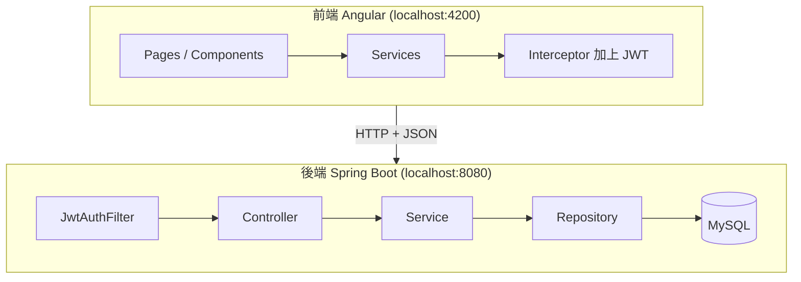
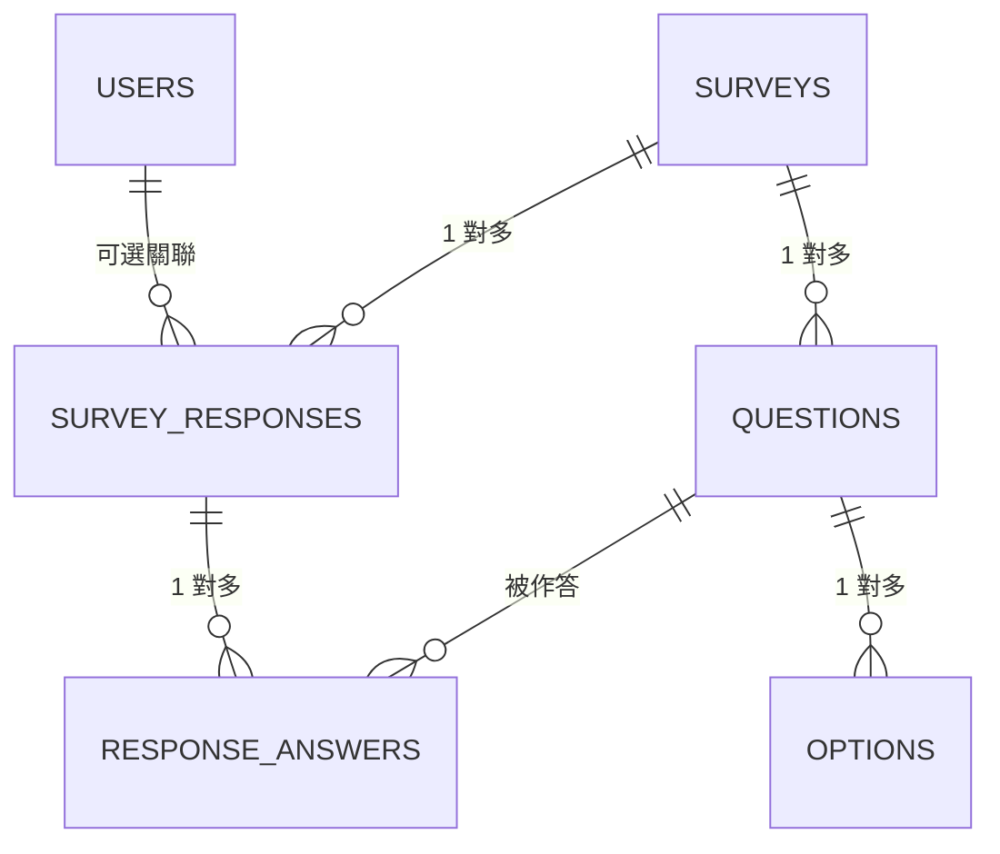

<div class="flex flex-col justify-center items-center h-full" style="background: #ffffff;">
  <p style="color: #5eada0; font-size: 1rem; font-weight: 600; letter-spacing: 0.2em; text-transform: uppercase; margin-bottom: 1.2rem;">
    Spring Boot Project Practice
  </p>
  <h1 style="color: #1a5c5c; font-size: 3.8rem; font-weight: 900; line-height: 1.15; margin-bottom: 1.5rem;">
    實戰演練：動態問卷系統
  </h1>
  <div style="height: 4px; width: 320px; background: linear-gradient(90deg, #5eada0, #a7d9d0); border-radius: 2px; margin-bottom: 1.5rem;"></div>
  <p style="color: #4a7c7c; font-size: 1.15rem; font-style: italic;">
    「從零到一，打造完整的前後端整合專案」
  </p>
  <Link to="home" style="color: #9dc4c4; font-size: 0.85rem; margin-top: 2rem; text-decoration: none; letter-spacing: 0.05em;">← 返回目錄</Link>
</div>

<!--
這一章是整個系列的綜合實戰，我們要把前面學過的 Spring Boot、Spring Security、JWT，甚至前端 Angular 通通串起來，做出一個真正能跑的「動態問卷系統」。之所以特別安排這個專案，是因為單獨學會 Annotation 或語法還不夠，真正上戰場時要處理的是「這些技術怎麼組合在一起」。跟著這份投影片，我們的目標是能夠獨立完成一個前後端分離、含身分驗證與統計圖表的完整專案。
-->

---
layout: section
class: flex flex-col justify-center items-center text-center
---

# 專案總覽

<!--
先看整個系統的藍圖：要服務哪些角色、有哪些功能、怎麼分工。這一章不再是逐行照抄程式碼，因為前面的每一章，你已經親手完成了大部分的零件。這一章的任務是：補齊最後幾塊拼圖，把零件組裝起來，然後對照需求文件逐條驗收。
-->

---
layout: default
---

# 我們要做什麼？

一個 **前後端分離** 的動態問卷系統。後端（本課程）提供 REST API，前端由 Angular 課完成。

| 角色 | 功能 |
| --- | --- |
| **訪客 / 會員** | 瀏覽進行中的問卷 → 填寫（單選 / 多選 / 文字）→ **確認頁**預覽 → 送出；看統計圓餅圖；會員可看自己的填寫紀錄 |
| **管理員** | 後台登入 → 問卷列表（搜尋、分頁、批次刪除）→ 新增 / 編輯（基本資料 → 題目 → 確認頁，僅儲存或儲存並發佈）→ 回饋列表與細節 → 統計 |

- **後端**：Spring Boot 4.1.1（Java 21）+ Spring Data JPA + Spring Security + JWT + MySQL 8.4
- **前端**：Angular 21 + Angular Material（Angular 課）
- **完整需求與 API 清單**：`SURVEY-SPEC.md`；**可執行的參考答案**：`reference/dynamic-survey`

<style>
.slidev-layout p, .slidev-layout li, .slidev-layout td, .slidev-layout th { font-size: 15px !important; line-height: 1.45 !important; }
.slidev-layout td, .slidev-layout th { padding: 4px 8px !important; }
.slidev-layout .text-sm { font-size: 14px !important; line-height: 1.4 !important; }
.slidev-layout .slidev-code-wrapper { max-width: none !important; }
.slidev-layout pre, .slidev-layout .shiki, .slidev-layout .slidev-code { padding: 0.7rem 1.2rem !important; width: calc(100% + 3rem) !important; margin-right: -3rem !important; }
.slidev-layout pre code, .slidev-layout .shiki code, .slidev-layout .line { font-size: 12.5px !important; line-height: 1.3 !important; }
</style>

<!--
這頁先定調整個專案的範圍。需求來自動態問卷的需求文件：訪客和會員、管理員兩種角色各自能做什麼事，直接對應到後端要開放的 API。

有一個很重要的心態要跟大家說：前面每一章的練習，都是這個系統的一小塊。所以你不是從零開始，而是在收尾。如果你每一章的練習都有完成，這一章你會發現，大部分的程式碼你已經寫過了。

參考答案放在 reference 資料夾，可以直接執行。它不是要讓大家照抄，而是當你卡住的時候，拿來對照。
-->

---
layout: default
---

# 系統架構

<div style="margin-top: 0.5rem;">


```mermaid
graph TB
    subgraph Frontend["前端 Angular (localhost:4200)"]
        direction LR
        Pages[Pages / Components] --> Svc[Services] --> Interceptor[Interceptor 加上 JWT]
    end
    subgraph Backend["後端 Spring Boot (localhost:8080)"]
        direction LR
        Filter[JwtAuthFilter] --> Controller --> Service --> Repository --> DB[(MySQL)]
    end
    Frontend -->|HTTP + JSON| Backend
```

</div>

- 所有回應統一為 `AppResponse { code, message, data }`；分頁為 `PageResult`
- 三層式：**Controller → Service → Repository**，資料物件分 **Entity（PO）/ DTO**
- 身分靠 **JWT**（無狀態）；作答與後台編輯的**暫存**靠 **HttpSession**（Cookie）——兩者並存

<!--
這張架構圖把前端跟後端怎麼溝通講清楚：前端發 HTTP 請求，Interceptor 自動掛上 JWT，後端 JwtAuthFilter 先驗證身分，才放行進 Controller。

特別注意最後一點：我們的系統同時用了兩種機制。JWT 用來識別「你是誰」，沒有狀態，適合前後端分離。HttpSession 用來暫存「你填到一半的問卷」，需要伺服器記住。兩者並存，就是整合時最容易出問題的地方，後面的疑難排解會再看到。

---
layout: default
---

# 資料庫 ER 圖

<div class="grid grid-cols-2 gap-4 items-start">
<div class="flex justify-center items-center"><div style="width: 330px;">


```mermaid
erDiagram
    USERS ||--o{ SURVEY_RESPONSES : "可選關聯"
    SURVEYS ||--o{ QUESTIONS : "1 對多"
    QUESTIONS ||--o{ OPTIONS : "1 對多"
    SURVEYS ||--o{ SURVEY_RESPONSES : "1 對多"
    SURVEY_RESPONSES ||--o{ RESPONSE_ANSWERS : "1 對多"
    QUESTIONS ||--o{ RESPONSE_ANSWERS : "被作答"
```

</div></div>
<div>

- 六張表由 **MySQL 課**設計，`sql/schema.sql` 建立
- `refresh_tokens`：ch45 新增
- 問卷狀態**不存資料庫**，由 `published` + 日期即時計算
- 多選答案以 `;` 串接存在 `answer_text`
- `UNIQUE (survey_id, email)`：同一 Email 不可重複填寫

</div>
</div>

<!--
這張 ER 圖就是 MySQL 課設計的成果，也是所有 Entity 的依據。一份問卷有多個題目，每個題目有多個選項；一次作答有多筆答案，每筆答案對應一個題目。

三個設計決定，值得再看一次：狀態不存資料庫，因為它會隨日期改變；多選答案用分號串接，是需求文件的規定，代價是統計時要拆字串；UNIQUE 約束，是重複填寫的最後防線。

---
layout: default
---

# 後端專案結構

```text
dynamic-survey/src/main/java/com/example/survey/
├── DynamicSurveyApplication.java
├── config/OpenApiConfig.java             # ch38  API 文件 + Authorize 按鈕
├── controller/
│   ├── SurveyController.java             # 前台：列表、內頁、暫存、送出、統計
│   ├── AdminSurveyController.java        # 後台：CRUD、編輯暫存、回饋、統計
│   ├── AuthController.java               # ch44–45  註冊、登入、refresh、logout
│   └── UserController.java               # ch44  我的資料、我的紀錄
├── service/  SurveyService · ResponseService · StatisticsService · DraftService · UserService
├── repository/  Survey · SurveyResponse · ResponseAnswer · User · RefreshToken
├── entity/   Survey · Question · Option · QuestionType · SurveyStatus
│             SurveyResponse · ResponseAnswer · User · RefreshToken
├── dto/      SurveyDTO · QuestionDTO · OptionDTO · ResponseDTO · AnswerDTO
│             StatisticsDTO · AuthDTO
├── vo/       AppResponse · RspCode · PageResult · FieldErrorVO      # ch39
├── exception/  BizException · GlobalExceptionHandler                # ch39
└── security/   SecurityConfig · JwtUtil · JwtAuthFilter · CustomUserDetailsService  # ch44–45
```

<style>
.slidev-layout p, .slidev-layout li, .slidev-layout td, .slidev-layout th { font-size: 15px !important; line-height: 1.45 !important; }
.slidev-layout td, .slidev-layout th { padding: 4px 8px !important; }
.slidev-layout .text-sm { font-size: 14px !important; line-height: 1.4 !important; }
.slidev-layout .slidev-code-wrapper { max-width: none !important; }
.slidev-layout pre, .slidev-layout .shiki, .slidev-layout .slidev-code { padding: 0.7rem 1.2rem !important; width: calc(100% + 3rem) !important; margin-right: -3rem !important; }
.slidev-layout pre code, .slidev-layout .shiki code, .slidev-layout .line { font-size: 12.5px !important; line-height: 1.3 !important; }
</style>

<!--
這是完成之後的專案結構，每個檔案旁邊標了是哪一章建立的。大部分你都做過了。

還沒有出現過的有三個：StatisticsService 和 StatisticsDTO，是統計功能；AdminSurveyController，把後台的 API 從 SurveyController 獨立出來；ResponseService 裡的回饋列表和細節。這三塊，就是這一章要補齊的。
-->

---
layout: section
class: flex flex-col justify-center items-center text-center
---

# 各章完成了什麼

<!--
先回顧一下，你這一路累積了什麼。
-->

---
layout: default
---

# 練習對照：每一章完成的零件

| 章 | 完成的零件 | 對應需求 |
| --- | --- | --- |
| MySQL ch03–04 | 六張表、外鍵、約束、`schema.sql` | 資料模型 |
| ch28 | `@Query` 搜尋 + `Pageable` 分頁 | 前台 / 後台列表的搜尋、每頁筆數 |
| ch37 | Entity、DTO、`SurveyStatus`、`SurveyService` CRUD | 問卷新增 / 修改 / 批次刪除、狀態計算 |
| ch38 | Swagger UI、`@Schema` | API 文件 |
| ch39 | `@Valid`、`AppResponse`、`BizException`、全域例外處理 | 必填 / 日期防呆、統一回應 |
| ch40 | 作答暫存（Session）→ 確認 → 送出；後台編輯暫存 | 前台確認頁、後台三步驟 |
| ch41 | 單元測試（狀態、Service）、日誌 | 品質保證 |
| ch44 | Spring Security、資料庫會員、註冊、我的紀錄 | 會員、後台限管理員 |
| ch45 | JWT 登入、Refresh Token、CORS | 登入驗證 |

<style>
.slidev-layout p, .slidev-layout li, .slidev-layout td, .slidev-layout th { font-size: 15px !important; line-height: 1.45 !important; }
.slidev-layout td, .slidev-layout th { padding: 4px 8px !important; }
.slidev-layout .text-sm { font-size: 14px !important; line-height: 1.4 !important; }
.slidev-layout .slidev-code-wrapper { max-width: none !important; }
.slidev-layout pre, .slidev-layout .shiki, .slidev-layout .slidev-code { padding: 0.7rem 1.2rem !important; width: calc(100% + 3rem) !important; margin-right: -3rem !important; }
.slidev-layout pre code, .slidev-layout .shiki code, .slidev-layout .line { font-size: 12.5px !important; line-height: 1.3 !important; }
</style>

---
layout: default
---

# 練習對照：每一章完成的零件（續）

| 章 | 完成的零件 | 對應需求 |
| --- | --- | --- |
| **ch47（本章）** | **統計、後台回饋列表與細節、Controller 拆分、整合驗收** | 統計頁、問卷回饋 |

<!--
這張表是這一章最重要的地圖。左邊是你完成的章節，右邊是它對應到需求文件的哪個功能。

如果你發現某一章的練習沒做，沒關係，參考答案裡有完整的程式碼，先補上就好。

本章要補的是最後一塊：統計、回饋列表與細節，然後把前台和後台的 Controller 整理乾淨。

<style>
.slidev-layout p, .slidev-layout li, .slidev-layout td, .slidev-layout th { font-size: 15px !important; line-height: 1.45 !important; }
.slidev-layout td, .slidev-layout th { padding: 4px 8px !important; }
.slidev-layout .text-sm { font-size: 14px !important; line-height: 1.4 !important; }
.slidev-layout .slidev-code-wrapper { max-width: none !important; }
.slidev-layout pre, .slidev-layout .shiki, .slidev-layout .slidev-code { padding: 0.7rem 1.2rem !important; width: calc(100% + 3rem) !important; margin-right: -3rem !important; }
.slidev-layout pre code, .slidev-layout .shiki code, .slidev-layout .line { font-size: 12.5px !important; line-height: 1.3 !important; }
</style>

---
layout: section
class: flex flex-col justify-center items-center text-center
---

# 補齊最後的拼圖

<!--
接下來，補上三塊：統計、後台回饋、Controller 的整理。
-->

---
layout: default
---

# 統計：需求與資料結構

**需求：** 進行中、已結束的問卷可以看統計；單選、多選題用圓餅圖，文字題列出所有回答。**尚未開始 / 未發佈**不能看。

`GET /api/surveys/{id}/statistics`（前台）、`GET /api/admin/surveys/{id}/statistics`（後台）

```java
@Getter
@Setter
public class StatisticsDTO {
    private Integer surveyId;
    private String title;
    private long totalResponses;
    private List<QuestionStat> questions = new ArrayList<>();

// ... 見下一頁
```

<style>
.slidev-layout p, .slidev-layout li, .slidev-layout td, .slidev-layout th { font-size: 15px !important; line-height: 1.45 !important; }
.slidev-layout td, .slidev-layout th { padding: 4px 8px !important; }
.slidev-layout .text-sm { font-size: 14px !important; line-height: 1.4 !important; }
.slidev-layout .slidev-code-wrapper { max-width: none !important; }
.slidev-layout pre, .slidev-layout .shiki, .slidev-layout .slidev-code { padding: 0.7rem 1.2rem !important; width: calc(100% + 3rem) !important; margin-right: -3rem !important; }
.slidev-layout pre code, .slidev-layout .shiki code, .slidev-layout .line { font-size: 12.5px !important; line-height: 1.3 !important; }
</style>

<!--
統計的 DTO 是三層：整份問卷的統計、每一題的統計、每個選項的統計。
-->

---
layout: default
---

# 統計：需求與資料結構（續）

```java
    // ... 接上一頁

    @Getter
    @Setter
    public static class QuestionStat {
        private Integer questionId;
        private String title;
        private String type;
        private long answeredCount;                       // 這題有幾個人回答
        private List<OptionStat> options = new ArrayList<>(); // 單選、多選
        private List<String> texts = new ArrayList<>();       // 文字題的所有回答
    }

    // ... 見下一頁
```

<style>
.slidev-layout p, .slidev-layout li, .slidev-layout td, .slidev-layout th { font-size: 15px !important; line-height: 1.45 !important; }
.slidev-layout td, .slidev-layout th { padding: 4px 8px !important; }
.slidev-layout .text-sm { font-size: 14px !important; line-height: 1.4 !important; }
.slidev-layout .slidev-code-wrapper { max-width: none !important; }
.slidev-layout pre, .slidev-layout .shiki, .slidev-layout .slidev-code { padding: 0.7rem 1.2rem !important; width: calc(100% + 3rem) !important; margin-right: -3rem !important; }
.slidev-layout pre code, .slidev-layout .shiki code, .slidev-layout .line { font-size: 12.5px !important; line-height: 1.3 !important; }
</style>

<!--
每個題目有兩種資料：options，是單選、多選題各選項被選了幾次、佔百分之幾；texts，是文字題的所有回答。前端拿到這個結構，選擇題畫圓餅圖，文字題列出清單，很容易。

percent 的分母，是「這一題有幾個人回答」，不是整份問卷的作答人數。因為有些題目是選填，很多人沒回答，如果用總人數當分母，百分比加起來不會是 100。
-->

---
layout: default
---

# 統計：需求與資料結構（續）

```java
// ... 接上一頁

    @Getter
    @Setter
    public static class OptionStat {
        private String label;
        private long count;
        private double percent; // 佔「這題回答人數」的百分比，0~100
    }
}
```

<style>
.slidev-layout p, .slidev-layout li, .slidev-layout td, .slidev-layout th { font-size: 15px !important; line-height: 1.45 !important; }
.slidev-layout td, .slidev-layout th { padding: 4px 8px !important; }
.slidev-layout .text-sm { font-size: 14px !important; line-height: 1.4 !important; }
.slidev-layout .slidev-code-wrapper { max-width: none !important; }
.slidev-layout pre, .slidev-layout .shiki, .slidev-layout .slidev-code { padding: 0.7rem 1.2rem !important; width: calc(100% + 3rem) !important; margin-right: -3rem !important; }
.slidev-layout pre code, .slidev-layout .shiki code, .slidev-layout .line { font-size: 12.5px !important; line-height: 1.3 !important; }
</style>

<!--
前台和後台的統計是同一個 Service，沒有差別，權限由 SecurityConfig 控制：前台的 GET 是公開的，後台要 ADMIN。
-->

---
layout: default
---

# 統計：StatisticsService
### `service/StatisticsService.java`

```java
@Service
@RequiredArgsConstructor
public class StatisticsService {

    private final SurveyService surveyService;
    private final SurveyResponseRepository responseRepository;
    private final ResponseAnswerRepository answerRepository;

    @Transactional(readOnly = true)
    public StatisticsDTO statistics(Integer surveyId) {
        Survey survey = surveyService.findOrThrow(surveyId);
        if (!surveyService.statusOf(survey).hasResult()) {
            throw new BizException(RspCode.SURVEY_NO_STATISTICS);
        }
        StatisticsDTO result = new StatisticsDTO();
        result.setSurveyId(survey.getId());
        result.setTitle(survey.getTitle());
        result.setTotalResponses(responseRepository.countBySurveyId(surveyId));

// ... 見下一頁
```

<style>
.slidev-layout p, .slidev-layout li, .slidev-layout td, .slidev-layout th { font-size: 15px !important; line-height: 1.45 !important; }
.slidev-layout td, .slidev-layout th { padding: 4px 8px !important; }
.slidev-layout .text-sm { font-size: 14px !important; line-height: 1.4 !important; }
.slidev-layout .slidev-code-wrapper { max-width: none !important; }
.slidev-layout pre, .slidev-layout .shiki, .slidev-layout .slidev-code { padding: 0.7rem 1.2rem !important; width: calc(100% + 3rem) !important; margin-right: -3rem !important; }
.slidev-layout pre code, .slidev-layout .shiki code, .slidev-layout .line { font-size: 12.5px !important; line-height: 1.3 !important; }
</style>

<!--
statistics 方法先檢查問卷狀態：不是進行中或已結束，就丟 SURVEY_NO_STATISTICS，回 409。
-->

---
layout: default
---

# 統計：StatisticsService（續）
### `service/StatisticsService.java`

```java
        // ... 接上一頁

        for (Question q : survey.getQuestions()) {
            List<ResponseAnswer> answers = answerRepository.findByQuestionId(q.getId());

            StatisticsDTO.QuestionStat stat = new StatisticsDTO.QuestionStat();
            stat.setQuestionId(q.getId());
            stat.setTitle(q.getTitle());
            stat.setType(q.getType().name());
            stat.setAnsweredCount(answers.size());

        // ... 見下一頁
```

<style>
.slidev-layout p, .slidev-layout li, .slidev-layout td, .slidev-layout th { font-size: 15px !important; line-height: 1.45 !important; }
.slidev-layout td, .slidev-layout th { padding: 4px 8px !important; }
.slidev-layout .text-sm { font-size: 14px !important; line-height: 1.4 !important; }
.slidev-layout .slidev-code-wrapper { max-width: none !important; }
.slidev-layout pre, .slidev-layout .shiki, .slidev-layout .slidev-code { padding: 0.7rem 1.2rem !important; width: calc(100% + 3rem) !important; margin-right: -3rem !important; }
.slidev-layout pre code, .slidev-layout .shiki code, .slidev-layout .line { font-size: 12.5px !important; line-height: 1.3 !important; }
</style>

<!--
接著逐題處理。文字題，把每筆回答放進 texts。選擇題有一個重要的技巧：先用「所有選項」建立一個計數表，初始值都是 0，再去掃描答案累加。這樣沒人選的選項，也會出現在結果裡，次數是 0，圓餅圖才不會少一塊。這跟 MySQL 課，統計 SQL 練習用 LEFT JOIN 保留次數為 0 的選項，是同樣的觀念。
-->

---
layout: default
---

# 統計：StatisticsService（續）
### `service/StatisticsService.java`

```java
            // ... 接上一頁

            if (q.getType() == QuestionType.TEXT) {
                answers.forEach(a -> stat.getTexts().add(a.getAnswerText()));
            } else {
                // 沒人選的選項也要出現（次數 0），所以先用所有選項建立計數表
                Map<String, Long> counts = new LinkedHashMap<>();
                q.getOptions().forEach(o -> counts.put(o.getLabel(), 0L));
                for (ResponseAnswer a : answers) {
                    Arrays.stream(a.getAnswerText().split(";"))
                            .forEach(v -> counts.computeIfPresent(v, (k, n) -> n + 1));
                }
                counts.forEach((label, count) -> {
                    StatisticsDTO.OptionStat os = new StatisticsDTO.OptionStat();
                    os.setLabel(label);
                    os.setCount(count);
                    os.setPercent(answers.isEmpty() ? 0 : Math.round(count * 1000.0 / answers.size()) / 10.0);

            // ... 見下一頁
```

<style>
.slidev-layout p, .slidev-layout li, .slidev-layout td, .slidev-layout th { font-size: 15px !important; line-height: 1.45 !important; }
.slidev-layout td, .slidev-layout th { padding: 4px 8px !important; }
.slidev-layout .text-sm { font-size: 14px !important; line-height: 1.4 !important; }
.slidev-layout .slidev-code-wrapper { max-width: none !important; }
.slidev-layout pre, .slidev-layout .shiki, .slidev-layout .slidev-code { padding: 0.7rem 1.2rem !important; width: calc(100% + 3rem) !important; margin-right: -3rem !important; }
.slidev-layout pre code, .slidev-layout .shiki code, .slidev-layout .line { font-size: 12.5px !important; line-height: 1.3 !important; }
</style>

<!--
多選題的答案，用分號串接，所以用 split 拆開，再逐一累加。computeIfPresent 的意思是：只有這個選項存在，才累加；如果答案不在選項裡，就忽略。這樣即使資料庫裡有奇怪的舊資料，也不會出錯。

Math.round(count * 1000.0 / answers.size()) / 10.0：先乘一千、四捨五入，再除以十，等於取到小數點後一位。
-->

---
layout: default
---

# 統計：StatisticsService（續）
### `service/StatisticsService.java`

```java
// ... 接上一頁

                    stat.getOptions().add(os);
                });
            }
            result.getQuestions().add(stat);
        }
        return result;
    }
}
```

<style>
.slidev-layout p, .slidev-layout li, .slidev-layout td, .slidev-layout th { font-size: 15px !important; line-height: 1.45 !important; }
.slidev-layout td, .slidev-layout th { padding: 4px 8px !important; }
.slidev-layout .text-sm { font-size: 14px !important; line-height: 1.4 !important; }
.slidev-layout .slidev-code-wrapper { max-width: none !important; }
.slidev-layout pre, .slidev-layout .shiki, .slidev-layout .slidev-code { padding: 0.7rem 1.2rem !important; width: calc(100% + 3rem) !important; margin-right: -3rem !important; }
.slidev-layout pre code, .slidev-layout .shiki code, .slidev-layout .line { font-size: 12.5px !important; line-height: 1.3 !important; }
</style>

<!--
⚠️ 效能提醒：目前每一題都呼叫一次 findByQuestionId，如果題目很多，就是很多次查詢。問卷系統的資料量不大，可以接受；資料量大的時候，可以改用 GROUP BY 的 SQL 直接在資料庫統計，或是把結果快取起來，這正是第 43 章 Cache 可以派上用場的地方。
-->

---
layout: default
---

# 後台回饋：列表與細節

**需求：** 後台看某份問卷的所有作答，**依填寫編號倒序**（越新越上面）；點「前往」看細節（問卷題目 + 該使用者的答案），唯讀。

`GET /api/admin/surveys/{id}/responses`（分頁）、`GET /api/admin/responses/{id}`

```java
    @Transactional(readOnly = true)
    public PageResult<ResponseDTO> listBySurvey(Integer surveyId, int page, int size) {
        surveyService.findOrThrow(surveyId);
        // 依填寫編號倒序：越新越上面
        PageRequest pageable = PageRequest.of(page, size, Sort.by(Sort.Direction.DESC, "id"));
        return PageResult.of(responseRepository.findBySurveyId(surveyId, pageable), r -> toDTO(r, false));
    }

    @Transactional(readOnly = true)
    public ResponseDTO detail(Integer responseId) {
        SurveyResponse r = responseRepository.findById(responseId)
                .orElseThrow(() -> new BizException(RspCode.NOT_FOUND));
        return toDTO(r, true);
    }
```

<style>
.slidev-layout p, .slidev-layout li, .slidev-layout td, .slidev-layout th { font-size: 15px !important; line-height: 1.45 !important; }
.slidev-layout td, .slidev-layout th { padding: 4px 8px !important; }
.slidev-layout .text-sm { font-size: 14px !important; line-height: 1.4 !important; }
.slidev-layout .slidev-code-wrapper { max-width: none !important; }
.slidev-layout pre, .slidev-layout .shiki, .slidev-layout .slidev-code { padding: 0.7rem 1.2rem !important; width: calc(100% + 3rem) !important; margin-right: -3rem !important; }
.slidev-layout pre code, .slidev-layout .shiki code, .slidev-layout .line { font-size: 12.5px !important; line-height: 1.3 !important; }
</style>

<!--
列表用 Pageable 分頁，排序固定是 id 倒序：因為 id 是自動遞增，id 越大就越新，需求說的「依填寫編號逆序」，就是這樣實作。

細節頁需要每題的答案，所以 toDTO 的第二個參數 withAnswers 是 true，列表則是 false，避免列表載入不需要的答案。
-->

---
layout: default
---

# 後台回饋：列表與細節（續）

```java
    private ResponseDTO toDTO(SurveyResponse r, boolean withAnswers) {
        ResponseDTO dto = new ResponseDTO();
        dto.setId(r.getId());
        dto.setSurveyId(r.getSurvey().getId());
        dto.setSubmittedAt(r.getSubmittedAt());
        dto.setName(r.getName());
        dto.setPhone(r.getPhone());
        dto.setEmail(r.getEmail());
        dto.setAge(r.getAge());
        if (withAnswers) {
            for (ResponseAnswer ra : r.getAnswers()) {
                AnswerDTO a = new AnswerDTO();
                a.setQuestionId(ra.getQuestion().getId());
                a.setQuestionTitle(ra.getQuestion().getTitle());
                a.setValues(Arrays.asList(ra.getAnswerText().split(";")));
                dto.getAnswers().add(a);
            }
        }
        return dto;
    }
```

<style>
.slidev-layout p, .slidev-layout li, .slidev-layout td, .slidev-layout th { font-size: 15px !important; line-height: 1.45 !important; }
.slidev-layout td, .slidev-layout th { padding: 4px 8px !important; }
.slidev-layout .text-sm { font-size: 14px !important; line-height: 1.4 !important; }
.slidev-layout .slidev-code-wrapper { max-width: none !important; }
.slidev-layout pre, .slidev-layout .shiki, .slidev-layout .slidev-code { padding: 0.7rem 1.2rem !important; width: calc(100% + 3rem) !important; margin-right: -3rem !important; }
.slidev-layout pre code, .slidev-layout .shiki code, .slidev-layout .line { font-size: 12.5px !important; line-height: 1.3 !important; }
</style>

<!--
答案的 answerText，用分號拆回陣列，跟前台作答的格式一致：values 是陣列。多選題的答案，前端拿到就可以直接顯示成標籤。

因為這兩個方法都是唯讀，加了 @Transactional(readOnly = true)。也因為 open-in-view 關閉，延遲載入的 answers，要在交易裡面讀完，所以 toDTO 必須在方法裡面呼叫，不能拿到 Entity 之後，回到 Controller 才轉。
-->

---
layout: default
---

# 整理 Controller：前台與後台分開

```java
// 前台：SurveyController
@Tag(name = "前台問卷", description = "問卷列表、填寫、確認、統計")
@RestController
public class SurveyController { /* list · get · statistics · draft · submit */ }

// 後台：AdminSurveyController，整個類別都需要 ADMIN
@Tag(name = "後台問卷", description = "問卷管理、回饋、統計（限管理員）")
@SecurityRequirement(name = "bearerAuth")
@RestController
@RequestMapping("/api/admin")
@RequiredArgsConstructor
public class AdminSurveyController {

    private final SurveyService surveyService;
    private final DraftService draftService;
    private final ResponseService responseService;
    private final StatisticsService statisticsService;
```

<style>
.slidev-layout p, .slidev-layout li, .slidev-layout td, .slidev-layout th { font-size: 15px !important; line-height: 1.45 !important; }
.slidev-layout td, .slidev-layout th { padding: 4px 8px !important; }
.slidev-layout .text-sm { font-size: 14px !important; line-height: 1.4 !important; }
.slidev-layout .slidev-code-wrapper { max-width: none !important; }
.slidev-layout pre, .slidev-layout .shiki, .slidev-layout .slidev-code { padding: 0.7rem 1.2rem !important; width: calc(100% + 3rem) !important; margin-right: -3rem !important; }
.slidev-layout pre code, .slidev-layout .shiki code, .slidev-layout .line { font-size: 12.5px !important; line-height: 1.3 !important; }
</style>

<!--
ch37 的時候，前台和後台的方法，都放在同一個 SurveyController。現在功能變多了，我們把它拆成兩個。

SurveyController 是前台，全部公開：問卷列表、內頁、統計、暫存、送出。

AdminSurveyController 是後台，路徑統一 /api/admin，整個類別都需要 ADMIN 角色。這個分開有兩個好處：SecurityConfig 只需要一行規則，/api/admin/** 要 ADMIN；Swagger 文件也分成兩個 Tag，一看就知道哪些 API 需要登入。

@SecurityRequirement(name = "bearerAuth")，讓 Swagger UI 知道，這個 Controller 的 API，要帶 JWT，右上角的 Authorize 按鈕貼上 Token 之後，才能在 Swagger 裡面測試。

拆分之後，Controller 的內容，跟前面各章的解答完全一樣，只是搬家。
-->

---
layout: default
---

# 整理 Controller：後台的完整端點

```java
    @Operation(summary = "後台問卷列表", description = "包含未發佈的問卷")
    @GetMapping("/surveys")
    public AppResponse<PageResult<SurveyDTO>> list(
            @RequestParam(name = "title", required = false) String title,
            @RequestParam(name = "startDate", required = false) LocalDate startDate,
            @RequestParam(name = "endDate", required = false) LocalDate endDate,
            @Parameter(description = "頁碼，從 0 開始") @RequestParam(name = "page", defaultValue = "0") int page,
            @RequestParam(name = "size", defaultValue = "10") int size) {
        return AppResponse.success(surveyService.search(title, startDate, endDate, false, page, size));
    }

    @GetMapping("/surveys/{id}")
    public AppResponse<SurveyDTO> get(@PathVariable("id") Integer id) {
        return AppResponse.success(surveyService.get(id, true));
    }

    // ... 見下一頁
```

<style>
.slidev-layout p, .slidev-layout li, .slidev-layout td, .slidev-layout th { font-size: 15px !important; line-height: 1.45 !important; }
.slidev-layout td, .slidev-layout th { padding: 4px 8px !important; }
.slidev-layout .text-sm { font-size: 14px !important; line-height: 1.4 !important; }
.slidev-layout .slidev-code-wrapper { max-width: none !important; }
.slidev-layout pre, .slidev-layout .shiki, .slidev-layout .slidev-code { padding: 0.7rem 1.2rem !important; width: calc(100% + 3rem) !important; margin-right: -3rem !important; }
.slidev-layout pre code, .slidev-layout .shiki code, .slidev-layout .line { font-size: 12.5px !important; line-height: 1.3 !important; }
</style>

<!--
後台的全部端點：問卷列表、單筆、新增、修改、批次刪除，這是 ch37 的成果；編輯暫存與 commit，是 ch40 練習 3；回饋列表、統計，是這一章新增的。
-->

---
layout: default
---

# 整理 Controller：後台的完整端點（續）

```java
    // ... 接上一頁

    @PostMapping("/surveys")
    public AppResponse<SurveyDTO> create(@Valid @RequestBody SurveyDTO dto,
                                         @RequestParam(name = "publish", defaultValue = "false") boolean publish) {
        dto.setId(null);
        return AppResponse.success(surveyService.save(dto, publish));
    }

    @PutMapping("/surveys/{id}")
    public AppResponse<SurveyDTO> update(@PathVariable("id") Integer id, @Valid @RequestBody SurveyDTO dto,
                                         @RequestParam(name = "publish", defaultValue = "false") boolean publish) {
        dto.setId(id);
        return AppResponse.success(surveyService.save(dto, publish));
    }

    // ... 見下一頁
```

<style>
.slidev-layout p, .slidev-layout li, .slidev-layout td, .slidev-layout th { font-size: 15px !important; line-height: 1.45 !important; }
.slidev-layout td, .slidev-layout th { padding: 4px 8px !important; }
.slidev-layout .text-sm { font-size: 14px !important; line-height: 1.4 !important; }
.slidev-layout .slidev-code-wrapper { max-width: none !important; }
.slidev-layout pre, .slidev-layout .shiki, .slidev-layout .slidev-code { padding: 0.7rem 1.2rem !important; width: calc(100% + 3rem) !important; margin-right: -3rem !important; }
.slidev-layout pre code, .slidev-layout .shiki code, .slidev-layout .line { font-size: 12.5px !important; line-height: 1.3 !important; }
</style>

<!--
（接續上一頁。）
-->

---
layout: default
---

# 整理 Controller：後台的完整端點（續）

```java
    // ... 接上一頁

    @Operation(summary = "批次刪除問卷", description = "Body 是 id 陣列；只有未發佈、尚未開始的問卷能刪，否則整批不刪")
    @DeleteMapping("/surveys")
    public AppResponse<Void> delete(@RequestBody List<Integer> ids) {
        surveyService.deleteAll(ids);
        return AppResponse.success();
    }

    // ---- 後台編輯流程：基本資料與題目先暫存在 Session，確認頁才寫資料庫 ----

    @PostMapping("/survey-draft")
    public AppResponse<Void> saveDraft(@Valid @RequestBody SurveyDTO dto, HttpSession session) {
        draftService.saveSurvey(session, dto);
        return AppResponse.success();
    }

    @GetMapping("/survey-draft")
    public AppResponse<SurveyDTO> getDraft(HttpSession session) {
        return AppResponse.success(draftService.getSurvey(session));
    }

    // ... 見下一頁
```

<style>
.slidev-layout p, .slidev-layout li, .slidev-layout td, .slidev-layout th { font-size: 15px !important; line-height: 1.45 !important; }
.slidev-layout td, .slidev-layout th { padding: 4px 8px !important; }
.slidev-layout .text-sm { font-size: 14px !important; line-height: 1.4 !important; }
.slidev-layout .slidev-code-wrapper { max-width: none !important; }
.slidev-layout pre, .slidev-layout .shiki, .slidev-layout .slidev-code { padding: 0.7rem 1.2rem !important; width: calc(100% + 3rem) !important; margin-right: -3rem !important; }
.slidev-layout pre code, .slidev-layout .shiki code, .slidev-layout .line { font-size: 12.5px !important; line-height: 1.3 !important; }
</style>

<!--
所有方法只做接收參數、呼叫 Service、包成 AppResponse 這三件事。
-->

---
layout: default
---

# 整理 Controller：後台的完整端點（續）

```java
    // ... 接上一頁

    /** 確認頁按「僅儲存」(publish=false) 或「儲存並發佈」(publish=true) */
    @PostMapping("/survey-draft/commit")
    public AppResponse<SurveyDTO> commit(@RequestParam(name = "publish") boolean publish, HttpSession session) {
        SurveyDTO dto = draftService.getSurvey(session);
        if (dto == null) throw new BizException(RspCode.NO_DRAFT);
        SurveyDTO saved = surveyService.save(dto, publish);
        draftService.clearSurvey(session);
        return AppResponse.success(saved);
    }

    // ---- 回饋與統計 ----

    // ... 見下一頁
```

<style>
.slidev-layout p, .slidev-layout li, .slidev-layout td, .slidev-layout th { font-size: 15px !important; line-height: 1.45 !important; }
.slidev-layout td, .slidev-layout th { padding: 4px 8px !important; }
.slidev-layout .text-sm { font-size: 14px !important; line-height: 1.4 !important; }
.slidev-layout .slidev-code-wrapper { max-width: none !important; }
.slidev-layout pre, .slidev-layout .shiki, .slidev-layout .slidev-code { padding: 0.7rem 1.2rem !important; width: calc(100% + 3rem) !important; margin-right: -3rem !important; }
.slidev-layout pre code, .slidev-layout .shiki code, .slidev-layout .line { font-size: 12.5px !important; line-height: 1.3 !important; }
</style>

<!--
（接續上一頁。）
-->

---
layout: default
---

# 整理 Controller：後台的完整端點（續）

```java
    // ... 接上一頁

    @GetMapping("/surveys/{id}/responses")
    public AppResponse<PageResult<ResponseDTO>> responses(@PathVariable("id") Integer id,
                                                          @Parameter(description = "頁碼，從 0 開始") @RequestParam(name = "page", defaultValue = "0") int page,
                                                          @RequestParam(name = "size", defaultValue = "10") int size) {
        return AppResponse.success(responseService.listBySurvey(id, page, size));
    }
    // ... GET /responses/{id}、GET /surveys/{id}/statistics
```

<style>
.slidev-layout p, .slidev-layout li, .slidev-layout td, .slidev-layout th { font-size: 15px !important; line-height: 1.45 !important; }
.slidev-layout td, .slidev-layout th { padding: 4px 8px !important; }
.slidev-layout .text-sm { font-size: 14px !important; line-height: 1.4 !important; }
.slidev-layout .slidev-code-wrapper { max-width: none !important; }
.slidev-layout pre, .slidev-layout .shiki, .slidev-layout .slidev-code { padding: 0.7rem 1.2rem !important; width: calc(100% + 3rem) !important; margin-right: -3rem !important; }
.slidev-layout pre code, .slidev-layout .shiki code, .slidev-layout .line { font-size: 12.5px !important; line-height: 1.3 !important; }
</style>

<!--
一個容易漏掉的細節：新增的時候，dto.setId(null)，修改的時候，dto.setId(id)，用路徑上的 id 覆蓋 body 裡的 id。這樣即使前端送錯，或有人惡意送別的 id，都不會影響到別的問卷。
-->

---
layout: section
class: flex flex-col justify-center items-center text-center
---

# 整合驗收

<!--
程式寫完了，接下來要證明它是對的。我們用兩種方式：對照需求逐條驗收，和用自動化腳本一次跑完。
-->

---
layout: default
---

# 環境準備與啟動

1. MySQL：依序執行 `sql/schema.sql`、`sql/seed.sql`、`sql/ch45-refresh-tokens.sql`（用 `mysql --default-character-set=utf8mb4`）
2. `application.properties`：資料庫帳密、`jwt.secret`（Base64）、`ddl-auto=validate`、`open-in-view=false`
3. 啟動：Eclipse 執行 `DynamicSurveyApplication`，或 `./gradlew bootRun`
4. 打開 Swagger UI：`http://localhost:8080/swagger-ui/index.html`
5. 測試帳號（密碼都是 `Passw0rd12`）：`admin@example.com`（管理員）、`ming@example.com`、`mei@example.com`（會員）
6. 單元測試：`./gradlew test`（12 個測試）
7. 自動化驗收：`reference/dynamic-survey/e2e.sh`（後端啟動後執行，把每個功能走一遍）

<div class="mt-4 p-3 bg-blue-50 border-l-4 border-blue-400 text-gray-700 text-sm text-left">
💡 <b>seed.sql 的日期是相對於「今天」</b>算的，所以不論哪一天執行，都會有進行中、尚未開始、已結束、未發佈四種狀態的問卷可以測試。
</div>

<!--
啟動之前，先確認資料庫。seed.sql 裡的日期，都是用 CURDATE() 加減幾天算出來的，所以你今天執行，就會有三份進行中、一份尚未開始、一份已結束、一份未發佈的問卷。下次上課再執行，也是一樣，不需要修改日期。

<style>
.slidev-layout p, .slidev-layout li, .slidev-layout td, .slidev-layout th { font-size: 15px !important; line-height: 1.45 !important; }
.slidev-layout td, .slidev-layout th { padding: 4px 8px !important; }
.slidev-layout .text-sm { font-size: 14px !important; line-height: 1.4 !important; }
.slidev-layout .slidev-code-wrapper { max-width: none !important; }
.slidev-layout pre, .slidev-layout .shiki, .slidev-layout .slidev-code { padding: 0.7rem 1.2rem !important; width: calc(100% + 3rem) !important; margin-right: -3rem !important; }
.slidev-layout pre code, .slidev-layout .shiki code, .slidev-layout .line { font-size: 12.5px !important; line-height: 1.3 !important; }
</style>

---
layout: default
---

# 環境準備與啟動（續）

Swagger UI 是第 38 章做的成果，現在可以直接在網頁上測試所有 API，登入之後，把 accessToken 貼到右上角的 Authorize 按鈕，就可以測試後台的 API。

e2e 腳本，是我們用 curl 把整個流程走一遍，適合在改完程式碼之後，快速確認有沒有把什麼東西弄壞。

<style>
.slidev-layout p, .slidev-layout li, .slidev-layout td, .slidev-layout th { font-size: 15px !important; line-height: 1.45 !important; }
.slidev-layout td, .slidev-layout th { padding: 4px 8px !important; }
.slidev-layout .text-sm { font-size: 14px !important; line-height: 1.4 !important; }
.slidev-layout .slidev-code-wrapper { max-width: none !important; }
.slidev-layout pre, .slidev-layout .shiki, .slidev-layout .slidev-code { padding: 0.7rem 1.2rem !important; width: calc(100% + 3rem) !important; margin-right: -3rem !important; }
.slidev-layout pre code, .slidev-layout .shiki code, .slidev-layout .line { font-size: 12.5px !important; line-height: 1.3 !important; }
</style>

---
layout: default
---

# 需求驗收清單（1/3）— 前台

| 需求 | 驗收方式 | 章 |
| --- | --- | --- |
| 列表：標題模糊搜尋 + 起訖日期組合 | `GET /api/surveys?title=午餐&startDate=…&endDate=…` | ch28 |
| 列表：分頁，預設每頁 10 筆，可自訂 | `?page=0&size=2` → `totalPages`、`totalElements` | ch28 |
| 列表：只顯示已發佈；狀態為尚未開始 / 進行中 / 已結束 | 看不到未發佈；每筆有 `statusLabel` | ch37 |
| 內頁：問題含單選、多選、文字，選項是陣列 | `GET /api/surveys/2` → `questions[].options[]` | ch37 |
| 姓名、手機、Email 必填，年齡選填；格式檢查 | 故意傳錯格式 → **400** + 訊息 | ch39 |
| 必填的題目沒答 → 提醒 | → **400**「…為必填」 | ch40 |
| 送出**不立刻寫資料庫**，先放 Session | `POST …/draft` 後，`survey_responses` 筆數不變 | ch40 |
| 確認頁：從 Session 讀取，唯讀 | `GET …/draft` 讀回；換 Cookie 讀不到（409） | ch40 |

<style>
.slidev-layout p, .slidev-layout li, .slidev-layout td, .slidev-layout th { font-size: 15px !important; line-height: 1.45 !important; }
.slidev-layout td, .slidev-layout th { padding: 4px 8px !important; }
.slidev-layout .text-sm { font-size: 14px !important; line-height: 1.4 !important; }
.slidev-layout .slidev-code-wrapper { max-width: none !important; }
.slidev-layout pre, .slidev-layout .shiki, .slidev-layout .slidev-code { padding: 0.7rem 1.2rem !important; width: calc(100% + 3rem) !important; margin-right: -3rem !important; }
.slidev-layout pre code, .slidev-layout .shiki code, .slidev-layout .line { font-size: 12.5px !important; line-height: 1.3 !important; }
</style>

---
layout: default
---

# 需求驗收清單（1/3）— 前台（續）

| 需求 | 驗收方式 | 章 |
| --- | --- | --- |
| 確認送出 → 寫入資料庫，多選以 `;` 串接 | `POST …/submit`；`answer_text = 青菜;豆腐` | ch40 |
| **同一 Email 不可重複填寫**同一份問卷 | 再送一次 → **409** `ALREADY_RESPONDED` | ch40 |
| 尚未開始 / 已結束的問卷不能填寫 | → **409** `SURVEY_NOT_OPEN` | ch40 |
| 統計：進行中、已結束才能看，尚未開始不行 | `GET …/statistics` → 200 / **409** | ch47 |
| 統計：選項次數與百分比，文字題列出內容 | 沒人選的選項次數為 0 | ch47 |
| 會員：註冊、登入、我的填寫紀錄、改資料 | `/api/auth/*`、`/api/users/me*` | ch44–45 |

<!--
這是前台的需求驗收清單，直接對照需求文件。每一條都可以用 Postman 或 Swagger 驗證。

<style>
.slidev-layout p, .slidev-layout li, .slidev-layout td, .slidev-layout th { font-size: 15px !important; line-height: 1.45 !important; }
.slidev-layout td, .slidev-layout th { padding: 4px 8px !important; }
.slidev-layout .text-sm { font-size: 14px !important; line-height: 1.4 !important; }
.slidev-layout .slidev-code-wrapper { max-width: none !important; }
.slidev-layout pre, .slidev-layout .shiki, .slidev-layout .slidev-code { padding: 0.7rem 1.2rem !important; width: calc(100% + 3rem) !important; margin-right: -3rem !important; }
.slidev-layout pre code, .slidev-layout .shiki code, .slidev-layout .line { font-size: 12.5px !important; line-height: 1.3 !important; }
</style>

---
layout: default
---

# 需求驗收清單（1/3）— 前台（續）

建議做法：兩個人一組，一個人念需求，一個人操作驗證。每驗證通過一條，就在旁邊打勾。

特別注意「送出不立刻寫資料庫」這一條。驗證的方法，不是看回傳值，而是打開 MySQL，看 survey_responses 的筆數，有沒有變。這才是真正的證據。

<style>
.slidev-layout p, .slidev-layout li, .slidev-layout td, .slidev-layout th { font-size: 15px !important; line-height: 1.45 !important; }
.slidev-layout td, .slidev-layout th { padding: 4px 8px !important; }
.slidev-layout .text-sm { font-size: 14px !important; line-height: 1.4 !important; }
.slidev-layout .slidev-code-wrapper { max-width: none !important; }
.slidev-layout pre, .slidev-layout .shiki, .slidev-layout .slidev-code { padding: 0.7rem 1.2rem !important; width: calc(100% + 3rem) !important; margin-right: -3rem !important; }
.slidev-layout pre code, .slidev-layout .shiki code, .slidev-layout .line { font-size: 12.5px !important; line-height: 1.3 !important; }
</style>

---
layout: default
---

# 需求驗收清單（2/3）— 後台問卷管理

| 需求 | 驗收方式 | 章 |
| --- | --- | --- |
| 後台限管理員：未登入 401、一般會員 403 | 用三種身分呼叫 `/api/admin/surveys` | ch44–45 |
| 列表：搜尋、分頁（預設 10）；顯示**所有**狀態（含未發佈） | `GET /api/admin/surveys` 含未發佈 | ch28 / ch37 |
| 新增：標題、說明必填；日期防呆（開始要晚於今天；結束在開始之後） | 傳今天 / 結束等於開始 → **400** | ch39 |
| 新增：題目單選 / 多選 / 文字、是否必填、選項陣列 | `POST` 含三種題型 | ch37 |
| 新增流程三步驟：基本資料 + 題目**先放 Session** | `POST /api/admin/survey-draft`（DB 沒有新資料） | ch40 |
| 確認頁：僅儲存（不發佈）／儲存並發佈 | `commit?publish=false / true` → `published` 0 / 1 | ch40 |
| 編輯：只有**未發佈、尚未開始**可以修改 | `PUT` 進行中 → **409** | ch37 |

<style>
.slidev-layout p, .slidev-layout li, .slidev-layout td, .slidev-layout th { font-size: 15px !important; line-height: 1.45 !important; }
.slidev-layout td, .slidev-layout th { padding: 4px 8px !important; }
.slidev-layout .text-sm { font-size: 14px !important; line-height: 1.4 !important; }
.slidev-layout .slidev-code-wrapper { max-width: none !important; }
.slidev-layout pre, .slidev-layout .shiki, .slidev-layout .slidev-code { padding: 0.7rem 1.2rem !important; width: calc(100% + 3rem) !important; margin-right: -3rem !important; }
.slidev-layout pre code, .slidev-layout .shiki code, .slidev-layout .line { font-size: 12.5px !important; line-height: 1.3 !important; }
</style>

---
layout: default
---

# 需求驗收清單（2/3）— 後台問卷管理（續）

| 需求 | 驗收方式 | 章 |
| --- | --- | --- |
| 刪除：只有未發佈、尚未開始可刪；**可批次刪除** | `DELETE` Body `[id…]`；含進行中 → **409**，**整批不刪** | ch37 |
| 名稱連結：可修改 / 唯讀頁面依狀態跳轉 | 回傳的 `status` 供前端判斷 | ch37 |

<!--
這是後台的問卷管理驗收清單。

有兩條特別有意思：一是批次刪除，「整批不刪」，我們要驗證的不只是回傳 409，還要驗證那些「可以刪」的問卷，真的也沒有被刪掉，因為整個方法是一個交易。二是編輯暫存，暫存完之後，資料庫不會有新資料，只有按下確認頁的按鈕，才會寫入。

<style>
.slidev-layout p, .slidev-layout li, .slidev-layout td, .slidev-layout th { font-size: 15px !important; line-height: 1.45 !important; }
.slidev-layout td, .slidev-layout th { padding: 4px 8px !important; }
.slidev-layout .text-sm { font-size: 14px !important; line-height: 1.4 !important; }
.slidev-layout .slidev-code-wrapper { max-width: none !important; }
.slidev-layout pre, .slidev-layout .shiki, .slidev-layout .slidev-code { padding: 0.7rem 1.2rem !important; width: calc(100% + 3rem) !important; margin-right: -3rem !important; }
.slidev-layout pre code, .slidev-layout .shiki code, .slidev-layout .line { font-size: 12.5px !important; line-height: 1.3 !important; }
</style>

---
layout: default
---

# 需求驗收清單（3/3）— 後台回饋、統計與安全

| 需求 | 驗收方式 | 章 |
| --- | --- | --- |
| 回饋列表：所有作答，**依填寫編號倒序** | `GET /api/admin/surveys/2/responses` → `id` 遞減 | ch47 |
| 回饋細節：問卷題目 + 該使用者答案，唯讀 | `GET /api/admin/responses/{id}` | ch47 |
| 後台統計：所有題目，選擇題圓餅圖資料 | `GET /api/admin/surveys/{id}/statistics` | ch47 |
| 密碼以 BCrypt 儲存 | `SELECT password FROM users` → `$2a$…` | ch44 |
| 登入失敗不洩漏「帳號不存在」或「密碼錯誤」 | 兩種情況訊息相同 | ch45 |
| Token 被竄改 → **401**（不是 500） | Token 後面多加一個字元 | ch45 |
| Refresh Token 可廢止 | `logout` 之後 `refresh` → 401 | ch45 |
| 錯誤有統一格式與正確的 HTTP 狀態碼 | 每個錯誤都是 `code / message / data` | ch39 |

<style>
.slidev-layout p, .slidev-layout li, .slidev-layout td, .slidev-layout th { font-size: 15px !important; line-height: 1.45 !important; }
.slidev-layout td, .slidev-layout th { padding: 4px 8px !important; }
.slidev-layout .text-sm { font-size: 14px !important; line-height: 1.4 !important; }
.slidev-layout .slidev-code-wrapper { max-width: none !important; }
.slidev-layout pre, .slidev-layout .shiki, .slidev-layout .slidev-code { padding: 0.7rem 1.2rem !important; width: calc(100% + 3rem) !important; margin-right: -3rem !important; }
.slidev-layout pre code, .slidev-layout .shiki code, .slidev-layout .line { font-size: 12.5px !important; line-height: 1.3 !important; }
</style>

---
layout: default
---

# 需求驗收清單（3/3）— 後台回饋、統計與安全（續）

| 需求 | 驗收方式 | 章 |
| --- | --- | --- |
| log 不含個資 | `logs/dynamic-survey.log` 沒有姓名 / 手機 / 完整 Email | ch41 |
| 狀態計算、Service 規則有測試 | `./gradlew test` 全綠 | ch41 |

<!--
最後一張驗收清單，涵蓋回饋、統計，還有安全性相關的項目。

其中有幾個是非功能需求：密碼要加密、登入失敗不洩漏資訊、log 不含個資、要有測試。這些需求文件沒有寫，但是是專業的後端一定要做到的。面試的時候，如果能講出「我怎麼確保這些」，會是很大的加分。

<style>
.slidev-layout p, .slidev-layout li, .slidev-layout td, .slidev-layout th { font-size: 15px !important; line-height: 1.45 !important; }
.slidev-layout td, .slidev-layout th { padding: 4px 8px !important; }
.slidev-layout .text-sm { font-size: 14px !important; line-height: 1.4 !important; }
.slidev-layout .slidev-code-wrapper { max-width: none !important; }
.slidev-layout pre, .slidev-layout .shiki, .slidev-layout .slidev-code { padding: 0.7rem 1.2rem !important; width: calc(100% + 3rem) !important; margin-right: -3rem !important; }
.slidev-layout pre code, .slidev-layout .shiki code, .slidev-layout .line { font-size: 12.5px !important; line-height: 1.3 !important; }
</style>

---
layout: default
---

# 自動化驗收：e2e.sh

```bash
cd reference/dynamic-survey
./gradlew bootRun &            # 先啟動後端
./e2e.sh                       # 把 16 個情境全部走一遍

== 1 前台列表 (published only, 預設 10 筆)
[(6, '進行中'), (4, '尚未開始'), (3, '進行中'), (2, '進行中'), (1, '已結束')] 5 1
== 5b 同 Email 重複
{"code":"ALREADY_RESPONDED","message":"此 Email 已經填寫過這份問卷","data":null}
[HTTP 409]
== 12 批次刪除含進行中 → 409 (整批不刪)
{"code":"SURVEY_NOT_EDITABLE","message":"「午餐偏好調查」已開始，無法刪除","data":null}
[HTTP 409]
== 16 過期/竄改的 Access Token → 401 而不是 500
{"code":"UNAUTHORIZED","message":"請先登入","data":null}
[HTTP 401]
```

<div class="mt-2 p-3 bg-yellow-50 border-l-4 border-yellow-400 text-gray-700 text-sm text-left">
⚠️ <b>腳本會改資料庫</b>（新增問卷、刪除問卷、註冊會員）。每次執行前，請重新執行 <code>schema.sql</code> + <code>seed.sql</code> + <code>ch45-refresh-tokens.sql</code>，讓資料回到起點。
</div>

<style>
.slidev-layout p, .slidev-layout li, .slidev-layout td, .slidev-layout th { font-size: 15px !important; line-height: 1.45 !important; }
.slidev-layout td, .slidev-layout th { padding: 4px 8px !important; }
.slidev-layout .text-sm { font-size: 14px !important; line-height: 1.4 !important; }
.slidev-layout .slidev-code-wrapper { max-width: none !important; }
.slidev-layout pre, .slidev-layout .shiki, .slidev-layout .slidev-code { padding: 0.7rem 1.2rem !important; width: calc(100% + 3rem) !important; margin-right: -3rem !important; }
.slidev-layout pre code, .slidev-layout .shiki code, .slidev-layout .line { font-size: 12.5px !important; line-height: 1.3 !important; }
</style>

<!--
e2e.sh 是一個 shell 腳本，用 curl 把整個系統走一遍：前台列表、搜尋、分頁、作答的三步驟、重複填寫、後台的新增編輯刪除、權限、註冊登入、refresh、logout。每一步都印出結果，你可以對照預期值。

它不是取代單元測試，而是補充：單元測試測的是一個一個的類別，e2e 測的是「所有零件組裝起來之後」是不是能運作，包含資料庫、Security、Session、JSON 序列化。很多問題，只有整合起來才會出現，例如下一頁要講的 Session 問題。

你可以自己在腳本後面新增案例，這是很好的練習：每個新的功能，加一個新的驗收步驟。
-->

---
layout: default
---

# 整合常見問題 (Troubleshooting)

| 症狀 | 可能原因 | 解法 |
| --- | --- | --- |
| 暫存後讀取回 409「沒有暫存」 | Security 每個請求都換 `JSESSIONID`（session fixation） | `sessionFixation(f -> f.none())`（ch45） |
| 前端讀不到 Session / 每次都是新的 | 前端沒帶 Cookie | Angular `withCredentials: true` + 後端 `allowCredentials(true)`，且 `allowedOrigins` 不能是 `*` |
| 啟動報 `Schema-validation: wrong column type` | `TINYINT` 對應 `Boolean` | `@JdbcTypeCode(SqlTypes.TINYINT)` |
| 啟動報 `Public Key Retrieval is not allowed` | MySQL 8 `caching_sha2_password` | 連線字串加 `allowPublicKeyRetrieval=true`，或用 root 的 native 密碼 |
| `LazyInitializationException` | `open-in-view=false`，Entity 出了交易才讀關聯 | 在 Service 的 `@Transactional` 內轉成 DTO |
| Swagger 欄位說明對不上 | 兩個 DTO 同名（不同 package） | DTO 命名不要重複，或 `@Schema(name = "…")` |

<style>
.slidev-layout p, .slidev-layout li, .slidev-layout td, .slidev-layout th { font-size: 15px !important; line-height: 1.45 !important; }
.slidev-layout td, .slidev-layout th { padding: 4px 8px !important; }
.slidev-layout .text-sm { font-size: 14px !important; line-height: 1.4 !important; }
.slidev-layout .slidev-code-wrapper { max-width: none !important; }
.slidev-layout pre, .slidev-layout .shiki, .slidev-layout .slidev-code { padding: 0.7rem 1.2rem !important; width: calc(100% + 3rem) !important; margin-right: -3rem !important; }
.slidev-layout pre code, .slidev-layout .shiki code, .slidev-layout .line { font-size: 12.5px !important; line-height: 1.3 !important; }
</style>

<!--
這張表整理了整合這個專案時，最常遇到的問題。這些幾乎都是我們做參考答案的時候，真正踩到的坑。

第一個最值得記住：Session 每次請求都換 ID。它的症狀非常詭異：單獨測 Session 沒問題，單獨測 JWT 也沒問題，兩個放在一起，暫存就找不到了。原因是 Spring Security 為了防止 Session 固定攻擊，認證成功就換 Session ID，而 JWT 的每個請求都是一次認證。解法我們在第 45 章看過。
-->

---
layout: default
---

# 整合常見問題 (Troubleshooting)（續）

| 症狀 | 可能原因 | 解法 |
| --- | --- | --- |
| `@WebMvcTest` 找不到 | Boot 4 測試切片獨立成模組 | 加 `spring-boot-starter-webmvc-test` |
| 中文變成 `???` / 亂碼 | 連線或檔案編碼 | `characterEncoding=utf-8`；執行 SQL 用 `--default-character-set=utf8mb4` |
| 401 還是 403？ | 401 未登入 / Token 無效；403 已登入但角色不夠 | 對照 `JwtAuthFilter` 與 `SecurityConfig` 規則 |

<style>
.slidev-layout p, .slidev-layout li, .slidev-layout td, .slidev-layout th { font-size: 15px !important; line-height: 1.45 !important; }
.slidev-layout td, .slidev-layout th { padding: 4px 8px !important; }
.slidev-layout .text-sm { font-size: 14px !important; line-height: 1.4 !important; }
.slidev-layout .slidev-code-wrapper { max-width: none !important; }
.slidev-layout pre, .slidev-layout .shiki, .slidev-layout .slidev-code { padding: 0.7rem 1.2rem !important; width: calc(100% + 3rem) !important; margin-right: -3rem !important; }
.slidev-layout pre code, .slidev-layout .shiki code, .slidev-layout .line { font-size: 12.5px !important; line-height: 1.3 !important; }
</style>

<!--
第二個，是前後端分離最經典的 CORS 加 Cookie 問題：後端要 allowCredentials，前端要 withCredentials，而且來源不能是萬用字元，三個條件缺一不可。

如果同學遇到其他問題，先看這張表，八成會在裡面。
-->

---
layout: default
---

# 延伸挑戰

做完驗收，還有時間的話，可以挑戰：

1. **統計加快取**：用第 43 章的 `@Cacheable` 快取統計結果，並在有人送出作答時 `@CacheEvict`
2. **定時關閉**：用第 42 章的 `@Scheduled`，每天凌晨記錄「今天結束的問卷」與作答人數到日誌
3. **Refresh Token Rotation**：每次 `/refresh` 換發新的 Refresh Token，並刪除舊的
4. **匯出 CSV**：後台匯出某份問卷的所有作答（`Content-Disposition: attachment`）
5. **問卷複製**：一鍵複製一份問卷（含題目、選項），狀態為未發佈
6. **整合測試**：用 `@SpringBootTest` + `MockMvc` 寫「暫存 → 送出 → 重複送出」的測試（記得加 Boot 4 的測試依賴）
7. **Docker 化**：Docker 課的最終章，把後端、前端、MySQL 用 Compose 一次拉起

<style>
.slidev-layout p, .slidev-layout li, .slidev-layout td, .slidev-layout th { font-size: 15px !important; line-height: 1.45 !important; }
.slidev-layout td, .slidev-layout th { padding: 4px 8px !important; }
.slidev-layout .text-sm { font-size: 14px !important; line-height: 1.4 !important; }
.slidev-layout .slidev-code-wrapper { max-width: none !important; }
.slidev-layout pre, .slidev-layout .shiki, .slidev-layout .slidev-code { padding: 0.7rem 1.2rem !important; width: calc(100% + 3rem) !important; margin-right: -3rem !important; }
.slidev-layout pre code, .slidev-layout .shiki code, .slidev-layout .line { font-size: 12.5px !important; line-height: 1.3 !important; }
</style>

<!--
這些是延伸挑戰，沒有標準答案。前兩題直接串回前面的章節：快取和排程，都很適合用在統計功能上。

第三題 Rotation 是 Refresh Token 的進階做法，第 45 章的延伸頁有介紹。

第七題是整個課程的最後一塊：把這個系統，用 Docker 打包部署。
-->

---
layout: end
---

# Q & A
### 恭喜完成後端部分！

<Link to="home" style="color: #9dc4c4; font-size: 0.85rem; margin-top: 2rem; text-decoration: none; letter-spacing: 0.05em;">← 返回目錄</Link>

<!--
到這裡，後端完成了。從資料庫設計、JPA、驗證、Session、Security、JWT，一路做到統計跟整合驗收，你完成了一個真實專案該有的所有環節。

這個系統不是玩具：它有分層架構、統一的錯誤處理、權限控管、重複提交的防禦、單元測試、日誌。這些都是面試的時候，可以講的故事。

下一步是 Angular：在前端把這些 API 變成畫面。有問題的話，現在開放提問。
-->
